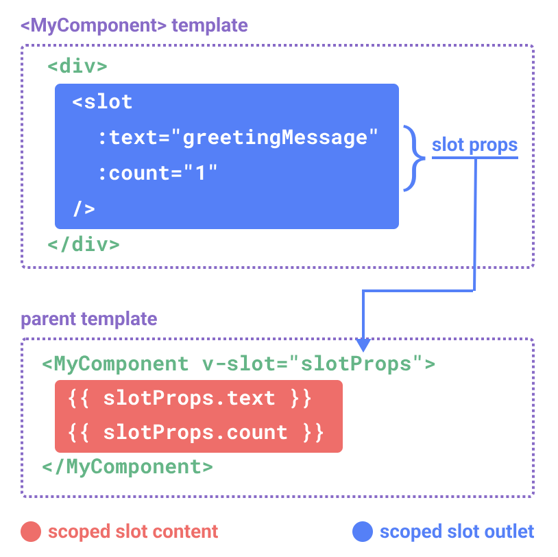

### 插槽的内容与出口

---

组件要如何接收模板内容呢？在某些场景中，可能想要为子组件传递一些模板片段，让子组件在它们的组件中渲染这些片段。

例如FancyButton.vue里定义的`<FancyButton>`组件：

```vue
<template>
  <button class="fancy-btn">
    <slot></slot><!--插槽出口-->
  </button>
</template>
```

以上组件可以这样使用：

```vue
<template>
  <!-- 显示组件 -->
  <FancyButton>
    Click me! <!--插槽内容-->
  </FancyButton>
</template>

<script>
//1、引入组件
import FancyButton from "@/components/slot/FancyButton.vue";

export default {
  // 2、注入组件
  components: {
    FancyButton
  }
};
</script>
```

`<slot>`元素是一个**插槽出口（slot outlet）**，标识了**父元素提供的插槽内容**将在哪里被渲染。


最终渲染出的DOM是这样的：


通过使用插槽，`<FancyButton>` 仅负责渲染外层的 `<button>` (以及相应的样式)，而其内部的内容由父组件提供。

插槽内容可以是**任意合法的模板内容**，不局限于文本。例如我们可以传入多个元素，甚至是组件：

```vue
<FancyButton>
  <span style="color:red">Click me!</span>
  <AwesomeIcon name="plus" />
</FancyButton>
```

通过使用插槽，`<FancyButton>` 组件更加灵活和具有可复用性。现在组件**可以用在不同的地方渲染各异的内容**，但同时还保证都**具有相同的样式**。

Vue 组件的插槽机制是受[原生 Web Component `` 元素](https://developer.mozilla.org/en-US/docs/Web/HTML/Element/slot)的启发而诞生，同时还做了一些功能拓展。


### 渲染作用域

---

 **插槽内容可以访问到父组件作用域**，因为插槽内容本身是在父组件模板中定义的。

```vue
<template>
  <!-- 显示组件 -->
  <FancyButton>
    <span style="color:red">{{ message }}</span><!--插槽内容-->
  </FancyButton>
</template>

<script>
//1、引入组件
import FancyButton from "@/components/slot/FancyButton.vue";

export default {
  // 2、注入组件
  components: {
    FancyButton
  },
  data() {
    return {
      message: "Click me!"
    };
  }
};
</script>

<style>

</style>
```

```vue
<template>
  <button class="fancy-btn">
    <slot></slot><!--插槽出口-->
  </button>
</template>
```

插槽内容**无法访问子组件**的数据。Vue 模板中的表达式只能访问其定义时所处的作用域，这和 JavaScript 的词法作用域规则是一致的。换言之：

>父组件模板中的表达式只能访问父组件的作用域；子组件模板中的表达式只能访问子组件的作用域。


### 默认内容

---

在外部没有提供任何内容的情况下，可以为插槽指定默认内容。比如有这样一个`<SubmitButton>`组件，在父组件没有提供任何插槽内容时在 `<button>` 内渲染“Submit”，只需要将“Submit”写在 `<slot>` 标签之间来作为默认内容：

```vue
<button type="submit">
  <slot>
    Submit <!-- 默认内容 -->
  </slot>
</button>
```

但如果我们提供了插槽内容，那么被显式提供的内容会取代默认内容。


### 具名插槽

---

有时在一个组件中包含多个插槽出口是很有用的。举例来说，在一个 `<BaseLayout>` 组件中，`<slot>` 元素可以有一个特殊的 attribute `name`，用来给各个插槽分配唯一的 ID，以确定每一处要渲染的内容。

```vue
<template>
  <div class="container">
    <header>
      <slot name="header"></slot>
    </header>
    <main>
      <slot></slot>
    </main>
    <footer>
      <slot name="footer"></slot>
    </footer>
  </div>
</template>
```

这类带 `name` 的插槽被称为具名插槽 (named slots)。没有提供 `name` 的 `<slot>` 出口会隐式地命名为“default”。

在父组件中使用 `<BaseLayout>` 时，我们需要一种方式将多个插槽内容传入到各自目标插槽的出口。此时就需要用到**具名插槽**了：

要为具名插槽传入内容，我们需要使用一个含 `v-slot` 指令的 `<template>` 元素，并将目标插槽的名字传给该指令，`v-slot` 有对应的简写 `#`。

```vue
<template>
  <BaseLayout>
    <template #header>
      <h1>Here might be a page title</h1>
    </template>

    <template #default>
      <p>A paragraph for the main content.</p>
      <p>And another one.</p>
    </template>

    <template #footer>
      <p>Here's some contact info</p>
    </template>
  </BaseLayout>
</template>

<script>
import BaseLayout from "@/components/slot/BaseLayout.vue";

export default {
  components: {
    BaseLayout
  }
};
</script>
```

当一个组件同时接收默认插槽和具名插槽时，所有位于顶级的非 `<template>` 节点都被隐式地视为默认插槽的内容。所以上面也可以写成：

```vue
<BaseLayout>
  <template #header>
    <h1>Here might be a page title</h1>
  </template>

  <!-- 隐式的默认插槽 -->
  <p>A paragraph for the main content.</p>
  <p>And another one.</p>

  <template #footer>
    <p>Here's some contact info</p>
  </template>
</BaseLayout>
```


### 动态插槽名

---

动态指令参数在 `v-slot` 上也是有效的，即可以定义下面这样的动态插槽名：

```vue
<base-layout>
  <template v-slot:[dynamicSlotName]>
    ...
  </template>

  <!-- 缩写为 -->
  <template #[dynamicSlotName]>
    ...
  </template>
</base-layout>
```

注意这里的表达式和动态指令参数受相同的[语法限制](https://cn.vuejs.org/guide/essentials/template-syntax.html#dynamic-argument-syntax-constraints)。


### 作用域插槽

---

在某些场景下插槽的内容可能想要同时使用父组件域内和子组件域内的数据。要做到这一点，我们需要一种方法来让子组件在渲染时将一部分数据提供给插槽。

我们也确实有办法这么做！可以像对组件传递 props 那样，向一个插槽的出口上传递 attributes：

```vue
<!-- <MyComponent> 的模板 -->
<template>
	<div>
  	<slot :text="greetingMessage" :count="1"></slot>
  </div>
</template>

<script>
  export default {
    props: {
      greetingMessage: {
        type: String,
        default: "Hello"
      }
    }
  };
</script>
```

当需要接收插槽 props 时，默认插槽和具名插槽的使用方式有一些小区别。下面我们将先展示默认插槽如何接受 props，通过子组件标签上的 `v-slot` 指令，直接接收到了一个插槽 props 对象：

```vue
<MyComponent v-slot="slotProps">
  {{ slotProps.text }} {{ slotProps.count }}
</MyComponent>
```



子组件传入插槽的 props 作为了 `v-slot` 指令的值，可以在插槽内的表达式中访问。

你可以将作用域插槽类比为一个传入子组件的函数。子组件会将相应的 props 作为参数传给它。

`v-slot="slotProps"` 可以类比这里的函数签名，和函数的参数类似，我们也可以在 `v-slot` 中使用解构：

```vue
<MyComponent v-slot="{ text, count }">
  {{ text }} {{ count }}
</MyComponent>
```


### 具名作用域插槽

---

具名作用域插槽的工作方式也是类似的，插槽 props 可以作为 `v-slot` 指令的值被访问到：`v-slot:name="slotProps"`。当使用缩写时是这样：

```vue
<MyComponent>
  <template #header="headerProps">
    {{ headerProps }}
  </template>

  <template #default="defaultProps">
    {{ defaultProps }}
  </template>

  <template #footer="footerProps">
    {{ footerProps }}
  </template>
</MyComponent>
```

向具名插槽中传入props：

```vue
<slot name="header" message="hello"></slot>
```

注意插槽上的 `name` 是一个 Vue 特别保留的 attribute，不会作为 props 传递给插槽。因此最终 `headerProps` 的结果是 `{ message: 'hello' }`。

如果你同时使用了具名插槽与默认插槽，则需要为默认插槽使用显式的 `<template>` 标签，有助于更清晰地指出 `message` 属性在其他插槽中不可用：

```vue
<template>
  <MyComponent>
    <!-- 使用显式的默认插槽 -->
    <template #default="{ message }">
      <p>{{ message }}</p>
    </template>

    <template #footer>
      <p>Here's some contact info</p>
    </template>
  </MyComponent>
</template>
```


### 高级列表组件示例

---

什么样的场景才适合用到作用域插槽，来看一个 `<FancyList>` 组件的例子。它会渲染一个列表，并同时会封装一些加载远端数据的逻辑、使用数据进行列表渲染、或者是像分页或无限滚动这样更进阶的功能。然而我们希望它能够保留足够的灵活性，将对单个列表元素内容和样式的控制权留给使用它的父组件。我们期望的用法可能是这样的：

```vue
<script setup>
import FancyList from './components/slot/FancyList.vue'

</script>

<template>
  <FancyList :apiUrl="url" :perPage="10">
    <template #item="{ body, username, likes }">
      <div class="item">
        <p>{{ body }}</p>
        <p class="meta">by {{ username }} | {{ likes }} likes</p>
      </div>
    </template>
  </FancyList>
</template>
```

在 `<FancyList>` 之中，可以多次渲染 `<slot>` 并每次都提供不同的数据 (注意我们这里使用了 `v-bind` 来传递插槽的 props)：

```vue
<script setup>
import {ref} from "vue";

const items = ref([]);

// 模拟远程数据获取
setTimeout(() => {
  items.value = [
    {body: 'Scoped Slots Guide', username: 'Evan You', likes: 20},
    {body: 'Vue Tutorial', username: 'Natalia Tepluhina', likes: 10}
  ]
}, 2000);
</script>

<template>
  <ul>
    <li v-if="!items.length">
      Loading...
    </li>
    <li v-for="(item,index) in items" :key="index">
      <slot name="item" v-bind="item"/>
    </li>
  </ul>
</template>
```


### 无渲染组件

---

上面的 `<FancyList>` 案例同时封装了可重用的逻辑 (数据获取、分页等) 和视图输出，但也将部分视图输出通过作用域插槽交给了消费者组件来管理。

如果我们将这个概念拓展一下，可以想象的是，一些组件可能只包括了逻辑而不需要自己渲染内容，视图输出通过作用域插槽全权交给了消费者组件。这种类型的组件称为**无渲染组件**。

这里有一个无渲染组件的例子，一个封装了追踪当前鼠标位置逻辑的组件：

```vue
<template>
  <MouseTracker v-slot="{ x, y }">
    Mouse is at: {{ x }}, {{ y }}
  </MouseTracker>
</template>
```

```vue
<script setup>
import {ref, onMounted, onUnmounted} from "vue";

const x = ref(0)
const y = ref(0)

const update = e => {
  x.value = e.pageX
  y.value = e.pageY
}

onMounted(() => {
  try {
    window.addEventListener('mousemove', update)
  } catch (e) {
    console.error("Error attaching mousemove event listener:", e);
  }
})
onUnmounted(() => {
  try {
    window.removeEventListener('mousemove', update)
  } catch (e) {
    console.error("Error detaching mousemove event listener:", e);
  }
})
</script>

<template>
  <slot :x="x" :y="y"/>
</template>
```

虽然这个模式很有趣，但大部分能用无渲染组件实现的功能都可以通过组合式 API 以另一种更高效的方式实现，并且还不会带来额外组件嵌套的开销。[组合式函数](https://cn.vuejs.org/guide/reusability/composables.html)中介绍了如何更高效地实现追踪鼠标位置的功能。

尽管如此，作用域插槽在需要**同时**封装逻辑、组合视图界面时还是很有用，就像上面的 `<FancyList>` 组件那样。