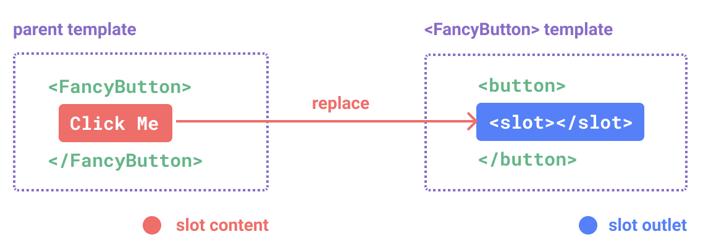
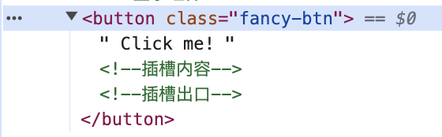

### 插槽的内容与出口

---

组件要如何接收模板内容呢？在某些场景中，可能想要为子组件传递一些模板片段，让子组件在它们的组件中渲染这些片段。

例如FancyButton.vue里定义的`<FancyButton>`组件：

```vue
<template>
  <button class="fancy-btn">
    <slot></slot><!--插槽出口-->
  </button>
</template>
```

以上组件可以这样使用：

```vue
<template>
  <!-- 显示组件 -->
  <FancyButton>
    Click me! <!--插槽内容-->
  </FancyButton>
</template>

<script>
//1、引入组件
import FancyButton from "@/components/slot/FancyButton.vue";

export default {
  // 2、注入组件
  components: {
    FancyButton
  }
};
</script>
```

`<slot>`元素是一个**插槽出口（slot outlet）**，标识了**父元素提供的插槽内容**将在哪里被渲染。



最终渲染出的DOM是这样的：



通过使用插槽，`<FancyButton>` 仅负责渲染外层的 `<button>` (以及相应的样式)，而其内部的内容由父组件提供。

插槽内容可以是**任意合法的模板内容**，不局限于文本。例如我们可以传入多个元素，甚至是组件：

```vue
<FancyButton>
  <span style="color:red">Click me!</span>
  <AwesomeIcon name="plus" />
</FancyButton>
```

通过使用插槽，`<FancyButton>` 组件更加灵活和具有可复用性。现在组件**可以用在不同的地方渲染各异的内容**，但同时还保证都**具有相同的样式**。

Vue 组件的插槽机制是受[原生 Web Component `` 元素](https://developer.mozilla.org/en-US/docs/Web/HTML/Element/slot)的启发而诞生，同时还做了一些功能拓展。


### 渲染作用域

---

 **插槽内容可以访问到父组件作用域**，因为插槽内容本身是在父组件模板中定义的。

```vue
<template>
  <!-- 显示组件 -->
  <FancyButton>
    <span style="color:red">{{ message }}</span><!--插槽内容-->
  </FancyButton>
</template>

<script>
//1、引入组件
import FancyButton from "@/components/slot/FancyButton.vue";

export default {
  // 2、注入组件
  components: {
    FancyButton
  },
  data() {
    return {
      message: "Click me!"
    };
  }
};
</script>

<style>

</style>
```

```vue
<template>
  <button class="fancy-btn">
    <slot></slot><!--插槽出口-->
  </button>
</template>
```

插槽内容**无法访问子组件**的数据。Vue 模板中的表达式只能访问其定义时所处的作用域，这和 JavaScript 的词法作用域规则是一致的。换言之：

>父组件模板中的表达式只能访问父组件的作用域；子组件模板中的表达式只能访问子组件的作用域。


### 默认内容

---

在外部没有提供任何内容的情况下，可以为插槽指定默认内容。比如有这样一个`<SubmitButton>`组件，在父组件没有提供任何插槽内容时在 `<button>` 内渲染“Submit”，只需要将“Submit”写在 `<slot>` 标签之间来作为默认内容：

```vue
<button type="submit">
  <slot>
    Submit <!-- 默认内容 -->
  </slot>
</button>
```

但如果我们提供了插槽内容，那么被显式提供的内容会取代默认内容。


### 具名插槽

---

有时在一个组件中包含多个插槽出口是很有用的。举例来说，在一个 `<BaseLayout>` 组件中，`<slot>` 元素可以有一个特殊的 attribute `name`，用来给各个插槽分配唯一的 ID，以确定每一处要渲染的内容。

```vue
<template>
  <div class="container">
    <header>
      <slot name="header"></slot>
    </header>
    <main>
      <slot></slot>
    </main>
    <footer>
      <slot name="footer"></slot>
    </footer>
  </div>
</template>
```

这类带 `name` 的插槽被称为具名插槽 (named slots)。没有提供 `name` 的 `<slot>` 出口会隐式地命名为“default”。

在父组件中使用 `<BaseLayout>` 时，我们需要一种方式将多个插槽内容传入到各自目标插槽的出口。此时就需要用到**具名插槽**了：

要为具名插槽传入内容，我们需要使用一个含 `v-slot` 指令的 `<template>` 元素，并将目标插槽的名字传给该指令，`v-slot` 有对应的简写 `#`。

```vue
<template>
  <BaseLayout>
    <template #header>
      <h1>Here might be a page title</h1>
    </template>

    <template #default>
      <p>A paragraph for the main content.</p>
      <p>And another one.</p>
    </template>

    <template #footer>
      <p>Here's some contact info</p>
    </template>
  </BaseLayout>
</template>

<script>
import BaseLayout from "@/components/slot/BaseLayout.vue";

export default {
  components: {
    BaseLayout
  }
};
</script>
```

当一个组件同时接收默认插槽和具名插槽时，所有位于顶级的非 `<template>` 节点都被隐式地视为默认插槽的内容。所以上面也可以写成：

```vue
<BaseLayout>
  <template #header>
    <h1>Here might be a page title</h1>
  </template>

  <!-- 隐式的默认插槽 -->
  <p>A paragraph for the main content.</p>
  <p>And another one.</p>

  <template #footer>
    <p>Here's some contact info</p>
  </template>
</BaseLayout>
```


### 动态插槽名

---


