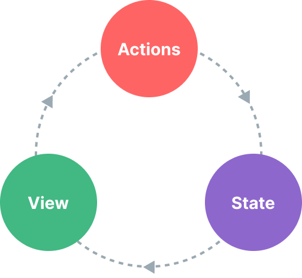

### 一、什么是状态管理？

---

理论上来说，每一个 Vue 组件实例都已经在“管理”它自己的响应式状态了。我们以一个简单的计数器组件为例：

```vue
<script setup>
import { ref } from 'vue'

// 状态
const count = ref(0)

// 动作
function increment() {
  count.value++
}
</script>

<!-- 视图 -->
<template>{{ count }}</template>
```

它是一个独立的单元，由以下几个部分组成的：

- 状态：驱动整个应用的数据源；
- 视图：对状态的一种声明式映射；
- 交互：状态根据用户在视图中的输入而作出相应变更的可能方式。

下面是“单向数据流”这一概念的简单图示：



当我们有**多个组件共享一个共同的状态**时，就没有这么简单了：

1. 多个视图可能都依赖于同一份状态。
2. 来自不同视图的交互也可能需要更改同一份状态。

对于情景 1，一个可行的办法是将共享状态“提升”到共同的祖先组件上去，再通过 props 传递下来。然而在深层次的组件树结构中这么做的话，很快就会使得代码变得繁琐冗长。这会导致另一个问题：[Prop 逐级透传问题](https://cn.vuejs.org/guide/components/provide-inject.html#prop-drilling)。

对于情景 2，经常发现自己会直接通过模板引用获取父/子实例，或者通过触发的事件尝试改变和同步多个状态的副本。但这些模式的健壮性都不甚理想，很容易就会导致代码难以维护。

一个更简单直接的解决方案是**抽取出组件间的共享状态，放在一个全局单例中来管理**。这样我们的组件树就变成了一个大的“视图”，而任何位置上的组件都可以访问其中的状态或触发动作。


### 二、响应式API做简单的状态管理

---

如果有一部分状态需要在多个组件实例间共享，可以使用reactive()来创建一个响应式对象，并将它导入到多个组件中：

```js
// store.js
import { reactive } from 'vue'

export const store = reactive({
  count:0
})
```

```vue
<!-- ComponentA.vue -->
<script setup>
import { store } from './store.js'
</script>

<template>From A: {{ store.count }}</template>
```

```vue
<!-- ComponentB.vue -->
<script setup>
import { store } from './store.js'
</script>

<template>From B: {{ store.count }}</template>
```

现在每当 `store` 对象被更改时，`<ComponentA>` 与 `<ComponentB>` 都会自动更新它们的视图。现在有了单一的数据源。然而，这也意味着任意一个导入了 `store` 的组件都可以随意修改它的状态：

```vue
<template>
  <button @click="store.count++">
    From B: {{ store.count }}
  </button>
</template>
```

虽然这在简单的情况下是可行的，但从长远来看，可以被任何组件任意改变的全局状态是不太容易维护的。**为了确保改变状态的逻辑像状态本身一样集中，建议在 store 上定义方法，方法的名称应该要能表达出行动的意图**：

```js
// store.js
import { reactive } from 'vue'

export const store = reactive({
  count: 0,
  increment() {
    this.count++
  }
})
```

```vue
<template>
  <button @click="store.increment()">
    From B: {{ store.count }}
  </button>
</template>
```

除了我们这里用到的单个响应式对象作为一个 store 之外，你还可以使用其他响应式 API 例如 `ref()` 或是 `computed()`，或是甚至通过一个组合式函数来返回一个全局状态：

```js
import { ref } from 'vue'

// 全局状态，创建在模块作用域下
const globalCount = ref(1)

export function useCount() {
  // 局部状态，每个组件都会创建
  const localCount = ref(1)

  return {
    globalCount,
    localCount
  }
}
```


### 三、SSR相关细节

---

如果正在构建一个需要利用[服务端渲染 (SSR)](https://cn.vuejs.org/guide/scaling-up/ssr.html) 的应用，由于 store 是跨多个请求共享的单例，上述模式可能会导致问题。这在 SSR 指引那一章节会讨论[更多细节](https://cn.vuejs.org/guide/scaling-up/ssr.html#cross-request-state-pollution)。


### 四、Pinia

---

Pinia 是 Vue 的专属状态管理库，它允许跨组件或页面共享状态。如果熟悉组合式 API 的话，可能会认为可以通过一行简单的 `export const state = reactive({})` 来共享一个全局状态。对于单页应用来说确实可以，但如果应用在服务器端渲染，这可能会使你的应用暴露出一些[安全漏洞](https://cn.vuejs.org/guide/scaling-up/ssr#cross-request-state-pollution)。 而如果使用 Pinia，即使在小型单页应用中，也可以获得如下功能：

- Devtools 支持
  - 追踪 actions、mutations 的时间线
  - 在组件中展示它们所用到的 Store
  - 让调试更容易的 Time travel
- 热更新
  - 不必重载页面即可修改 Store
  - 开发时可保持当前的 State
- 插件：可通过插件扩展 Pinia 功能
- 为 JS 开发者提供适当的 TypeScript 支持以及**自动补全**功能。
- 支持服务端渲染

#### 4.1 Store

Store 是一个保存状态和业务逻辑的实体，它并不与组件树绑定。**它承载着全局状态**，有点像一个永远存在的组件，每个组件都可以读取和写入它。它有三个概念，`state`、`getter`和 `action`，我们可以假设这些概念相当于组件中的 data、 computed 和 methods。

#### 4.2 定义Store

store是使用 `defineStore()` 定义的，

- 第一个参数要求是一个独一无二的名字。这个**名字** ，也被用作 *id* ，是必须传入的， Pinia 将用它来连接 store 和 devtools。
- 第二个参数可接受两类值：Setup 函数或 Option 对象。

```js
import { defineStore } from 'pinia'

// 可以任意命名 `defineStore()` 的返回值，但最好使用 store 的名字，同时以 `use` 开头且以 `Store` 结尾。
// (比如 `useUserStore`，`useCartStore`，`useProductStore`)
// 第一个参数是你的应用中 Store 的唯一 ID。
export const useAlertsStore = defineStore('alerts', {
  // 其他配置...
})
```

##### 4.2.1 Option Store

传入一个带有 `state`、`actions` 与 `getters` 属性的 Option 对象。可以认为state是store的数据(data)，getters是store的计算属性(computed)，而actions则是方法(methods)。

```js
export const useCounterStore = defineStore('counter', {
  state: () => ({ count: 0 }),
  getters: {
    double: (state) => state.count * 2,
  },
  actions: {
    increment() {
      this.count++
    },
  },
})
```

##### 4.2.2 Setup Store

也存在另一种定义store的可用语法。与 Vue 组合式 API 的 setup 函数相似，可以传入一个函数，该函数定义了一些响应式属性和方法，并且返回一个带有我们想暴露出去的属性和方法的对象。

```js
export const useCounterStore = defineStore('counter', () => {
  const count = ref(0)
  const doubleCount = computed(() => count.value * 2)
  function increment() {
    count.value++
  }

  return { count, doubleCount, increment }
})
```

在 *Setup Store* 中：

- `ref()` 就是 `state` 属性
- `computed()` 就是 `getters`
- `function()` 就是 `actions`

注意，要让 pinia 正确识别 `state`，必须在 setup store 中返回 **`state` 的所有属性**。这意味着不能在 store 中使用**私有**属性。不完整返回会影响 SSR ，开发工具和其他插件的正常运行。

Setup store 比 Option Store带来了更多的灵活性，因为你可以在一个 store 内创建侦听器，并自由地使用任何组合式函数。不过使用组合式函数会让 SSR 变得更加复杂。

Setup store 也可以依赖于全局**提供**的属性，比如路由。任何应用层面提供的属性都可以在 store 中使用 `inject()` 访问，就像在组件中一样：

```js
import { inject } from 'vue'
import { useRoute } from 'vue-router'

export const useSearchFilters = defineStore('search-filters', () => {
  const route = useRoute()
  // 这里假定 `app.provide('appProvided', 'value')` 已经调用过
  const appProvided = inject('appProvided')

  // ...

  return {
    // ...
  }
})
```

#### 4.3 使用Store

虽然我们前面定义了一个 store，但在我们使用 `<script setup>` 调用 `useStore()`(或者使用 `setup()` 函数，**像所有的组件那样**) 之前，store 实例是不会被创建的：

```vue
<script setup>
import { useCounterStore } from '@/stores/counter'
// 可以在组件中的任意位置访问 `store` 变量
const store = useCounterStore()
</script>
```

可以定义任意多的 store，但为了让使用 pinia 的益处最大化 (比如允许构建工具自动进行代码分割以及 TypeScript 推断)，**你应该在不同的文件中去定义 store**。

一旦 store 被实例化，可以直接访问在 store 的 `state`、`getters` 和 `actions` 中定义的任何属性。

请注意，`store` 是一个用 `reactive` 包装的对象，这意味着不需要在 getters 后面写 `.value`。就像 `setup` 中的 `props` 一样，**我们不能对它进行解构**：

```vue
<script setup>
import { useCounterStore } from '@/stores/counter'
const store = useCounterStore()
// ❌ 这将不起作用，因为它破坏了响应性
// 这就和直接解构 `props` 一样
const { name, doubleCount } = store
name // 将始终是 "Eduardo"
doubleCount // 将始终是 0
setTimeout(() => {
  store.increment()
}, 1000)
// ✅ 这样写是响应式的
// 当然你也可以直接使用 `store.doubleCount`
const doubleValue = computed(() => store.doubleCount)
</script>
```

#### 4.4 从Store解构

为了从 store 中提取属性时保持其响应性，你需要使用 `storeToRefs()`。它将为每一个响应式属性创建引用。当你只使用 store 的状态而不调用任何 action 时，它会非常有用。请注意，你可以直接从 store 中解构 action，因为它们也被绑定到 store 上：

```vue
<script setup>
import { storeToRefs } from 'pinia'
const store = useCounterStore()
// `name` 和 `doubleCount` 是响应式的 ref
// 同时通过插件添加的属性也会被提取为 ref
// 并且会跳过所有的 action 或非响应式 (不是 ref 或 reactive) 的属性
const { name, doubleCount } = storeToRefs(store)
// 作为 action 的 increment 可以直接解构
const { increment } = store
</script>
```

#### 4.5 State

在 Pinia 中，state 被定义为一个返回初始状态的函数。这使得 Pinia 可以同时支持服务端和客户端。

```js
import { defineStore } from 'pinia'

const useStore = defineStore('storeId', {
  // 为了完整类型推理，推荐使用箭头函数
  state: () => {
    return {
      // 所有这些属性都将自动推断出它们的类型
      count: 0,
      name: 'Eduardo',
      isAdmin: true,
      items: [],
      hasChanged: true,
    }
  },
})
```

##### 4.5.1 访问state

默认情况下，你可以通过 `store` 实例访问 state，直接对其进行读写。

```js
const store = useStore()

store.count++
```

##### 4.5.2 重置state

- **选项式API**可以通过调用store的`$reset()`方法将state重置为初始值。 

  ```js
  const store = useStore()
  
  store.$reset()
  ```

  在 `$reset()` 内部，会调用 `state()` 函数来创建一个新的状态对象，并用它替换当前状态。

- 在 **Setup Stores** 中，需要创建自己的 `$reset()` 方法：

  ```js
  import { defineStore } from 'pinia';
  
  export const useCounterStore = defineStore('counter', () => {
    const count = window.Vue.ref(0);
  
    function $reset() {
      count.value = 0;
    }
  
    return { count, $reset };
  });
  ```

##### 4.5.3 变更state

除了用`store.count++` 直接改变 store，你还可以调用 `$patch` 方法。它允许你用一个 `state` 的补丁对象在同一时间更改多个属性：

```js
store.$patch({
  count: store.count + 1,
  age: 120,
  name: 'DIO',
})
```

用这种语法的话，有些变更真的很难实现或者很耗时：任何集合的修改（例如，向数组中添加、移除一个元素或是做 `splice` 操作）都需要你创建一个新的集合。因此，`$patch` 方法也接受一个函数来组合这种难以用补丁对象实现的变更。

```js
store.$patch((state) => {
  state.items.push({ name: 'shoes', quantity: 1 })
  state.hasChanged = true
})
```

两种变更 store 方法的主要区别：

`$patch()` 允许你将多个变更归入 devtools 的同一个条目中。**直接修改 `state`，`$patch()` 也会出现在 devtools 中**，而且可以进行 time travel (在 Vue 3 中还没有)。

##### 4.5.4 替换state

**不能完全替换掉** store 的 state，因为那样会破坏其响应性。但是，你可以 *patch* 它。

```js
// 这实际上并没有替换`$state`
store.$state = { count: 24 }
// 在它内部调用 `$patch()`：
store.$patch({ count: 24 })
```

你也可以通过变更 `pinia` 实例的 `state` 来设置整个应用的初始 state。这常用于 [SSR 中的激活过程](https://pinia.vuejs.org/zh/ssr/#state-hydration)。

```js
pinia.state.value = {}
```

##### 4.5.5 订阅state

类似于 Vuex 的 subscribe 方法，可以通过 store 的 `$subscribe()` 方法侦听 state 及其变化。比起普通的 `watch()`，使用 `$subscribe()` 的好处是 *subscriptions* 在 *patch* 后只触发一次 (例如，当使用上面的函数版本时)。

```js
cartStore.$subscribe((mutation, state) => {
  // import { MutationType } from 'pinia'
  mutation.type // 'direct' | 'patch object' | 'patch function'
  // 和 cartStore.$id 一样
  mutation.storeId // 'cart'
  // 只有 mutation.type === 'patch object'的情况下才可用
  mutation.payload // 传递给 cartStore.$patch() 的补丁对象。

  // 每当状态发生变化时，将整个 state 持久化到本地存储。
  localStorage.setItem('cart', JSON.stringify(state))
})
```

默认情况下，state subscription 会被绑定到添加它们的组件上(如果 store 在组件的 `setup()` 里面)。这意味着，当该组件被卸载时，它们将被自动删除。如果你想在组件卸载后依旧保留它们，请将 `{ detached: true }` 作为第二个参数，以将 state subscription 从当前组件中分离：

```vue
<script setup>
  const someStore = useSomeStore();
  // 此订阅器即便在组件卸载之后仍会被保留
  someStore.$subscribe(callback, { detached: true })
</script>
```

可以在 `pinia` 实例上使用 `watch()` 函数侦听整个 state。

```js
watch(
  pinia.state,
  (state) => {
    // 每当状态发生变化时，将整个 state 持久化到本地存储。
    localStorage.setItem('piniaState', JSON.stringify(state))
  },
  { deep: true }
)
```

#### 4.6 Getter

Getter 完全等同于 store 的 state 的计算值。可以通过 `defineStore()` 中的 `getters` 属性来定义它们。推荐使用箭头函数，并且它将接收 `state` 作为第一个参数：

```js
export const useCounterStore = defineStore('counter', {
  state: () => ({
    count: 0,
  }),
  getters: {
    doubleCount: (state) => state.count * 2,
  },
})
```

大多数时候，getter 仅依赖 state，不过，有时它们也可能会使用其他 getter。因此，即使在使用常规函数定义 getter 时，也可以通过 `this` 访问到整个 store 实例**，**但(在 TypeScript 中)必须定义返回类型。这是为了避免 TypeScript 的已知缺陷，**不过这不影响用箭头函数定义的 getter，也不会影响不使用 `this` 的 getter**。

```js
export const useCounterStore = defineStore('counter', {
  state: () => ({
    count: 0,
  }),
  getters: {
    // 自动推断出返回类型是一个 number
    doubleCount(state) {
      return state.count * 2
    },
    // 返回类型**必须**明确设置
    doublePlusOne(): number {
      // 整个 store 的 自动补全和类型标注 ✨
      return this.doubleCount + 1
    },
  },
})
```

然后可以直接访问 store 实例上的 getter 了：

```vue
<script setup>
  import { useCounterStore } from './counterStore'

  const store = useCounterStore()
</script>

<template>
	<p>Double count is {{ store.doubleCount }}</p>
</template>
```

##### 4.6.1 访问其他getter

与计算属性一样，你也可以组合多个 getter。通过 `this`，你可以访问到其他任何 getter。即使没有使用 TypeScript，你也可以用 JSDoc 来让你的 IDE 提示类型。

```js
export const useCounterStore = defineStore('counter', {
  state: () => ({
    count: 0,
  }),
  getters: {
    // 类型是自动推断出来的，因为我们没有使用 `this`
    doubleCount: (state) => state.count * 2,
    // 这里我们需要自己添加类型(在 JS 中使用 JSDoc)
    // 可以用 this 来引用 getter
    /**
     * 返回 count 的值乘以 2 加 1
     *
     * @returns {number}
     */
    doubleCountPlusOne() {
      return this.doubleCount + 1
    },
  },
})
```

##### 4.6.2 向getter传递参数

*Getter* 只是幕后的**计算**属性，所以不可以向它们传递任何参数。不过，你可以从 *getter* 返回一个函数，该函数可以接受任意参数：

```js
export const useUserListStore = defineStore('userList', {
  getters: {
    getUserById: (state) => {
      return (userId) => state.users.find((user) => user.id === userId)
    },
  },
})
```

并在组件中使用：

```vue
<script setup>
  import { useUserListStore } from './store'
  const userList = useUserListStore()
  const { getUserById } = storeToRefs(userList)
  // 请注意，你需要使用 `getUserById.value` 来访问
  // <script setup> 中的函数
</script>

<template>
<p>User 2: {{ getUserById(2) }}</p>
</template>
```

请注意，这样做时，**getter 将不再被缓存**，它们只是一个被你调用的函数。不过，你可以在 getter 本身中缓存一些结果，虽然这种做法并不常见，但有证明表明它的性能会更好：

```js
export const useUserListStore = defineStore('userList', {
  getters: {
    getActiveUserById(state) {
      const activeUsers = state.users.filter((user) => user.active)
      return (userId) => activeUsers.find((user) => user.id === userId)
    },
  },
})
```

##### 4.6.3 访问其他store的getter

想要使用另一个 store 的 getter 的话，那就直接在 *getter* 内使用就好：

```js
import { useOtherStore } from './other-store'

export const useStore = defineStore('main', {
  state: () => ({
    // ...
  }),
  getters: {
    otherGetter(state) {
      const otherStore = useOtherStore()
      return state.localData + otherStore.data
    },
  },
})
```

##### 4.6.4 使用setup()时的用法

作为 store 的一个属性，你可以直接访问任何 getter(与 state 属性完全一样)：

```vue
<script setup>
  const store = useCounterStore()
  store.count = 3
  store.doubleCount // 6
</script>
```

##### 4.6.5 使用选项式API的用法

使用setup()：

```vue
<script>
  import { useCounterStore } from '../stores/counter'

  export default defineComponent({
    setup() {
      const counterStore = useCounterStore()

      return { counterStore }
    },
    computed: {
      quadrupleCounter() {
        return this.counterStore.doubleCount * 2
      },
    },
  })
</script>
```

不使用setup()，可以使用 `mapState()` 函数来将其映射为 getters：

```js
import { mapState } from 'pinia'
import { useCounterStore } from '../stores/counter'

export default {
  computed: {
    // 允许在组件中访问 this.doubleCount
    // 与从 store.doubleCount 中读取的相同
    ...mapState(useCounterStore, ['doubleCount']),
    // 与上述相同，但将其注册为 this.myOwnName
    ...mapState(useCounterStore, {
      myOwnName: 'doubleCount',
      // 你也可以写一个函数来获得对 store 的访问权
      double: store => store.doubleCount,
    }),
  },
}
```

#### 4.7 Action

Action 相当于组件中的 method。它们可以通过 `defineStore()` 中的 `actions` 属性来定义。

```js
export const useCounterStore = defineStore('main', {
  state: () => ({
    count: 0,
  }),
  actions: {
    increment() {
      this.count++
    },
    randomizeCounter() {
      this.count = Math.round(100 * Math.random())
    },
  },
})
```

action 可通过 `this` 访问整个 store 实例，并支持**完整的类型标注。**不同的是，`action` 可以是异步的，可以在它们里面 `await` 调用任何 API，以及其他 action！下面是一个使用 [Mande](https://github.com/posva/mande) 的例子。请注意，使用什么库并不重要，只要你得到的是一个`Promise`，甚至可以 (在浏览器中) 使用原生 `fetch` 函数：

```js
import { mande } from 'mande'

const api = mande('/api/users')

export const useUsers = defineStore('users', {
  state: () => ({
    userData: null,
    // ...
  }),

  actions: {
    async registerUser(login, password) {
      try {
        this.userData = await api.post({ login, password })
        showTooltip(`Welcome back ${this.userData.name}!`)
      } catch (error) {
        showTooltip(error)
        // 让表单组件显示错误
        return error
      }
    },
  },
})
```

完全可以自由地设置任何你想要的参数以及返回任何结果。当调用 action 时，一切类型也都是可以被自动推断出来的。

Action 可以像函数或者通常意义上的方法一样被调用：

```vue
<script setup>
  const store = useCounterStore()
  // 将 action 作为 store 的方法进行调用
  store.randomizeCounter()
</script>
<template>
<!-- 即使在模板中也可以 -->
<button @click="store.randomizeCounter()">Randomize</button>
</template>
```

##### 4.7.1 访问其他store的action

想要使用另一个 store 的话，直接在 *action* 中调用就好了：

```js
import { useAuthStore } from './auth-store'

export const useSettingsStore = defineStore('settings', {
  state: () => ({
    preferences: null,
    // ...
  }),
  actions: {
    async fetchUserPreferences() {
      const auth = useAuthStore()
      if (auth.isAuthenticated) {
        this.preferences = await fetchPreferences()
      } else {
        throw new Error('User must be authenticated')
      }
    },
  },
})
```

##### 4.7.2 使用选项式API的用法

```js
// 示例文件路径：
// ./src/stores/counter.js

import { defineStore } from 'pinia'

const useCounterStore = defineStore('counter', {
  state: () => ({
    count: 0
  }),
  actions: {
    increment() {
      this.count++
    }
  }
})
```

##### 4.7.3 使用setup()

虽然并不是每个开发者都会使用组合式 API，但 `setup()` 钩子依旧可以使 Pinia 在选项式 API 中更易用。

```vue
<script>
  import { useCounterStore } from '../stores/counter'
  export default defineComponent({
    setup() {
      const counterStore = useCounterStore()
      return { counterStore }
    },
    methods: {
      incrementAndPrint() {
        this.counterStore.increment()
        console.log('New Count:', this.counterStore.count)
      },
    },
  })
</script>
```

##### 4.7.4 不使用setup()

也可以使用 `mapActions()` 辅助函数将 action 属性映射为你组件中的方法。

```js
import { mapActions } from 'pinia'
import { useCounterStore } from '../stores/counter'

export default {
  methods: {
    // 访问组件内的 this.increment()
    // 与从 store.increment() 调用相同
    ...mapActions(useCounterStore, ['increment'])
    // 与上述相同，但将其注册为this.myOwnName()
    ...mapActions(useCounterStore, { myOwnName: 'increment'}),
  },
}
```

##### 4.7.5 订阅action

可以通过 `store.$onAction()` 来监听 action 和它们的结果。传递给它的回调函数会在 action 本身之前执行。`after` 表示在 promise 解决之后，允许你在 action 解决后执行一个回调函数。同样地，`onError` 允许你在 action 抛出错误或 reject 时执行一个回调函数。这些函数对于追踪运行时错误非常有用，类似于[Vue docs 中的这个提示](https://v3.vuejs.org/guide/tooling/deployment.html#tracking-runtime-errors)。

这里有一个例子，在运行 action 之前以及 action resolve/reject 之后打印日志记录。

```js
const unsubscribe = someStore.$onAction(
  ({
    name, // action 名称
    store, // store 实例，类似 `someStore`
    args, // 传递给 action 的参数数组
    after, // 在 action 返回或解决后的钩子
    onError, // action 抛出或拒绝的钩子
  }) => {
    // 为这个特定的 action 调用提供一个共享变量
    const startTime = Date.now()
    // 这将在执行 "store "的 action 之前触发。
    console.log(`Start "${name}" with params [${args.join(', ')}].`)

    // 这将在 action 成功并完全运行后触发。
    // 它等待着任何返回的 promise
    after((result) => {
      console.log(
        `Finished "${name}" after ${
        Date.now() - startTime
        }ms.\nResult: ${result}.`
      )
    })

    // 如果 action 抛出或返回一个拒绝的 promise，这将触发
    onError((error) => {
      console.warn(
        `Failed "${name}" after ${Date.now() - startTime}ms.\nError: ${error}.`
      )
    })
  }
)

// 手动删除监听器
unsubscribe()
```

默认情况下，*action 订阅器*会被绑定到添加它们的组件上(如果 store 在组件的 `setup()` 内)。这意味着，当该组件被卸载时，它们将被自动删除。如果你想在组件卸载后依旧保留它们，请将 `true` 作为第二个参数传递给 *action 订阅器*，以便将其从当前组件中分离：

```vue
<script setup>
  const someStore = useSomeStore()
  // 此订阅器即便在组件卸载之后仍会被保留
  someStore.$onAction(callback, true)
</script>
```

#### 4.8 插件

由于有了底层 API 的支持，Pinia store 现在完全支持扩展。以下是你可以扩展的内容：

- 为 store 添加新的属性
- 定义 store 时增加新的选项
- 为 store 增加新的方法
- 包装现有的方法
- 改变甚至取消 action
- 实现副作用，如[本地存储](https://developer.mozilla.org/en-US/docs/Web/API/Window/localStorage)
- **仅**应用插件于特定 store

插件是通过 `pinia.use()` 添加到 pinia 实例的。最简单的例子是通过返回一个对象将一个静态属性添加到所有 store。

```js
import { createPinia } from 'pinia'

// 创建的每个 store 中都会添加一个名为 `secret` 的属性。
// 在安装此插件后，插件可以保存在不同的文件中
function SecretPiniaPlugin() {
  return { secret: 'the cake is a lie' }
}

const pinia = createPinia()
// 将该插件交给 Pinia
pinia.use(SecretPiniaPlugin)

// 在另一个文件中
const store = useStore()
store.secret // 'the cake is a lie'
```

这对添加全局对象很有用，如路由器、modal 或 toast 管理器。
