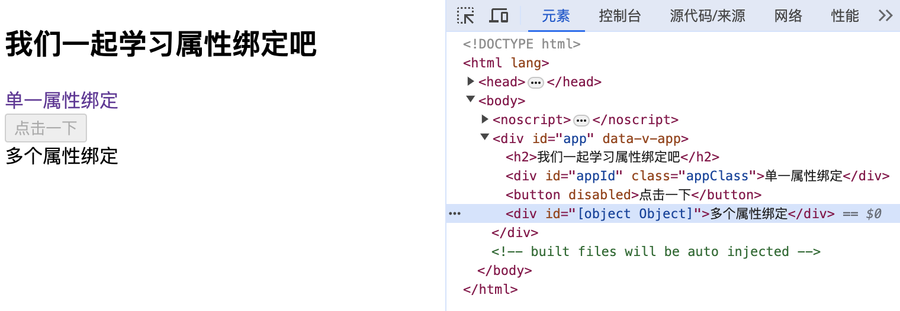

vue可以使用 `v-bind:` 指令进行动态绑定，当然也可以省略，直接使用 `:` 进行属性绑定，可以绑定**单一属性**，也可以同时绑定**多个属性**。

```vue
<template>
  <h2>我们一起学习属性绑定吧</h2>
  <div v-bind:id="dynamicId" :class="dynamicClass">单一属性绑定</div>
  <button :disabled="isDisabled">点击一下</button>
  <div :id="objectArr">多个属性绑定</div>
</template>

<script>
export default {
  data() {
    return {
      dynamicId: "appId",
      dynamicClass: "appClass",
      isDisabled: true,
      objectArr: {
        dynamicId: "appId",
        dynamicClass: "appClass"
      }
    }
  }
}
</script>

<style>
.appClass{
  color: rebeccapurple;
}
</style>
```



