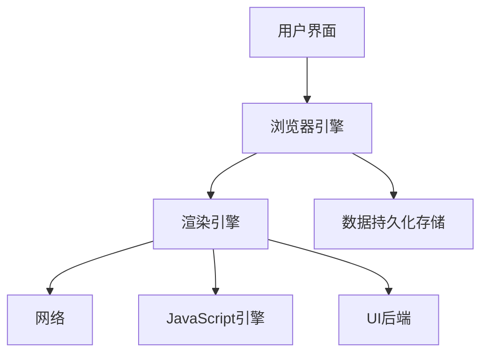

### 一、浏览器组成结构

---

从打开浏览器输入一个网址到页面展示网页内容的这段时间内，浏览器和服务端都发生了什么事情？

- 在接受到用户输入的网址后，浏览器会开启一个线程来处理这个请求，对用户输入的 URL 地址进行分析判断，如果是 HTTP 协议就按照 HTTP 方式来处理。
- 调用浏览器引擎中的对应方法，比如 WebView 中的 loadUrl 方法，分析并加载这个 URL 地址。
- 通过 **DNS 解析**获取该网站地址对应的 IP 地址，查询完成后连同浏览器的 Cookie、userAgent 等信息向网站目的 IP 发出 GET 请求。
- 进行 HTTP 协议会话，浏览器客户端向 Web 服务器发送报文。
- 进入网站后台上的 Web 服务器处理请求，如 Apache、Tomcat、Node.js 等服务器。
- 进入部署好的后端应用，如 PHP、Java、JavaScript、Python 等后端程序，找到对应的请求处理逻辑，这期间可能会读取服务器缓存或查询数据库等。
- 服务器处理请求并返回响应报文，此时如果浏览器访问过该页面，缓存上有对应资源，会与服务器最后修改记录对比，一致则返回 304，否则返回 200 和对应的内容。
- 浏览器开始下载 HTML 文档（响应报头状态码为 200 时）或者从本地缓存读取文件内容（浏览器缓存有效或响应报头状态码为 304 时）。
- 浏览器根据下载接收到的 HTML 文件解析结构建立 DOM（Document Object Model，文档对象模型），并根据 HTML 中的标记请求下载指定的 MIME 类型文件（如 CSS、JavaScript 脚本等），同时设置缓存等内容。
- 页面开始**解析渲染 DOM**，CSS 根据规则解析并结合 DOM 文档树进行**网页内容布局和绘制渲染**，JavaScript 根据 DOM API 操作 DOM，并读取浏览器缓存、执行事件绑定等，页面整个展示过程完成。

通常认为浏览器主要由七部分组成：

1. 用户界面
2. 网络（开启网络线程发送请求或下载资源文件）
3. JavaScript 引擎
4. 渲染引擎（解析 DOM 文档和 CSS 规则并将内容排版到浏览器中显示有样式的界面）
5. UI 后端
6. JavaScript 解释器（解释和执行 JavaScript 脚本，例如 V8 引擎）
7. 持久化数据存储（涉及 Cookie、localStorage 等一些客户端存储技术，可通过浏览器引擎提供的 API 进行调用）

| 浏览器          | 内核                   | 特点                                                         |
| --------------- | ---------------------- | ------------------------------------------------------------ |
| Google Chrome   | **Blink**              | 基于 Webkit 内核开发，提供快速的页面加载速度和丰富的扩展功能。 |
| Mozilla Firefox | Gecko                  | 开源内核，支持高度定制和丰富的扩展，注重用户隐私保护         |
| Safari          | **Webkit**             | 苹果公司开发，针对 ios 和 macos 系统优化，提供流畅的用户体验 |
| Microsoft Edge  | Blink（基于 Chromium） | 微软开发，兼容性强，性能和稳定性得到提升                     |
| Opera           | Blink                  | 早期使用 Presto 内核，后转为 Blink，以轻量级和快速渲染著称   |

### 二、浏览器渲染引擎简介

---

#### 2.1 渲染引擎的主要工作流程

渲染引擎在浏览器中主要用于解析 HTML 文档和 CSS 文档，然后将 CSS 规则应用到 HTML 标签元素上，并将 HTML 渲染到浏览器窗口中以显示具体的 DOM 内容。

解析 HTML 构建 DOM 树时渲染引擎会先将 HTML 元素标签解析成由多个 DOM 元素对象节点组成的具有节点父子关系的 DOM 树结构，然后根据 DOM 树结构的每个节点顺序提取计算使用的 CSS 规则并重新计算 DOM 树结构的样式数据，生成一个**带样式描述的 DOM 渲染树对象**。DOM 渲染树生成结束后，进入渲染树的布局阶段，即根据每个渲染树节点在页面中的大小和位置，将节点固定到页面的对应位置上，这个阶段主要是元素的布局属性（例如 position、float、margin 等属性）生效，即**在浏览器中绘制页面上元素节点的位置**。接下来就是绘制阶段，**将渲染树节点的背景、颜色、文本等样式信息应用到每个节点上**，这个阶段主要是元素的内部显示样式（例如 color、background、text-shadow 等属性）生效，最终完成整个 DOM 在页面上的绘制显示。

>页面生成后，如果颜面元素位置发生变化，就要从布局阶段开始重新渲染，也就是**页面重排**，所以页面一定会进行后续重绘。重排通常会导致页面元素几何大小位置发生变化且伴随着重新渲染的巨大代价，因此我们要尽可能避免页面的重排，并减少页面元素的重绘。

渲染引擎对 DOM 渲染树的解析和输出是逐行进行的，所以渲染树前面的内容可以先渲染展示，这样就保证了较好的用户体验，另外也尽量不要在 HTML 显示内容中插入 script 脚本等标签，script 标签内容的解释执行常常会阻塞页面结构的渲染。

