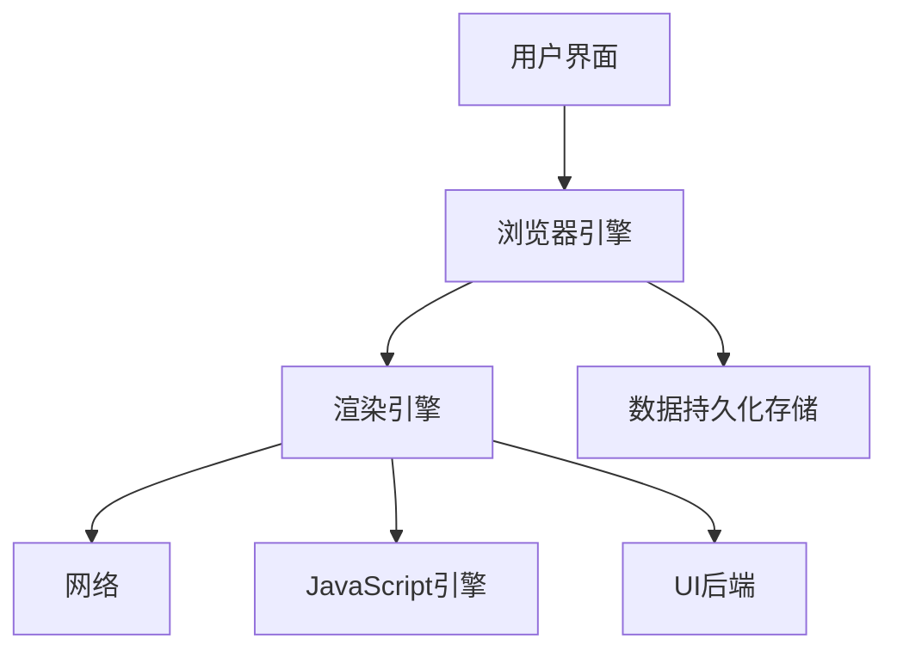
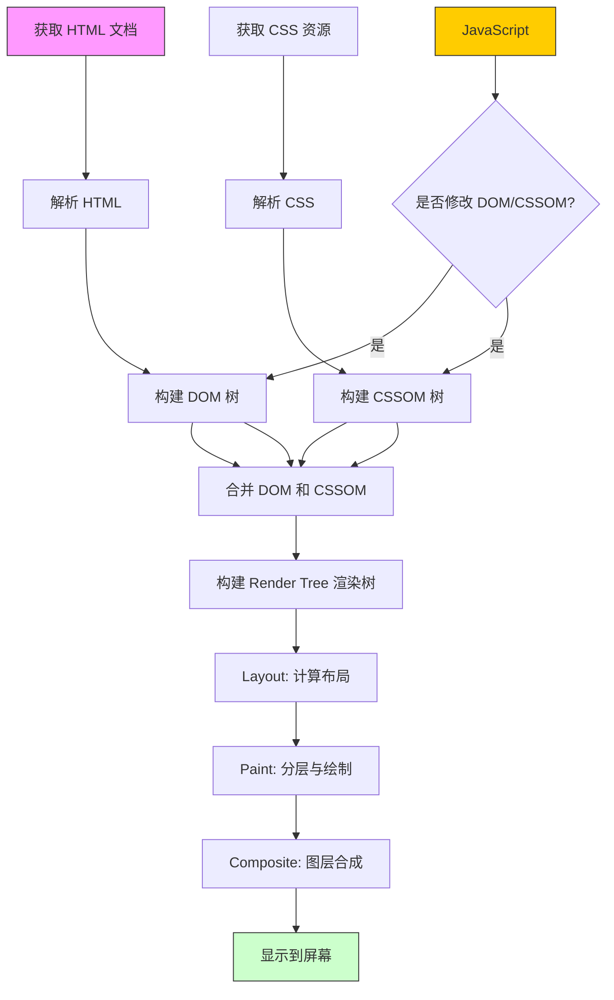
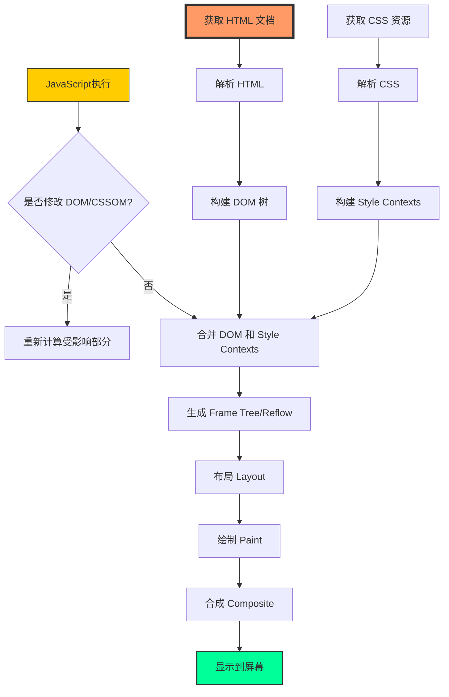
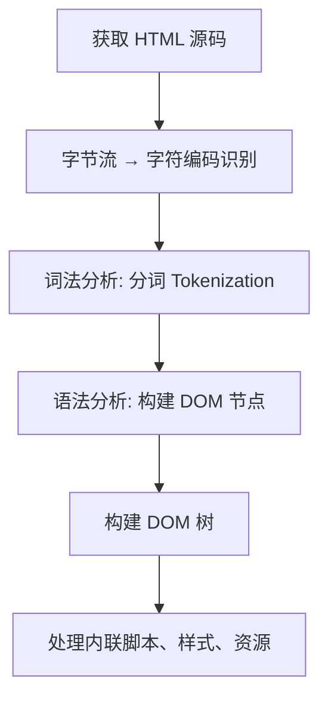
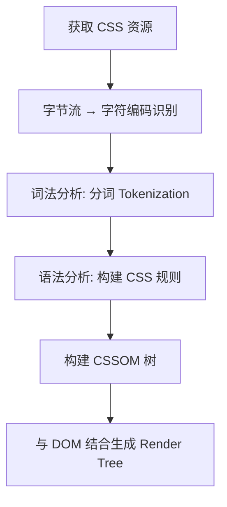

### 一、浏览器组成结构

---

从打开浏览器输入一个网址到页面展示网页内容的这段时间内，浏览器和服务端都发生了什么事情？

- 在接受到用户输入的网址后，浏览器会开启一个线程来处理这个请求，对用户输入的 URL 地址进行分析判断，如果是 HTTP 协议就按照 HTTP 方式来处理。
- 调用浏览器引擎中的对应方法，比如 WebView 中的 loadUrl 方法，分析并加载这个 URL 地址。
- 通过 **DNS 解析**获取该网站地址对应的 IP 地址，查询完成后连同浏览器的 Cookie、userAgent 等信息向网站目的 IP 发出 GET 请求。
- 进行 HTTP 协议会话，浏览器客户端向 Web 服务器发送报文。
- 进入网站后台上的 Web 服务器处理请求，如 Apache、Tomcat、Node.js 等服务器。
- 进入部署好的后端应用，如 PHP、Java、JavaScript、Python 等后端程序，找到对应的请求处理逻辑，这期间可能会读取服务器缓存或查询数据库等。
- 服务器处理请求并返回响应报文，此时如果浏览器访问过该页面，缓存上有对应资源，会与服务器最后修改记录对比，一致则返回 304，否则返回 200 和对应的内容。
- 浏览器开始下载 HTML 文档（响应报头状态码为 200 时）或者从本地缓存读取文件内容（浏览器缓存有效或响应报头状态码为 304 时）。
- 浏览器根据下载接收到的 HTML 文件解析结构建立 DOM（Document Object Model，文档对象模型），并根据 HTML 中的标记请求下载指定的 MIME 类型文件（如 CSS、JavaScript 脚本等），同时设置缓存等内容。
- 页面开始**解析渲染 DOM**，CSS 根据规则解析并结合 DOM 文档树进行**网页内容布局和绘制渲染**，JavaScript 根据 DOM API 操作 DOM，并读取浏览器缓存、执行事件绑定等，页面整个展示过程完成。



通常认为浏览器主要由七部分组成：

1. 用户界面
2. 网络（开启网络线程发送请求或下载资源文件）
3. JavaScript 引擎
4. 渲染引擎（解析 DOM 文档和 CSS 规则并将内容排版到浏览器中显示有样式的界面）
5. UI 后端
6. JavaScript 解释器（解释和执行 JavaScript 脚本，例如 V8 引擎）
7. 持久化数据存储（涉及 Cookie、localStorage 等一些客户端存储技术，可通过浏览器引擎提供的 API 进行调用）

| 浏览器          | 内核                   | 特点                                                         |
| --------------- | ---------------------- | ------------------------------------------------------------ |
| Google Chrome   | **Blink**              | 基于 Webkit 内核开发，提供快速的页面加载速度和丰富的扩展功能。 |
| Mozilla Firefox | Gecko                  | 开源内核，支持高度定制和丰富的扩展，注重用户隐私保护         |
| Safari          | **Webkit**             | 苹果公司开发，针对 ios 和 macos 系统优化，提供流畅的用户体验 |
| Microsoft Edge  | Blink（基于 Chromium） | 微软开发，兼容性强，性能和稳定性得到提升                     |
| Opera           | Blink                  | 早期使用 Presto 内核，后转为 Blink，以轻量级和快速渲染著称   |


### 二、浏览器渲染引擎简介

---

#### 2.1 渲染引擎的主要工作流程

渲染引擎在浏览器中主要用于解析 HTML 文档和 CSS 文档，然后将 CSS 规则应用到 HTML 标签元素上，并将 HTML 渲染到浏览器窗口中以显示具体的 DOM 内容。


解析 HTML 构建 DOM 树时渲染引擎会先将 HTML 元素标签解析成由多个 DOM 元素对象节点组成的具有节点父子关系的 DOM 树结构，然后根据 DOM 树结构的每个节点顺序提取计算使用的 CSS 规则并重新计算 DOM 树结构的样式数据，生成一个**带样式描述的 DOM 渲染树对象**。DOM 渲染树生成结束后，进入渲染树的布局阶段，即根据每个渲染树节点在页面中的大小和位置，将节点固定到页面的对应位置上，这个阶段主要是元素的布局属性（例如 position、float、margin 等属性）生效，即**在浏览器中绘制页面上元素节点的位置**。接下来就是绘制阶段，**将渲染树节点的背景、颜色、文本等样式信息应用到每个节点上**，这个阶段主要是元素的内部显示样式（例如 color、background、text-shadow 等属性）生效，最终完成整个 DOM 在页面上的绘制显示。

>页面生成后，如果颜面元素位置发生变化，就要从布局阶段开始重新渲染，也就是**页面重排**，所以页面一定会进行后续重绘。重排通常会导致页面元素几何大小位置发生变化且伴随着重新渲染的巨大代价，因此我们要尽可能避免页面的重排，并减少页面元素的重绘。

渲染引擎对 DOM 渲染树的解析和输出是逐行进行的，所以渲染树前面的内容可以先渲染展示，这样就保证了较好的用户体验，另外也尽量不要在 HTML 显示内容中插入 script 脚本等标签，script 标签内容的解释执行常常会阻塞页面结构的渲染。

#### 2.2 Webkit内核渲染 DOM 流程



Webkit 内核中的 HTML 和 CSS 解析可以认为是并行的。

- 从 **HTML 和 CSS 的加载与解析** 开始。
- **DOM 树** 和 **CSSOM 树** 独立构建。
- 合并为 **渲染树（Render Tree）**。
- 经历 **布局（Layout）**、**绘制（Paint）**、**合成（Composite）** 最终显示。
- JavaScript 可能会**修改 DOM 或 CSSOM**，从而触发重新渲染流程。

#### 2.3 Gecko 内核渲染 DOM 流程



- 从 **HTML 和 CSS 资源的获取和解析** 开始，分别构建 **DOM 树** 和 **Style Contexts**。
- JavaScript 可能会在任何时刻运行，并且根据运行结果判断是否需要对 DOM 或 Style Contexts 进行修改。如果发生了修改，则需要对受影响的部分进行重新计算。
- 结合 **DOM 树** 和 **Style Contexts** 来生成 **Frame Tree**，并进行重排（Reflow），这是 Gecko 处理视觉呈现的独特步骤之一。
- 接下来是 **布局（Layout）**、**绘制（Paint）**、**合成（Composite）**，最终将内容显示在屏幕上。

#### 2.4 HTML 文档解析

HTML 文档解析是一个高效、容错、流式（streaming）的过程，其核心目标是：**将 HTML 文本 → 结构化 DOM 树**。它是整个 **关键渲染路径（Critical Rendering Path）** 的起点，直接影响页面加载性能和用户体验。

理解 HTML 解析机制，有助于编写更高效、兼容性更好的前端代码。



1. 字节流到字符流

   - 浏览器接收到 HTML 文件的字节流（如 UTF-8 编码）。
   - 根据 `<meta charset="...">` 或 HTTP 响应头中的 `Content-Type` 判断字符编码。
   - 将字节流解码为 Unicode 字符流，供后续使用。

2. 词法分析（Tokenization）

   - 解析器将字符流拆分为有意义的“**标记（Tokens）**”，这一过程称为 **分词（Tokenization）**。
   - 常见的 Token 类型包括：
     - 开始标签：`<div class="example">` → `StartTag: div`
     - 结束标签：`</div>` → `EndTag: div`
     - 文本内容：`Hello World`
     - 注释：`<!-- comment -->`
     - DOCTYPE：`<!DOCTYPE html>`
     - 属性：`class="example"`

3. 语法分析（Parsing）与 DOM 构建

   - 解析器根据 HTML 的语法规则，将 Token 转换为 **DOM 节点（Node）**。
   - 按照标签的嵌套关系，构建出一棵 **DOM 树**。
   - 树的根节点是 `<html>`，其子节点为 `<head>` 和 `<body>`。

4. 处理特殊标签（阻塞与非阻塞）

   | 标签                            | 是否阻塞解析             | 说明                                                         |
   | ------------------------------- | ------------------------ | ------------------------------------------------------------ |
   | `<script>`                      | ✅ 是（默认）             | 遇到没有 `async` 或 `defer` 的 `<script>` 时，**暂停 HTML 解析**，下载并执行脚本后继续。 |
   | `<script async>`                | ❌ 否                     | 异步下载，下载完成后暂停解析执行脚本。                       |
   | `<script defer>`                | ❌ 否                     | 异步下载，**延迟到 DOM 构建完成后**执行。                    |
   | `<link rel="stylesheet">`       | ❌ 不阻塞解析，但阻塞渲染 | CSS 是**渲染阻塞资源**，必须等 CSSOM 构建完成才能渲染页面。  |
   | ``、`<link rel="icon">` 等 | ❌ 否                     | 异步加载，不阻塞解析。                                       |

5. 错误处理与容错机制

   HTML 解析器具有强大的 **容错能力（Error Recovery）**，能处理不规范的 HTML：

   - 自动补全缺失的标签（如自动添加 `<tbody>` 到 `<table>`）。
   - 修正嵌套错误（如 `<div><p></div></p>` 会被纠正）。
   - 忽略非法字符或标签。

**解析过程中的关键对象：**

| 对象                | 作用                                                     |
| ------------------- | -------------------------------------------------------- |
| `Document`          | DOM 树的根对象，代表整个页面                             |
| `Element`           | 表示 HTML 元素（如 `HTMLHtmlElement`, `HTMLDivElement`） |
| `Text`              | 表示文本内容节点                                         |
| `Comment`           | 表示注释节点                                             |
| `Tree Construction` | WebKit/Gecko 中负责将 Token 构建成 DOM 树的模块          |

#### 2.5 CSS 解析

CSS 解析负责将 CSS 样式表代码转换为浏览器可以理解和应用的内部数据结构——**CSSOM（CSS Object Model）树**。这个过程与 HTML 解析并行或交错进行，最终**与 DOM 树结合生成渲染树（Render Tree）**，用于布局和绘制。



1. 获取 CSS 资源，浏览器在解析 HTML 时遇到以下便签会发起 CSS 资源请求

   - `<link rel="stylesheet" href="style.css">`（**渲染阻塞资源**，浏览器必须等待 CSSOM 构建完成才能进行后续的布局和绘制）
   - `<style>` 内联样式块
   - 元素的 `style=""` 属性（内联样式）

2. 字符编码识别

   - 类似 HTML，浏览器根据 HTTP 响应头中的 `Content-Type` 或 CSS 文件内的 `@charset` 指令确定编码方式（如 UTF-8）。
   - 将字节流解码为字符流。

3. 词法分析（Tokenization），将 CSS 源码分解为基本的 Token

   - 选择器：`.header`, `#nav`, `div`
   - 属性名：`color`, `font-size`
   - 属性值：`red`, `16px`, `bold`
   - 符号：`{`, `}`, `:`, `;`, `,`

   >例如：
   >
   >```css
   >.box { color: red; width: 100px; }
   >```
   >
   >分词结果：
   >
   >- Selector：`.box`
   >- Property：`color`，Value：red
   >- Property：`width`，Value：`100px`

4. 语法分析

   - 解析器根据 CSS 语法规则（基于 CSS Syntax Module）将 Token 组合成 **CSS 规则（CSSRule）**。
   - 每条规则包含：
     - **选择器（Selector）**
     - **声明块（Declaration Block）**：包含多个属性-值对

   > 浏览器会忽略无法识别的规则或属性（**容错机制**），但会继续解析后续内容。

5. 构建 CSSOM 树

   - 将所有 CSS 规则组织成一棵树形结构，称为 **CSSOM 树**。
   - 它不仅包含样式规则，还体现**层叠（Cascading）** 和 **继承（Inheritance）** 关系。
   - CSSOM 是一个**键值映射结构**，用于快速查找某个元素应应用哪些样式。

   示例：

   ```css
   html {
     font-size: 16px;
   }
   body {
     color: black;
     font-family: Arial;
   }
   .box {
     width: 100px;
     color: red;
   }
   ```

   构建的 CSSOM 会记录：

   - 所有匹配 `html` 的规则
   - 所有匹配 `body` 的规则
   - 所有匹配 `.box` 的规则
   - 并根据**特异性（Specificity）**、**源顺序（Source Order）** 等决定最终样式

 **CSS 解析的关键特性：**

| 特性                          | 说明                                                         |
| ----------------------------- | ------------------------------------------------------------ |
| **阻塞性质**                  | 外部样式表是 **渲染阻塞资源**，必须等 CSSOM 构建完成后才能进行布局和绘制。 |
| **并行下载**                  | CSS 文件可以与 HTML 并行下载，但解析可能稍晚于 HTML。        |
| **容错能力强**                | 遇到语法错误（如缺少 `}` 或无效属性），浏览器会跳过该规则，继续解析后续内容。 |
| **媒体查询（Media Queries）** | 浏览器会根据当前设备条件（如屏幕宽度）决定是否应用某条规则，未匹配的规则不会进入最终 CSSOM。 |
| **优先级计算**                | 在解析阶段就开始收集规则，在后续“样式计算”阶段结合 DOM 节点进行最终样式的确定。 |


### 三、浏览器数据持久化存储技术

---

浏览器数据持久化存储技术是现代 Web 应用实现用户状态保持、离线操作、性能优化等功能的核心基础。

| 技术                       | 容量                         | 持久性                     | 作用域           | API 类型 | 是否同源限制     | 适用场景                           |
| -------------------------- | ---------------------------- | -------------------------- | ---------------- | -------- | ---------------- | ---------------------------------- |
| **Cookie**                 | ~4KB                         | 可持久化                   | 域名级           | 同步     | 是               | 身份认证、会话管理                 |
| **LocalStorage**           | ~5–10MB                      | 持久（除非手动清除）       | 同源             | 同步     | 是               | 用户偏好、离线数据                 |
| **SessionStorage**         | ~5–10MB                      | 会话级（关闭标签页即清除） | 同源             | 同步     | 是               | 临时表单数据、会话状态             |
| **IndexedDB**              | 数百 MB 到 GB 级（动态申请） | 持久                       | 同源             | 异步     | 是               | 复杂结构化数据、离线应用           |
| **Web SQL（已废弃）**      | ~50MB（旧标准）              | 持久                       | 同源             | 异步     | 是               | ❌ 不推荐使用                       |
| **Cache API**              | GB 级（可动态申请）          | 持久                       | 同源             | 异步     | 是               | 资源缓存、PWA 离线加载             |
| **File System Access API** | 极大（用户授权）             | 持久                       | 用户本地文件系统 | 异步     | 否（需用户授权） | 文件编辑类应用（如 IDE、图像处理） |

#### 3.1 Cookie

特点：

- 每次 HTTP 请求都会**自动携带**（通过 Cookie 请求头）
- 可设置过期时间（Expires/Max-Age）、作用路径（Path）、域名（Domain）、安全标志（Secure、HttpOnly）。

优点：

- 自动随请求发送，适合身份认证（如 session_id）
- 支持跨页面共享

缺点：

- 容量小（约 4KB）
- 每次请求都传输，增加网络开销
- 易受 CSRF、XSS 攻击

使用场景：

- 用户登录状态维持（配合后端 session）。
- 跟踪用户行为（如广告追踪）。

>✅ 建议：敏感信息使用 `HttpOnly` + `Secure` + `SameSite` 保护。

#### 3.2 LocalStorage

特点 ：

- 键值对存储，仅支持字符串（对象需 `JSON.stringify`）。
- 数据永久保存，除非用户手动清除或代码删除。
- 同步 API，阻塞主线程（大数据量时影响性能）。

优点：

- 简单易用，兼容性好。
- 容量远大于 Cookie。

使用场景：

- 用户主题偏好（如暗黑模式）。
- 简单的离线数据缓存。

#### 3.3 SessionStorage

特点：

- 与 localStorage 接口相同，但生命周期仅限于当前浏览器标签页。 
-  关闭标签页后数据自动清除

优点：

- 临时数据隔离，是个多标签也独立状态。

使用场景：

- 表单草稿保存

- 临时登录状态（如 OAuth 流程中）。

  ```js
  sessionStorage.setItem('formDraft', JSON.stringify(data));
  ```

#### 3.4 IndexDB

特点：

- 浏览器内置的 **NoSQL 数据库**，支持对象存储、索引、事务、游标。
- 异步 API，不阻塞主线程。
- 支持结构化数据（对象、数组、二进制 Blob）。

优点：

- 容量大，适合复杂应用。
- 支持离线应用（如 PWA）。
- 高性能查询（通过索引）。

缺点：

-  API 较复杂，学习成本高。
- 需要手动管理版本和迁移。

使用场景：

- 离线笔记应用（如 Notion 离线版）。
- 邮件客户端缓存。
- 游戏存档。

```js
const request = indexedDB.open('MyDB', 1);
request.onsuccess = function(event) {
  const db = event.target.result;
  const tx = db.transaction('users', 'readwrite');
  const store = tx.objectStore('users');
  store.add({name: 'Alice', age: 30});
};
```

>💡 推荐使用封装库：`Dexie.js`、`idb` 等简化操作。

#### 3.5 Cache API

特点：

- 用于缓存 HTTP 请求/响应对（如 HTML、CSS、JS、图片）。
- 通常与 **Service Worker** 配合使用，实现离线加载。
- 是 PWA（渐进式 Web 应用）的核心技术之一。

优点：

- 可精确控制资源缓存策略（Cache First、Network First 等）。
- 支持动态缓存。

使用场景：

- 实现离线访问。
- 提升加载速度（缓存静态资源）

```js
caches.open('v1').then(cache => {
  cache.addAll(['/index.html', '/style.css', '/app.js']);
});
```

#### 3.6 File System Access API（实验性）

- 特点：
  - 允许 Web 应用直接读写用户本地文件系统（需用户授权）。
  - 支持持久化文件存储，类似桌面应用。
- 优点：
  - 可处理大文件（如视频、文档）。
  - 支持文件夹操作。
- 使用场景：
  - 在线 IDE（如 VS Code Web）。
  - 图像/视频编辑器（如 Photopea）。
  - 文档处理工具。

> 🔐 安全要求高，需用户主动授权，仅支持 HTTPS。

#### 3.7 技术选型

| 需求                       | 推荐技术                                                 |
| -------------------------- | -------------------------------------------------------- |
| 用户登录状态               | `Cookie`（配合 `HttpOnly`）或 `localStorage`（需防 XSS） |
| 用户偏好设置               | `localStorage`                                           |
| 临时会话数据               | `sessionStorage`                                         |
| 复杂结构化数据（离线应用） | `IndexedDB`                                              |
| 静态资源缓存（PWA）        | `Cache API` + `Service Worker`                           |
| 大文件读写（如文档编辑）   | `File System Access API`                                 |
| 跟踪用户行为               | `Cookie` 或 `localStorage`                               |

#### 3.8 安全注意事项

1. **XSS 风险**：`localStorage`、`sessionStorage`、`IndexedDB` 均可被 JavaScript 读取，避免存储敏感信息（如 token）。
2. **CSRF 防护**：使用 `SameSite=Strict/Lax` 的 Cookie。
3. **存储配额**：浏览器有存储上限，需监听 `storage` 事件和配额警告。
4. **隐私合规**：遵循 GDPR、CCPA 等法规，提供用户清除数据的选项。