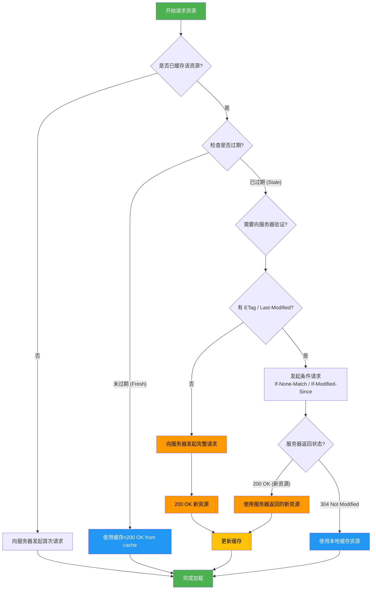

>浏览器上解析执行的 HTML、CSS 和 JavaScript 文件通常是通过网络请求从 Web 服务器上下载解析的，加载过程中，浏览器通过网络模块创建下载进程，发起 HTTP 请求，将 HTML 文本、CSS 样式或 JavaScript 脚本装载进浏览器解析或运行。这里就涉及了一些相关的网络协议。

### 一、HTTP 协议简介

---

Hyper Transport Protocol，超文本传输协议是 WWW 服务器和用户请求代理（例如浏览器等）之间通过应答请求模式传输超文本（例如 HTML 文件、JavaScript 文件、CSS 文件、图片甚至服务器接口数据等）内容的一种协议，协议的详细规范序号为 RFC2616。

HTTP 应答过程展示了客户端（UserAgent，通常是浏览器）与服务器之间的交互流程。这个过程分为几个关键步骤：

#### 1.1 客户端发起请求

客户端向服务器发送一个 HTTP 请求，请求中包含了多个头部信息和可能的请求体内容。在图示中，客户端发送了一个 `GET` 请求，请求的目标是 `/` 路径，并且使用的是 HTTP/1.1 协议版本。请求头中包含以下信息：

- **Accept**：指定客户端能够接受的内容类型。
- **Cache-Control**：设置缓存策略，例如 `max-age=3600` 表示资源在 3600 秒内有效。
- **Cookie**：包含了浏览器的 cookie 信息，用于会话管理。
- **Host**：指定请求的主机名。
- **If-Modiled-Since**：如果资源自指定时间后未被修改，则返回 304 状态码，否则返回 200 状态码并附带新的资源。
- **Proxy-Connection**：设置代理连接方式，这里为 keep-alive，表示保持连接。
- **User-Agent**：描述客户端的信息，如浏览器类型、版本等。

#### 1.2 服务器处理请求

服务器接受到客户端的请求后，会根据请求中的信息进行相应的处理。在这个过程中，服务器会检查资源是否存在、是否需要更新等。如果资源自从上次请求以来没有被修改过，服务器将返回一个 304 Not Modified 状态码，告知客户端资源未被修改，客户端可以直接从本地缓存中读取资源。

#### 1.3 服务器生成响应

服务器根据处理结果生成响应，并将其发送回客户端。在图示中，服务器返回了一个 304 Not Modified 的响应，表示资源未被修改。响应头中包含以下信息：

- **HTTP/1.1 304 Not Modified**: 响应状态行，表明这是一个 HTTP/1.1 协议的响应，状态码为304，表示资源未被修改。
- **Cache-Control**: 重申缓存策略，设置资源的有效期。
- **Connection**: 设置连接方式，这里为 `keep-alive`，表示保持连接。
- **Date**: 服务器生成响应的时间。
- **Expires**: 资源过期时间，客户端可以根据这个时间判断资源是否需要重新请求。
- **Vary**: 指定哪些请求头会影响服务器对资源的选择，这里是 `Accept-Encoding`，表示不同的编码方式可能会导致不同的资源返回。

#### 1.4 客户端接受响应

客户端接收到服务器的响应后，会根据响应的状态码和头部信息进行相应的处理。在这个例子中，由于状态码为 `304 Not Modified`，客户端会直接从本地缓存中读取资源，而不会再次请求服务器获取资源内容。


### 二、HTTP 1.1

---

#### 2.1 长连接

长连接允许客户端和服务器之间的**TCP连接**在完成一次请求/响应交互后不立即关闭，而是保持打开状态以便后续的请求和响应能够重用这个连接，减少重复建立和断开连接的开销。

在HTTP/1.1版本之前，默认情况下每个HTTP请求都会创建一个新的TCP连接，并在响应结束后立即关闭该连接。自HTTP/1.1起，引入了“Connection”头部字段，通过设置其值为`keep-alive`，默认开启了长连接支持，使得一个TCP连接可以服务多个HTTP请求和响应。

使用长连接时的注意事项：

- **超时与心跳检测**：为了防止长时间空闲的连接占用服务器资源，通常会设定一定的超时机制，一旦超过设定的时间没有活动，则自动关闭连接。此外，有时也会采用心跳包的方式维持连接活跃状态。
- **并发控制**：虽然长连接可以减少资源消耗，但过多的长连接同样会对服务器造成压力。因此，合理地管理并发连接数也是十分重要的。
- **兼容性问题**：尽管大多数现代Web服务器和浏览器都支持长连接，但在某些特定环境下或对老旧系统的兼容上，可能需要特别注意。

#### 2.2 协议扩展切换

在某些场景下，客户端和服务器可能需要根据实际情况在不同的通信协议之间切换。例如：

- **HTTP 到 WebSocket**：在需要实时双向通信的应用中（如聊天应用、在线游戏），客户端可能首先通过 HTTP 协议与服务器建立连接，然后通过 Upgrade 头部字段请求升级到 WebSocket 协议，从而实现持久的双向通信。

  ```http
  GET /chat HTTP/1.1
  Host: example.com
  Upgrade: websocket
  Connection: Upgrade
  Sec-WebSocket-Key: dGhlIHNhbXBsZSBub25jZQ==
  Sec-WebSocket-Version: 13
  ```

  服务器如果支持 WebSocket，会返回 101 Switching Protocols 状态码，表示协议已成功切换。

- **HTTP/1.1 到 HTTP/2**：现代浏览器和服务器通常支持 HTTP/2，它提供了多路复用、头部压缩等新能优化。客户端可以通过 ALPN（Application-Layer Protocol Negotiation）在 TLS 握手阶段协商使用 HTTP/2，从而实现从 HTTP/1.1 到 HTTP/2 的“切换”。

协议扩展是指在不破坏现有协议兼容性的前提下，向协议中添加新的功能或字段。例如：

- **HTTP 头部扩展**：HTTP 协议允许自定义头部字段（以 X-开头，尽管现在推荐使用无前缀的标准化字段），用于传递额外的元数据。例如：

- **WebSocket 扩展**：WebSocket 协议通过支持`Sec-WebSocket-Extensions` 头部协商使用扩展，如消息压缩（`permessage-deflate`）：

  ```http
  Sec-WebSocket-Extensions: permessage-deflate; client_max_window_bits

- **TLS 扩展**：在 TLS 握手过程中，客户端和服务器可以通过扩展字段协商支持的协议版本、加密套件、服务器名称（SNI）等。

#### 2.3 缓存控制

1. `Cache-Control`（最重要的缓存指令）

   `Cache-Control` 是 HTTP/1.1 中最核心的缓存控制头部，定义了**缓存的行为策略**，可应用于请求（Request）和响应（Response）。

   ```http
   Cache-Control: public, max-age=3600, s-maxage=7200
   ```

   >表示：所有缓存均可存储，浏览器缓存 1 小时，CDN 缓存 2 小时。

   ```http
   Cache-Control: private, no-cache
   ```

   >表示：仅浏览器可缓存，但每次使用前必须验证。

2. `ETag` / `If-None-Match`（基于内容指纹）

   - 服务器响应：

     ```http
     ETag: "abc123"
     ```

   - 客户端再次请求：

     ```http
     If-None-Match: "abc123"
     ```

     服务器检查 ETag 是否匹配：

     - 匹配 → 返回 `304 Not Modified`
     - 不匹配 → 返回 `200 OK` 和新资源

3. `Last-Modified` / `If-Modified-Since`（基于时间戳）

   - 服务器响应：

     ```http
     Last-Modified: Wed, 16 Aug 2025 08:00:00 GMT
     ```

   - 客户端再次请求：

     ```http
     If-Modified-Since: Wed, 16 Aug 2025 08:00:00 GMT
     ```

     服务器检查资源最后修改时间：

     - 未更新 → `304 Not Modified`
     - 已更新 → `200 OK`

| 场景                       | 推荐策略                                                     |
| -------------------------- | ------------------------------------------------------------ |
| **静态资源（JS/CSS/Img）** | `Cache-Control: public, max-age=31536000, immutable` + 内容哈希命名 |
| **HTML 页面**              | `Cache-Control: no-cache` + `ETag`                           |
| **用户私有数据（API）**    | `Cache-Control: private, max-age=60`                         |
| **敏感信息（如登录页）**   | `Cache-Control: no-store`                                    |
| **CDN 加速**               | 使用 `s-maxage` 控制 CDN 缓存时间                            |



#### 2.4 部分内容传输优化

部分内容传输优化通常指的是在HTTP协议中利用**范围请求（Range Requests）**来优化大文件的传输或恢复中断的下载，这种方法可以显著提高效率，特别是在处理大文件或者在网络不稳定的情况下。

- **断点续传**：当下载过程中断时，用户可以从上次停止的地方继续下载，而不需要重新开始。
- **多线程下载**：通过同时请求多个片段来加速下载过程。
- **视频流媒体**：播放器可以在不加载整个视频文件的情况下，跳转到特定的时间点进行播放。

**客户端请求**

客户端需要发送一个带有 Range 头部的 HTTP 请求，指定它想要获取的字节范围。例如，要请求文件的前 1000 个字节，请求头如下：

```http
Range: bytes=0-999
```

对于多段请求，可以这样指定多个范围：

```http
Range: bytes=0-499,500-999
```

**服务器响应**

如果服务器支持范围请求，并且请求的范围有效，则会在响应中包含 206 Partial Content 状态码以及对应的字节范围。响应头中会有一个 Content-Range 字段指出实际返回的内容范围，如：

```http
Content-Range: bytes 0-499/1000
```

这表示返回的是从 0 到 499 字节的数据，总长度为 1000 字节。如果请求的范围无效，服务器可能会返回 416 Range Not Satisfiable 错误。

>⚠️注意事项
>
>- **服务器支持**：不是所有的服务器都支持范围请求。在尝试使用范围请求之前，应该检查服务器是否接受此类请求。可以通过查看响应中的`Accept-Ranges`头部来确认：
>
>  ```http
>  Accept-Ranges: bytes
>  ```
>
>  如果服务器不支持范围请求，则该头部可能不会出现，或者其值为`none`。
>
>- **缓存问题**：由于部分内容传输涉及多次请求，如何正确地缓存这些部分可能变得复杂。开发者需要注意设置合适的缓存控制策略以确保最终用户能够获得一致的结果。


### 三、HTTP 2

---

HTTP/2 是 HTTP 协议的第二个主要版本，旨在解决 HTTP/1.1 中存在的性能瓶颈，特别是在高延迟网络环境下。它基于 Google 的 SPDY 协议开发，并于 2015 年由 IETF 正式标准化（RFC 7540）。HTTP/2 在不改变 HTTP 语义（如请求方法、状态码、URL）的基础上，通过底层传输机制的优化，显著提升了 Web 性能。

#### 3.1 二进制分帧层（核心改进）

Binary Framing Layer

HTTP/2 将所有传输的数据（请求和响应）分解为二进制帧（Frame），并封装在流中进行传输。

- **帧（Frame）**：最小通信单位，分为 `HEADERS`、`DATA`、`PRIORITY` 等类型。
- **流（Stream）**：一个逻辑上的双向字节流，对应一个完整的请求/响应。
- **消息（Message）**：由一个或多个帧组成，对应一个完整的 HTTP 请求或响应。

>二进制格式更高效、易于解析，避免了 HTTP/1.x 的文本解析开销。

#### 3.2 多路复用（性能飞跃）

Multiplexing

在 HTTP/1.1 中，多个请求需排队或并行多个 TCP 连接（存在“队头阻塞”问题）

HTTP/2 允许**多个请求和响应在同一个 TCP 连接上同时传输**。

- 多个流（Stream）共享一个 TCP 连接。
- 每个流可以独立发送帧，互不阻塞。
- 彻底解决了 HTTP/1.1 的“队头阻塞”（Head-of-Line Blocking）。

>页面加载速度显著提升，尤其对资源密集型网站。

#### 3.3 头部压缩（减少冗余）

HPACK

HTTP 请求头通常包含大量重复信息（如 `Cookie`、`User-Agent`），HTTP/2 使用 **HPACK 压缩算法** 对头部进行编码：

- 使用静态表和动态表存储常见头部字段。
- 仅传输差异部分，大幅减少头部体积（可压缩 80%+）。

#### 3.4 请求优先级

Stream Priority

客户端可为每个流设置优先级，告知服务器哪些资源更重要（如 HTML > CSS > JS > 图片）。

- 服务器根据优先级调度资源传输顺序。
- 提升关键资源加载速度，优化用户体验。

#### 3.5 流量控制

Flow Control

防止发送方过快发送数据导致接收方缓冲区溢出。

- 基于窗口大小（Window Size）机制。
- 每个流和连接都可独立设置流量控制。

#### 3.6 安全性

HTTPS 是事实标准。

虽然 HTTP/2 协议本身支持明文传输（`h2c`），但**Chrome、Firefox、Safari 等主流浏览器仅支持 HTTPS 上的 HTTP/2（`h2`）**。因此，部署 HTTP/2 通常意味着必须启用 TLS（HTTPS）。

#### 3.7 启用 HTTP/2

1. 服务器支持
   - Nginx：1.9.5+，需启用 http2 模块
   - Apache：2.4.17+，启用 mod_http2
   - CDN：Cloudflare、阿里云 CDN、AWS CloudFront 等均默认支持 HTTP/2。
2. 浏览器支持
   - 所有现代浏览器均支持 HTTP/2。
3. 验证方法
   - 浏览器 DevTools → Network → 查看协议列（Protocol）是否为 h2。