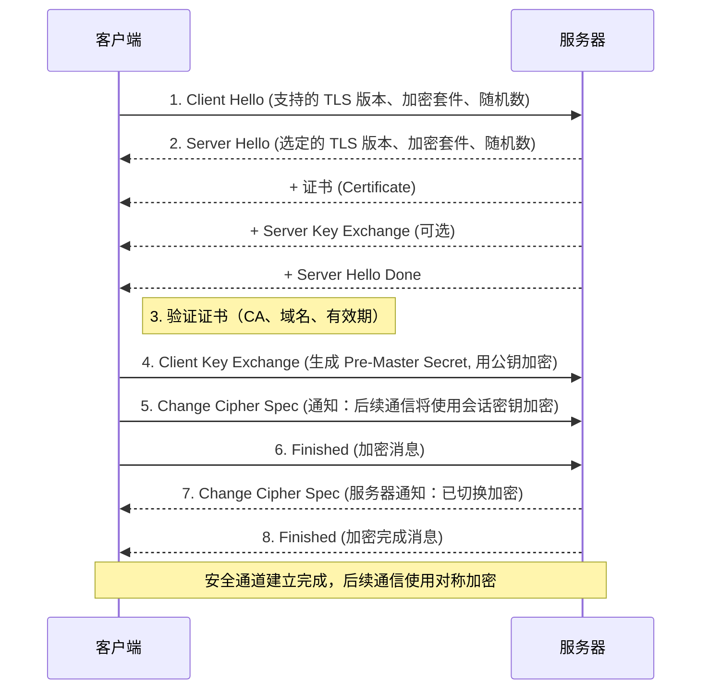

### 一、XSS

---

XSS（Cross-Site Scripting）是一种客户端代码注入攻击。攻击者将恶意脚本（通常是 JavaScript）注入到网页中，当其他用户浏览该页面时，恶意脚本会在用户的浏览器中执行。

> ⚠️ **关键点**：XSS 攻击的目标是**用户**，而不是服务器。它利用了用户对网站的信任。

#### 1.1 三种类型

1. **反射型 XSS（Reflected XSS）**

   - 原理：恶意脚本通过 URL 参数等方式“反射”回服务器的响应中，并在用户的浏览器中执行。

   - 触发方式：用户点击一个恶意链接（如钓鱼邮件中的链接）。

   - 例子：

     ```js
     http://example.com/search?q=<script>alert('XSS')</script>
     ```

     如果网站没有对 q 参数进行过滤或编码，搜索结果页面可能会直接将该脚本插入 HTML 中执行。

   - 特点：一次性、需要诱导用户点击。

2. **存储型 XSS（Stored XSS）**

   - 原理：恶意脚本被永久存储在服务器上（如数据库、评论、用户资料），当其他用户访问该页面时自动执行。
   - 触发方式：用户访问包含恶意脚本的页面。
   - 例子：
     - 在论坛评论中插入 `<script>窃取Cookie()</script>`。
     - 在用户昵称中插入恶意脚本。
   - 特点：影响范围广、持久性强，危害最大。

3. DOM 型 XSS（DOM-based XSS）

   - **原理**：漏洞和执行都在客户端（浏览器）的 DOM（文档对象模型）中完成，不经过服务器响应。

   - **触发方式**：JavaScript 代码直接操作 DOM 时，使用了不可信的数据（如 `location.hash`、`document.referrer`）。

   - 例子：

     ```js
     <script>
       var data = location.hash.slice(1);
       document.getElementById("div").innerHTML = data; // 危险！
     </script>
     ```

     访问 `http://example.com#` 会触发脚本。

   - **特点**：服务器返回的页面本身不包含恶意代码，攻击在客户端动态生成。

#### 1.2 危害

1. **窃取用户 Cookie / Session ID**
   攻击者可冒充用户登录，实现“会话劫持”。
2. **钓鱼攻击（Phishing）**
   动态插入伪造的登录框，骗取用户账号密码。
3. **键盘记录（Keylogging）**
   记录用户在页面上的输入。
4. **重定向用户**
   将用户跳转到恶意网站。
5. **传播蠕虫（如社交平台）**
   自动发布带有恶意脚本的内容，感染更多用户。
6. **结合 CSRF 实现更复杂攻击**
   在用户不知情下执行敏感操作（如转账、删数据）。

#### 1.3 防御措施

1. #### **输出编码（Output Encoding）**

   - 在将不可信数据插入 HTML 页面前，根据输出上下文进行编码：
     - **HTML 上下文**：`<` → `<`, `>` → `>`, `&` → `&`
     - **JavaScript 上下文**：使用 `\xHH` 或 `\uHHHH` 转义
     - **URL 上下文**：使用 `encodeURIComponent`
   - **推荐库**：OWASP Java Encoder、DOMPurify（JS）、htmlspecialchars（PHP）等。

2. **输入验证（Input Validation）**

   - 对用户输入进行白名单验证（如只允许字母数字）。
   - 过滤或拒绝包含 `<script>`、`onerror=`、`javascript:` 等危险关键字的输入。
   - 注意：**输入验证不能完全替代输出编码**，因为有些场景需要允许 HTML（如富文本编辑器）。

3. **使用内容安全策略（CSP, Content Security Policy）**

   - 通过 HTTP 响应头设置：

     ```http
     Content-Security-Policy: default-src 'self'; script-src 'self' https://trusted.cdn.com;
     ```

   - 作用：
     - 禁止内联脚本（`<script>...</script>` 和 `onclick=""`）。
     - 只允许从指定域名加载脚本。
     - 是防御 XSS 的“最后一道防线”。

4. **设置安全的 Cookie 属性**

   - `HttpOnly`：防止 JavaScript 通过 `document.cookie` 读取 Cookie。

   - `Secure`：仅通过 HTTPS 传输。

   - `SameSite=Strict/Lax`：防止 CSRF，间接降低 XSS 利用风险。

5. **避免危险的 DOM 操作**

- 避免使用：

  ```js
  element.innerHTML = untrustedData;
  document.write(untrustedData);
  eval(untrustedData);
  ```

- 改用安全方式：

  ```js
  element.textContent = untrustedData; // 仅作为文本
  element.setAttribute('href', encodeURI(url));
  ```

6. **使用现代框架的安全机制**

   - React：默认对 `{}` 中的内容进行转义。

   - Vue：使用 `v-text` 而非 `v-html`，或使用 `DOMPurify` 净化 HTML。

   - Angular：内置 XSS 防护。


### 二、SQL 注入攻击

---

**SQL 注入（SQL Injection）** 是一种代码注入攻击，攻击者通过在应用程序的输入字段（如登录框、搜索框、URL 参数等）中插入恶意的 SQL 代码，欺骗后端数据库执行非预期的 SQL 命令。

#### 2.1 原理

假设有一个登录功能，正常输入：

- 用户名：`alice`

- 密码：`123456`

- 生成的 SQL：

  ```sql
  SELECT * FROM users WHERE username = 'alice' AND password = '123456'
  ```

**攻击输入**：

- 用户名：`admin' --`

- 密码：任意（如 `123`）

- 生成的 SQL：

  ```sql
  SELECT * FROM users WHERE username = 'admin' -- ' AND password = '123'
  ```

`--` 是 SQL 的注释符，后面的内容被忽略。最终查询变为：

```sql
SELECT * FROM users WHERE username = 'admin'
```

攻击者无需密码即可以 `admin` 身份登录！

#### 2.2 常见类型

| 类型                            | 说明                                                         | 特点                                   |
| ------------------------------- | ------------------------------------------------------------ | -------------------------------------- |
| **联合查询注入（Union-based）** | 利用 `UNION` 操作符合并两个查询结果，直接从数据库中提取数据。 | 可以直接获取表名、列名、敏感数据。     |
| **错误型注入（Error-based）**   | 通过构造特殊输入，触发数据库错误，从错误信息中获取数据库结构或数据。 | 依赖数据库返回详细错误信息。           |
| **盲注（Blind SQLi）**          | 无法直接看到查询结果或错误信息，通过观察页面行为（真假）间接推断数据。 | 时间更长，但隐蔽性强。                 |
| • 布尔盲注                      | 页面返回“真”或“假”（如内容变化、状态码不同）。               | 例如：`... AND 1=1` vs `... AND 1=2`   |
| • 时间盲注                      | 根据数据库响应时间判断真假（如 `SLEEP(5)`）。                | 例如：`... AND IF(1=1, SLEEP(5), 0)`   |
| **堆叠注入（Stacked Queries）** | 在一个请求中执行多条 SQL 语句（如 `; DROP TABLE users;--`）。 | 危害极大，但多数数据库或驱动默认禁用。 |

#### 2.3 危害

1. **数据泄露**
   窃取用户信息、密码、订单、财务数据等。
2. **身份绕过**
   绕过登录验证，获取管理员权限。
3. **数据篡改**
   修改、删除数据库中的数据。
4. **拒绝服务（DoS）**
   执行大量查询或删除操作，导致数据库瘫痪。
5. **远程代码执行（RCE）**
   在某些配置下（如 MySQL 的 `SELECT ... INTO OUTFILE`），可写入 Webshell，进而控制服务器。
6. **提权与横向移动**
   利用数据库漏洞提升权限，攻击内网其他系统。

#### 2.4 防御措施

1. **使用参数化查询（Prepared Statements）**

   参数化查询将 SQL 语句的**结构**和**数据**分离，数据库会预先编译 SQL 模板，用户输入仅作为“参数”传入，不会被解析为 SQL 代码。

   正确示例：

   ```java
   String sql = "SELECT * FROM users WHERE username = ? AND password = ?";
   PreparedStatement stmt = connection.prepareStatement(sql);
   stmt.setString(1, username);
   stmt.setString(2, password);
   ResultSet rs = stmt.executeQuery();
   ```

   错误示例（字符串拼接）：

   ```java
   String sql = "SELECT * FROM users WHERE username = '" + username + "' AND password = '" + password + "'";
   ```

   >支持参数化查询的语言/框架：Java (JDBC), Python (sqlite3, psycopg2), .NET (SqlCommand), PHP (PDO, MySQLi) 等。

2. **输入验证与过滤**

   - 对用户输入进行白名单验证（如邮箱格式、手机号规则）。

   - 过滤或转义特殊字符（如 `'`, `;`, `--`, `/*`, `*/`）。

   - 注意：**输入验证不能替代参数化查询**，只能作为辅助手段。

3. **最小权限原则**

   - 数据库连接账户不应使用 `root` 或 `sa` 等高权限账号。

   - 应为应用分配最小必要权限（如只允许 `SELECT`, `INSERT`，禁止 `DROP`, `DELETE`, `EXECUTE`）。

4. **避免暴露数据库错误信息**

   - 不要将数据库错误直接返回给前端（如“MySQL Error 1064”）。

   - 使用自定义错误页面，记录日志供管理员查看。

5. **使用 ORM 框架**

   - Hibernate, MyBatis, Django ORM 等通常使用参数化查询，能有效防止 SQLi。

   - 但若使用原生 SQL 或 HQL 拼接，仍可能中招。

6. **Web 应用防火墙（WAF）**

   - 可检测和拦截常见的 SQL 注入攻击载荷。

   - 作为**纵深防御**手段，**不能替代代码层防护**。

7. **定期安全测试与扫描**

   - 使用工具如：SQLMap（测试）、Burp Suite、OWASP ZAP、Acunetix 等进行渗透测试。

   - 定期审计代码，尤其是拼接 SQL 的地方。


### 三、DNS 劫持

---

**DNS 劫持（DNS Hijacking）**，也称为 **DNS 重定向（DNS Redirection）**，是一种网络攻击手段。攻击者通过非法手段篡改 DNS（域名系统）的正常解析过程，将用户对某个域名的请求**错误地指向一个攻击者控制的 IP 地址**，而不是该域名真实的服务器 IP。

#### 3.1 原理

正常的 DNS 解析流程：

1. 用户在浏览器输入 `www.bank.com`。
2. 操作系统向 DNS 服务器（如运营商 DNS）查询该域名的 IP。
3. DNS 服务器返回正确的 IP 地址。
4. 浏览器连接该 IP，加载网页。

**DNS 劫持后**：

- 攻击者在某个环节篡改了 DNS 响应，返回一个**伪造的 IP 地址**（比如指向钓鱼网站或恶意服务器）。
- 用户的浏览器连接了错误的服务器，可能被窃取账号密码或感染恶意软件。

#### 3.2 常见类型

| 类型                                    | 说明                                                         | 攻击者身份                 |
| --------------------------------------- | ------------------------------------------------------------ | -------------------------- |
| **本地 DNS 劫持**                       | 恶意软件（如病毒、木马）修改用户电脑或路由器的 DNS 设置。    | 本地攻击者                 |
| **ISP 劫持（服务提供商劫持）**          | 网络运营商（ISP）出于广告、审查或缓存目的，故意返回错误的 DNS 响应。 | 运营商                     |
| **中间人攻击（MITM）**                  | 攻击者在用户与 DNS 服务器之间拦截并篡改 DNS 请求/响应。      | 网络中间人（如公共 Wi-Fi） |
| **DNS 服务器劫持**                      | 攻击者入侵并控制 DNS 服务器（如域名注册商、递归 DNS 服务器），修改其解析记录。 | 高级攻击者                 |
| **DNS 缓存投毒（DNS Cache Poisoning）** | 向 DNS 缓存服务器注入虚假的解析记录，导致后续查询返回错误结果。 | 网络层攻击                 |

#### 3.3 危害

1. **钓鱼攻击（Phishing）**
   用户访问 `www.bank.com`，却被导向伪造的银行登录页，导致账号密码泄露。
2. **恶意软件传播**
   用户下载“正常软件”时，被重定向到包含病毒的页面。
3. **流量劫持与广告注入**
   强制插入广告、跳转到合作网站，谋取非法利益。
4. **隐私泄露**
   攻击者可监控用户的访问行为，收集浏览习惯。
5. **服务中断（DoS）**
   将域名解析到无效 IP，导致服务无法访问。
6. **企业安全风险**
   内部系统、API 接口被劫持，可能导致数据泄露或业务中断。

#### 3.4 如何判断是否遭遇 DNS 劫持

1. **访问正常网站跳转到陌生页面**（尤其是广告页或搜索页）。

2. **域名拼写错误时不再提示“无法访问”**，而是跳转到某个搜索结果页（ISP 常见行为）。

3. **使用不同网络（如切换 Wi-Fi 和 4G）访问同一网站结果不同**。

4. **通过 `nslookup` 或 `dig` 命令查询域名，结果与权威 DNS 不符**：

   ```bash
   nslookup www.baidu.com
   # 正常结果应指向百度的 IP，如 14.215.177.39
   ```

#### 3.5 防范措施

1. 使用可信的公共DNS服务

   将设备或路由器的 DNS 设置为安全、可靠的公共 DNS，避免使用 ISP 默认 DNS。

   | DNS 服务商         | IPv4 地址                | 特点                         |
| ------------------ | ------------------------ | ---------------------------- |
| **阿里云 DNS**     | `223.5.5.5`, `223.6.6.6` | 国内解析快，防劫持能力强     |
| **腾讯 DNSPod**    | `119.29.29.29`           | 稳定、安全                   |
| **Cloudflare DNS** | `1.1.1.1`                | 全球最快，注重隐私           |
| **Google DNS**     | `8.8.8.8`, `8.8.4.4`     | 国际常用，但部分地区访问受限 |

2. 启用DNSSEC（DNS Security Extensions）
   - DNSSEC 为 DNS 数据提供**数字签名**，确保解析结果的**真实性**和**完整性**。
   - 防止 DNS 缓存投毒和伪造响应。
   - 需要域名所有者和 DNS 服务商共同支持。
3. 使用加密DNS （DoH/DoT）
   - **DoH（DNS over HTTPS）**：通过 HTTPS 加密 DNS 查询，防止中间人窃听和篡改。
   - **DoT（DNS over TLS）**：通过 TLS 加密 DNS 通信。
   - 浏览器支持：Firefox、Chrome 已支持 DoH。
   - 公共 DoH 服务：
     - 阿里云：`https://dns.alidns.com/dns-query`
     - Cloudflare：`https://cloudflare-dns.com/dns-query`
4. 定期检查路由器安全
   - 更改默认管理员密码。
   - 关闭远程管理功能。
   - 升级固件到最新版本。
   - 检查 DNS 设置是否被篡改。
5. 安装并更新安全软件
   - 使用可靠的杀毒软件和防火墙，防止恶意软件修改本地 DNS。
6. 域名所有者防护
   - 在域名注册商处启用**域名锁**（Registry Lock）。
   - 使用强密码 + 二次验证（2FA）保护域名账户。
   - 定期检查 DNS 解析记录是否异常。


### 四、HTTP 劫持

---

**HTTP 劫持**（HTTP Hijacking）是指攻击者在用户与目标服务器之间的通信链路中，**非法截获、篡改或注入 HTTP 数据包**，从而实现流量监控、内容篡改、广告植入、钓鱼攻击等恶意目的。

#### 4.1 原理（以内容注入为例）

1. 用户通过 HTTP 访问 `http://example.com`。

2. 请求在传输过程中（如经过运营商网关、公共 Wi-Fi 路由器）被拦截。

3. 攻击者在服务器返回的 HTML 响应中插入恶意代码，例如：

   ```html
   <script src="http://malicious.com/ads.js"></script>
   ```

4. 用户浏览器收到被篡改的页面，执行恶意脚本，弹出广告或窃取信息。

> **关键点**：HTTP 是**明文传输**，任何中间节点都可以查看和修改内容。

#### 4.2 常见类型

| 类型                                 | 说明                                            | 典型场景               |
| ------------------------------------ | ----------------------------------------------- | ---------------------- |
| **内容注入（Content Injection）**    | 在网页中插入广告、弹窗、JS 脚本等。             | 公共 Wi-Fi、运营商劫持 |
| **会话劫持（Session Hijacking）**    | 窃取用户的 Cookie 或 Session ID，冒充用户登录。 | 未加密网络、XSS 配合   |
| **连接劫持（Connection Hijacking）** | 接管 TCP 连接，发送伪造请求或响应。             | 局域网攻击             |
| **降级攻击（Downgrade Attack）**     | 强制客户端使用不安全的 HTTP 而非 HTTPS。        | 中间人干扰             |
| **缓存投毒（Cache Poisoning）**      | 向代理缓存服务器注入恶意内容，影响多个用户。    | 公共代理服务器         |

#### 4.3 危害

1. **隐私泄露**
   攻击者可监听用户浏览的网页、提交的表单（如账号密码）。
2. **恶意广告与弹窗**
   强制插入广告，影响用户体验，甚至诱导下载恶意软件。
3. **钓鱼攻击**
   修改页面内容，伪造登录框，骗取用户敏感信息。
4. **会话劫持**
   窃取 Cookie 后，可直接登录用户账号（如社交、邮箱、购物网站）。
5. **恶意代码传播**
   注入 XSS、挖矿脚本、木马下载链接。
6. **企业安全风险**
   内部系统接口被监听或篡改，导致数据泄露或业务异常。

#### 4.4 如何判断是否遭遇 HTTP 劫持

1. 网页中出现异常广告、弹窗或脚本。

2. 访问正常网站跳转到陌生页面。

3. 浏览器地址栏显示“不安全”或证书错误。

4. 使用 `curl` 或开发者工具查看响应内容是否被注入：

   ```bash
   curl -I http://example.com
   ```

5. 对比不同网络环境下的页面内容是否一致。

#### 4.5 防范措施

1. **强制使用 HTTPS**

   - 网站应全站启用 HTTPS。

   - 使用 HSTS（HTTP Strict Transport Security）告诉浏览器“以后访问本站必须用 HTTPS”：

     ```http
     Strict-Transport-Security: max-age=31536000; includeSubDomains; preload
     ```

2. **启用 HSTS 预加载（HSTS Preload）**

   - 将域名提交到浏览器的 HSTS 预加载列表（如 Chrome 的 hstspreload.org）。

   - 即使用户第一次访问 `http://`，浏览器也会自动跳转到 `https://`。

3. **使用内容安全策略（CSP）**

   - 防止注入的脚本执行：

     ```htpp
     Content-Security-Policy: default-src 'self'; script-src 'self' https://trusted.cdn.com;
     ```

4. **设置安全的 Cookie 属性**

   - `Secure`：仅通过 HTTPS 传输。

   - `HttpOnly`：防止 JavaScript 窃取。

   - `SameSite=Strict/Lax`：防止 CSRF。

5. **避免使用不安全的公共 Wi-Fi**

   - 公共网络（如机场、咖啡馆）极易被监听和劫持。

   - 如需使用，建议搭配 **VPN** 或只访问 HTTPS 网站。

6. **客户端防护**

   - 使用现代浏览器（自动拦截可疑内容）。

   - 安装可信的安全软件（防病毒、防钓鱼）。

   - 不随意点击不明链接。

7. **服务器端安全配置**

   - 使用强 TLS 配置（禁用 SSLv3、TLS 1.0/1.1，使用强加密套件）。

   - 定期更新证书。

   - 部署 WAF（Web 应用防火墙）检测异常流量。


### 五、HTTP 协议解析

---

#### 5.1 简介

- 全称：**HTTP Secure**（或 **HTTP over TLS/SSL**）
- 定义：HTTPS 是在 **HTTP 协议**和 **TCP 协议**之间加入了一层 **TLS/SSL 加密协议**，用于加密客户端与服务器之间的通信。
- 端口：默认使用 **443** 端口（HTTP 为 80）。
- 目标：解决 HTTP 的**明文传输**问题，防止**窃听、篡改、冒充**。

> 简单理解：**HTTPS = HTTP + TLS/SSL + 证书验证**

#### 5.2 核心机制

1. **TLS/SSL 协议**（传输层安全协议）

   - **SSL**（Secure Sockets Layer）：早期版本（已淘汰）。

   - **TLS**（Transport Layer Security）：SSL 的继任者，当前主流是 **TLS 1.2** 和 **TLS 1.3**。

   - 作用：
     - 加密通信内容（防窃听）
     - 验证服务器身份（防冒充）
     - 保证数据完整性（防篡改）

2. **公钥加密体系（非对称加密）**

   HTTPS 使用**非对称加密**（如 RSA、ECC）进行密钥交换，再用**对称加密**（如 AES）加密实际数据。

   - **公钥（Public Key）**：公开的，用于加密。

   - **私钥（Private Key）**：服务器私有，用于解密。
   
   >举例：客户端用“锁”（公钥）加密数据 → 服务器用“钥匙”（私钥）解密。

3. **数字证书（Digital Certificate）**

   - 作用：证明“这个公钥确实属于这个网站”。

   - 颁发机构：由受信任的 **CA（Certificate Authority）** 如 Let's Encrypt、DigiCert、阿里云等颁发。

   - 包含信息：
     - 域名（Common Name）
     - 公钥
     - 有效期
     - 颁发 CA
     - 数字签名

   >浏览器内置了受信任的 CA 列表，会自动验证证书合法性。

#### 5.3 工作流程（TLS 握手过程）



以下是 TLS 1.2 的典型握手流程（以 RAS 为例）：

1. **客户端问候**（Client Hello），客户端发送：
   - 支持的 TLS 版本
   - 支持的加密套件（Cipher Suites）
   - 随机数（Client Random）
2. **服务器问候**（Server Hello），服务器响应：
   - 选定的 TLS 版本和加密套件
   - 随机数（Server Random）
   - 数字证书（包含公钥）
3. **证书验证**，客户端验证证书（若验证失败，浏览器显示“证书错误”）：
   - 是否由可信 CA 签发？
   - 域名是否匹配？
   - 是否在有效期内？
   - 是否被吊销？（OCSP/CRL）
4. **生成会话密钥**
   - 客户端生成一个**预主密钥（Pre-Master Secret）**，用服务器的**公钥加密**后发送。
   - 服务器用**私钥解密**得到预主密钥。
   - 双方使用 **Client Random + Server Random + Pre-Master Secret** 生成相同的**会话密钥（Session Key）**。
5. **切换加密通信**
   - 客户端发送 “Finished” 消息（用会话密钥加密）。
   - 服务器发送 “Finished” 消息（用会话密钥加密）。
   - 握手完成，后续通信使用**对称加密**（如 AES）和**会话密钥**进行。

>为什么用对称加密？
>
>非对称加密计算开销大，只用于密钥交换；对称加密速度快，适合大量数据传输。

#### 5.4 HTTPS 安全增强机制

1. **HSTS（HTTP Strict Transport Security）**

   - 告诉浏览器：“以后访问本站必须用 HTTPS”。

   - 防止降级攻击（如 SSL Strip）。

   - 示例头：

     ```http
     Strict-Transport-Security: max-age=31536000; includeSubDomains; preload
     ```

2. **证书透明度（Certificate Transparency, CT）**
   - 所有证书签发记录公开可查，防止非法证书被签发。

3. **OCSP Stapling**
   - 服务器在握手时主动提供证书吊销状态，减少客户端查询延迟。

4. **TLS 1.3**

   - 更快的握手（1-RTT 或 0-RTT）

   - 移除不安全加密算法

   - 更强的安全性
