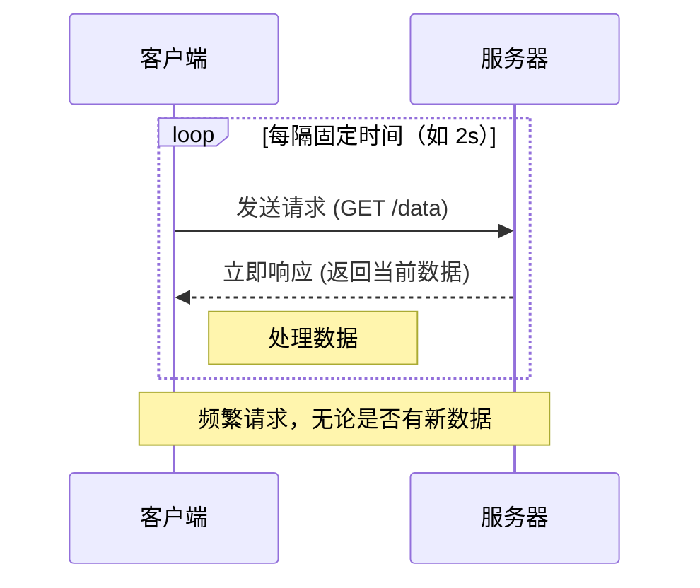
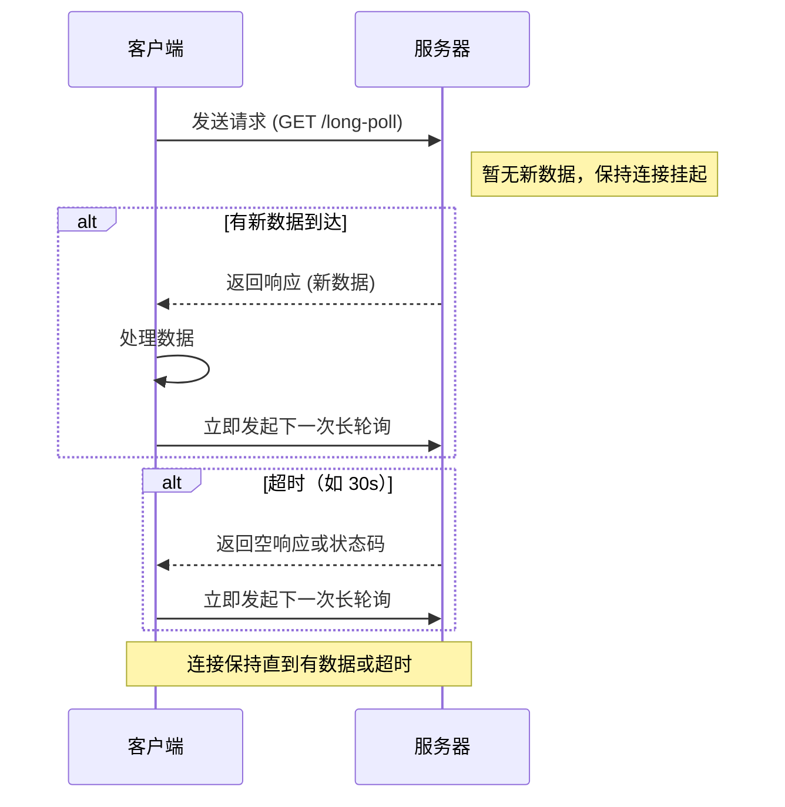

前端实时协议通常指的是用于实现实时通信的技术和协议。随着Web应用的发展，用户对即时响应和实时交互的需求日益增加，因此出现了多种技术来满足这些需求。以下是几种常见的前端实时通信协议和技术：

1. **WebSocket**：
   - WebSocket是一种在单个TCP连接上进行全双工通信的协议。它使得客户端和服务器之间的数据交换变得更加简单，允许服务器主动向客户端推送数据。
   - 特点：低延迟、双向通信、适用于需要实时更新的应用场景，如在线游戏、聊天应用等。
2. **Server-Sent Events (SSE)**：
   - SSE是一种允许服务器向浏览器推送更新的技术。与WebSocket不同，SSE是单向的，即只能从服务器到客户端。
   - 特点：实现简单，适合于只需要服务器向客户端发送数据的场景，如股票价格更新、社交媒体的状态更新等。
3. **HTTP Long Polling**：
   - HTTP长轮询不是一种独立的协议，而是一种使用HTTP协议的技术。在这种模式下，客户端发起请求后，如果服务器没有新信息，则保持连接打开状态直到有新消息或超时发生。
   - 特点：可以基于现有的HTTP服务器实现，但效率低于WebSocket。
4. **HTTP Streaming**：
   - 与长轮询类似，HTTP流媒体也是一种利用HTTP的技术，通过保持一个请求打开来持续地从服务器向客户端发送数据。
   - 特点：适合于需要连续更新的应用，如新闻提要、体育赛事比分等。
5. **gRPC-Web**（Google Remote Procedure Call for Web）：
   - gRPC-Web是gRPC协议的一个变种，专为Web环境设计。它支持高效的二进制序列化，并且可以通过HTTP/2传输。
   - 特点：高效的数据传输，支持复杂的请求/响应模式，适用于高性能的Web应用和服务。


### 一、WebSocket 通信机制

---

#### 1.1 简介

**WebSocket** 是一种在单个 TCP 连接上实现**全双工（Full-Duplex）通信**的网络协议，定义在 RFC 6455 中。它允许客户端和服务器之间进行**持久化、低延迟、双向实时通信**。

> 协议标识：
>
> - `ws://`：非加密 WebSocket（不推荐用于生产环境）
> - `wss://`：加密 WebSocket（基于 TLS，等同于 HTTPS）

#### 1.2 通信机制

1. 连接建立：基于 HTTP 的“握手”升级

   WebSocket 连接的建立始于一个 **HTTP 升级请求（Upgrade Request）**，服务器同意后将协议从 HTTP 升级为 WebSocket。

   客户端发起握手请求：

   ```http
   GET /chat HTTP/1.1
   Host: example.com
   Upgrade: websocket
   Connection: Upgrade
   Sec-WebSocket-Key: dGhlIHNhbXBsZSBub25jZQ==
   Sec-WebSocket-Version: 13
   Origin: https://example.com
   ```

   服务器响应（成功）：

   ```http
   HTTP/1.1 101 Switching Protocols
   Upgrade: websocket
   Connection: Upgrade
   Sec-WebSocket-Accept: s3pPLMBiTxaQ9kYGzzhZRbK+xOo=
   ```

   >状态码 101 表示协议切换，之后通信将使用 WebSocket 协议，不再使用 HTTP。

2. 数据帧传输：轻量级帧格式

   一旦连接建立，客户端和服务器可以通过**数据帧（Frames）** 交换消息。WebSocket 使用二进制或文本格式的帧进行通信。

   帧结构（简化）：

   | 字段           | 说明                                                   |
   | -------------- | ------------------------------------------------------ |
   | FIN            | 是否是消息的最后一个帧（用于分片）                     |
   | Opcode         | 操作码（如 1=文本, 2=二进制, 8=关闭, 9=Ping, 10=Pong） |
   | Mask           | 客户端发送的数据必须被掩码（Masked），防止代理缓存攻击 |
   | Payload Length | 数据长度                                               |
   | Masking Key    | 掩码密钥（客户端发送时使用）                           |
   | Payload Data   | 实际传输的数据                                         |

   > 特点：帧头小（最小 2 字节），开销低，适合高频小数据传输。

3. 双向通信：客户端与服务器可随时发送数据

   - 客户端可以随时向服务器发送消息。
   - 服务器也可以主动向客户端推送消息（这是传统 HTTP 无法做到的）。
   - 通信是**全双工**的，即发送和接收可以同时进行。

   ```js
   // 客户端代码
   const ws = new WebSocket('wss://api.example.com/chat');
   
   ws.onopen = () => {
     ws.send('Hello, Server!'); // 客户端发送
   };
   
   ws.onmessage = (event) => {
     console.log('Received:', event.data); // 服务器推送消息
   };
   ```

4. 连接保持与心跳机制

   WebSocket 连接是**持久化**的，不会像 HTTP 那样请求完就断开。

   心跳机制（Ping/Pong）：

   - 服务器可发送 `Ping` 帧（Opcode 9）
   - 客户端必须回复 `Pong` 帧（Opcode 10）
   - 用于检测连接是否存活，防止因长时间无数据而被中间代理断开。

   ```js
   // 示例：客户端处理 Pong
   ws.onpong = () => {
     console.log('Heartbeat received');
   };
   ```

5. 连接关闭

   - 任一方可以发送 `Close` 帧（Opcode 8）关闭连接。
   - 应包含关闭码（如 1000=正常关闭，1001=服务器宕机）和可选原因。
   - 另一方应响应 `Close` 帧，完成四次挥手。

   ```js
   ws.close(1000, "Normal Closure");
   ```

#### 1.3 应用场景

| 场景              | 说明                                  |
| ----------------- | ------------------------------------- |
| **实时聊天应用**  | 如微信、钉钉、Slack，消息即时送达     |
| **在线游戏**      | 客户端与服务器实时同步状态            |
| **股票/行情推送** | 金融数据实时更新                      |
| **协同编辑**      | 如 Google Docs，多人实时编辑同步      |
| **AI 流式响应**   | 大模型逐字输出（如通义千问、ChatGPT） |
| **远程控制**      | 如远程桌面、IoT 设备控制              |
| **直播弹幕**      | 实时发送和显示弹幕                    |


### 二、Polling 和 Long Polling

---

#### 2.1 Polling（短轮询）



**工作原理**：

- 客户端定期（如每 1 秒）向服务器发送 HTTP 请求。
- 服务器立即响应，返回当前数据状态（无论是否有更新）。
- 客户端处理响应后，等待下一次轮询。

**代码示例**：

```js
function startPolling() {
  setInterval(async () => {
    const res = await fetch('/api/status');
    const data = await res.json();
    console.log('Polling:', data);
  }, 2000); // 每 2 秒轮询一次
}
```

#### 2.2 Long Polling（长轮询）



**工作原理**：

- 客户端发送一个 HTTP 请求。
- 如果服务器没有新数据，不立即响应，而是保持连接打开，直到：
  - 有新数据生成，或
  - 超时（如 30 秒）
- 服务器返回数据后，客户端**立即发起下一个请求**，保持“长连接”循环。

**代码示例**：

```js
async function longPoll() {
  try {
    const res = await fetch('/api/long-poll');
    const data = await res.json();
    console.log('New data:', data);
  } catch (err) {
    console.error('Error:', err);
  } finally {
    longPoll(); // 立即发起下一次长轮询
  }
}

longPoll();
```

#### 2.3 短轮询和长轮询对比

| 特性           | Polling（短轮询）     | Long Polling（长轮询）   |
| -------------- | --------------------- | ------------------------ |
| **实时性**     | 差（固定间隔）        | 较好（数据到达即返回）   |
| **延迟**       | 高（等于轮询间隔）    | 低（仅网络传输时间）     |
| **服务器压力** | 高（频繁请求）        | 中（连接挂起）           |
| **连接数**     | 短连接，频繁创建/销毁 | 长连接，连接数稳定       |
| **资源消耗**   | 客户端和服务器都高    | 服务器内存压力大         |
| **实现复杂度** | 简单                  | 较复杂（需管理挂起连接） |
| **兼容性**     | 极好                  | 好（需服务器支持长连接） |
| **典型间隔**   | 1s ~ 5s               | 超时时间 20s ~ 60s       |


### 三、DDP 协议（了解）

---

#### 3.1 简介

**DDP（Distributed Data Protocol）** 是一种基于 WebSocket 的**实时双向通信协议**，最初由 Meteor.js 框架设计并使用，用于实现客户端与服务器之间的：

- 实时数据同步（发布/订阅）
- 远程方法调用（Remote Method Invocation）
- 自动状态恢复与重连

#### 3.2 特点

- 基于 JSON 的轻量级协议
- 支持 `subscribe/publish` 和 `call/method` 两种交互模式
- 使用 WebSocket 作为传输层（`ws://` 或 `wss://`）
- 数据变更自动推送到订阅客户端
