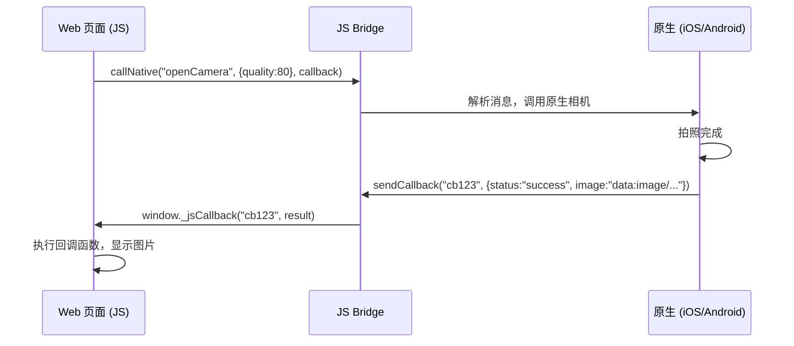

### 一、什么是“与 Native 交互”

---

在移动应用开发中，常常需要：

- Web 页面调用原生功能（如相机、GPS、蓝牙、文件系统）
- 原生应用向 Web 页面传递数据或触发事件
- 实现 JS 与 Native 的双向通信

这种通信需要一套**约定的协议机制**，我们称之为“**与 Native 交互协议**”。


### 二、常见交互方式与协议机制

---

#### 2.1 JS Bridge（主流方案）

基于 WebView 提供的 JavaScript 与 Native 通信能力，通过“桥接”实现双向调用。

实现原理：

| 方向            | 实现方式                                  |
| --------------- | ----------------------------------------- |
| **JS → Native** | 注入 JavaScript 接口 或 拦截 URL Scheme   |
| **Native → JS** | 调用 WebView 的 `evaluateJavaScript` 方法 |

协议设计示例（JSON 消息）

```json
{
  "action": "openCamera",
  "callbackId": "cb123",
  "params": {
    "quality": 80,
    "allowEdit": true
  }
}
```

- action：要执行的原生方法
- callbackId：回调 id，用于一部结果返回。
- params：参数

通信流程：



示例：H5 页面点击按钮➡️调用原生相机➡️拍照后将图片 Base64 返回给 H5。

**封装 JS Bridge SDK**

```js
<!DOCTYPE html>
<html>
<head>
  <title>JS Bridge 示例</title>
</head>
<body>
  <h2>JS Bridge 示例 - 调用原生相机</h2>
  <button onclick="openCamera()">打开相机</button>
  <div id="result"></div>

  <script>
    // 全局回调存储
    window.JSBridgeCallbacks = {};

    // 调用原生方法
    function callNative(action, params, callback) {
      const callbackId = 'cb_' + Date.now() + '_' + Math.random().toString(36).substr(2, 5);
      
      // 存储回调函数
      if (typeof callback === 'function') {
        window.JSBridgeCallbacks[callbackId] = callback;
      }

      // 构造消息
      const message = {
        action: action,
        params: params || {},
        callbackId: callbackId
      };

      // 通过 bridge 调用原生
      if (window.NativeBridge && window.NativeBridge.call) {
        window.NativeBridge.call(JSON.stringify(message));
      } else {
        console.error('NativeBridge not available');
      }
    }

    // 原生回调入口
    window.jsBridgeCallback = function(callbackId, error, result) {
      const cb = window.JSBridgeCallbacks[callbackId];
      if (cb) {
        cb(error, result);
        delete window.JSBridgeCallbacks[callbackId]; // 释放
      }
    };

    // 调用相机
    function openCamera() {
      callNative('openCamera', { quality: 80 }, function(error, result) {
        const resultDiv = document.getElementById('result');
        if (error) {
          resultDiv.innerHTML = `<p style="color:red">错误: ${error.message}</p>`;
        } else {
          resultDiv.innerHTML = ``;
        }
      });
    }
  </script>
</body>
</html>
```

优点：

- 灵活，可扩展
- 支持复杂数据结构（JSON）
- 可实现异步回调

缺点：

- 需要原生端实现桥接逻辑
- 安全性需自行控制（防 XSS、伪造调用）

应用场景：

- 混合 App（如钉钉、企业微信、支付宝小程序）
- Cordova / Ionic / DCloud H5+

#### 2.2 URL Scheme/Intent Scheme

通过自定义 URL 协议触发原生功能。

示例：

```js
window.location.href = "myapp://camera/open?quality=80&callback=cb123";
```

原生端拦截：

- Android：在 `AndroidManifest.xml` 中注册 `intent-filter`
- iOS：在 `Info.plist` 中注册 `URL types`

优点：

- 简单，无需复杂桥接
- 兼容性好

缺点：

- 只能单向通信（JS → Native）
- 无法直接获取返回值（需配合 JS Bridge 回调）
- 存在被劫持风险（iOS 9+ 限制）

#### 2.3 PostMessage + Web Messaging

HTML5 提供的跨上下文通信机制，适用于 WebView 与 Native 之间。

JS 发送消息：

```js
window.postMessage({
  action: "getLocation",
  callbackId: "cb456"
}, "*");
```

Native监听（Android WebView）：

```js
webView.addJavascriptInterface(new WebAppInterface(), "nativeBridge");
// 或通过 shouldOverrideUrlLoading 拦截
```

优点：

- 标准化，安全（可指定 origin）
- 支持复杂对象传递

缺点：

- 部分旧 WebView 支持不完整
- 需要原生端主动监听

#### 2.4 React Native/Flutter 的 JSI（JavaScript Interface）

现代跨平台框架使用更高效的通信方式：

| 框架             | 通信机制                                                     |
| ---------------- | ------------------------------------------------------------ |
| **React Native** | 使用 **JSI（JavaScript Interface）**，实现 JS 与 Native 直接调用，无需序列化 |
| **Flutter**      | 使用 **MethodChannel**，通过 JSON 消息传递                   |

Flutter 示例（MethodChannel）：

```dart
// Dart (Flutter)
const platform = MethodChannel('com.example/app');
final String result = await platform.invokeMethod('openCamera');
```

```kotlin
// Android
MethodChannel(flutterEngine.dartExecutor, "com.example/app").setMethodCallHandler { call, result ->
    if (call.method == "openCamera") {
        // 打开相机
        result.success(imageBase64)
    }
}
```

优势：

- 高性能，接近原生体验
- 类型安全（可配合代码生成）


### 三、安全性规范

---

| 安全风险         | 防范措施                                 |
| ---------------- | ---------------------------------------- |
| **伪造调用**     | 校验来源（origin）、签名、白名单         |
| **XSS 攻击**     | 不执行不可信 JS，输入过滤                |
| **敏感数据泄露** | 加密传输，不通过 URL 传 Token            |
| **权限滥用**     | 动态申请权限（如相机、定位）             |
| **协议劫持**     | 避免使用通用 URL Scheme（如 `myapp://`） |

建议：

- 使用 HTTPS 加载 H5 页面
- 对关键调用进行签名验证
- 提供调试模式与生产模式隔离


### 四、协议设计最佳实践

---

#### 4.1 统一消息格式

推荐 JSON

```json
{
  "type": "call",
  "action": "getLocation",
  "callbackId": "cb123",
  "params": {},
  "timestamp": 1712345678901
}
```

#### 4.2 支持回调机制

- 每次调用生成唯一 `callbackId`
- 原生执行完成后调用 `window._nativeCallback(id, result)`

#### 4.3 错误处理

```json
{
  "callbackId": "cb123",
  "error": {
    "code": 1001,
    "message": "Camera not available"
  }
}
```

#### 4.4 版本兼容

- 在协议中加入 `version` 字段
- 支持旧版本降级处理


### 五、典型应用场景

---

| 场景          | 交互方式                         |
| ------------- | -------------------------------- |
| 调用相机/相册 | JS → Native → 回调图片数据       |
| 获取定位信息  | JS → Native → 返回经纬度         |
| 扫码功能      | JS → Native → 返回扫码结果       |
| 支付调起      | JS → Native → 调起支付宝/微信    |
| 通知栏推送    | Native → JS → 触发页面更新       |
| 登录态同步    | Native → JS → 传递 Token         |
| 文件上传      | JS → Native → 调用系统文件选择器 |


### 六、主流方案对比

---

| 方案                      | 通信方向          | 性能 | 复杂度 | 推荐场景         |
| ------------------------- | ----------------- | ---- | ------ | ---------------- |
| **JS Bridge**             | 双向              | 中   | 中     | 混合 App、小程序 |
| **URL Scheme**            | 单向（JS→Native） | 高   | 低     | 简单功能调起     |
| **PostMessage**           | 双向              | 中   | 中     | 标准化通信       |
| **React Native JSI**      | 双向              | ⭐ 高 | 高     | 跨平台高性能应用 |
| **Flutter MethodChannel** | 双向              | 高   | 中     | Flutter 应用集成 |

