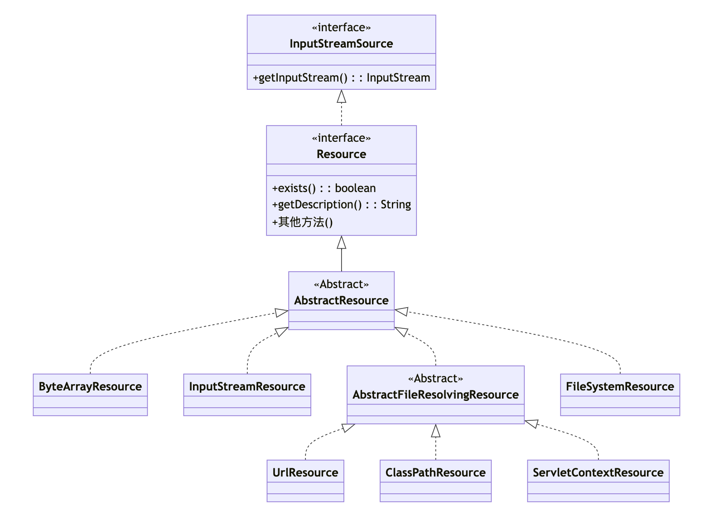

### 一、知识储备

---

1. I/O知识
   - 了解文件、路径、输入/输出流等基础概念。
2. 类路径（Classpath）
   - 了解什么是类路径，以及如何从类路径中加载资源。
3. URL和URI概念
   - 这对于理解如何从网络或其他协议中加载资源是必要的。


### 二、基本描述

`Resource` 是Spring框架中用于简化和统一对底层资源（如文件、classpath资源、URL等）的访问的一个核心接口。它为不同来源的资源提供了一个共同的抽象， 并隐藏具体资源访问的细节。

Java 的标准库为不同类型的资源提供了不同的访问机制：

1. 对于文件系统中的资源，可以使用 `java.io.File`。
1. 对于 classpath 中的资源，可以使用 `ClassLoader` 的 `getResource` 或 `getResourceAsStream` 方法。
1. 对于网络资源，我们可能使用 `java.net.URL`。

不同的机制意味着我们需要了解和使用多种方式来访问资源，这导致的问题是代码复杂性增加、重复代码以及可能的错误。为了提供一个统一、简化和更高级的资源访问机制，Spring 框架引入了 `Resource` 接口，这个接口为所有的资源提供了一个统一的抽象。


### 三、主要功能

---

#### 3.1 统一的资源抽象

无论资源来资源文件系统、classpath、URL还是其他来源，Resource接口都为其提供了一个统一抽象。

#### 3.2 资源描述

通过 `getDescription()` 方法，每个 `Resource` 实现都可以为其所代表的底层资源提供描述性信息，这对于错误处理和日志记录特别有用。

#### 3.3 读取能力

`getInputStream()` 方法，允许直接读取资源内容，而无需关心资源的实际来源。

#### 3.4 存在性与可读性

`exists()` 和 `isReadable()` 方法来确定资源是否存在及其是否可读。

#### 3.5 开放性检查

`isOpen()` 方法用于检查资源是否表示一个已经打开的流，这有助于避免重复读取流资源。

#### 3.6 URI 和 URL 访问

通过 `getURI()` 和 `getURL()` 方法获取其底层资源的 URI 和 URL，这为进一步的资源处理提供了可能。

#### 3.7 文件访问

当资源代表一个文件系统中的文件时，可以通过 `getFile()` 直接访问该文件。

#### 3.8 多种实现

Spring 提供了多种 `Resource` 的实现，以支持不同来源的资源，如 `ClassPathResource`、`FileSystemResource` 和 `UrlResource` 等。


### 四、接口源码

---

#### 4.1 InputStreamSource 接口

用于提供一个输入流。它被设计为可以多次返回一个新的、未读取的输入流。

```java
/**
 * 表示可以提供输入流的资源或对象的接口。
 */
public interface InputStreamSource {

  /**
	 * 返回基础资源内容的 InputStream。
	 * 期望每次调用都会创建一个新的流。
	 * 当我们考虑到像 JavaMail 这样的API时，这个要求尤为重要，因为在创建邮件附件时，JavaMail需要能够多次读取流。对于这样的用例，要求每个 getInputStream() 调用都返回一个新的流。
	 * @return 基础资源的输入流（不能为 null）
	 * @throws java.io.FileNotFoundException 如果基础资源不存在
	 * @throws IOException 如果无法打开内容流
	 */
  InputStream getInputStream() throws IOException;

}
```

#### 4.2 Resource 接口

Spring框架中的核心接口，代表了外部或内部的资源，如文件、类路径资源、URL资源等。它为访问底层资源提供了一个统一的抽象，从而使得代码可以独立于实际资源的类型。

```java
/**
 * 用于描述资源的接口，该接口抽象了底层资源的实际类型，如文件或类路径资源。
 *
 * <p>对于每个资源，如果它在物理形式上存在，都可以打开一个输入流，但只有某些资源才能返回 URL 或文件句柄。具体行为取决于其实现。
 */
public interface Resource extends InputStreamSource {

  /**
   * 判断此资源是否在物理形式上真正存在。
   */
  boolean exists();

  /**
   * 指示是否可以通过 {@link #getInputStream()} 读取此资源的非空内容。
   * 实际的内容读取可能仍然失败。
   */
  default boolean isReadable() {
    return exists();
  }

  /**
   * 指示此资源是否代表一个打开的流的句柄。
   * 如果为 true，则输入流不能被多次读取，并且在读取后必须被关闭，以避免资源泄露。
   */
  default boolean isOpen() {
    return false;
  }

  /**
   * 判断此资源是否代表文件系统中的文件。
   */
  default boolean isFile() {
    return false;
  }

  /**
   * 返回此资源的 URL 句柄。
   */
  URL getURL() throws IOException;

  /**
   * 返回此资源的 URI 句柄。
   */
  URI getURI() throws IOException;

  /**
   * 返回此资源的文件句柄。
   */
  File getFile() throws IOException;

  /**
   * 返回一个 {@link ReadableByteChannel}。
   */
  default ReadableByteChannel readableChannel() throws IOException {
    return Channels.newChannel(getInputStream());
  }

  /**
   * 确定此资源的内容长度。
   */
  long contentLength() throws IOException;

  /**
   * 确定此资源的最后修改时间戳。
   */
  long lastModified() throws IOException;

  /**
   * 创建相对于此资源的资源。
   */
  Resource createRelative(String relativePath) throws IOException;

  /**
   * 返回此资源的文件名。
   */
  @Nullable
  String getFilename();

  /**
   * 返回此资源的描述，用于在处理资源时的错误输出。
   */
  String getDescription();
}
```


### 五、主要实现

---

#### 5.1 ClassPathResource

用于加载 classpath 下的资源。

**注意：不在claspath下的资源则读取不到。**

```java
public class ClassPathResourceDemo {
  public static void main(String[] args) throws Exception {
    String path = "application.properties";
    Resource resource = new ClassPathResource(path);
    try (InputStream is = resource.getInputStream()) {
      // 读取和处理资源内容
      System.out.println(new String(is.readAllBytes()));
    }
  }
}
```

#### 5.2 FileSystemResource

用于访问文件系统中的资源。

```java
public class FileSystemResourceDemo {
  public static void main(String[] args) throws Exception {
    // 请替换我们自己的目录
    String path = "D:\\idea-work-space-xcs\\spring-reading\\spring-resources\\spring-resource\\myfile.txt";
    Resource resource = new FileSystemResource(path);
    try (InputStream is = resource.getInputStream()) {
      // 读取和处理资源内容
      System.out.println(new String(is.readAllBytes()));
    }
  }
}
```

#### 5.3 UrlResource

用于访问网络上的资源。

```java
public class UrlResourceDemo {
  public static void main(String[] args) throws Exception {
    Resource resource = new UrlResource("https://dist.apache.org/repos/dist/test/test.txt");
    try (InputStream is = resource.getInputStream()) {
      // 读取和处理资源内容
      System.out.println(new String(is.readAllBytes()));
    }
  }
}
```

#### 5.4 ServletContextResource

用于 Web 应用中的资源。

#### 5.5 ByteArrayResource & InputStreamResource

基于内存和流的资源表示。   

```java
public class ByteArrayResourceDemo {
  public static void main(String[] args) throws Exception {
    byte[] data = "hello world".getBytes();
    Resource resource = new ByteArrayResource(data);
    try (InputStream is = resource.getInputStream()) {
      // 读取和处理资源内容
      System.out.println(new String(is.readAllBytes()));
    }
  }
}
```

```java
public class InputStreamResourceDemo {
  public static void main(String[] args) throws Exception {
    InputStream isSource = new ByteArrayInputStream("hello world".getBytes());
    Resource resource = new InputStreamResource(isSource);
    try (InputStream is = resource.getInputStream()) {
      // 读取和处理资源内容
      System.out.println(new String(is.readAllBytes()));
    }
  }
}
```




### 六、与其他组件的关系

---

#### 6.1 BeanFactory & ApplicationContext

`BeanFactory`和应用上下文`ApplicationContext`在实例化和配置Bean时通常需要访问资源。`Resource` 接口提供了一种统一的方式来加载资源文件，这对于配置和初始化Bean非常有用。Bean定义中可以包含资源引用，使Bean能够使用这些资源。

#### 6.2 ResourceLoader

Spring提供了`ResourceLoader`接口，该接口在应用上下文中广泛使用，以便加载资源。`ResourceLoader`的默认实现是`DefaultResourceLoader`，它基于`Resource`接口实现了资源加载功能。通过`ResourceLoader`，应用可以轻松获取和管理资源，无论资源是来自文件系统、类路径、URL还是其他来源。

#### 6.3 PropertyPlaceholderConfigurer

`PropertyPlaceholderConfigurer`是Spring框架中用于替换属性占位符的类。它可以将属性值从资源文件中读取，然后替换配置文件中的占位符。这是通过 `locations` 属性指定的资源文件实现的。

#### 6.4 MVC框架

Spring的MVC框架（如Spring MVC）通常需要处理文件上传和静态资源。`Resource` 接口及其实现可以用于管理和提供这些资源。`Resource`接口与`ResourceLoader`一起被用于加载静态资源，例如图像、样式表和JavaScript文件。

#### 6.5 自定义资源加载和处理

我们自己也可以使用 `Resource` 接口自定义资源加载和处理逻辑。例如，我们可以创建一个自定义的 `Resource` 实现，用于加载资源文件，执行特定的处理逻辑，然后将处理后的资源提供给应用程序。


### 七、常见问题

---

#### 7.1 如何选择合适的 `Resource` 实现

- `ClassPathResource`: 用于访问类路径下的资源。
- `FileSystemResource`: 用于访问文件系统中的资源。
- `UrlResource`: 用于基于URL的资源，如HTTP或FTP资源。
- `ServletContextResource`: 专为 Web 应用程序设计，用于访问`ServletContext`中的资源。

#### 7.2 资源未找到

- 如果尝试使用一个不存在的路径或URL创建资源，可能会得到一个 `FileNotFoundException`。
- 确保提供正确的路径，并检查资源是否真的存在。

#### 7.3 如何处理编码或字符集问题

- 当从资源中读取文本内容时，可能需要处理编码问题。
- 使用 `Reader` 和适当的字符集，或使用 Spring 的 `EncodedResource` 类。

#### 7.4 相对路径的使用

- 当使用 `FileSystemResource` 时，相对路径可能会导致混淆。确保我们了解相对路径的基准。

#### 7.5 资源的实际URL或文件路径是什么

- 虽然 `Resource` 接口为各种资源类型提供了一个统一的抽象，但有时可能需要知道资源的真实类型或位置。
- 使用 `resource.getURL()` 或 `resource.getFile()` 可以尝试获取资源的真实URL或文件。

#### 7.6 如何在非Web应用程序中使用 ServletContextResource

- 这是不可能的，因为 `ServletContextResource` 是为Web应用程序设计的。如果尝试在非Web应用程序中使用它，将会得到错误。

#### 7.7 如何从Jar文件或War文件中读取资源

- 使用 `ClassPathResource` 或 `UrlResource` 可以轻松地从Jar或War文件中读取资源。
- 但是，对于嵌套的Jar文件（例如，当使用Spring Boot可执行Jar时），需要特殊的处理，通常通过 `org.springframework.boot.loader.jar.JarFile` 类。

#### 7.8 如何刷新或重新加载已更改的资源

- 默认情况下，`Resource` 实例不提供刷新或重新加载机制。但对于某些资源类型，如 `UrlResource`，每次调用 `getInputStream()` 都会重新读取内容。
- 对于需要刷新的资源，考虑使用缓存机制或其他方法来处理。

#### 7.9 资源加载的性能问题

- 大量频繁地加载资源可能会导致性能问题。
- 考虑缓存资源内容或使用更高效的资源加载策略。
