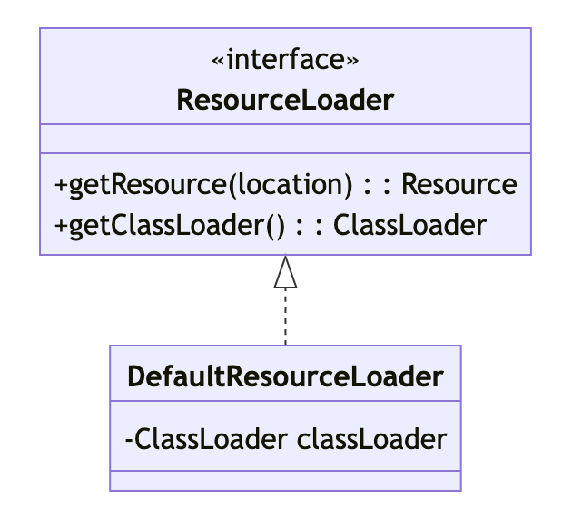

### 一、知识储备

---

1. Spring  资源抽象
   - Resource接口及其各种实现。
2. 路径和模式解析
   - Spring 中的路径解析，特别是使用 ant 风格的路径模式，例如 `classpath*:com/example/**/*.xml`。
3. 理解不同的资源类型
   - 文件资源、类路径资源、URL 资源、JAR 中的资源等。


### 二、基本描述

---

`org.springframework.core.io.ResourceLoader` 是 Spring 框架中的一个关键接口，它定义了如何获取资源（例如类路径资源、文件系统资源或网页资源）的策略。这个接口是 Spring 资源加载抽象的核心，使得应用程序可以从不同的资源位置以统一的方式加载资源。


### 三、主要功能

---

#### 3.1 统一资源加载

ResourceLoader 提供了一个标准化的方法来加载资源，不论资源是存放在类路径、文件系统、网络URL还是其他位置。

#### 3.2 资源位置解析

根据提供的资源字符串位置（如 "classpath:", "file:", "http:"），ResourceLoader 可以确定资源的类型，并为其创建相应的 Resource 实例。

#### 3.3 返回 Resource 实例

通过 `Resource getResource(String location)` 方法，ResourceLoader 返回一个 Resource 对象，代表了指定位置的资源。这使得读取和操作资源变得简单且统一。

#### 3.4 与 ClassLoader 的交互

通过 `ClassLoader getClassLoader()` 方法返回与其关联的 ClassLoader。这使得资源加载策略可以与特定的类加载器关联。

#### 3.5 扩展性

ResourceLoader 是一个接口，这意味着我们可以实现自己的资源加载策略，或者扩展默认的策略以满足特定需求。

#### 3.6 内置实现与整合

Spring 提供了默认的 ResourceLoader 实现，如 `DefaultResourceLoader`。但更重要的是，`org.springframework.context.ApplicationContext` 也实现了 `ResourceLoader`，这意味着 **Spring 上下文本身就是一个资源加载器**。


### 四、接口源码

---

ResourceLoader 接口为 Spring 框架定义了资源加载策略。它提供了获取资源的方法，并公开了其使用的 ClassLoader。通过这种策略，资源可以从各种来源（如类路径、文件系统等）以统一方式加载。这提供了资源加载的灵活性和一致性，并支持各种资源描述符，如 URL、类路径等。此外，它还允许对资源句柄进行多次重新使用和读取。

```java
/**
 * 用于加载资源（例如类路径或文件系统资源）的策略接口。
 * 一个 ApplicationContext 需要提供此功能以及扩展的 ResourcePatternResolver 支持。
 * 
 * DefaultResourceLoader 是一个独立的实现，可在 ApplicationContext 外部使用，并被 ResourceEditor 使用。
 * 
 * 当在 ApplicationContext 中运行时，类型为 Resource 和 Resource[] 的 Bean 属性可以从字符串中填充，使用特定上下文的资源加载策略。
 *
 * @author Juergen Hoeller
 * @since 10.03.2004
 */
public interface ResourceLoader {

  /** 用于从类路径加载的伪 URL 前缀："classpath:"。 */
  String CLASSPATH_URL_PREFIX = ResourceUtils.CLASSPATH_URL_PREFIX;

  /**
	 * 返回指定资源位置的 Resource 句柄。
	 * 该句柄应始终是一个可重用的资源描述符，允许进行多次 Resource#getInputStream() 调用。
	 * 必须支持完全限定的 URLs，例如 "file:C:/test.dat"。
	 * 必须支持类路径伪-URLs，例如 "classpath:test.dat"。
	 * 应支持相对文件路径，例如 "WEB-INF/test.dat"。
	 * （这将是实现特定的，通常由 ApplicationContext 实现提供。）
	 * 请注意，Resource 句柄并不意味着资源存在；我们需要调用 Resource#exists 来检查其存在性。
	 *
	 * @param location 资源位置
	 */
  Resource getResource(String location);

  /**
	 * 公开此 ResourceLoader 使用的 ClassLoader。
	 * 需要直接访问 ClassLoader 的客户端可以与 ResourceLoader 以统一的方式这样做，而不是依赖线程上下文 ClassLoader。
	 *
	 * @return ClassLoader（仅当连系统 ClassLoader 都不可访问时为 null）
	 */
  @Nullable
  ClassLoader getClassLoader();
}
```


### 五、主要实现

---

#### 5.1 DefaultResourceLoader

- 这是基本的资源加载器实现。它可以处理 "classpath:" 前缀的资源，如果没有提供这样的前缀，它会尝试使用类加载器或文件系统来加载资源。




### 六、最佳实践

---

使用 `DefaultResourceLoader` 从不同的资源（类路径和文件系统）加载内容。

```java
public class DefaultResourceLoaderDemo {
  public static void main(String[] args) {
      DefaultResourceLoader loader = new DefaultResourceLoader();

      // 从类路径加载资源
      Resource classpathResource = loader.getResource("classpath:application.properties");
      try (InputStream is = classpathResource.getInputStream()) {
          // 读取和处理资源内容
          System.out.println("Classpath = "+ new String(is.readAllBytes()));
      } catch (IOException e) {
          e.printStackTrace();
      }

      // 加载文件系统中的资源
      Resource fileResource = loader.getResource("file:/idea-work-space-xcs/spring-reading/spring-resources/spring-resource-resourceLoader/myfile1.txt");
      try (InputStream is = fileResource.getInputStream()) {
          // 读取和处理资源内容
          System.out.println("File = "+ new String(is.readAllBytes()));
      } catch (IOException e) {
          e.printStackTrace();
      }
  }
}
```


### 七、与其他组件的关系

---

#### 7.1 ApplicationContext

所有Spring ApplicationContext都实现了ResourceLoader。这意味着可以使用Spring上下文本身来加载资源。

#### 7.2 Resource

`ResourceLoader` 返回 `Resource` 对象，它代表实际的资源，可以是文件系统中的文件、类路径资源、URLs 等。`Resource` 提供了访问和读取资源内容的方法。

#### 7.3 ResourcePatternResolver

这是 `ResourceLoader` 的扩展，可以解析给定的位置模式以加载多个资源。`PathMatchingResourcePatternResolver` 是它的主要实现。

#### 7.4 ResourceEditor

这是一个属性编辑器，用于将字符串转换为 `Resource` 对象。它内部使用 `ResourceLoader` 来执行转换。

#### 7.5 ResourceLoaderAware

这是一个特殊的接口，任何 bean 如果实现了它，那么它就可以在被创建时获得对 `ResourceLoader` 的引用，这样它就可以自己加载资源。

#### 7.6 EmbeddedValueResourceAware

一些组件，如属性占位符处理器，可能需要解析值中的动态部分。它们可以使用 `ResourceLoader` 作为解析这些值的一部分，特别是当值代表资源位置时。

#### 7.7 加载匹配特定模式的多个资源

使用 `ResourcePatternResolver` 或其实现 `PathMatchingResourcePatternResolver`。

#### 7.8 自动注入 ResourceLoader

实现 `ResourceLoaderAware` 接口，Spring 将自动为我们的 bean 提供 `ResourceLoader` 的引用。

#### 7.9 扩展或自定义资源加载机制

我们可以实现自己的 `ResourceLoader` 或继承现有的实现，如 `DefaultResourceLoader`。

#### 7.10 加载资源时考虑环境或属性占位符

使用 `PropertyPlaceholderConfigurer` 或 `PropertySourcesPlaceholderConfigurer` 与 `@Value` 注解可以解析属性值中的资源路径。
