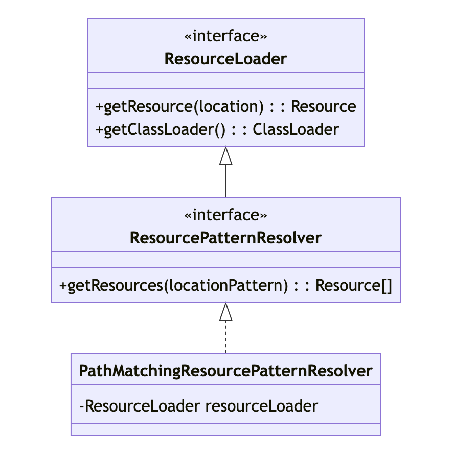

### 一、基本描述

---

`ResourcePatternResolver`是Spring框架中的一个接口，扩展自`ResourceLoader`，用于解析资源模式，支持通过模式匹配检索多个资源。其中，常见的实现类是`PathMatchingResourcePatternResolver`，它通过类路径、文件系统或URL等多种资源位置，能够根据给定的资源模式获取匹配的资源。通过调用`getResources(String locationPattern)`方法，可以使用包含通配符的资源模式，例如`classpath*:com/example/**/*.xml`，来获取满足条件的资源数组。这提供了一种灵活的机制，使得在应用程序中能够方便地加载和处理符合特定模式的资源文件，如配置文件、模板文件等。


### 二、主要功能

---

#### 2.1 资源模式解析

通过`getResources(String locationPattern)`方法，支持使用通配符的资源模式，如`classpath*:com/example/**/*.xml`，用于检索匹配特定模式的多个资源。

#### 2.2 资源获取

通过`getResources(Resource location)`方法，根据给定的资源对象，返回匹配的资源数组。这使得可以获取与特定资源相关联的其他资源，例如获取与给定类路径下的一个文件相关的所有资源。

#### 2.3 多种资源位置支持

可以处理不同的资源位置，包括类路径（classpath）、文件系统、URL等。这使得应用程序能够以不同的方式组织和存储资源，而不影响资源的检索和加载。

#### 2.4 灵活的资源加载

结合ResourceLoader的能力，ResourcePatternResolver允许在应用程序中以统一的方式加载各种资源，而无需关心底层资源的存储位置或形式。

#### 2.5 通用资源操作

通过Resource接口，提供了对资源的通用操作，例如获取资源的URL、输入流、文件句柄等。


### 三、接口源码

---

`ResourcePatternResolver`是Spring框架中用于解析位置模式为资源对象的策略接口。它扩展了ResourceLoader接口，允许通过类路径、文件系统、URL等多种方式获取匹配指定模式的资源。

```java
/**
 * 策略接口，用于将位置模式（例如Ant风格的路径模式）解析为 Resource 对象。
 *
 * 这是对 org.springframework.core.io.ResourceLoader 接口的扩展。传入的
 * ResourceLoader（例如，在上下文中通过 org.springframework.context.ResourceLoaderAware
 * 传递的 org.springframework.context.ApplicationContext）可以检查是否也实现了这个扩展接口。
 *
 * PathMatchingResourcePatternResolver 是一个独立的实现，可在不依赖
 * ApplicationContext 的情况下使用，也被 ResourceArrayPropertyEditor 用于
 * 填充 Resource 数组的 bean 属性。
 *
 * 可用于任何类型的位置模式（例如 "/WEB-INF/*-context.xml"）：输入模式必须与策略实现匹配。
 * 这个接口只指定了转换方法，而不是具体的模式格式。
 *
 * 该接口还引入了一个新的资源前缀 "classpath*:"，用于匹配类路径下的所有资源。注意，在这种情况下，
 * 资源位置预期是没有占位符的路径（例如 "/beans.xml"）；类路径中的 JAR 文件或不同目录可以包含相同名称的多个文件。
 *
 * @author Juergen Hoeller
 * @since 1.0.2
 * @see org.springframework.core.io.Resource
 * @see org.springframework.core.io.ResourceLoader
 * @see org.springframework.context.ApplicationContext
 * @see org.springframework.context.ResourceLoaderAware
 */
public interface ResourcePatternResolver extends ResourceLoader {

    /**
     * 类路径匹配所有资源的伪 URL 前缀："classpath*:"
     * 这与 ResourceLoader 的类路径 URL 前缀不同，它检索给定名称（例如 "/beans.xml"）的
     * 所有匹配资源，例如在所有部署的 JAR 文件的根目录中。
     * 详见 org.springframework.core.io.ResourceLoader#CLASSPATH_URL_PREFIX
     */
    String CLASSPATH_ALL_URL_PREFIX = "classpath*:";

    /**
     * 将给定的位置模式解析为 Resource 对象。
     * 应尽可能避免指向相同物理资源的重叠资源条目。结果应具有集合语义。
     * @param locationPattern 要解析的位置模式
     * @return 相应的 Resource 对象数组
     * @throws IOException 如果发生 I/O 错误
     */
    Resource[] getResources(String locationPattern) throws IOException;

}
```


### 四、主要实现

---

#### 4.1 PathMatchingResourcePatternResolver

支持使用Ant风格的路径模式，例如`classpath*:com/example/**/*.xml`，这允许在类路径中检索符合指定模式的资源。




### 五、最佳实践

---

使用 `PathMatchingResourcePatternResolver` 来加载匹配指定模式的资源。	

```java
public class PathMatchingResourcePatternResolverDemo {
  public static void main(String[] args) throws Exception {
      PathMatchingResourcePatternResolver resolver = new PathMatchingResourcePatternResolver();

      // 加载所有匹配的类路径资源
      Resource[] resources = resolver.getResources("classpath*:*.properties");
      for (Resource resource : resources) {
          System.out.println("Classpath = " + resource.getFilename());
      }

      // 加载文件系统中的所有匹配资源
      Resource[] fileResources = resolver.getResources("file:/idea-work-space-xcs/spring-reading/spring-resources/spring-resource-resourceLoader/*.txt");
      for (Resource resource : fileResources) {
          System.out.println("File = " + resource.getFilename());
      }
  }
}
```

运行结果发现

- 从类路径上，我们加载了两个文件：application.properties 和 bootstrap.properties。这意味着在我们的项目的类路径中，有这两个文件。
- 从文件系统上，我们加载了三个文件：myfile1.txt, myfile2.txt, 和 myfile3.txt。这些文件位于我们之前在代码中硬编码的文件路径 `/idea-work-space-xcs/spring-reading/spring-resources/spring-resource-resourceLoader/` 下。

```
Classpath = application.properties
Classpath = bootstrap.properties
File = myfile1.txt
File = myfile2.txt
File = myfile3.txt
```


### 六、与其他组件的关系

---

#### 6.1 BeanDefinitionLoader

`BeanDefinitionLoader` 是 Spring 框架中用于加载 BeanDefinition 的接口，提供了对加载过程的抽象。在加载过程中，需要使用 PathMatchingResourcePatternResolver 来解析资源模式。

#### 6.2 MessageSourceAutoConfiguration

`MessageSourceAutoConfiguration` 是 Spring Boot 中的一个自动配置类，用于配置消息源（MessageSource）。在配置中可能涉及到加载国际化资源文件，而 PathMatchingResourcePatternResolver 用于解析这些资源文件的路径。

#### 6.3 AbstractBeanDefinitionReader

`AbstractBeanDefinitionReader` 是 Spring 框架中用于读取 BeanDefinition 的抽象类，具体的实现类（如 XmlBeanDefinitionReader）在加载 XML 文件时可能使用 PathMatchingResourcePatternResolver。

#### 6.4 ClassPathScanningCandidateComponentProvider

`ClassPathScanningCandidateComponentProvider` 是 Spring 框架中用于基于类路径进行组件扫描的类，其中使用了 PathMatchingResourcePatternResolver 来解析类路径中的资源。

#### 6.5 ResourceArrayPropertyEditor

`ResourceArrayPropertyEditor` 是 Spring 框架中用于处理 Resource 数组类型属性的属性编辑器。在处理这些属性时，需要解析资源模式，而 PathMatchingResourcePatternResolver 提供了相应的功能。

#### 6.6 性能问题

在处理大量资源或者模式时，可能会遇到性能问题。考虑对资源模式进行优化，避免过度使用通配符和递归，以提高性能。
