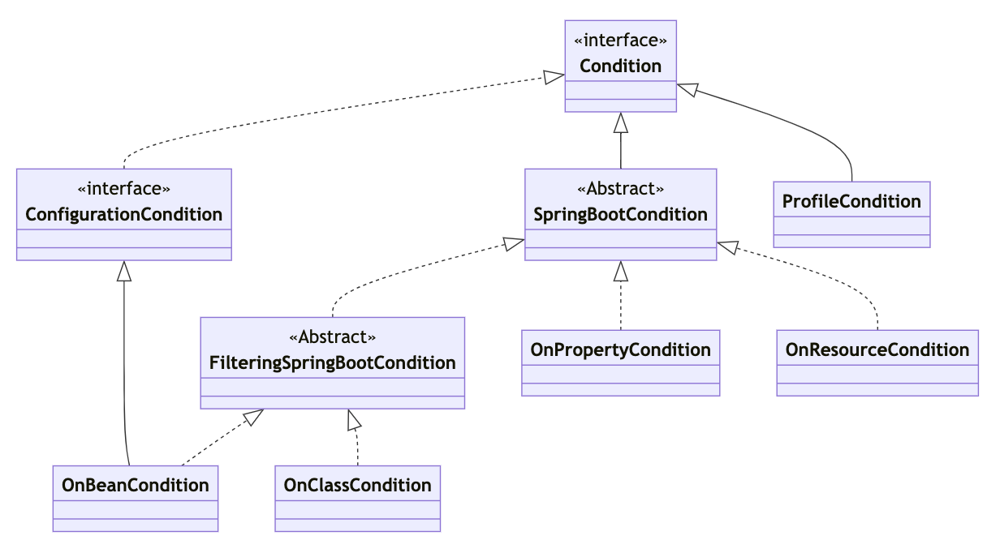

### 一、知识储备

---

#### 1.1 Resource接口

Resource 是用于访问资源的抽象接口。资源可以是文件、类路径中的文件、URL 等等。我们需要了解如何使用 Resource 接口来获取资源的输入流、文件路径等信息。

#### 1.2 AnnotationMetadata接口

AnnotationMetadata 是Spring 框架中用于处理类上的注解信息的接口，它提供了对类上注解信息的访问和操作方法。

#### 1.3 MetadataReader接口

MetadataReader 是Spring 提供的一个接口，用于读取类的元数据信息。它可以用于扫描类文件，获取类的基本信息，如类名、类的注解等。在注解驱动的开发中，MetadataReader 通常用于扫描包中的类，并从这些类中提取注解信息，以便配置 Spring Bean。

#### 1.4 路径和模式解析

Spring 中的路径解析，特别是使用 ant 风格的路径模式，例如 `classpath*:com/xcs/spring/bean/**/*.xml`。


### 二、基本描述

---

Condition 接口的实现类通常用于@Conditional注解，该注解可以用在类级别或方法级别，通过判断条件是否满足，来确定是否应该创建Bean或应用特定的配置。这样的机制使得Spring应用更加灵活，能够根据不同的条件选择性地进行配置。


### 三、主要功能

---

#### 3.1 动态决定Bean的创建

Condition 接口的实现类通过实现 matches 方法，可以根据运行时的条件判断逻辑，决定是否满足条件，从而决定是否创建特定的Bean。

#### 3.2 条件化配置类的应用

通过 @Conditional 注解，Condition 接口的实现类可以用于配置类或者配置类中的方法上，从而条件化地应用或排除某个配置。

#### 3.3 与环境变量和系统属性结合使用

可以结合 ConditionContext 中的环境变量和系统属性，编写更加复杂的条件判断逻辑，使得Bean的创建或配置的应用更加灵活。

#### 3.4 支持自定义条件逻辑

可以根据应用的具体需求自定义实现 Condition 接口，实现灵活的条件逻辑，例如基于操作系统、特定的类是否存在于类路径等条件。

#### 3.5 提高应用的灵活性

通过条件化机制，可以在不同的环境中配置不同的Bean或应用不同的配置，从而提高应用的灵活性和可配置性。


### 四、接口源码

---

Condition接口要求实现类通过matches方法在组件注册前进行条件匹配，可根据运行时条件动态决定是否注册。该接口的实现类可用于@Conditional注解，用于灵活控制Bean的注册，遵循与BeanFactoryPostProcessor相同的限制。特别强调条件不应与Bean实例进行交互。为更精细地控制条件与@Configuration bean的交互，建议考虑实现ConfigurationCondition接口。

```java
/**
 * 一个用于组件注册的单一 condition，必须在组件注册之前 #matches 匹配。
 *
 * 条件将在 bean 定义即将注册之前立即检查，并可以根据在此时能够确定的任何条件否决注册。
 *
 * 条件必须遵循与 BeanFactoryPostProcessor 相同的限制，并注意永远不要与 bean 实例进行交互。
 * 要更精细地控制与 @Configuration bean 交互的条件，请考虑实现 ConfigurationCondition 接口。
 *
 * @author Phillip Webb
 * @since 4.0
 * @see ConfigurationCondition
 * @see Conditional
 * @see ConditionContext
 */
@FunctionalInterface
public interface Condition {

    /**
     * 确定条件是否匹配。
     * @param context 条件上下文
     * @param metadata 被检查的 org.springframework.core.type.AnnotationMetadata类或org.springframework.core.type.MethodMetadata方法的元数据
     * @return true 如果条件匹配且组件可以注册，或 false 以否决带有注解组件的注册
     */
    boolean matches(ConditionContext context, AnnotatedTypeMetadata metadata);
}
```


### 五、主要实现

---

#### 5.1 ProfileCondition

通过判断运行时的profile信息，决定是否注册组件。例如，可以根据激活的profile选择性地注册特定的Bean。

#### 5.2 OnBeanCondition

根据容器中是否存在某个特定类型的Bean来进行条件判断，决定是否注册组件。这个条件允许根据容器中的Bean的存在与否来决定是否创建某个Bean。

#### 5.3 OnClassCondition

判断类路径中是否存在某个特定的类，决定是否注册组件。通过检查类路径，可以根据类的存在与否来动态控制组件的注册。

#### 5.4 OnPropertyCondition

根据配置文件中的属性值来进行条件判断，决定是否注册组件。可以根据配置文件中的属性来灵活地配置组件的注册。

#### 5.5 ResourceCondition

判断类路径中是否存在指定资源文件，决定是否注册组件。类似于OnClassCondition，但是可以判断任意资源文件的存在与否。




### 六、最佳实践

---

结合自定义的条件类MyOnClassCondition，来判断类路径下的资源是否满足指定的条件。通过创建资源解析器和元数据读取器工厂，然后从`classpath*:com/xcs/spring/**/*.class`路径下获取所有类文件，最后使用自定义的条件类判断每个资源是否满足条件。根据条件的结果，输出相应的信息。

```java
public class ConditionDemo {

    public static void main(String[] args) throws IOException {
        // 创建资源解析器，用于获取匹配指定模式的资源
        PathMatchingResourcePatternResolver resolver = new PathMatchingResourcePatternResolver();

        // 创建MetadataReader工厂，用于读取类的元数据信息
        SimpleMetadataReaderFactory metadataReaderFactory = new SimpleMetadataReaderFactory();

        // 获取指定模式下的所有资源
        Resource[] resources = resolver.getResources("classpath*:com/xcs/spring/bean/**/*.class");

        // 创建自定义条件类的实例，用于条件匹配
        Condition condition = new MyOnClassCondition("com.xcs.spring.ConditionDemo");

        // 遍历每个资源，判断是否满足自定义条件
        for (Resource resource : resources) {
            // 获取资源对应的元数据读取器
            MetadataReader metadataReader = metadataReaderFactory.getMetadataReader(resource);

            // 判断资源是否满足自定义条件
            if (condition.matches(null, metadataReader.getAnnotationMetadata())) {
                System.out.println(resource.getFile().getName() + "满足条件");
            } else {
                System.out.println(resource.getFile().getName() + "不满足条件");
            }
        }
    }
}
```

定义了一个 MyOnClassCondition 的自定义条件类，实现了 Spring 框架的 Condition 接口。该条件类的主要功能是根据指定的类名，在运行时动态地尝试加载该类，若加载成功则条件匹配，返回 true，否则捕获 ClassNotFoundException 表示类不存在，条件不匹配，返回 false。

```java
public class MyOnClassCondition implements Condition {

    private final String className;

    public MyOnClassCondition(String className) {
        this.className = className;
    }

    @Override
    public boolean matches(ConditionContext context, AnnotatedTypeMetadata metadata) {
        try {
            // 尝试加载类
            getClass().getClassLoader().loadClass(className);
            // 类存在，条件匹配
            return true;
        } catch (ClassNotFoundException e) {
            // 类不存在，条件不匹配
            return false;
        }
    }
}
```

MyBeanA和MyBeanB为两个简单的Java类。

```java
package com.xcs.spring.bean;

public class MyBeanA {

}

public class MyBeanB {

}
```

运行结果发现，当com.xcs.spring.ConditionDemo存在的情况下，MyOnClassCondition 类中的 matches 方法尝试加载 com.xcs.spring.ConditionDemo 类，若加载成功则条件匹配，返回 true。因此，MyBeanA.class 和 MyBeanB.class 均满足条件，成功注册。

```
MyBeanA.class满足条件
MyBeanB.class满足条件
```

当我们修改为 new MyOnClassCondition("com.xcs.spring.ConditionDemo1") 后，即尝试加载 com.xcs.spring.ConditionDemo1 类。结果中的 "不满足条件" 表明 MyOnClassCondition 的 matches 方法返回了 false，即未成功加载相应的类。因此，MyBeanA.class 和 MyBeanB.class 均不满足条件。

```
MyBeanA.class不满足条件
MyBeanB.class不满足条件
```


### 七、与其他组件的关系

---

#### 7.1 ConditionEvaluator

ConditionEvaluator 提供了 shouldSkip 方法，该方法接受一个 Condition 对象和一个 ConditionContext 对象，用于判断是否应该跳过（即不注册）特定的组件，例如 Bean。主要在处理 @Conditional 注解时被使用，当 @Conditional 注解标注在类或方法上时，Spring 在进行组件注册时会通过 ConditionEvaluator 来判断是否满足条件，从而决定是否注册相应的组件。这一机制使得在应用上下文初始化之前能够动态地根据条件来决定是否注册特定的组件，为 Spring 应用提供了更灵活的组件注册策略。


### 八、常见问题

---

#### 8.1 条件的匹配时机

条件是在 bean 的定义注册之前立即进行检查的，因此可以在 Spring 应用上下文初始化之前进行条件匹配。

#### 8.2 多个条件的组合

Spring 提供了一些组合条件的方式，例如 `@ConditionalOnProperty` 和 `@ConditionalOnExpression`。

#### 8.3 条件与配置的关系

条件是用于决定是否注册组件的机制，而配置则是用于配置组件的属性和行为。

#### 8.4 自定义条件的实现

实现 `Condition` 接口，并确保在 `matches` 方法中提供适当的条件逻辑。

#### 8.5 条件的错误处理

当条件判断出现错误时，例如 `matches` 方法中抛出异常，可能会导致注册组件的失败。需要注意条件逻辑中的异常处理，以确保不会影响到整个应用的启动。

#### 8.6 条件的性能考虑

如果应用中有大量的条件，可能会影响启动性能。谨慎设计条件逻辑，以确保在条件数量较多的情况下，应用的启动性能仍然可接受。

#### 8.7 条件的动态性

条件是在应用启动时进行一次性的检查，通常不会在运行时动态变化。如果需要更动态的条件判断，可以考虑使用其他机制，如 `Environment` 中的属性。