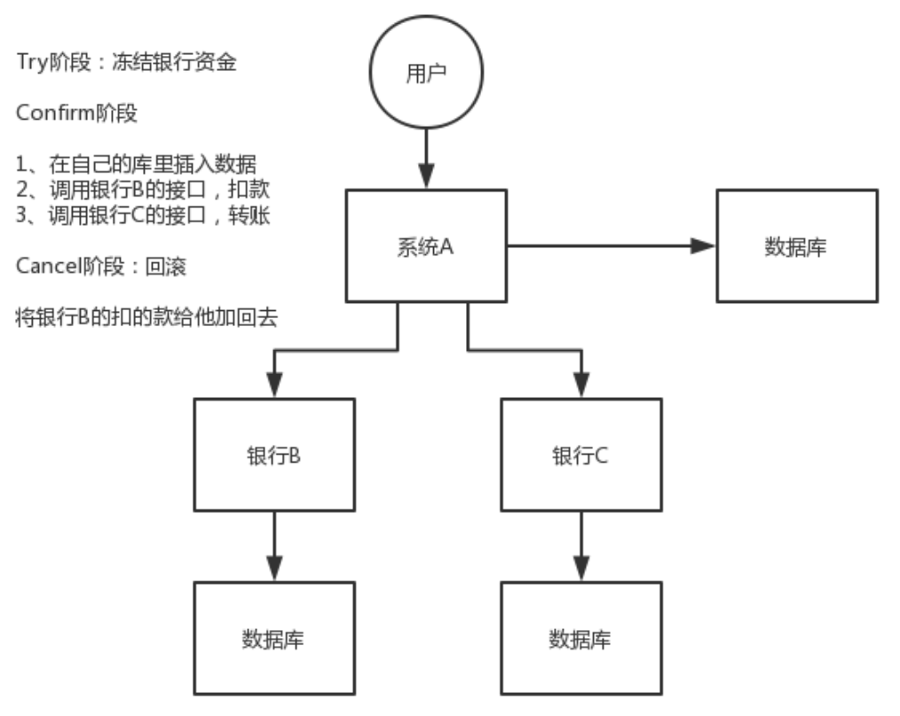
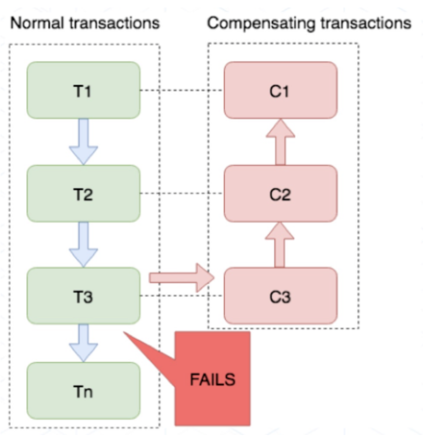

### 一、分布式事务实现方案

---

- XA 方案
- TCC 方案
- SAGA 方案
- 本地消息表
- 可靠消息最终一致性方案
- 最大努力通知方案

### 二、TCC 方案（不建议）

---

TCC 的全程是：Try、Confirm、Cancel。

- Try 阶段：这个阶段说的是对各个服务的资源做检测以及对资源进行**锁定或者预留**。
- Confirm 阶段：这个阶段说的是在各个服务中**执行实际的操作**。
- Cancel 阶段：如果任何一个服务的业务方法执行出错，那么这里就需要**进行补偿**，就是执行已经执行成功的业务逻辑的回滚操作。（把那些执行成功的回滚）

这种方案说实话几乎很少人使用，我们用的也比较少，但是也有使用的场景。因为这个**事务回滚**实际上是**严重依赖于你自己写代码来回滚和补偿**了，会造成补偿代码巨大，非常之恶心。

比如说我们，一般来说跟**钱**相关的，跟钱打交道的，**支付**、**交易**相关的场景，我们会用 TCC，严格保证分布式事务要么全部成功，要么全部自动回滚，严格保证资金的正确性，保证在资金上不会出现问题。

而且最好是你的各个业务执行的时间都比较短。

但是说实话，一般尽量别这么搞，自己手写回滚逻辑，或者是补偿逻辑，实在太恶心了，那个业务代码是很难维护的。

### 三、Saga 方案

---

金融核心等业务可能会选择 TCC 方案，以追求强一致性和更高的并发量，而对于更多的金融核心以上的业务系统往往会选择补偿事务，补偿事务处理在 30 多年前就提出了 Saga 理论，随着微服务的发展，近些年才逐步受到大家的关注。目前业界比较公认的是采用 Saga 作为长事务的解决方案。

#### 3.1 基本原理

业务流程中每个参与者都提交本地事务，若某一个参与者失败，则补偿前面已经成功的参与者。下图左侧是正常的事务流程，当执行到 T3 时发生了错误，则开始执行右边的事务补偿流程，**反向执行** T3、T2、T1 的补偿服务 C3、C2、C1，将 T3、T2、T1 已经修改的数据补偿掉。

#### 3.2 使用场景

对于一致性要求高、短流程、并发高的场景，如：金融核心系统，会优先考虑 TCC 方案。而在另外一些场景下，我们并不需要这么强的一致性，只需要保证最终一致性即可。

比如很多金融核心以上的业务（渠道层、产品层、系统集成层），这些系统的特点是**最终一致即可、流程多、流程长、还可能要调用其他公司的服务**。这种情况如果选择 TCC 方案开发的话，一来成本太高，二来无法要求其他公司的服务也遵循 TCC 模式。同时流程长，事务边界太长，加锁时间长，也会影响并发性能。

Saga 模式的适用场景是：

- 业务流程长、业务流程多；
- 参与者包含其他公司或遗留系统服务，无法提供 TCC 模式要求的三个接口。

