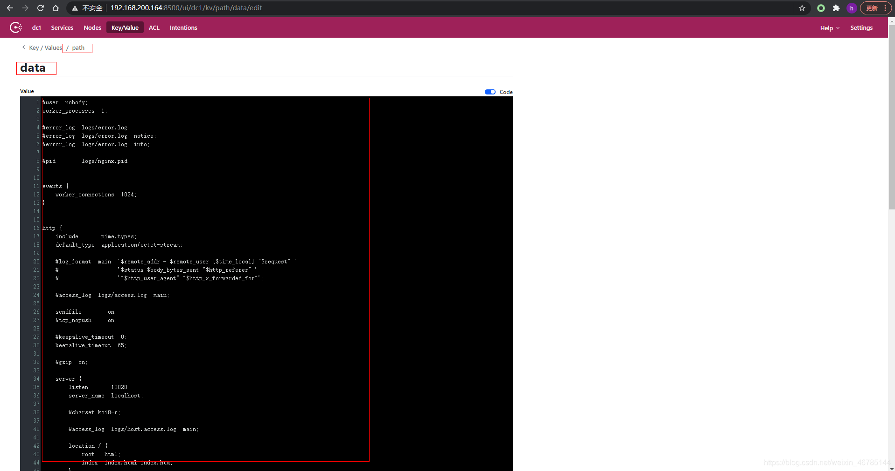
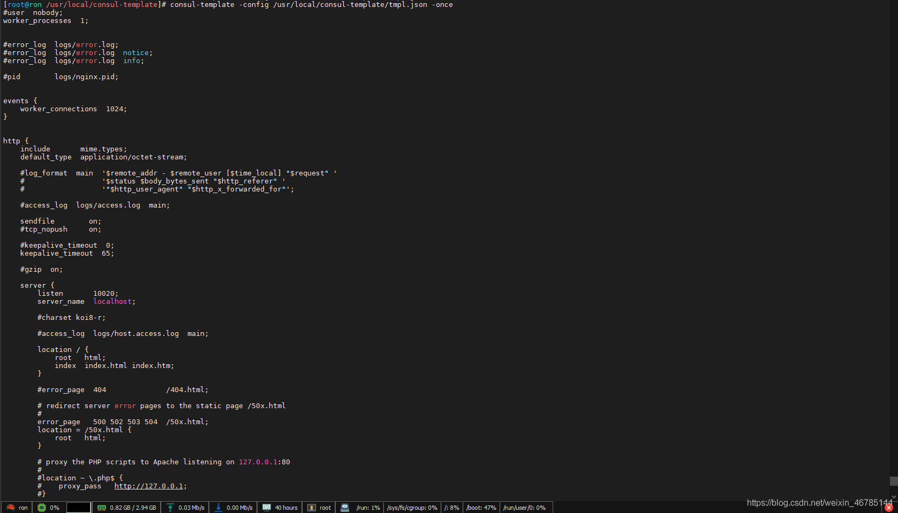

### 一、介绍

---

consul-template是基于consul的**自动替换配置文件**的应用。

consul-template提供了一个便捷的方式从consul中获取存储的值，**consul-template守护进程会查询consul实例来更新系统上指定的任何模板。当更新完成后，模板还可以选择运行一些任意的命令**。


### 二、应用场景

---

consul-template可以查询consul中的服务目录、Key、Key-values等。consul-template特别适合**动态的创建配置文件**。例如：创建Apache/Nginx Proxy Balancers、Haproxy Backends、Varnish Servers、Application Configurations等配置文件。


### 三、部署

---

1. 下载并解压，得到可执行文件。

   ```shell
   wget https://releases.hashicorp.com/consul-template/0.19.3/consul-template_0.19.3_linux_amd64.zip
   ```

   ```shell
   unzip consul-template_0.19.3_linux_amd64.zip
   ```

2. 将执行文件放到/usr/local/bin下。

   ```shell
   mv consul-template /usr/local/bin/
   ```

3. 查看可执行文件版本

   ```shell
   consul-template -v
   ```


### 四、配置文件

---

#### 4.1 consul-template配置文件

tmpl.json放在当前目录。

```json
consul {
  address="192.168.200.164:8500"
}

reload_signal = "SIGHUP"
kill_signal = "SIGINT"

template {
  source = "./config.ctmpl"				#配置文件模板
  destination = "./nginx.config"	#需要生成的配置文件
  command = "cat ./nginx.config"	#生成配置文件后，执行命令
}
```

>说明：需要连接的consul是：”192.168.200.164:8500“。

#### 4.2 准备配置文件模板

配置文件模板config.ctmpl，放在当前目录：

```shell
{{key "path/data"}}
```

>key为consule template语法
>
>path/data：consul key

#### 4.3 consul创建key/value



#### 4.4 执行consul-template

```shell
consul-template -config ./tmpl.json -once
```



一直执行，当修改consul对应的key值时，页面会输出更新后的内容。