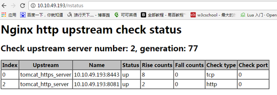
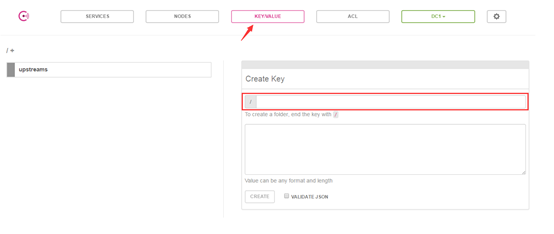
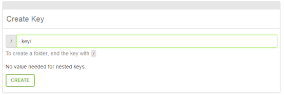
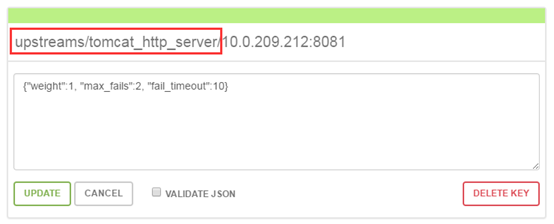
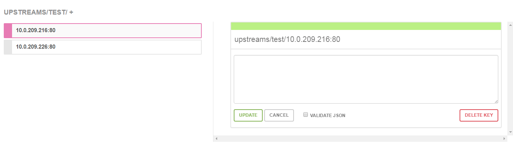
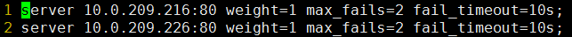

### 一、安装

---

1.1 nginx

需要编译两个模块

nginx_upstream_check_module：[nginx主动健康检查模块](https://github.com/xiaokai-wang/nginx_upstream_check_module)

nginx-upsync-module：[nginx服务发现模块](https://github.com/weibocom/nginx-upsync-module)

#### 1.2 consul

启动：

```bash
./consul agent -server –bootstrap-expect 1 –data-dir /tmp/consul –bind=10.10.49.193 –ui –client 0.0.0.0 &
```

1. server： 以server身份启动。
2. bootstrap-expect：集群要求的最少server数量，当低于这个数量，集群即失效。经测试，低于这个数量也不影响访问
3. data-dir：data存放的目录，更多信息请参阅consul数据同步机制
4. node：节点id，在同一集群不能重复。
5. bind：监听的ip地址。
6. client 客户端的ip地址
7. & ：在后台运行，此为linux脚本语法
8. ui：启动webui，端口8500

#### 1.3 consul常用命令

关闭：`./consul leave`

查看成员：`./consul members`

#### 1.4 启动consul集群

建议server节点数为3~5个。以下以3台为例，分别为ip1、ip2、ip3：

```bash
./consul agent -server -bootstrap-expect 2 -data-dir /tmp/consul -node=consul1 -bind=ip1 -ui -client=0.0.0.0 &
```

```bash
./consul agent -server -bootstrap-expect 2 -data-dir /tmp/consul -node=consul2 -bind=ip2 -join=ip1 -ui -client=0.0.0.0 &
```

```bash
./consul agent -server -bootstrap-expect 2 -data-dir /tmp/consul -node=consul3 -bind=ip3 -join=ip1 -ui -client=0.0.0.0 &
```

-join 加入一个集群


### 二、使用

---

#### 2.1 nginx&upstream配置

consul是针对nginx的upstream所做的一项改善，地址池不再需要手动配置，而是从consul的数据中心抓取。新的upstream配置如下：

```nginx
upstream tomcat_http_server {
  server 127.0.0.1:11111;
  upsync 10.10.49.193:8500/v1/kv/upstreams/tomcat_http_server upsync_timeout=6m upsync_interval=500ms upsync_type=consul strong_dependency=off;
  upsync_dump_path /usr/local/nginx/conf/server/server_test.conf;

  check interval=1000 rise=2 fall=2 timeout=3000 type=http default_down=false;
  check_http_send "HEAD / HTTP/1.0\r\n\r\n";
  check_http_expect_alive http_2xx http_3xx;
}
```

server 127.0.0.1:11111是占位机器，这个配置必须要有不然校验配置文件不通过。

upsync配置语法：

upsync $consul/etcd.api.com:$port/v1/kv/upstreams/$upstream_name/ [upsync_type=consul/etcd] [upsync_interval=second/minutes] [upsync_timeout=second/minutes] [strong_dependency=off/on]

默认upsync_interval=5s upsync_timeout=6m strong_dependency=off

10.10.49.193:8500/v1/kv/upstreams/tomcat_http_server为同步地址；upsync_timeout同步超时时间；upsync_interval同步间隔；upsync_type同步类型，默认为consul；strong_dependency，配置为on时，每次启动或重启nginx，都会强制去consul拉一次upstream servers。

upsync_dump_path将拉取到的upstreams地址池写入一个文件；

此处想要多说两句，即使consul中途挂掉，nginx仍然可以从upsync_dump_path配置的文件中取到数据，继续分发流量，只是此时upstream池变为静态了，跟之前的情形一样，启停重启nginx等操作并没有问题。所以consul单节点配置中心的可用性也是很高的。

upsync更多指令请阅读

https://github.com/weibocom/nginx-upsync-module#upsync

check代表健康检查；interval检查间隔，单位为毫秒；rise成功该次数后，标记为up；fall失败该次数后，标记为down；timeout；type包括tcp、ssl_hello、http、mysql、ajp、fastcgi；default_down设置后端server的初始状态；

默认配置interval=30000 fall=5 rise=2 timeout=1000 default_down=true type=tcp

check_http_send 健康检查发送的请求包；

check_http_expect_alive 这些状态代表后端server是活着的；

check更多指令请阅读

https://github.com/xiaokai-wang/nginx_upstream_check_module

#### 2.2 查询健康检查状态

健康检查模块提供了一个接口check_status，用于检查consul数据中心配置的所有server的健康检查状态。需要在nginx稍作配置：

在80端口下，配置nstatus的接口：

```
location /nstatus {
        check_status;
        access_log off;
}
```

访问consul节点的ip/nstatus



#### 2.3 consul配置

输入【http://ip:8500/ui】进入consulweb控制台

进入consu首页，点击进入【KEY/VALUE】，此处即为配置upstream的位置。



Key以“/”结尾，则创建了一个文件夹，否则创建了一个key。



此处的文件夹路径即为upsync指令请求的路径。



value默认值为{"weight":1, "max_fails":2, "fail_timeout":10}，所以不配置value也是可以的



写入本地文件是这样的：

