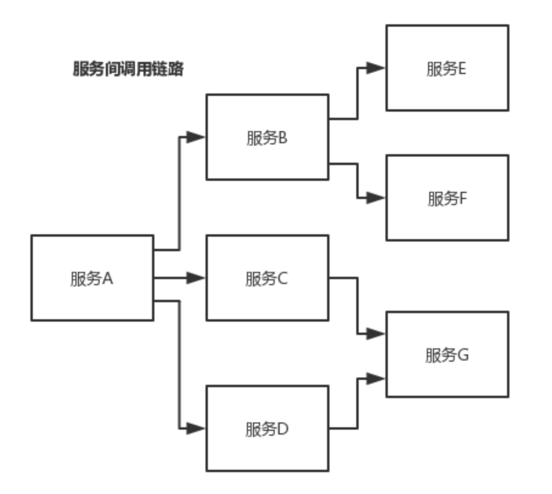

>如何基于 dubbo 进行服务治理、服务降级、失败重试以及超时重试？

### 一、服务治理

---

#### 1.1 调用链路自动生成

一个大型的分布式系统，或者说是用现在流行的微服务架构来说吧，分布式系统由大量的服务组成。那么这些服务之间互相是如何调用的？调用链路是啥？

需要基于 dubbo 做的分布式系统中，对各个服务之间的调用自动记录下来，然后将各个服务之间的依赖关系和调用链路生成出来，做成一张图，显示出来，才可以看到。



#### 1.2 服务访问压力以及时长统计

需要自动统计各个接口和服务之间的调用次数以及访问延时，而且要分成两个级别。

- **接口粒度**，就是每个服务的每个接口每天被调用多少次，TP50/TP90/TP99，三个档次的请求延时分别是多少；
- **从源头入口开始**，一个完整的请求链路经过几十个服务之后，完成一次请求，每天全链路走多少次，全链路请求延时的 TP50/TP90/TP99，分别是多少。

#### 1.3 其他

- 服务分层（避免循环依赖）
- 调用链路失败监控和报警
- 服务鉴权
- 每个服务的可用性的监控（接口调用成功率？几个 9？99.99%，99.9%，99%）


### 二、服务降级

---

比如说服务 A 调用服务 B，结果服务 B 挂掉了，服务 A 重试几次调用服务 B，还是不行，那么直接降级，走一个备用的逻辑，给用户返回响应。

举个例子，我们有接口 HelloService，HelloServiceImpl有该接口的具体实现。在调用接口失败的时候，可以通过 mock统一返回 null。

```java
public interface HelloService {
   void sayHello();
}

public class HelloServiceImpl implements HelloService {
    public void sayHello() {
        System.out.println("hello world......");
    }
}
```

mock 的值也可以修改为 true，然后再跟接口同一个路径下实现一个 Mock 类，命名规则是 “接口名称+ `Mock` ” 后缀。然后在 Mock 类里实现自己的降级逻辑。

```java
public class HelloServiceMock implements HelloService {
    public void sayHello() {
        // 降级逻辑
    }
}
```


### 三、失败重试和超时重试

---

所谓失败重试，就是 consumer 调用 provider 要是失败了，比如抛异常了，此时应该是可以重试的，或者调用超时了也可以重试。配置如下：

```xml
<dubbo:reference id="xxxx" interface="xx" check="true" async="false" retries="3" timeout="2000"/>
```

例如某个服务的接口，要耗费 5s，你这边不能干等着，你这边配置了 timeout 之后，我等待 2s，还没返回，我直接就撤了，不能干等你。

可以结合你们公司具体的场景来说说你是怎么设置这些参数的：

- `timeout` ：一般设置为 `200ms` ，我们认为不能超过 `200ms` 还没返回。
- `retries` ：设置 retries，一般是在读请求的时候，比如你要查询个数据，你可以设置个 retries，如果第一次没读到，报错，重试指定的次数，尝试再次读取。