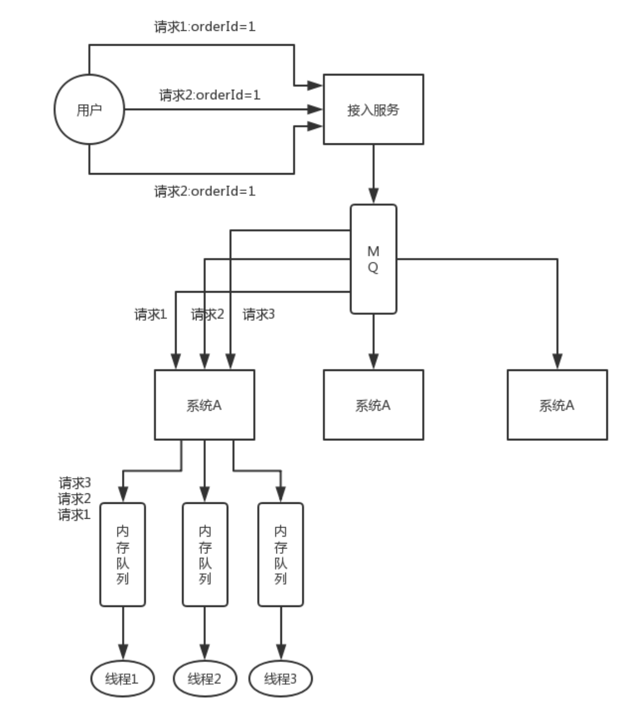

>分布式服务接口请求的顺序性如何保证？

首先，一般来说，个人建议是，你们从业务逻辑上设计的这个系统最好是不需要这种顺序性的保证，因为一旦引入顺序性保障，比如使用**分布式锁**，会**导致系统复杂度上升**，而且会带来**效率低下**，热点数据压力过大等问题。

下面我给个我们用过的方案吧，简单来说，首先你得用 Dubbo 的一致性 hash 负载均衡策略，将比如某一个订单 id 对应的请求都给分发到某个机器上去，接着就是在那个机器上，因为可能还是多线程并发执行的，你可能得立即将某个订单 id 对应的请求扔一个**内存队列**里去，强制排队，这样来确保他们的顺序性。

但是这样引发的后续问题就很多，比如说要是某个订单对应的请求特别多，造成某台机器成**热点**怎么办？解决这些问题又要开启后续一连串的复杂技术方案...... 曾经这类问题弄的我们头疼不已，所以，还是建议什么呢？

最好是比如说刚才那种，一个订单的插入和删除操作，能不能合并成一个操作，就是一个删除，或者是其它什么，避免这种问题的产生。