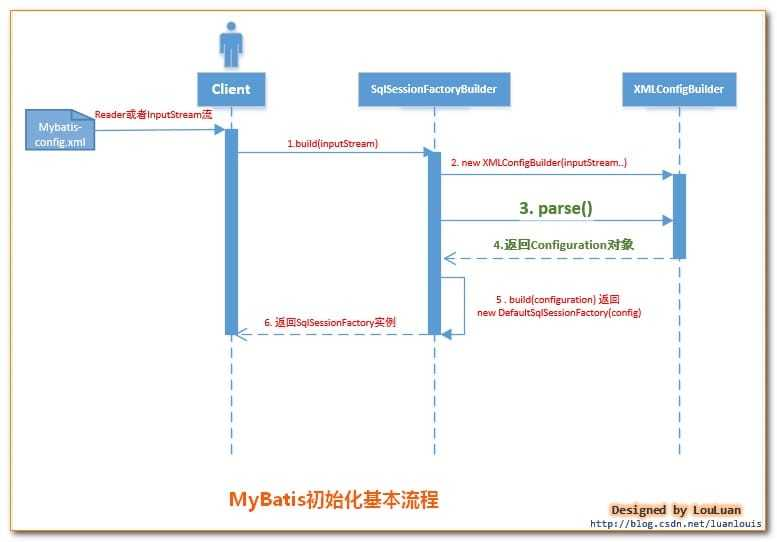
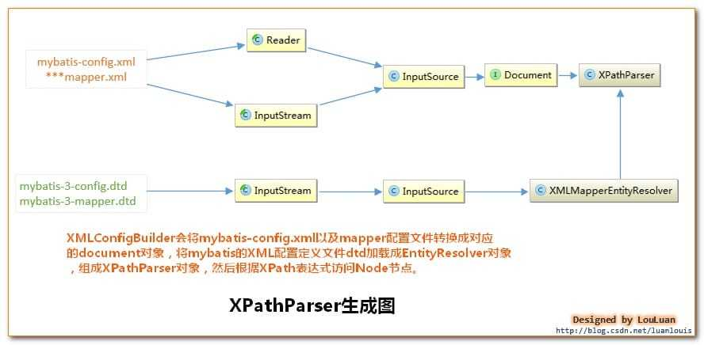
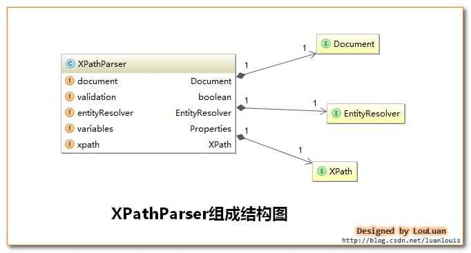
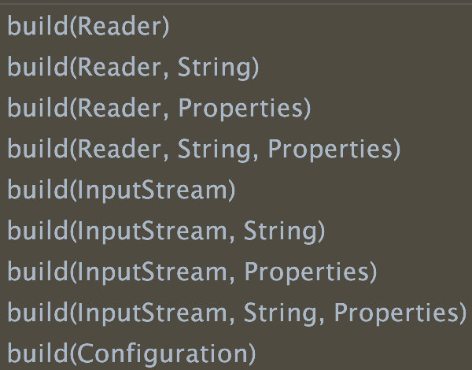

如何读取配置文件：`org.apache.ibatis.session.Configuration`。

Mybatis的入口类 `SqlSessionFactoryBuilder`，在创建完成 XMLConfigBuilder 之后，会完成 Configuration 的创建工作，即 **Configuration 对象的创建是在 CMLConfigBuilder 中完成的**。


### 一、基于XML配置文件构建SqlSessionFactory

---

将Mybatis的所有配置信息放在XML文件中，Mybatis通过加载并配置XML文件，将配置信息组装成内部的Configuration对象。

```java
String resource = "org/mybatis/example/mybatis-config.xml";
// 将配置文件获取为流对象
InputStream inputStream = Resources.getResourceAsStream(resource);
// 使用流对象创建SqlSessionFactory对象
SqlSessionFactory sqlSessionFactory = new SqlSessionFactoryBuilder().build(inputStream);
```



1. 调用SqlSessionFactoryBuilder对象的build(inputStream)方法；
2. SqlSessionFactoryBuilder会根据输入流inputStream等信息创建XMLConfigBuilder对象；
3. SqlSessionFactoryBuilder调用 `XMLConfigBuilder` 对象的 `parse()` 方法；
4. **XMLConfigBuilder对象返回Configuration对象**；
5. SqlSessionFactoryBuilder根据Configuration对象创建一个DefaultSessionFactory对象；
6. SqlSessionFactoryBuilder返回 DefaultSessionFactory对象给Client，供Client使用。

跟踪源码：

```java
public SqlSessionFactory build(InputStream inputStream) {
  return build(inputStream, null, null);
}

public SqlSessionFactory build(InputStream inputStream, String environment, Properties properties) {
  try {
    XMLConfigBuilder parser = new XMLConfigBuilder(inputStream, environment, properties);
    return build(parser.parse());
  }...
}

public SqlSessionFactory build(Configuration config) {
  // 利用Configuration对象构建SqlSessionFactory对象
  return new DefaultSqlSessionFactory(config);
}
```

> 使用构造函数创建`XMLConfigBuilder对象`：
>
> XMLConfigBuilder会将XML配置文件的信息转换为Document对象，而XML配置定义文件DTD转换成XMLMapperEntityResolver对象，然后将二者封装到XpathParser对象中，XpathParser的作用是提供根据Xpath表达式获取基本的DOM节点Node信息的操作。如下图所示：





```java
public XMLConfigBuilder(InputStream inputStream, String environment, Properties props) {
  this(new XPathParser(inputStream, true, props, new XMLMapperEntityResolver()), environment, props);
}

// 使用构造函数创建`XPathParser对象`
public XPathParser(InputStream inputStream, boolean validation, Properties variables, EntityResolver entityResolver) {
  // XPathParser对象设置validation为true；variables为null；entityResolver为new XMLMapperEntityResolver()
  commonConstructor(validation, variables, entityResolver);
  this.document = createDocument(new InputSource(inputStream));
}

private XMLConfigBuilder(XPathParser parser, String environment, Properties props) {
  // 这里调用了父类的构造器，并创建了Configuration
  super(new Configuration());
  ErrorContext.instance().resource("SQL Mapper Configuration");
  this.configuration.setVariables(props);
  this.parsed = false;
  this.environment = environment;
  this.parser = parser;
}

// XMLConfigBuilder的父类
public BaseBuilder(Configuration configuration) {
  this.configuration = configuration;
  this.typeAliasRegistry = this.configuration.getTypeAliasRegistry();
  this.typeHandlerRegistry = this.configuration.getTypeHandlerRegistry();
}
//这里实现了赋值configuration这个类并在Configuration创建了typeAliasRegistry和typeHandlerRegistry两个类。
```

既然已经创建了Configuration接下来就是如何将Document转换为Configuration的过程。

>创建`Document树`：
>
>1. 调用 DocumentBuilderFactory.newInstance() 方法得到创建 DOM 解析器的工厂。
>2. 调用工厂对象的 newDocumentBuilder方法得到 DOM 解析器对象。
>3. 调用 DOM 解析器对象的 parse() 方法解析 XML 文档，得到代表整个文档的 Document 对象，进行可以利用DOM特性对整个XML文档进行操作了。

```java
private Document createDocument(InputSource inputSource) {
  try {
    // 获取DocumentBuilderFactory实例
    DocumentBuilderFactory factory = DocumentBuilderFactory.newInstance();
    // 为DocumentBuilderFactory和DocumentBuilderFactory创建的DocumentBuilder设置功能
    factory.setFeature(XMLConstants.FEATURE_SECURE_PROCESSING, true);
    // 指定生成的解析器将 在解析文档时是否对它们进行验证
    factory.setValidating(validation);

    // 指定生成的解析器 不提供对XML名称空间的支持
    factory.setNamespaceAware(false);
    // 指定生成的解析器将 忽略注释
    factory.setIgnoringComments(true);
    // 指定由该工厂创建的解析器 在解析XML文档时必须消除元素内容中的空格，此设置要求解析器处于验证模式
    factory.setIgnoringElementContentWhitespace(false);
    // 指定生成的解析器 不会将CDATA节点转换为Text节点，并将其附加到相邻的文本节点（如果有）
    factory.setCoalescing(false);
    // 指定生成的解析器 将扩展实体引用节点。
    factory.setExpandEntityReferences(true);
    // 使用当前配置的参数创建 javax.xml.parsers.DocumentBuilder 的实例。
    DocumentBuilder builder = factory.newDocumentBuilder();
    builder.setEntityResolver(entityResolver);
    builder.setErrorHandler(new ErrorHandler() {
      //...
    });
    return builder.parse(inputSource);
  } catch (Exception e) {

  }
}

// 使用DocumentBuilder将输入流解析成org.w3c.dom.Document并将其存储到XPathParser中
public Document parse(InputSource is) throws SAXException, IOException {
  if (is == null) {

  }
  if (fSchemaValidator != null) {
    if (fSchemaValidationManager != null) {
      fSchemaValidationManager.reset();
      fUnparsedEntityHandler.reset();
    }
    resetSchemaValidator();
  }
  domParser.parse(is);
  Document doc = domParser.getDocument();
  domParser.dropDocumentReferences();
  return doc;
}
```

> 解析配置文件：将XML配置信息赋值给Configuration中的参数。

```java
public Configuration parse() {
  // 初始化的时候parsed为false，说明同一个XMLConfigBuilder只能给Configuration解析赋值一次
  if (parsed) {
    throw new BuilderException("Each XMLConfigBuilder can only be used once.");
  }
  parsed = true;
  // 从XPathParser中取出<configuration>节点对应的XNode对象，解析此Node节点的子Node
  parseConfiguration(parser.evalNode("/configuration"));
  return configuration;
}
```

解析完之后的XNode.toString()方法输出的内容如下：

```xml
<configuration>
  <properties resource="properties/db.properties"/>
  
  <settings>
    <setting name="cacheEnabled" value="true"/>
    <setting name="lazyLoadingEnabled" value="true"/>
    <setting name="useGeneratedKeys" value="true"/>
  </settings>
  
  <typeAliases>
    <typeAlias alias="Mail" type="org.xrq.mybatis.pojo.Mail"/>
  </typeAliases>
  
  <environments default="development">
    <environment id="development">
      <transactionManager type="JDBC"/>
      <dataSource type="POOLED">
        <property name="driver" value="${driveClass}"/>
        <property name="url" value="${url}"/>
        <property name="username" value="${userName}"/>
        <property name="password" value="${password}"/>
      </dataSource>
    </environment>
  </environments>
  
  <mappers>
    <mapper resource="mybatis/mail.xml"/>
  </mappers>
</configuration>
```

可见xml文件中`<configuration>`中所有内容都已经被成功解析并放在XNode中了，剩下的只要调用XNode的方法获取自己想要的内容即可。

```java
// 解析相应的属性元素
private void parseConfiguration(XNode root) {
  try {
    propertiesElement(root.evalNode("properties"));
    Properties settings = settingsAsProperties(root.evalNode("settings"));
    loadCustomVfs(settings);
    loadCustomLogImpl(settings);
    typeAliasesElement(root.evalNode("typeAliases"));
    pluginElement(root.evalNode("plugins"));
    objectFactoryElement(root.evalNode("objectFactory"));
    objectWrapperFactoryElement(root.evalNode("objectWrapperFactory"));
    reflectorFactoryElement(root.evalNode("reflectorFactory"));
    settingsElement(settings);

    environmentsElement(root.evalNode("environments"));
    databaseIdProviderElement(root.evalNode("databaseIdProvider"));
    typeHandlerElement(root.evalNode("typeHandlers"));
    mapperElement(root.evalNode("mappers"));
  } catch (Exception e) {
    throw new BuilderException("Error parsing SQL Mapper Configuration. Cause: " + e, e);
  }
}
```


### 二、基于Java API构建SqlSessionFactory

---

```java
// 数据源配置
DataSource dataSource = BlogDataSourceFactory.getBlogDataSource();
// 事务配置
TransactionFactory transactionFactory = new JdbcTransactionFactory();
Environment environment = new Environment("development", transactionFactory, dataSource);
Configuration configuration = new Configuration(environment);
configuration.addMapper(BlogMapper.class);
SqlSessionFactory sqlSessionFactory = new SqlSessionFactoryBuilder().build(configuration);
```


### 三、设计模式

---

初始化的过程中涉及到**创建各种对象**，所以会使用Builder的设计模式。

#### 3.1 Builder模式应用1：SqlSessionFactory的创建

对于创建SqlSessionFactory时，会根据情况提供不同的参数，其参数组合可以有以下几种：



#### 3.2 Builder模式应用2：数据库连接环境Environment对象的创建。

```java
public final class Environment {
  private final String id;
  private final TransactionFactory transactionFactory;
  private final DataSource dataSource;

  public Environment(String id, TransactionFactory transactionFactory, DataSource dataSource) {
    if (id == null) {
      throw new IllegalArgumentException("Parameter 'id' must not be null");
    }
    if (transactionFactory == null) {
      throw new IllegalArgumentException("Parameter 'transactionFactory' must not be null");
    }
    this.id = id;
    if (dataSource == null) {
      throw new IllegalArgumentException("Parameter 'dataSource' must not be null");
    }
    this.transactionFactory = transactionFactory;
    this.dataSource = dataSource;
  }

  /**
   * 静态内部类
   */
  public static class Builder {
    private final String id;
    private TransactionFactory transactionFactory;
    private DataSource dataSource;

    public Builder(String id) {
      this.id = id;
    }

    public Builder transactionFactory(TransactionFactory transactionFactory) {
      this.transactionFactory = transactionFactory;
      return this;
    }

    public Builder dataSource(DataSource dataSource) {
      this.dataSource = dataSource;
      return this;
    }

    public String id() {
      return this.id;
    }

    public Environment build() {
      return new Environment(this.id, this.transactionFactory, this.dataSource);
    }
  }
  // 省略get方法
}
```
