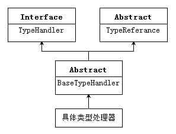

TypeHandlerReister是用来统筹管理类型处理器的，`TypeHandler`是真正用于进行java类型与数据库类型映射的工具。


### 一、类型处理器架构

---

MyBatis针对诸多Java类型与数据库类型进行了匹配处理。它主要用于映射器配置文件的工作，在通过类型别名注册器获取类型别名代表的类型之后，就可以使用获取的类型通过类型处理器注册器来得到其对应的JdbcType和对应的类型处理器。由此可见**每个类型处理器都针对两个类型，一个javaType，一个jdbcType**。类型处理器的作用就是进行二者之间的匹配、对应、转换。



- `TypeHandler接口`定义了类型处理器；
- `TypeReference抽象类`则定义了一个类型引用，用于引用一个泛型类型；
- `BaseTypeHandler`是类型处理器的基础，是所有类型处理器的公共模块。（模版模式）


### 二、TypeHandler

---

一方面将Java类型的参数设置到数据库操作脚本中（匹配jdbcType），另一种是获取操作结果到Java类型中。

```java
public interface TypeHandler<T> {

  // 设置参数
  void setParameter(PreparedStatement ps, int i, T parameter, JdbcType jdbcType) throws SQLException;

  // 取得结果，供普通select用
  T getResult(ResultSet rs, String columnName) throws SQLException;

  // 取得结果，供普通select用
  T getResult(ResultSet rs, int columnIndex) throws SQLException;

  // 取得结果，供SP用
  T getResult(CallableStatement cs, int columnIndex) throws SQLException;

}
```

- 设置参数方法：用于设置数据库操作的参数，例如查询参数、删除参数、更新参数等；
- 取得结果的方法：
  - 从`ResultSet`中获取结果，通过`列名（columnName）`获取；
  - 从`ResultSet`中获取结果，通过列`下标（columnIndex）`获取；
  - 针对`存储过程`而设，通过列下标的方式获取存储过程中输出结果中的数据。


### 三、TypeReference

---

用于获取原生类型，Java中的原生类型又称为基本类型，即byte、short、int、long、float、double、boolean、char。

类型引用的目的：为了持有这个具体的类型处理器所处理的Java类型的原生类型。

在该类中还有两个方法`getRawType()`和`toString()`方法，通过检索发现，getRawType()方法重点被调用的地方在`TypeHandlerRegistry`中，在没有指定JavaType而只有TypeHandler的情况下，调用该TypeHandler的getRawType()方法来获取其原生类型（即参数类型）来作为其JavaType来进行类型处理器的注册。

```java
public abstract class TypeReference<T> {

  // 引用原生类型
  private final Type rawType;

  protected TypeReference() {
    rawType = getSuperclassTypeParameter(getClass());
  }

  Type getSuperclassTypeParameter(Class<?> clazz) {
    // 得到泛型T的实例类型
    Type genericSuperclass = clazz.getGenericSuperclass();
    if (genericSuperclass instanceof Class) {
      if (TypeReference.class != genericSuperclass) {
        return getSuperclassTypeParameter(clazz.getSuperclass());
      }

      throw new TypeException("'" + getClass() + "' extends TypeReference but misses the type parameter. "
                              + "Remove the extension or add a type parameter to it.");
    }

    // 获取泛型<T>中的T类型
    Type rawType = ((ParameterizedType) genericSuperclass).getActualTypeArguments()[0];
    if (rawType instanceof ParameterizedType) {
      rawType = ((ParameterizedType) rawType).getRawType();
    }

    return rawType;
  }

  public final Type getRawType() {
    return rawType;
  }

  @Override
  public String toString() {
    return rawType.toString();
  }

}
```

1. 通过给定参数clazz的getGenericSuperclass()方法来获取该类类型的上一级类型（直接超类，父类）并带有参数类型，即带泛型。
2. 判断第1步获取的类型是否是==Class类的实例==（泛型类不是Class类的实例）。
   1. 如果第一步获取的类型是带泛型的类型，那么判断不成立，则会直接执行23行，将该类型强转为参数化类型，使用其getActualTypeArguments()方法来获取其参数类型（泛型类型），因为该方法获取的泛型类型可能不是一个，所以返回的是一个数组，但是我们这里只会获取到一个，所以取第一个即可。
   2. 如果第1不获取的类型不带泛型，那么就会进入条件内部执行，再次判断，获取的类型是否是TypeReference类型，如果不是该类型，则有可能是多重继承导致目标类型并不是直接继承自TypeReference，那么就通过getSuperclass()方法获取其父类，以这个类来进行递归；但如果获取到的是TypeReference类型，只是没有添加泛型，则抛出类型异常，提示丢失泛型。
3. 如果第2步判断不通过，则会执行地23行代码，来获取参数类型，然后对获取的参数类型进行判断，如果该类型还是参数化类型（仍然带有泛型，即泛型嵌套的模式），那么就需要再次执行getActualTypeArguments()方法来获取其泛型类型（参数类型），最后将该类型返回（赋值给字段）


### 四、BaseTypeHandler

---

**主要对设置参数与获取返回结果时数据位null的情况进行了处理**，具体的参数设置方法与结果获取方法都是由具体的类型处理器来实现的。

```java
//非NULL情况，怎么设参数还得交给不同的子类完成
public abstract void setNonNullParameter(PreparedStatement ps, int i, T parameter, JdbcType jdbcType) throws SQLException;

//以下3个方法是取得可能为null的结果，具体交给子类完成
public abstract T getNullableResult(ResultSet rs, String columnName) throws SQLException;

public abstract T getNullableResult(ResultSet rs, int columnIndex) throws SQLException;

public abstract T getNullableResult(CallableStatement cs, int columnIndex) throws SQLException;
```


### 五、StringTypeHandler

---

字符串型类型处理器：（其中直接调用了JDK API来实现功能）

```java
public class StringTypeHandler extends BaseTypeHandler<String> {

  @Override
  public void setNonNullParameter(PreparedStatement ps, int i, String parameter, JdbcType jdbcType)
    throws SQLException {
    // 调用了PreparedStatement的setString()方法
    ps.setString(i, parameter);
  }

  @Override
  public String getNullableResult(ResultSet rs, String columnName)
    throws SQLException {
    // 调用ResultSet的getString()方法
    return rs.getString(columnName);
  }

  @Override
  public String getNullableResult(ResultSet rs, int columnIndex)
    throws SQLException {
    // 调用ResultSet的getString()方法
    return rs.getString(columnIndex);
  }

  @Override
  public String getNullableResult(CallableStatement cs, int columnIndex)
    throws SQLException {
    // 调用CallableStatement的getString()方法
    return cs.getString(columnIndex);
  }
}
```


### 六、UnknownTypeHandler

---

通过类型处理器注册器中的注册信息可以看出这种类型处理器所对应的JavaType是 `Object` 类型，对应的JdbcType是 `OTHER` 类型，这个OTHER是什么类型？我们可以这么理解，**每个数据库内部都有一些自定义的只在其内部起作用的数据类型，而这些类型反映到Java中之后是Object类型时**，这里就将其统一定义为OTHER类型。

UnknownTypeHandler是一种中间类型处理器，或者叫代理类型处理器，因为它本身并不会真正实现处理功能，它只是通过获取对应的类型处理器来调用其处理功能来完成功能。

```java
public class UnknownTypeHandler extends BaseTypeHandler<Object> {

  private static final ObjectTypeHandler OBJECT_TYPE_HANDLER = new ObjectTypeHandler();
  private final Configuration config;
  private final Supplier<TypeHandlerRegistry> typeHandlerRegistrySupplier;

  public UnknownTypeHandler(Configuration configuration) {
    this.config = configuration;
    this.typeHandlerRegistrySupplier = configuration::getTypeHandlerRegistry;
  }

  @Deprecated
  public UnknownTypeHandler(TypeHandlerRegistry typeHandlerRegistry) {
    this.config = new Configuration();
    this.typeHandlerRegistrySupplier = () -> typeHandlerRegistry;
  }

  @Override
  public void setNonNullParameter(PreparedStatement ps, int i, Object parameter, JdbcType jdbcType)
    throws SQLException {
    TypeHandler handler = resolveTypeHandler(parameter, jdbcType);
    handler.setParameter(ps, i, parameter, jdbcType);
  }

  @Override
  public Object getNullableResult(ResultSet rs, String columnName)
    throws SQLException {
    TypeHandler<?> handler = resolveTypeHandler(rs, columnName);
    return handler.getResult(rs, columnName);
  }

  @Override
  public Object getNullableResult(ResultSet rs, int columnIndex)
    throws SQLException {
    TypeHandler<?> handler = resolveTypeHandler(rs.getMetaData(), columnIndex);
    if (handler == null || handler instanceof UnknownTypeHandler) {
      handler = OBJECT_TYPE_HANDLER;
    }
    return handler.getResult(rs, columnIndex);
  }

  @Override
  public Object getNullableResult(CallableStatement cs, int columnIndex)
    throws SQLException {
    return cs.getObject(columnIndex);
  }

}
```

先通过不同的resolveTypeHandler()方法来获取具体的TypeHandler，然后调用具体TypeHandler的对应方法来完成功能。那么UnknownTypeHandler中的重点就集中在这三个resolveTypeHandler()方法中了。

```java
private TypeHandler<?> resolveTypeHandler(Object parameter, JdbcType jdbcType) {
  TypeHandler<?> handler;
  // 如果参数为null
  if (parameter == null) {
    // 直接将TypeHandler设置为ObjectTypeHandler
    handler = OBJECT_TYPE_HANDLER;
  } else {
    // 如果parameter不为null，则直接从类型处理器注册器中获取对应JavaType与JdbcType的类型处理器
    handler = typeHandlerRegistrySupplier.get().getTypeHandler(parameter.getClass(), jdbcType);
    if (handler == null || handler instanceof UnknownTypeHandler) {
      handler = OBJECT_TYPE_HANDLER;
    }
  }
  return handler;
}

private TypeHandler<?> resolveTypeHandler(ResultSet rs, String column) {
  try {
    Map<String,Integer> columnIndexLookup;
    columnIndexLookup = new HashMap<>();
    ResultSetMetaData rsmd = rs.getMetaData();
    int count = rsmd.getColumnCount();
    boolean useColumnLabel = config.isUseColumnLabel();
    for (int i = 1; i <= count; i++) {
      String name = useColumnLabel ? rsmd.getColumnLabel(i) : rsmd.getColumnName(i);
      columnIndexLookup.put(name,i);
    }
    Integer columnIndex = columnIndexLookup.get(column);
    TypeHandler<?> handler = null;
    if (columnIndex != null) {
      handler = resolveTypeHandler(rsmd, columnIndex);
    }
    if (handler == null || handler instanceof UnknownTypeHandler) {
      handler = OBJECT_TYPE_HANDLER;
    }
    return handler;
  } catch (SQLException e) {
    throw new TypeException("Error determining JDBC type for column " + column + ".  Cause: " + e, e);
  }
}

private TypeHandler<?> resolveTypeHandler(ResultSetMetaData rsmd, Integer columnIndex) {
  TypeHandler<?> handler = null;
  JdbcType jdbcType = safeGetJdbcTypeForColumn(rsmd, columnIndex);
  Class<?> javaType = safeGetClassForColumn(rsmd, columnIndex);
  if (javaType != null && jdbcType != null) {
    handler = typeHandlerRegistrySupplier.get().getTypeHandler(javaType, jdbcType);
  } else if (javaType != null) {
    handler = typeHandlerRegistrySupplier.get().getTypeHandler(javaType);
  } else if (jdbcType != null) {
    handler = typeHandlerRegistrySupplier.get().getTypeHandler(jdbcType);
  }
  return handler;
}
```
