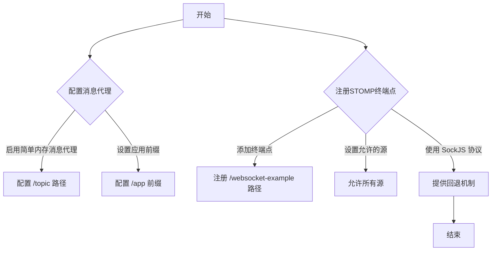
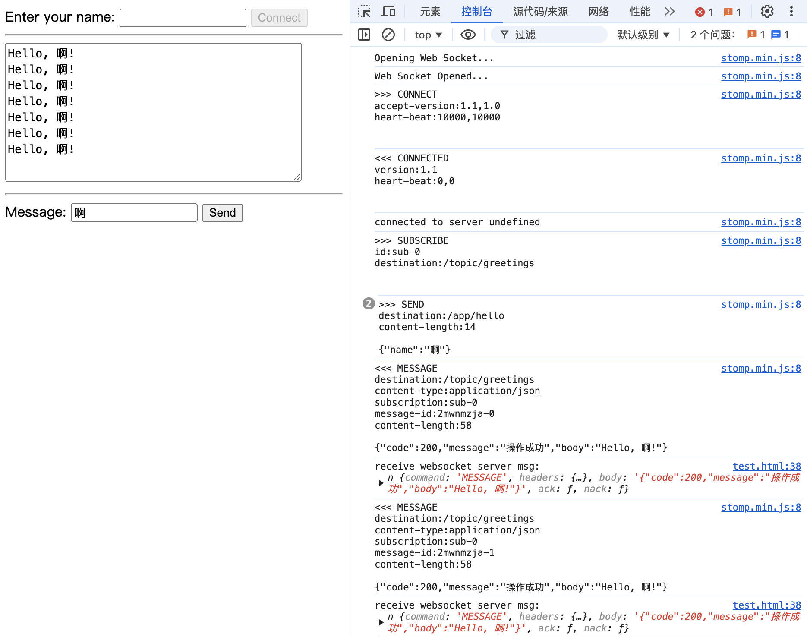

### 一、websocket使用场景

---

1. **实时聊天应用程序**： WebSocket 提供了一种实时通信的方式，使得在线聊天应用程序能够实时地传递消息。
2. **实时数据更新**： 对于需要在客户端和服务器之间共享实时数据的应用程序，例如股票市场行情、在线游戏状态等。
3. **协作应用程序**： 在协作工具中，用户可以实时共享文档、图像等内容。
4. **实时提醒和通知**： 通过 WebSocket，服务器可以即时地向客户端推送通知，而不需要客户端不断地轮询。


### 二、代码示例

---

#### 2.1 创建 Spring Boot 项目

引入websocket-starter

```xml
 <!-- Spring Boot Starter WebSocket -->
<dependency>
    <groupId>org.springframework.boot</groupId>
    <artifactId>spring-boot-starter-websocket</artifactId>
</dependency>
```

#### 2.2 WebSocket 配置

创建一个 WebSocket 配置类，配置一个WebSocket消息代理，实现WebSocketMessageBrokerConfigurer接口。

```java
@Configuration
@EnableWebSocketMessageBroker
public class WebSocketConfig implements WebSocketMessageBrokerConfigurer {

    @Override
    public void configureMessageBroker(MessageBrokerRegistry config) {
        // 启用简单的内存消息代理：配置了/topic路径用于广播消息
        config.enableSimpleBroker("/topic");
        // 设置应用前缀：所有发送到服务器的消息都必须以/app开头
        config.setApplicationDestinationPrefixes("/app");
    }

    @Override
    public void registerStompEndpoints(StompEndpointRegistry registry) {
        // 注册STOMP终端点：客户端可以通过/websocket-example路径连接到WebSocket，使用SockJS协议提供对不支持WebSocket的浏览器的回退机制
        registry
                .addEndpoint("/websocket-example")
                .setAllowedOrigins("*")
                .withSockJS();
    }

}
```

**控制流图：**



- **配置消息代理：**
  - 启用简单内存消息代理：通过config.enableSimpleBroker("/topic")启用简单的内存消息代理，用于广播消息。
  - 设置应用前缀：通过config.setApplicationDestinationPrefixes("/app")设置所有发送到服务器的消息都必须以/app开头。

- **注册STOMP终端点：**
  - 添加终端点：通过registry.addEndpoint("/websocket-example")注册一个STOMP终端点，客户端可以通过这个终端点连接到WebSocket。
  - 设置允许的源：通过setAllowedOrigins("*")允许所有源访问。
  - 使用 SockJS 协议：通过withSockJS()使用SockJS协议，提供对不支持WebSocket的浏览器的回退机制。

#### 2.3 STOMP

> Streaming Text Orientated Message Protocol，是流文本定向消息协议，是一种为MOM(Message Oriented Middleware，面向消息的中间件)设计的简单文本协议。
>
> 它提供了一个可互操作的连接格式，允许STOMP客户端与任意STOMP消息代理(Broker)进行交互，类似于OpenWire(一种二进制协议)。
>
> 由于其设计简单，很容易开发客户端，因此在多种语言和多种平台上得到广泛应用。其中最流行的STOMP消息代理是Apache ActiveMQ。

#### 2.4 创建WebSocket控制器

用于处理 WebSocket 消息：

```java
@RestController
public class WebSocketController {

    /**
     * 处理来自 "/hello" 的消息，并在处理后发送回复到 "/topic/greetings"
     * 此方法演示了如何接收客户端发送的消息，并在处理后广播给所有订阅了 "/topic/greetings" 的客户端
     *
     * @param message 从客户端接收的消息，包含客户端传递的名称信息
     * @return 返回一个通用响应对象，包含处理后的问候消息
     * @throws Exception 可能抛出的异常，例如在消息处理过程中发生的错误
     */
    @MessageMapping("/hello")
    @SendTo("/topic/greetings")
    public CommonRsp<String> greeting(HelloMessage message) throws Exception {
        // 模拟处理时间，例如进行一些耗时的操作
        Thread.sleep(1000);
        // 返回处理后的消息，这里简单地拼接了一个问候语
        return CommonRsp.success("Hello, " + message.getName() + "!");
    }
}
```

#### 2.5 创建消息模型

创建用于传递消息的模型类：

```java
@Data
public class HelloMessage {

    private String name;
}

public class CommonRsp<T> {

    private long code;
    private String message;
    private T body;

    public static CommonRsp<Object> success() {
        CommonRsp<Object> rsp = new CommonRsp<>();
        rsp.setCode(ResultCode.SUCCESS.getCode());
        rsp.setMessage(ResultCode.SUCCESS.getMessage());
        return rsp;
    }

    public static <T> CommonRsp<T> success(T body) {
        CommonRsp<T> rsp = new CommonRsp<>();
        rsp.setCode(ResultCode.SUCCESS.getCode());
        rsp.setMessage(ResultCode.SUCCESS.getMessage());
        rsp.setBody(body);
        return rsp;
    }

    public static <T> CommonRsp<T> error(String errorMsg) {
        CommonRsp<T> rsp = new CommonRsp<>();
        rsp.setCode(ResultCode.FAIL.getCode());
        rsp.setMessage(errorMsg);
        return rsp;
    }

    public CommonRsp() {
    }

    public CommonRsp(long code, String message) {
        this.code = code;
        this.message = message;
    }

    public CommonRsp(long code, String message, T body) {
        this.code = code;
        this.message = message;
        this.body = body;
    }

    public long getCode() {
        return code;
    }

    public void setCode(long code) {
        this.code = code;
    }

    public String getMessage() {
        return message;
    }

    public void setMessage(String message) {
        this.message = message;
    }

    public T getBody() {
        return body;
    }

    public void setBody(T body) {
        this.body = body;
    }
}
```

#### 2.6 编写前端页面

在前端页面使用JavaScript来处理WebSocket连接，创建test.html，写入以下代码：

```html
<!DOCTYPE html>
<html>
	<head>
		<title>WebSocket Example</title>
		<script src="https://code.jquery.com/jquery-3.6.0.min.js"></script>
		<script src="https://cdn.jsdelivr.net/sockjs/1/sockjs.min.js"></script>
		<script src="https://cdnjs.cloudflare.com/ajax/libs/stomp.js/2.3.3/stomp.min.js"></script>

	</head>
	<body>
		<div>
			<label for="name">Enter your name: </label>
			<input type="text" id="name" />
			<button onclick="connect()" id='connect'>Connect</button>
			<hr />
			<textarea id="messages" cols="40" rows="10" readonly></textarea>
			<hr />
			<label for="message">Message: </label>
			<input type="text" id="message" />
			<button onclick="sendMessage()">Send</button>
		</div>

		<script>
			var stompClient = null;

			function setConnected(connected) {
				document.getElementById('connect').disabled = connected;
			}

			function connect() {
				// 注意端口号
				var socket = new SockJS('http://localhost:8091/websocket-example');
				stompClient = Stomp.over(socket);
				stompClient.connect({}, function(frame) {
					setConnected(true);

					stompClient.subscribe('/topic/greetings', function(greeting) {
						console.log("receive websocket server msg:", greeting)
						showGreeting(JSON.parse(greeting.body).body);
					});
				});
			}

			function disconnect() {
				if (stompClient !== null) {
					stompClient.disconnect();
				}
				setConnected(false);
				console.log('Disconnected');
			}

			function sendMessage() {
				var message = document.getElementById('message').value;
				stompClient.send("/app/hello", {}, JSON.stringify({
					'name': message
				}));
			}

			function showGreeting(message) {
				var textarea = document.getElementById('messages');
				textarea.value += message + '\n';
			}
		</script>
	</body>
</html>
```

#### 2.7 运行应用程序

运行Spring Boot应用程序，并访问http://127.0.0.1:8848/learn/html/websocket/test.html

