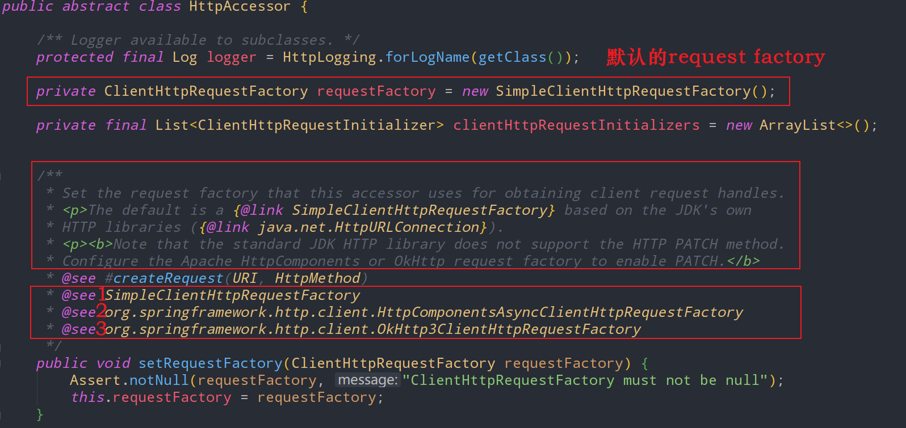
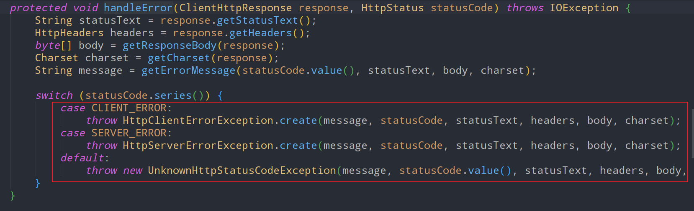
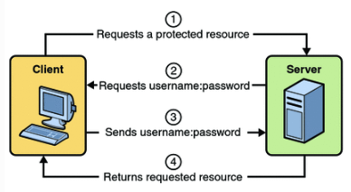
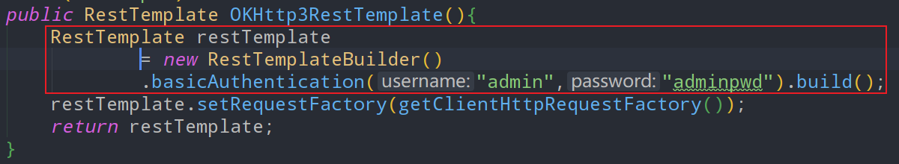
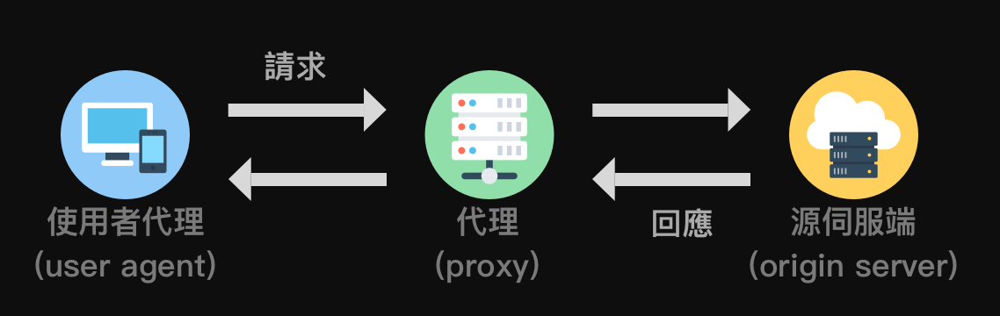
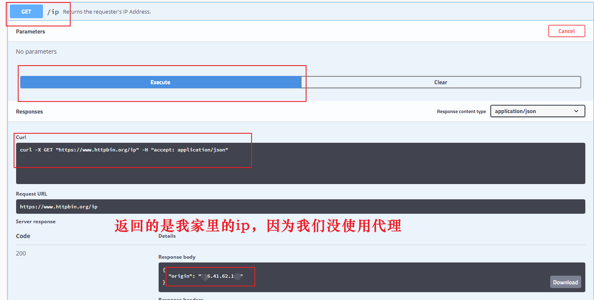

### RESTful风格与HTTP method

---

| 常用HTTP方法 | RESTful风格语义（操作）                     |
| ------------ | ------------------------------------------- |
| GET          | 查询、获取数据                              |
| POST         | 新增、提交数据                              |
| DELETE       | 删除数据                                    |
| PUT          | 更新、修改数据                              |
| HEAD         | 获取HTTP请求头数据                          |
| OPTIONS      | 判断URL提供的当前API支持哪些HTTP method方法 |

### 一、简介

---

RestTemplate 是执行HTTP请求的**同步阻塞式**的客户端，它在HTTP客户端库（例如`JDK HttpURLConnection`，`Apache HttpComponents`，`okHttp`等）基础封装了更加简单易用的模板方法API。也就是说RestTemplate是一个封装，底层的实现还是java应用开发中常用的一些HTTP客户端。

RestTemplate 作为spring-web项目的一部分，在Spring 3.0版本开始被引入。

>根据Spring官方文档及源码中的介绍，RestTemplate在将来的版本中它可能会被弃用，因为他们已在Spring 5中引入了WebClient作为非阻塞式Reactive HTTP客户端。


### 二、将RestTemplate配置初始化为一个Bean

---

添加依赖

```xml
<dependency>
  <groupId>org.springframework.boot</groupId>
  <artifactId>spring-boot-starter-web</artifactId>
</dependency>
```

创建RestTemplateConfig类，设置连接池大小、超时时间、重试机制等。配置如下：

```java
@Configuration
public class RestTemplateConfig {

  @ConditionalOnMissingBean(RestTemplate.class)
  @Bean
  public RestTemplate restTemplate(){
    RestTemplate restTemplate = new RestTemplate();
    return restTemplate;
  }
}
```

这种初始化方法，是使用了JDK 自带的HttpURLConnection作为底层HTTP客户端实现。我们还可以把底层实现切换为Apache HttpComponents，okHttp等。

在需要使用RestTemplate 的位置，注入并使用即可：

```java
@Resource
private RestTemplate restTemplate;
```

#### 2.1 发送GET请求

- getForObject()返回值是HTTP协议的响应体。
- getForEntity()返回的是ResponseEntity，ResponseEntity是对HTTP响应的封装，除了包含响应体，还包含HTTP状态码、contentType、contentLength、Header等信息。

```java
// 1-getForObject()
String response = restTemplate.getForObject(url , String.class);
System.out.println(response);

// 2-getForEntity().
ResponseEntity<String> responseEntity1 = restTemplate.getForEntity(url, String.class);
HttpStatus statusCode = responseEntity1.getStatusCode();
HttpHeaders header = responseEntity1.getHeaders();
String response2 = responseEntity1.getBody();
System.out.println(response2);

// 3-exchange()
RequestEntity requestEntity = RequestEntity.get(new URI(url)).build();
ResponseEntity<String> responseEntity2 = restTemplate.exchange(requestEntity, String.class);
String response3 = responseEntity2.getBody();
System.out.println(response3);
```

getForEntity比getForObject多出来的内容：

- `HttpStatus statusCode = responseEntity.getStatusCode();`获取整体的响应状态信息；
- `int statusCodeValue = responseEntity.getStatusCodeValue();` 获取响应码值；
- `HttpHeaders headers = responseEntity.getHeaders();`获取响应头；

#### 2.2 发送POST请求

```java
// 1-postForObject()
User user1 = this.restTemplate.postForObject(uri, user, User.class);

// 2-postForEntity()
ResponseEntity<User> responseEntity1 = this.restTemplate.postForEntity(uri, user, User.class);

// 3-exchange()
RequestEntity<User> requestEntity = RequestEntity.post(new URI(uri)).body(user);
ResponseEntity<User> responseEntity2 = this.restTemplate.exchange(requestEntity, User.class);
```

postForLocation的传参的类型、个数、用法基本都和postForObject()或postForEntity()一致。和前两者的唯一区别在于返回值是一个URI。该URI返回值体现的是：用于提交完成数据之后的页面跳转，或数据提交完成之后的下一步数据操作URI。

#### 2.3 设置HTTP Header

```java
// 1-Content-Type
RequestEntity<User> requestEntity = RequestEntity
  .post(new URI(uri))
  .contentType(MediaType.APPLICATION_JSON)
  .body(user);

// 2-Accept
RequestEntity<User> requestEntity = RequestEntity
  .post(new URI(uri))
  .accept(MediaType.APPLICATION_JSON)
  .body(user);

// 3-Other
RequestEntity<User> requestEntity = RequestEntity
  .post(new URI(uri))
  .header("Authorization", "Basic " + base64Credentials)
  .body(user);
```

#### 2.4 发送文件

```java
@RequestMapping(value="/sendFile")
public String sendFile() throws URISyntaxException, IOException {
  MultiValueMap<String, Object> multiPartBody = new LinkedMultiValueMap<>();
  multiPartBody.add("file", new ClassPathResource("tmp/user.txt"));
  RequestEntity<MultiValueMap<String, Object>> requestEntity = RequestEntity
    .post(new URI("http://127.0.0.1:8080/upload1"))
    .contentType(MediaType.MULTIPART_FORM_DATA)
    .body(multiPartBody);
  ResponseEntity<String> response = restTemplate.exchange(requestEntity, String.class);
  return "sueecess";
}
```

#### 2.5 下载文件

```java
/**
* 下载文件
* @param response
* @throws URISyntaxException
* @throws IOException
*/
@RequestMapping(value="/receiveFile")
public void receiveFile(HttpServletResponse response) throws URISyntaxException, IOException {
  // 小文件
  RequestEntity requestEntity = RequestEntity.get(
    new URI("http://127.0.0.1:8080/downLoad.html")).build();
  ResponseEntity<byte[]> responseEntity = restTemplate.exchange(requestEntity, byte[].class);
  byte[] downloadContent = responseEntity.getBody();
  response.reset();
  response.setHeader("Content-Disposition", "attachment; filename=\"myframe.html\"");
  response.addHeader("Content-Length", "" + downloadContent.length);
  response.setContentType("application/octet-stream; charset=UTF-8");
  IOUtils.write(downloadContent, response.getOutputStream());
}

/**
* 大文件
* @param response
* @return
* @throws URISyntaxException
*/
@RequestMapping(value="/bigFile")
public String bigFile(HttpServletResponse response) throws URISyntaxException {
  //大文件
  ResponseExtractor<ResponseEntity<File>> responseExtractor =
    new ResponseExtractor<ResponseEntity<File>>() {
    @Override
    public ResponseEntity<File> extractData(ClientHttpResponse response)
      throws IOException {
      File rcvFile = File.createTempFile("rcvFile", "zip");
      FileCopyUtils.copy(response.getBody(), new FileOutputStream(rcvFile));
      return ResponseEntity.status(response.getStatusCode()).
        headers(response.getHeaders()).body(rcvFile);
    }
  };
  RequestCallback requestCallback = new RequestCallback() {
    @Override
    public void doWithRequest(ClientHttpRequest clientHttpRequest) throws IOException {

    }
  };
  ResponseEntity<File> fileBody = this.restTemplate.execute(
    new URI("http://127.0.0.1:8080/downLoad.html"),
    HttpMethod.GET,  requestCallback, responseExtractor);
  File file = fileBody.getBody();
  file.renameTo(new File("D:/Users/big.hmtl"));
  return "success";
}
```


```java
@Test
public void testGetWithHeaders(){
  HttpHeaders headers = new HttpHeaders();
  headers.setContentType(MediaType.APPLICATION_JSON);
  Map<String,Integer> map = new HashMap<String,Integer>();
  map.put("pageNum",1);
  map.put("pageSize",15);
  HttpEntity<MultiValueMap> httpEntity = new HttpEntity<>(null, headers);
  //get请求
  String newUrl = "https://xxxxxxx.com:8101/operate/operate_pay/getOperatesPay?pageNum="+1+"&pageSize="+15;
  ResponseEntity<String> responseEntity = restTemplate.exchange(newUrl, HttpMethod.GET, httpEntity, String.class);
  String body = responseEntity.getBody();
  System.err.println(body);
}
```


### 三、源码分析

---

`org.springframework.http.client.support.HttpAccessor`用于HTTP接触访问的基础类。



> 标准JDK HTTP库不支持HTTP PATCH方法。配置Apache HttpComponents或OkHttp请求工厂以启用PATCH。

RestTemplate 支持至少三种HTTP客户端库。

- `SimpleClientHttpRequestFactory`。对应的HTTP库是java JDK自带的 HttpURLConnection。
- `HttpComponentsAsyncClientHttpRequestFactory`。对应的HTTP库是 Apache HttpComponents。
- `OkHttp3ClientHttpRequestFactory`。对应的HTTP库是 OkHttpClient。

可以通过设置setRequestFactory方法，来切换RestTemplate的底层HTTP客户端实现类库。


### 四、底层实现切换方法

---

OkHttp 优于 Apache HttpComponents、Apache HttpComponents优于HttpURLConnection。

#### 4.1 切换为okHTTP

```xml
<dependency>
  <groupId>com.squareup.okhttp3</groupId>
  <artifactId>okhttp</artifactId>
  <version>4.9.1</version>
</dependency>
```

如果是spring 环境下通过如下方式使用OkHttp3ClientHttpRequestFactory初始化RestTemplate bean对象。

```java
@Configuration
public class ContextConfig {
  @Bean("OKHttp3")
  public RestTemplate OKHttp3RestTemplate(){
    RestTemplate restTemplate = new RestTemplate(new OkHttp3ClientHttpRequestFactory());
    return restTemplate;
  }
}
```

#### 4.2 切换为Apache HttpComponents

```xml
<dependency>
    <groupId>org.apache.httpcomponents</groupId>
    <artifactId>httpclient</artifactId>
    <version>4.5.12</version>
</dependency>
```

使用HttpComponentsClientHttpRequestFactory初始化RestTemplate bean对象。

```java
@Bean("httpClient")
public RestTemplate httpClientRestTemplate(){
  RestTemplate restTemplate = new RestTemplate(new HttpComponentsClientHttpRequestFactory());
  return restTemplate;
}
```


### 五、占位符号传参的几种方式

---

以下的几个请求都是在访问"http://jsonplaceholder.typicode.com/posts/1"，只是使用了占位符语法，这样在业务使用上更加灵活。

- 使用占位符的形式传递参数：

```java
String url = "http://jsonplaceholder.typicode.com/{1}/{2}";
PostDTO postDTO = restTemplate.getForObject(url, PostDTO.class, "posts", 1);
```

- 另一种使用占位符的形式：

```java
String url = "http://jsonplaceholder.typicode.com/{type}/{id}";
String type = "posts";
int id = 1;
PostDTO postDTO = restTemplate.getForObject(url, PostDTO.class, type, id);
```

- 也可以使用 map 装载参数：

```java
String url = "http://jsonplaceholder.typicode.com/{type}/{id}";
Map<String,Object> map = new HashMap<>();
map.put("type", "posts");
map.put("id", 1);
PostDTO  postDTO = restTemplate.getForObject(url, PostDTO.class, map);
```


### 六、大文件下载

---

- 设置了请求头`APPLICATION_OCTET_STREAM`，表示以流的形式进行数据加载
-  结合File.copy保证了接收到一部分文件内容，就向磁盘写入一部分内容。而不是全部加载到内存，最后再写入磁盘文件。

```java
@Test
void testDownLoadBigFile() throws IOException {
  // 待下载的文件地址
  String url = "http://localhost:8888/2020/08/12/028b38f1-3f9b-4088-9bea-1af8c18cd619.png";
  // 文件保存的本地路径
  String targetPath = "D:\\data\\local\\splash-down-big.png";
  //定义请求头的接收类型
  RequestCallback requestCallback = request -> request.getHeaders().setAccept(Arrays.asList(MediaType.APPLICATION_OCTET_STREAM, MediaType.ALL));
  //对响应进行流式处理而不是将其全部加载到内存中
  restTemplate.execute(url, HttpMethod.GET, requestCallback, clientHttpResponse -> {
    Files.copy(clientHttpResponse.getBody(), Paths.get(targetPath));
    return null;
  });
}
```


### 七、RestTemplate自定义异常处理

---

#### 7.1 异常处理的默认实现

- ResponseErrorHandler是RestTemplate请求结果的异常处理器接口
  - 接口的第一个方法hasError用于判断HttpResponse是否是异常响应（通过状态码）
  - 接口的第二个方法handleError用于处理异常响应结果（非200状态码段）
- DefaultResponseErrorHandler是ResponseErrorHandler的默认实现

看看DefaultResponseErrorHandler是如何来处理异常响应的？从HttpResponse解析出Http StatusCode，如果状态码StatusCode为null，就抛出UnknownHttpStatusCodeException异常。

```java
@Override
public void handleError(ClientHttpResponse response) throws IOException {
  HttpStatus statusCode = HttpStatus.resolve(response.getRawStatusCode());
  if (statusCode == null) {
    byte[] body = getResponseBody(response);
    String message = getErrorMessage(response.getRawStatusCode(),
                                     response.getStatusText(), body, getCharset(response));
    throw new UnknownHttpStatusCodeException(message,
                                             response.getRawStatusCode(), response.getStatusText(),
                                             response.getHeaders(), body, getCharset(response));
  }
  handleError(response, statusCode);
}
```

如果StatusCode存在，则解析出StatusCode的series，也就是状态码段（除了200段，其他全是异常状态码）,解析规则是StatusCode/100取整。

```java
public enum Series {

  INFORMATIONAL(1),
  SUCCESSFUL(2),
  REDIRECTION(3),
  CLIENT_ERROR(4),
  SERVER_ERROR(5);
}
```

进一步针对客户端异常和服务端异常进行处理，处理的方法是抛出HttpClientErrorException。



#### 7.2 自定义异常处理

自定义异常，实现ResponseErrorHandler 接口。

```java
public class RestErrorHandler implements ResponseErrorHandler {

  /**
   * 判断返回结果response是否是异常结果
   * 主要是去检查response 的HTTP Status
   * 仿造DefaultResponseErrorHandler实现即可
   */
  @Override
  public boolean hasError(ClientHttpResponse response) throws IOException {
    int rawStatusCode = response.getRawStatusCode();
    HttpStatus statusCode = HttpStatus.resolve(rawStatusCode);
    return (statusCode != null ? statusCode.isError() : hasError(rawStatusCode));
  }

  protected boolean hasError(int unknownStatusCode) {
    HttpStatus.Series series = HttpStatus.Series.resolve(unknownStatusCode);
    return (series == HttpStatus.Series.CLIENT_ERROR || series == HttpStatus.Series.SERVER_ERROR);
  }

  @Override
  public void handleError(ClientHttpResponse response) throws IOException {
    // 里面可以实现你自己遇到了Error进行合理的处理
    //TODO 将接口请求的异常信息持久化
  }
}
```

最后，将这个自定义的`ResponseErrorHandler`设置到`RestTemplate`中：

```java
public class MyApplication {

  public static void main(String[] args) {
    RestTemplate restTemplate = new RestTemplate();
    restTemplate.setErrorHandler(new CustomResponseErrorHandler());

    // 现在使用这个配置了自定义错误处理器的RestTemplate进行HTTP请求
    // ...
  }
}
```


### 八、请求失败自动重试机制

---

自动重试，就是在RestTemplate发送请求得到非200状态结果的时候，间隔一定的时间再次发送n次请求。n次请求都失败之后，最后抛出`HttpClientErrorException`。

#### 8.1 Spring Retry配置生效

通过maven坐标引入spring-retry，spring-retry的实现依赖于面向切面编程，所以引入aspectjweaver。

```xml
<dependency>
  <groupId>org.springframework.retry</groupId>
  <artifactId>spring-retry</artifactId>
  <version>1.2.5.RELEASE</version>
</dependency>
<dependency>
  <groupId>org.aspectj</groupId>
  <artifactId>aspectjweaver</artifactId>
</dependency>
```

在应用入口启动类上面加上@SpringRetry注解，表示让重试机制生效。

#### 8.2 示例

写一个模拟的业务类RetryService ，在其里面注入RestTemplate 。将正确的请求服务地址由“/posts/1”改成“/postss/1”。服务不存在所以抛出404异常，是为了触发重试机制。

```java
@Service
public class RetryService {


  @Resource
  private RestTemplate restTemplate;

  private static final DateTimeFormatter DATE_TIME_FORMATTER = DateTimeFormatter.ofPattern("yyyy-MM-dd HH:mm:ss");


  @Retryable(value = RestClientException.class, maxAttempts = 3,
             backoff = @Backoff(delay = 5000L,multiplier = 2))
  public HttpStatus testEntity() {
    System.out.println("发起远程API请求:" + DATE_TIME_FORMATTER.format(LocalDateTime.now()));

    String url = "http://jsonplaceholder.typicode.com/postss/1";
    ResponseEntity<String> responseEntity
      = restTemplate.getForEntity(url, String.class);

    return responseEntity.getStatusCode(); // 获取响应码
  }

}
```

- `@Retryable` 注解的方法在发生异常时会重试，参数说明：
  - value：当指定异常发生时会进行重试，HttpClientErrorException是RestClientException的子类。
  - include：和value一样，默认空。如果 exclude也为空时，所有异常都重试
  - exclude：指定异常不重试，默认空。如果 include也为空时，所有异常都重试
  - maxAttemps：最大重试次数，默认3
  - backoff：重试等待策略，默认空
- `@Backoff` 注解为重试等待的策略，参数说明：
  - delay：指定重试的延时时间，默认为1000毫秒
  - multiplier：指定延迟的倍数，比如设置delay=5000，multiplier=2时，第一次重试为5秒后，第二次为10(5x2)秒，第三次为20(10x2)秒。


### 九、HTTP Basic Auth 认证

---

#### 9.1 HttpBasic认证原理说明



- 首先，HttpBasic模式要求传输的用户名密码使用Base64模式进行加密。如果用户名是 `"admin"` ，密码是“ admin”，则将字符串`"admin:admin"`使用Base64编码算法加密。加密结果可能是：YWtaW46YWRtaW4=。
- 然后，在Http请求中使用authorization作为一个HTTP请求头Header name，“Basic YWtaW46YWRtaW4=“作为Header的值，发送给服务端。（注意这里使用**Basic+空格+加密串**）
- 服务器在收到这样的请求时，到达BasicAuthenticationFilter过滤器，将提取“authorization”的Header值，并使用用于验证用户身份的相同算法Base64进行解码。
- 解码结果与登录验证的用户名密码匹配，匹配成功则可以继续过滤器后续的访问。

#### 9.2 请求头方式携带认证信息

在HTTP请求头中携带Basic Auth认证的用户名和密码，具体实现参考下文代码注释：

```java
@SpringBootTest
class BasicAuthTests {

  @Resource
  private RestTemplate restTemplate;

  @Test
  void testBasicAuth() {
    //该url上携带用户名密码是httpbin网站测试接口的要求，
    //真实的业务是不需要在url上体现basic auth用户名密码的
    String url = "http://www.httpbin.org/basic-auth/admin/adminpwd";

    //在请求头信息中携带Basic认证信息(这里才是实际Basic认证传递用户名密码的方式)
    HttpHeaders headers = new HttpHeaders();
    headers.set("authorization",
                "Basic " +
                Base64.getEncoder()  
                .encodeToString("admin:adminpwd".getBytes()));

    //发送请求
    HttpEntity<String> ans = restTemplate
      .exchange(url,
                HttpMethod.GET,   //GET请求
                new HttpEntity<>(null, headers),   //加入headers
                String.class);  //body响应数据接收类型
    System.out.println(ans);
  }

}
```

#### 9.3 拦截方式

在RestTemplate Bean初始化的时候加入拦截器，以拦截器的方式统一添加Basic认证信息。

```java
@Configuration
public class ContextConfig {

  @Bean("OKHttp3")
  public RestTemplate OKHttp3RestTemplate(){
    RestTemplate restTemplate = new RestTemplate(getClientHttpRequestFactory());
    //添加拦截器
    restTemplate.getInterceptors().add(getCustomInterceptor());
    return restTemplate;
  }
  //实现一个拦截器：使用拦截器为每一个HTTP请求添加Basic Auth认证用户名密码信息
  private ClientHttpRequestInterceptor getCustomInterceptor() {
    return (httpRequest, bytes, execution) -> {
      httpRequest.getHeaders().set("authorization", "Basic " + Base64.getEncoder().encodeToString("admin:adminpwd".getBytes()));
      return execution.execute(httpRequest, bytes);
    };
  }

  private ClientHttpRequestFactory getClientHttpRequestFactory() {
    int timeout = 100000;
    OkHttp3ClientHttpRequestFactory clientHttpRequestFactory
      = new OkHttp3ClientHttpRequestFactory();
    clientHttpRequestFactory.setConnectTimeout(timeout);
    return clientHttpRequestFactory;
  }
}
```

#### 9.4 进一步简化

Spring RestTemplate 已经提供了封装好的Basic Auth拦截器，直接使用就可以了，不需要我们自己去实现拦截器。

```java
@Bean("okHttp3")
public RestTemplate restTemplate() {
  RestTemplate restTemplate = new RestTemplate(okHttp3ClientHttpRequestFactory());
  restTemplate.setErrorHandler(new RestErrorHandler());
  //添加拦截器
  restTemplate.getInterceptors().add(new BasicAuthenticationInterceptor("admin","adminpwd"));
  return new RestTemplate(okHttp3ClientHttpRequestFactory());
}
```

下面的方法是在RestTemplate Bean实例化的时候使用RestTemplateBuilder，自带basicAuthentication。所以到这里拦截器也不需要了（实际底层代码实现仍然是拦截器，只是api层面不需要指定拦截器了）。




### 十、使用代理作为跳板发送请求

---

代理Proxy作为跳板成为服务的直接访问者，代理使用者（真正的客户端）是间接访问服务。这样在服务端看来，每次请求是代理发出的，从代理IP池中一直更换代理发送请求，这样能够降低IP封锁的可能。



作为一个代理使用者，该如何使用RestTemplate发送请求的时候使用代理Proxy。

#### 10.1 搭建一个代理服务器

安装tinyproxy，tinyproxy可以提供代理服务。

```bash
# 安装tinyproxy 命令
sudo yum install tinyproxy -y
```

编辑tinyproxy的配置文件`vim /etc/tinyproxy/tinyproxy.conf`。为该代理配置允许访问的使用者客户端ip，也就是我家的ip，所以这个代理服务只能我用，其他人用不了。

```properties
# 代理服务端口
Port 1080
# 允许哪个客户端使用该代理程序？
Allow xxx.xxx.xxx.xxx
```

启动tinyproxy提供代理服务，最好检查一下防火墙是否开放了1080端口。

```bash
systemctl start tinyproxy.service
```

#### 10.2 用于测试的服务端

- 要访问的服务端是：`http://www.httpbin.org`，这个网站是提供在线的HTTP访问服务的网站。我们可以用它进行测试。
- `http://www.httpbin.org/ip`是我们本次要访问的服务，响应结果是访问者的IP。

在家里使用电脑访问这个服务的时候结果如下：



上图没有使用代理，所以返回的是我家的ip。如果我使用代理访问，返回结果应该是proxy代理服务器的ip地址。

#### 10.3 代理使用者RestTemplate

代理服务器的ip是192.168.8.9，tinyproxy代理服务端口8888。下文代码通过SimpleClientHttpRequestFactory设置访问代理。

```java
@Test
void testProxyIp() {

  String url = "http://www.httpbin.org/ip";

  SimpleClientHttpRequestFactory requestFactory = new SimpleClientHttpRequestFactory();
  requestFactory.setProxy(
    new Proxy(
      Proxy.Type.HTTP,
      new InetSocketAddress("192.168.8.9", 8888)  //设置代理服务
    )
  );
  restTemplate.setRequestFactory(requestFactory);
  //发送请求
  String result = restTemplate.getForObject(url, String.class);
  Assertions.assertNotNull(result);
  System.out.println(result);  //打印响应结果
}
```

代理类型可以是HTTP也可以是SOCKS。下图是 "http://www.httpbin.org/ip" 的请求响应结果，返回的是代理服务器的ip，而不是我电脑的ip。说明我们为RestTemplate 设置的代理生效了。

```json
{
  "origin": "36.113.37.191"
}
```
