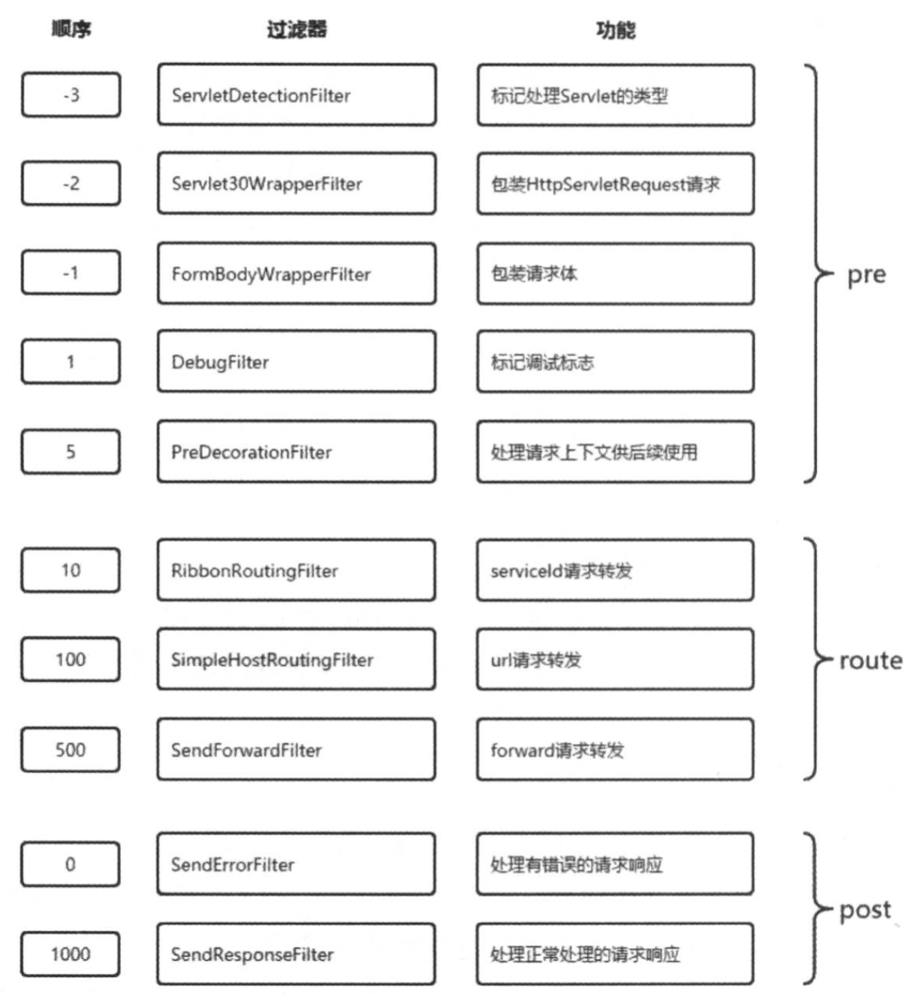

### 一、pre过滤器

---

#### 1.1 ServletDetectionFilter(-3)

执行顺序为-3，是最先被执行的过滤器。

该过滤器总是会被执行，主要用来**检测当前请求是通过Spring的DispatcherServlet处理运行的，还是通过ZuulServlet来处理运行的**。

```java
public Object run() {
  RequestContext ctx = RequestContext.getCurrentContext();
  HttpServletRequest request = ctx.getRequest();
  if (!(request instanceof HttpServletRequestWrapper) && this.isDispatcherServletRequest(request)) {
    ctx.set("isDispatcherServletRequest", true);
  } else {
    ctx.set("isDispatcherServletRequest", false);
  }

  return null;
}

private boolean isDispatcherServletRequest(HttpServletRequest request) {
  return request.getAttribute(DispatcherServlet.WEB_APPLICATION_CONTEXT_ATTRIBUTE) != null;
}
```

它的检测结果会以布尔类型保存在当前请求上下文的isDispatcherServletRequest参数中，这样在后续的过滤器中就可以通过RequestUtils. isDispatcherServletRequest()和RequestUtils. isZuulServletRequest ()方法来判断请求处理的源头，以实现后续不同的处理机制。

一般情况下，发送到API网关的外部请求都会被Spring的DispatcherServlet 处理，除了通过`/zuul/*`路径访问的请求会绕过DispatcherServlet，被ZuulServlet处理，主要用来应对处理大文件上传的情况。另外，对于ZuulServlet的访问路径`/zuul/*`，可以通过`zuul.servletPath`参数来进行修改。

#### 1.2 Servlet30WrapperFilter(-2)

执行顺序为-2，是第二个执行的过滤器。

目前的实现会对所有请求生效，主要为了**将原始的HttpServletRequest 包装成Servlet30RequestWrapper对象**。

```java
public Object run() {
  RequestContext ctx = RequestContext.getCurrentContext();
  HttpServletRequest request = ctx.getRequest();
  if (request instanceof HttpServletRequestWrapper) {
    request = (HttpServletRequest)ReflectionUtils.getField(this.requestField, request);
    ctx.setRequest(new Servlet30RequestWrapper(request));
  } else if (RequestUtils.isDispatcherServletRequest()) {
    ctx.setRequest(new Servlet30RequestWrapper(request));
  }

  return null;
}
```

#### 1.3 FormBodyWrapperFilter(-1)

执行顺序为-1，是第三个执行的过滤器。

该过滤器仅对两类请求生效，第一类是Content-Type 为`application/x-www-form-urlencoded`的请求，第二类是Content-Type为`multipart/ form-data`并且是由Spring 的DispatcherServlet 处理的请求。而该过滤器的主要目的是**将符合要求的请求体包装成FormBodyRequestWrapper对象**。

```java
public boolean shouldFilter() {
  RequestContext ctx = RequestContext.getCurrentContext();
  HttpServletRequest request = ctx.getRequest();
  String contentType = request.getContentType();
  if (contentType == null) {
    return false;
  } else {
    try {
      MediaType mediaType = MediaType.valueOf(contentType);
      return MediaType.APPLICATION_FORM_URLENCODED.includes(mediaType) || this.isDispatcherServletRequest(request) && MediaType.MULTIPART_FORM_DATA.includes(mediaType);
    } catch (InvalidMediaTypeException var5) {
      return false;
    }
  }
}

private boolean isDispatcherServletRequest(HttpServletRequest request) {
  return request.getAttribute(DispatcherServlet.WEB_APPLICATION_CONTEXT_ATTRIBUTE) != null;
}

public Object run() {
  RequestContext ctx = RequestContext.getCurrentContext();
  HttpServletRequest request = ctx.getRequest();
  FormBodyWrapperFilter.FormBodyRequestWrapper wrapper = null;
  if (request instanceof HttpServletRequestWrapper) {
    HttpServletRequest wrapped = (HttpServletRequest)ReflectionUtils.getField(this.requestField, request);
    wrapper = new FormBodyWrapperFilter.FormBodyRequestWrapper(wrapped);
    ReflectionUtils.setField(this.requestField, request, wrapper);
    if (request instanceof ServletRequestWrapper) {
      ReflectionUtils.setField(this.servletRequestField, request, wrapper);
    }
  } else {
    wrapper = new FormBodyWrapperFilter.FormBodyRequestWrapper(request);
    ctx.setRequest(wrapper);
  }

  if (wrapper != null) {
    ctx.getZuulRequestHeaders().put("content-type", wrapper.getContentType());
  }

  return null;
}
```


#### 1.4 DebugFilter(1)

执行顺序为1，是第四个执行的过滤器。

该过滤器会根据配置参数`zuul.debug.request`和请求中的debug参数来决定是否执行过滤器中的操作。

而它的具体操作内容则是将当前请求上下文中的debugRouting 和debugRequest参数设置为true。由于在同一个请求的不同生命周期中都可以访问到这两个值，所以我们在后续的各个过滤器中可以利用这两个值来定义一些debug信息，这样当线上环境出现问题的时候，可以通过请求参数的方式来激活这些debug信息以帮助分析问题。另外，对于请求参数中的debug参数，我们也可以通过zuul.debug.parameter来进行自定义。

```java
public boolean shouldFilter() {
  HttpServletRequest request = RequestContext.getCurrentContext().getRequest();
  return "true".equals(request.getParameter(DEBUG_PARAMETER.get())) ? true : ROUTING_DEBUG.get();
}

public Object run() {
  RequestContext ctx = RequestContext.getCurrentContext();
  ctx.setDebugRouting(true);
  ctx.setDebugRequest(true);
  return null;
}
```

#### 1.5 PreDecorationFilter(5)

执行顺序为5，是pre阶段最后被执行的过滤器。

该过滤器会判断当前请求上下文中是否存在forward.to和serviceId参数，如果都不存在，那么它就会执行具体过滤器的操作（如果有一个存在的话；说明当前请求已经被处理过了，因为这两个信息就是根据当前请求的路由信息加载进来的）。

而它的具体操作内容就是**为当前请求做一些预处理**，比如，进行路由规则的匹配、在请求上下文中设置该请求的基本信息以及将路由匹配结果等一些设置信息等，这些信息将是后续过滤器进行处理的重要依据，我们可以通过RequestContext.getCurrentContext()来访问这些信息。另外，我们还可以在该实现中找到一些对HTTP头请求进行处理的逻辑，其中包含了一些耳熟能详的头域，比如X-Forwa rded-Host、X-Forwarded-Port。另外，对于这些头域的记录是通过zuul.addProxyHeaders参数进行控制的，而这个参数的默认值为true，所以.Zuul在请求跳转时默认会为请求增加X-Forwarded-*头域，包括X-Forwarded-Host、X-Forwarded-Port、 X-Forwarded-For、 X-Forwarded-Prefix、X- Forwarded- Proto。也可以通过设置zuul.addProxyHeaders=false关闭对这些头域的添加动作。

```java
public boolean shouldFilter() {
  RequestContext ctx = RequestContext.getCurrentContext();
  return !ctx.containsKey("forward.to") && !ctx.containsKey("serviceId");
}

public Object run() {
  RequestContext ctx = RequestContext.getCurrentContext();
  String requestURI = this.urlPathHelper.getPathWithinApplication(ctx.getRequest());
  if (this.insecurePath(requestURI)) {
    throw new InsecureRequestPathException(requestURI);
  } else {
    Route route = this.routeLocator.getMatchingRoute(requestURI);
    String location;
    if (route != null) {
      location = route.getLocation();
      if (location != null) {
        ctx.put("requestURI", route.getPath());
        ctx.put("proxy", route.getId());
        if (!route.isCustomSensitiveHeaders()) {
          this.proxyRequestHelper.addIgnoredHeaders((String[])this.properties.getSensitiveHeaders().toArray(new String[0]));
        } else {
          this.proxyRequestHelper.addIgnoredHeaders((String[])route.getSensitiveHeaders().toArray(new String[0]));
        }

        if (route.getRetryable() != null) {
          ctx.put("retryable", route.getRetryable());
        }

        if (!location.startsWith("http:") && !location.startsWith("https:")) {
          if (location.startsWith("forward:")) {
            ctx.set("forward.to", StringUtils.cleanPath(location.substring("forward:".length()) + route.getPath()));
            ctx.setRouteHost((URL)null);
            return null;
          }

          ctx.set("serviceId", location);
          ctx.setRouteHost((URL)null);
          ctx.addOriginResponseHeader("X-Zuul-ServiceId", location);
        } else {
          ctx.setRouteHost(this.getUrl(location));
          ctx.addOriginResponseHeader("X-Zuul-Service", location);
        }

        if (this.properties.isAddProxyHeaders()) {
          this.addProxyHeaders(ctx, route);
          String xforwardedfor = ctx.getRequest().getHeader("X-Forwarded-For");
          String remoteAddr = ctx.getRequest().getRemoteAddr();
          if (xforwardedfor == null) {
            xforwardedfor = remoteAddr;
          } else if (!xforwardedfor.contains(remoteAddr)) {
            xforwardedfor = xforwardedfor + ", " + remoteAddr;
          }

          ctx.addZuulRequestHeader("X-Forwarded-For", xforwardedfor);
        }

        if (this.properties.isAddHostHeader()) {
          ctx.addZuulRequestHeader("Host", this.toHostHeader(ctx.getRequest()));
        }
      }
    } else {
      log.warn("No route found for uri: " + requestURI);
      location = this.getForwardUri(requestURI);
      ctx.set("forward.to", location);
    }

    return null;
  }
}
```


### 二、route过滤器

---

#### 2.1 RibbonRoutingFilter(10)

执行顺序为10，是route阶段第一个执行的过滤器。

该过滤器只对请求上下文中存在serviceId参数的请求进行处理，即只对通过serviceId配置路由规则的请求生效。而该过滤器的执行逻辑就是面向服务路由的核心，它通过**使用Ribbon和Hystrix来向服务实例发起请求，并将服务实例的请求结果返回**。

```java
public Object run() {
  RequestContext context = RequestContext.getCurrentContext();
  this.helper.addIgnoredHeaders(new String[0]);

  try {
    RibbonCommandContext commandContext = this.buildCommandContext(context);
    ClientHttpResponse response = this.forward(commandContext);
    this.setResponse(response);
    return response;
  } catch (ZuulException var4) {
    throw new ZuulRuntimeException(var4);
  } catch (Exception var5) {
    throw new ZuulRuntimeException(var5);
  }
}
```

#### 2.2 SimpleHostRoutingFilter(100)

执行顺序为100，是route阶段第二个执行的过滤器。

该过滤器只对请求上下文中存在routeHost参数的请求进行处理，即只对通过url配置路由规则的请求生效。而该过滤器的执行逻辑就是直接向routeHost参数的物理地址发起请求，从源码中我们可以知道该**请求是直接通过httpclient包实现的，而没有使用Hystrix命令进行包装，所以这类请求并没有线程隔离和断路器的保护**。

#### 2.3 SendForwardFilter(500)

执行顺序为500,是route阶段第三个执行的过滤器。

该过滤器只对请求上下文中存在forward.to参数的请求进行处理，即用来**处理路由规则中的forward本地跳转配置**。


### 三、post过滤器

---

#### 3.1 SendErrorFilter

执行顺序为0，是post阶段第一个执行的过滤器。

该过滤器仅在请求上下文中包含 `error.status_code` 参数(由之前执行的过滤器设置的错误编码)并且还没有被该过滤器处理过的时候执行。而该过滤器的具体逻辑就是利用请求上下文中的错误信息来组成一个forward到API网关/error错误端点的请求来产生错误响应。

#### 3.2 SendResponseFilter(1000)

执行顺序为1000，是post阶段最后执行的过滤器。

该过滤器会检查请求上下文中是否包含请求响应相关的头信息、响应数据流或是响应体，只有在包含它们其中一个的时候执行处理逻辑。而该过滤器的处理逻辑就是利用请求上下文的响应信息来组织需要发送回客户端的响应内容。

下图对上述过滤器根据顺序、名称、功能、类型做了综合整理，可以帮助我们在自定义过滤器或是扩展过滤器的时候用来参考并全面地考虑整个请求生命周期的处理过程。



