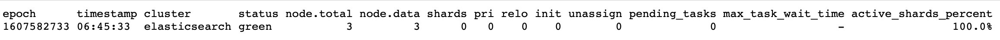

### 一、安装Java

---

ES需要Java 7或者更高版本的支持。


### 二、安装ES

---

安装好Java环境后，下载最新版的ES，解压，安装完毕。


### 三、ES配置

---

ES有三个配置文件：

- **elasticsearch.yml** 用于配置 Elasticsearch
- **jvm.options** 用于配置 Elasticsearch JVM 的设置
- **log4j2.properties** 用户配置 Elasticsearch 日志

配置文件存放在 config 目录下，默认的存放位置取决于安装是从归档发行版（tar.gz 或 zip）还是软件包发行版（Debian 或 RPM 软件包）。

- 对于分布式系统来说，配置文件默认在 `$ES_HOME/config`，可以通过 ES_PATH_CONF 更改配置文件所在的目录位置：

```properties
ES_PATH_CONF=/path/to/my/config ./bin/elasticsearch
```

- 使用 export 方法导出 ES_PATH_CONF 环境变量。

- 如果是软件包安装的系统，默认的配置文件是在 `/etc/elasticsearch`。当然配置文件地址也可以通过修改 ES_PATH_CONF 环境变量而变化。

**环境变量替换**：配置文件中可以使用 `${...}` 符号引用环境变量，例如：

```yaml
node.name: ${HOSTNAME}
network.host: ${ES_NETWORK_HOST}
```

#### 3.1 JVM参数设置

修改JVM参数（包括系统属性和JAVA指标）的首选方法是通过修改`jvm.options`，默认的配置文件在`config/jvm.options`（tar或zip方法安装）或者`/etc/elasticsearch/jvm.options`（Linux方法安装）。

该文件包含了以遵循行分隔符为规则的JVM参数：

- 空行将会被忽略
- 以`#`开头的行被视为注释而被忽略
- 以`-`开头的行被视为JVM选项 `-Xmx2g`
- 以数字开头且后跟`:-`的行被视为JVM选项，仅当JVM的版本与数字匹配。 `8:-Xmx2g`
- 以数字开头的行，后跟 `-:-` 被视为 JVM 选项，仅当 JVM 的版本大于或等于数字时才适用。 `8-:-Xmx2g`
- 以数字开头，后跟 `-` 在跟数字和`:-` 行被视为 JVM 选项，仅当 JVM 的版本在这两个数字的范围内时才应用该选项。 `8-9:-Xmx2g`

#### 3.2 日志配置

Elasticsearch 使用 Log4j 2 作为日志驱动。可以通过 log4j2.properties 文件配置 Log4j 2 。 Elasticsearch 对外有三个属性：

- `${sys:es.logs.base_path}`  确定了文件的位置
- `${sys:es.logs.cluster_name}`  被解析为集群名称 （集群名称是日志文件的默认前缀）
-  `${sys:es.logs.node_name}`   被解析为节点名称（如果节点名称已定义）

例如：如果你的日志文件（path.logs）在 /var/log/elasticsearch 目录下，集群名被命名成 production：

- `${sys:es.logs.base_path}` 将被解析为 `/var/log/elasticsearch`
- `${sys:es.logs.base_path}${sys:file.separator}${sys:es.logs.cluster_name}.log`被解析成` /var/log/elasticsearch/production.log`。


### 四、启动

---


```shell
$ ./bin/elsaticsearch
```

现在，已经创建并运行了一个单节点 Elasticsearch 集群。

启动另外两个Elasticsearch实例，以便你可以看到经典的多节点集群的行为。需要为每个节点指定唯一的数据和日志路径。

```shell
./elasticsearch -E path.data=data2 -E path.logs=log2
./elasticsearch -E path.data=data3 -E path.logs=log3
```

为其他节点分配了唯一的ID。在本地运行所有三个节点，它们会自动与第一个节点一起加入集群。

1. 使用 `cat health API` 去验证三个节点的集群是否运行。

2. 打开Kibana通过开发控制台提交请求。

通过向 Elasticsearch REST API 提交 HTTP 请求来直接与集群交互。

```
GET /_cat/health?v
例如：
http://localhost:9200/_cat/health?v
```



返回的结果显示：Elasticsearch集群的`status`是`green`，`node.total`是`3`。

如果是只运行一个 Elasticsearch 实例，则集群状态将保持黄色。单节点群集具有完整的功能，但是无法将数据复制到另一个节点以提供弹性。副本分片必须可用，群集状态才会显示绿色。如果群集状态为红色，则表示某些数据不可用。
