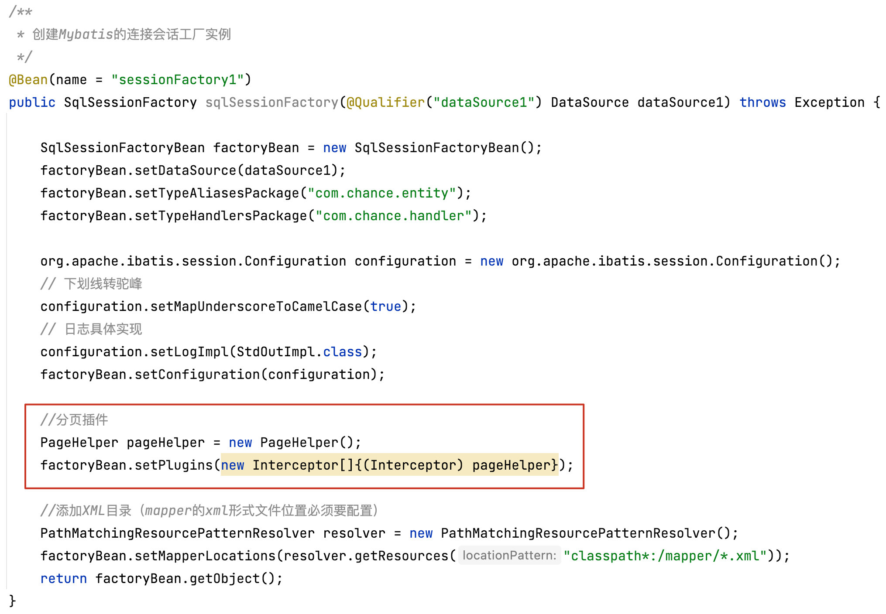

### 一、插件是如何实现的

---

在MyBatis中插件式通过拦截器来实现的，那么既然是通过拦截器来实现的，就会有一个问题，哪些对象才允许被拦截呢？

真正执行Sql的是四大对象：`Executor`，`StatementHandler`，`ParameterHandler`，`ResultSetHandler`。MyBatis的插件正是基于拦截这四大对象来实现的。下面就是官网提供的可拦截的对象和方法汇总：

| 拦截对象             | 拦截方法               | 方法作用                       |
| -------------------- | ---------------------- | ------------------------------ |
| **Executor**         | update                 | 对应insert，delete，update语句 |
|                      | query                  | 对应select语句                 |
|                      | flushStatements        | 刷新Statement                  |
|                      | commit                 | 提交事务                       |
|                      | rollback               | 回滚事务                       |
|                      | getTransaction         | 获取事务                       |
|                      | close                  | 关闭事务                       |
|                      | isClosed               | 判断事务是否关闭               |
|                      |                        |                                |
| **StatementHandler** | prepare                | 预编译SQL                      |
|                      | parameterize           | 设置参数                       |
|                      | batch                  | 批处理                         |
|                      | update                 | 对应insert,delete,update语句   |
|                      | query                  | 对应select语句                 |
|                      |                        |                                |
| **ParameterHandler** | getParameterObject     | 获取参数                       |
|                      | setParameters          | 设置参数                       |
|                      |                        |                                |
| **ResultSetHandler** | handleResultSets       | 处理结果集                     |
|                      | handleOutputParameters | 处理存储过程出参               |


### 二、插件的使用

---

1. 首先建立一个CustomQueryPagePlugin实现接口Interceptor，重写其中的三个方法(注意，这里必须要实现Interceptor接口，否则无法被拦截)。

   ```java
   @Intercepts({@Signature(type = Executor.class, method = "query", args = {MappedStatement.class, Object.class, RowBounds.class, ResultHandler.class})})
   public class CustomQueryPagePlugin implements Interceptor {
   
     /**
      * 覆盖原有方法
      *
      * @param invocation
      * @return
      * @throws Throwable
      */
     @Override
     public Object intercept(Invocation invocation) throws Throwable {
       //成功拦截了Executor的query方法，在这里可以做点什么
       //调用原方法
       return invocation.proceed();
     }
   
     @Override
     public Object plugin(Object target) {
       //把被拦截对象生成一个代理对象
       return Plugin.wrap(target, this);
     }
   
     @Override
     public void setProperties(Properties properties) {
       //可以自定义一些属性
       System.out.println("自定义属性:userName->" + properties.getProperty("userName"));
       Interceptor.super.setProperties(properties);
     }
   }
   ```

   >@Intercepts是声明当前类是一个拦截器，后面的@Signature是标识需要拦截的方法签名，通过以下三个参数来确定：
   >
   >- type：被拦截的类名。
   >- method：被拦截的方法名
   >- args：标注方法的参数类型

2. 在MybatisConfig中配置好插件

   

   这里如果配置了自定义属性，那么可以在setProperties获取到。


### 三、插件实现原理

---

#### 3.1 插件的加载

插件是如何被解析的。进入XMLConfigBuilder类：

```java
private void pluginElement(XNode parent) throws Exception {
  if (parent != null) {
    for (XNode child : parent.getChildren()) {
      // 获取拦截器
      String interceptor = child.getStringAttribute("interceptor");
      // 获取配置的properties属性
      Properties properties = child.getChildrenAsProperties();
      // 根据配置文件中配置的插件类的全限定类名进行反射初始化
      Interceptor interceptorInstance = (Interceptor) resolveClass(interceptor).getDeclaredConstructor().newInstance();
      // 将属性添加到Inteceptor对象
      interceptorInstance.setProperties(properties);
      // 添加到配置类的InterceptorChain属性，InterceptorChain类维护了一个List<Interceptor>
      configuration.addInterceptor(interceptorInstance);
    }
  }
}
```

在这里解析出来之后会将插件存入InterceptorChain对象的list属性。

```java
public class InterceptorChain {

  private final List<Interceptor> interceptors = new ArrayList<>();

  public Object pluginAll(Object target) {
    for (Interceptor interceptor : interceptors) {
      target = interceptor.plugin(target);
    }
    return target;
  }

  public void addInterceptor(Interceptor interceptor) {
    interceptors.add(interceptor);
  }

  public List<Interceptor> getInterceptors() {
    return Collections.unmodifiableList(interceptors);
  }
}
```

mybatis的插件就是通过责任链模式实现的。


