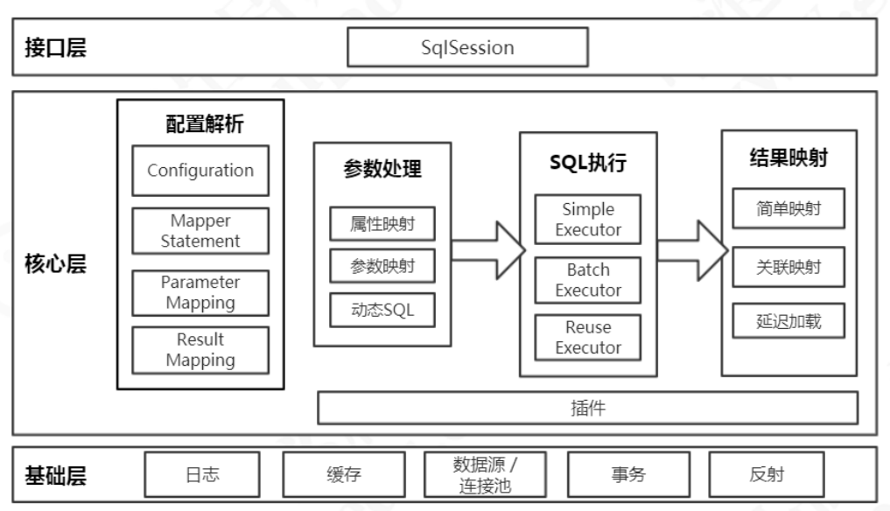
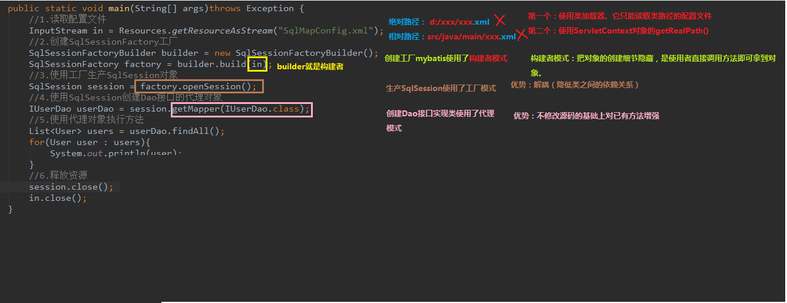
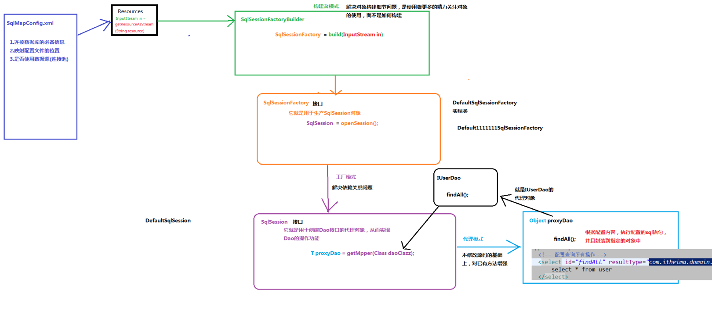
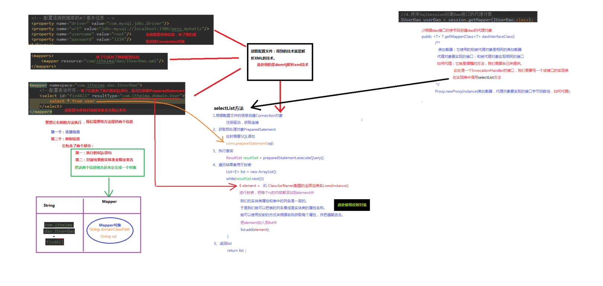
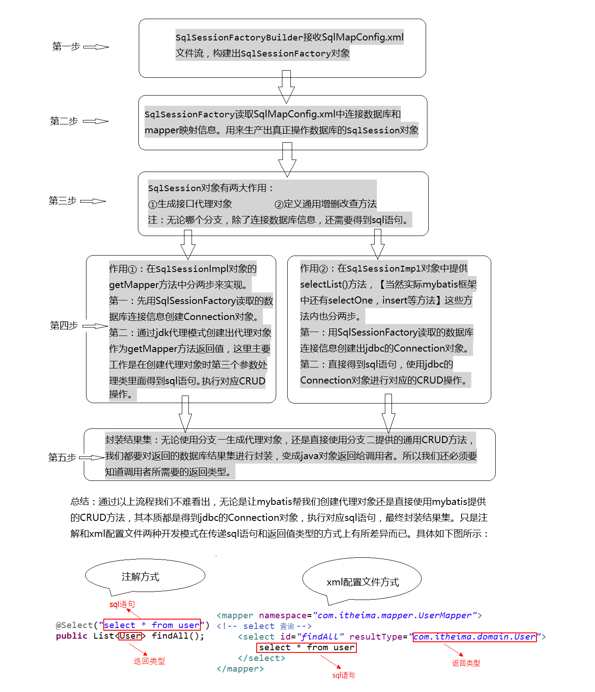
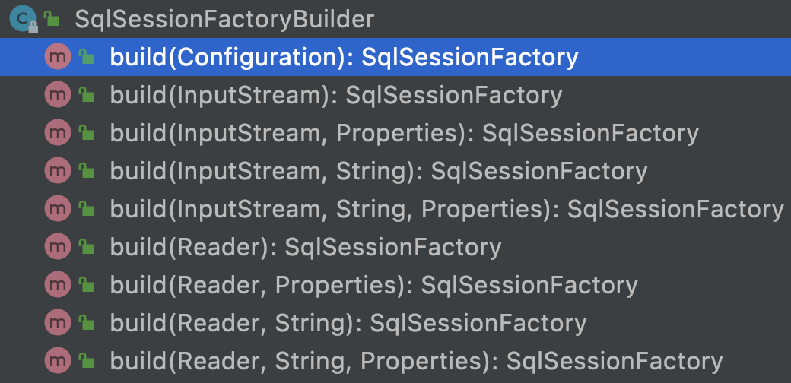

### 一、功能架构

---



#### 1.1 架构分层

API接口层：通过API操作数据库。接口层一收到调用请求就会调用数据处理层来完成具体的数据处理。

数据处理层：负责具体的**SQL查找**、**SQL解析**、**SQL执行**和**执行结果映射处理**等。它主要的目的是根据调用的请求完成一次数据库操作。

基础支撑层：**连接管理**、**事务管理**、**配置加载**和**缓存处理**，为上层的数据处理提供基础支撑。

#### 1.2 各组件作用

1. SqlSession 作为MyBatis工作的主要顶层API，表示和数据库交互的会话，完成必要数据库增删改查功能。
2. Executor MyBatis执行器，是MyBatis 调度的核心，负责SQL语句的生成和查询缓存的维护。
3. StatementHandler 封装了JDBC Statement操作，负责对JDBCstatement的操作，如设置参数、将Statement结果集转换成List集合。
4. ParameterHandler 负责对用户传递的参数转换成JDBC Statement 所需要的参数。
5. ResultSetHandler *负责将JDBC返回的ResultSet结果集对象转换成List类型的集合。
6. TypeHandler 负责java数据类型和jdbc数据类型之间的映射和转换。
7. MappedStatement MappedStatement维护了一条<select|update|delete|insert>节点的封。
8. SqlSource 负责根据用户传递的parameterObject，动态地生成SQL语句，将信息封装到BoundSql对象中，并返回。
9. BoundSql 表示动态生成的SQL语句以及相应的参数信息。
10. Configuration MyBatis所有的配置信息都维持在Configuration对象之中。

#### 1.3 设计模式分析





#### 1.4 查询语句分析



#### 1.5 分析代理dao的实现过程

Mybatis 借助设计模式中的 ⌈动态代理模式⌋ 帮助我们在底层创建了 Mapper 接口的实现类，从而调用该实现类的方法完成了我们所需要的操作。

在此过程中，主要涉及三个至关重要的类：**MapperRegistry**、**MapperProxy** 和 **MapperMethod**。

> **代理对象的生成：**
>
> Mybatis在底层借助 `MapperRegistry` 类生成Mapper接口的具体实现类，即userDao对象的代理对象。最重要的方法`org.apache.ibatis.binding.MapperRegistry#getMapper`：
>
> ```java
> public <T> T getMapper(Class<T> type, SqlSession sqlSession) {
>   final MapperProxyFactory<T> mapperProxyFactory = (MapperProxyFactory<T>) knownMappers.get(type);
>   if (mapperProxyFactory == null) {
>     throw new BindingException("Type " + type + " is not known to the MapperRegistry.");
>   }
>   try {
>     // 生成代理对象
>     return mapperProxyFactory.newInstance(sqlSession);
>   } catch (Exception e) {
>     throw new BindingException("Error getting mapper instance. Cause: " + e, e);
>   }
> }
> ```
>
> MapperRegistry 中使用一个Map容器 knownMappers 存储已经注册过的Mapper接口，该容器的key值为Mapper接口，value值可以生成Mapper接口具体实现类（代理对象）的MapperProxyFactory 工厂。
>
> 所以代理对象的生成过程可以描述为：首先调用 SqlSession 对象的 getMapper() 方法（**传入 Mapper 接口作为参数**）。然后，Mybatis 底层实际去执行 MapperRegistry 类的 getMapper() 方法，在该类的 knownMappers 容器中以我们传入的 Mapper 接口为 key 值找到可以生成该 Mapper 接口所对应的代理对象的 `MapperProxyFactory` 工厂。最后，MapperProxyFactory 工厂通过 newInstance() 方法生成 Mapper 接口的代理对象 `MapperProxy` 类实例，至此进入下一阶段。

>**Mapper接口方法的执行：**
>
>在获得Mapper接口的代理对象后，由IUserDao接口的代理对象MapperProxy类实例在其内部通过反射机制调用invoke()方法来完成findAll()方法所对应的MapperMethod类实例对象，由 `MapperMethod` 类实例作为执行者完成数据库操作：
>
>```java
>// 代码有删减,只截取核心代码
>public class MapperProxy<T> implements InvocationHandler, Serializable {
>
>  // 生成findAll()方法对应的MapperMethod类实例对象
>  @Override
>  public Object invoke(Object proxy, Method method, Object[] args) throws Throwable {
>    try {
>      if (Object.class.equals(method.getDeclaringClass())) {
>        return method.invoke(this, args);
>      } else {
>        return cachedInvoker(method).invoke(proxy, method, args, sqlSession);
>      }
>    } catch (Throwable t) {
>      throw ExceptionUtil.unwrapThrowable(t);
>    }
>  }
>
>  private static class PlainMethodInvoker implements MapperMethodInvoker {
>    private final MapperMethod mapperMethod;
>
>    public PlainMethodInvoker(MapperMethod mapperMethod) {
>      super();
>      this.mapperMethod = mapperMethod;
>    }
>
>    @Override
>    public Object invoke(Object proxy, Method method, Object[] args, SqlSession sqlSession) throws Throwable {
>      // 调用MapperMethod的execute()方法完成实际的数据库操作
>      return mapperMethod.execute(sqlSession, args);
>    }
>  }
>}
>```
>
>然后findAll()方法所对应的MapperMethod类实例对象执行自己的execute()方法，解析IUserDao接口的findAll()方法，并找到执行对应的SQL语句的方法（在switch...case...中查找）。最终。findAll()方法会对应到”SELECT“中的`executeForMany()` 方法，该方法与数据库进行交互，查询到我们所需的数据，并返回结果，结束整个过程。
>
>```java
>// 代码有删减,只截取核心代码
>public class MapperMethod {
>  public Object execute(SqlSession sqlSession, Object[] args) {
>    Object result;
>    Object param;
>    switch(this.command.getType()) {
>      case INSERT:
>        param = this.method.convertArgsToSqlCommandParam(args);
>        result = this.rowCountResult(sqlSession.insert(this.command.getName(), param));
>        break;
>      case UPDATE:
>        param = this.method.convertArgsToSqlCommandParam(args);
>        result = this.rowCountResult(sqlSession.update(this.command.getName(), param));
>        break;
>      case DELETE:
>        param = this.method.convertArgsToSqlCommandParam(args);
>        result = this.rowCountResult(sqlSession.delete(this.command.getName(), param));
>        break;
>      case SELECT:
>        if (this.method.returnsVoid() && this.method.hasResultHandler()) {
>          this.executeWithResultHandler(sqlSession, args);
>          result = null;
>        } else if (this.method.returnsMany()) {
>          result = this.executeForMany(sqlSession, args);
>        } else if (this.method.returnsMap()) {
>          result = this.executeForMap(sqlSession, args);
>        } else if (this.method.returnsCursor()) {
>          result = this.executeForCursor(sqlSession, args);
>        } else {
>          param = this.method.convertArgsToSqlCommandParam(args);
>          result = sqlSession.selectOne(this.command.getName(), param);
>          if (this.method.returnsOptional() && (result == null || !this.method.getReturnType().equals(result.getClass()))) {
>            result = Optional.ofNullable(result);
>          }
>        }
>        break;
>      case FLUSH:
>        result = sqlSession.flushStatements();
>        break;
>      default:
>        throw new BindingException("Unknown execution method for: " + this.command.getName());
>    }
>
>    if (result == null && this.method.getReturnType().isPrimitive() && !this.method.returnsVoid()) {
>      throw new BindingException("Mapper method '" + this.command.getName() + " attempted to return null from a method with a primitive return type (" + this.method.getReturnType() + ").");
>    } else {
>      return result;
>    }
>  }
>}
>```




### 二、SqlSessionFactoryBuilder（建造者模式）

---

每一个基于Mybatis的应用都是以一个 `SqlSessionFactoryBuilder` 的实例为中心的。SqlSessionFactory 的实例可以通过 SqlSessionFactoryBuilder 获得。而 SqlSessionFactoryBuilder 则可以从 XML 配置文件或一个预先定制的 Configuration 的实例构建出 SqlSessionFactory 的实例。

- 通过XML配置文件创建org.apache.ibatis.session.Configuration对象（也可直接在代码中创建）；
- 调用build()方法创建SqlSessionFactory对象。
- 通常创建一个全局SqlSessionFactory对象就可以了。

```java
public static void main(String[] args) throws Exception {
  // 1.读取配置文件
  InputStream inputStream = Resources.getResourceAsStream("mybatis-config.xml");
  SqlSessionFactoryBuilder sessionFactoryBuilder = new SqlSessionFactoryBuilder();
  // 2.根据配置创建sqlSessionFactoryBuilder
  SqlSessionFactory sqlSessionFactory = sessionFactoryBuilder.build(inputStream);
  // 3.打开一个sqlSession对象
  SqlSession sqlSession = sqlSessionFactory.openSession();
  // 4.使用sqlSession创建创建Mapper接口的代理对象
  UserMapper userMapper = sqlSession.getMapper(UserMapper.class);
  // 5.使用代理对象执行方法
  List<User> users = userMapper.queryAllUsers();
  for (User user : users) {
    System.out.println(user);
  }
  sqlSession.close();
  inputStream.close();
}
```



#### 2.1 resources读取对应的Reader对象

```java
String resource = "/mybatis-config.xml";
Reader reader = Resources.getResourceAsReader(resource);
SqlSessionFactory sqlSessionFactory = new SqlSessionFactoryBuilder().build(reader);
```

进入build(reader)方法的具体实现：

```java
/*
 * 创建 SqlSessionFactory
 */
public SqlSessionFactory build(Reader reader, String environment, Properties properties) {
  try {
    // 通过XMLConfigurationBuilder解析mybatis配置文件，源码分析
    XMLConfigBuilder parser = new XMLConfigBuilder(reader, environment, properties);
    return build(parser.parse());
  }
  ...省略部分代码
}
```

通过分析源码可知，在mybatis的配置文件中：

1. configuration节点为根节点。
2. 在configuration节点之下，我们可以配置10个子节点， 分别为：properties、typeAliases、plugins、objectFactory、objectWrapperFactory、settings、environments、databaseIdProvider、typeHandlers、mappers。
3. 解析配置文件完成了之后，都会装配到configuration。
4. Configuration作用：mybatis核心的配置文件内容 ，使用xml转换bean。


### 三、SqlSessionFactory

---

SqlSessionFactory用来创建SqlSession对象。

- **SqlSessionFactory对象的一个必要的属性是Configuration对象**（保存Mybatis全局配置的对象）
- 通常创建一个全局的SqlSessionFactory对象就行了。


### 四、SqlSession

---

SqlSession对象主要功能是**完成一次数据库的访问和结果的映射**。

- 类似于数据库的session概念。
- **线程不安全**，所以**SqlSession对象的作用域需限制在方法内**。
- SqlSession默认实现类是 `DefaultSqlSession`，有两个必须配置的属性：`Configuration` 和 `Excutor`。

>SqlSession：默认创建DefaultSqlSession并且开启一级缓存，创建执行器、赋值。
>
>SqlSession有一个重要的方法 `getMapper`，这个方式是用来获取Mapper对象的。什么是Mapper对象？应用程序除了要初始并启动Mybatis之外，还需要定义一些接口，接口里定义访问数据库的方法，存放接口的包路径下需要放置同名的XML配置文件。
>
>SqlSession的getMapper方法是联系应用程序和Mybatis纽带，应用程序访问getMapper时，Mybatis会根据传入的接口类型和对应的XML配置文件生成一个代理对象，这个代理对象就叫Mapper对象。应用程序获得Mapper对象后，就应该通过这个Mapper对象来访问Mybatis的SqlSession对象，这样就达到里插入到Mybatis流程的目的。


### 五、Excutor

---

*<u>Executor对象在创建Configuration对象的时候创建</u>*，并且缓存在Configuration对象里。

Executor对象的主要功能是**调用StatementHandler访问数据库**，并将查询结果存入缓存中（如果配置了缓存的话）。


### 六、StatementHandler

---

`StatementHandler` 是真正访问数据库的地方，并调用ResultSetHandler处理查询结果。如下org.apache.ibatis.executor.statement.PreparedStatementHandler#query：

```java
public <E> List<E> query(Statement statement, ResultHandler resultHandler) throws SQLException {
  String sql = boundSql.getSql();
  // 执行sql
  statement.execute(sql);
  // 调用ResultSetHandler处理查询结果
  return resultSetHandler.handleResultSets(statement);
}
```


### 七、ResultSetHandler

---

处理查询结果。

```java
public interface ResultSetHandler {

  // 负责结果集处理，完成映射返回结果对象
  <E> List<E> handleResultSets(Statement stmt) throws SQLException;

  // 负责游标对象处理
  <E> Cursor<E> handleCursorResultSets(Statement stmt) throws SQLException;

  // 负责存储过程的输出参数
  void handleOutputParameters(CallableStatement cs) throws SQLException;

}
```
