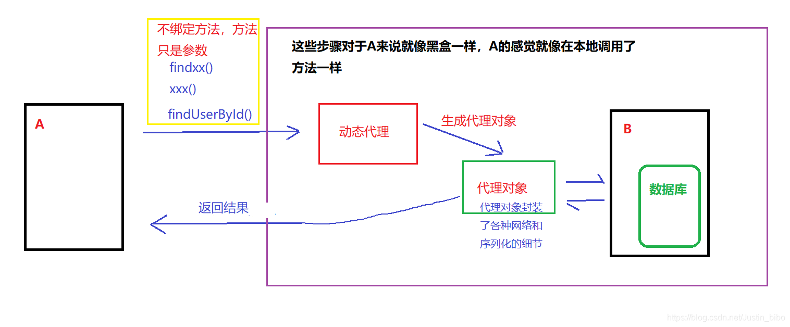

### 一、为什么用动态代理

---

有一个客户类 User 代表用户的信息，这些信息存储在服务器 B 上面，服务器B提供查询用户的方法。

假设现在客户端A同样需要一个查询用户的方法 findUserById()，需要这个方法去访问服务器 B，一般的步骤是：

- A 把参数、接口和方法等信息序列化
- A 把序列化的信息通过网络发送给 B
- B 收到信息之后，反序列化解析信息
- B 根据解析到的信息找到方法，执行得到结果
- B 把结构序列化通过网络发送给 A
- A 反序列化解析信息，得到结果

为了完成上述的功能，最直接的做法是在 findUserById() 方法里面写这些序列化、网络请求、反序列化的代码，但是这样做有明显的缺点：

1. 代码复杂，网络请求序列化等方法和业务代码混杂在一起；
2. 如果用户类 User 改变，那么代码的序列化等部分都要变；
3. 如果有很多地方需求这种远程调用，需要为每一个方法写这一大堆代码；
4. 如果远程服务器地址、端口甚至服务改变，需要修改每一个远程调用的方法。

看到上述的缺点，可能大家想到的是用一个类把这些网络请求序列化等方法封装起来，让 findUserById() 直接去调用封装的代码：

```java
findUserById(){
  xx();// 调用封装方法
}
xx(){// 封装方法
  把 findUserById 序列化
    网络传输
    // 服务器 B 执行 findUserById 返回
    反序列化
    返回
}
```

一个好的解决方法是用**动态代理**，这样就和方法无关，一系列的方法只需要写一个代理类，修改代码也只需要修改代理类。这其实就是 RPC 的原理：利用动态代理，创建代理类去实现这些细节，**把接口（方法）作为参数传递**，而不是绑定方法，上述的伪代码改成动态代理可以表示为：

```java
findUserById(){
  user = xx(接口);// 得到代理类
  user.findUserById(参数);// 执行方法，这个方法实际上是 invoke() 里面的方法
}
xx(接口){// 封装方法,接口是一个参数
  invoke(代理类，方法，参数){
    把 方法，参数 序列化
      网络传输
      // 服务器 B 执行 接口方法 返回
      反序列化
      返回
  }
  return 代理类
}
```

>这样，我们需要远程调用的方法（接口）只是一个参数，全部细节都可以在代理类中实现，并且一个代理类可以处理很多方法，**从而把远程访问代码和本地代码解耦**，便于项目扩展和维护。



### 二、RPC demo

---

这个 Demo 演示了客户端 Client 远程访问 findUserById() 方法的过程。客户端调用代理类，生成代理对象之后执行findUserById()方法，**代理类封装了网络序列化等细节**，服务器收到网络请求之后去执行返回。

#### 2.1 客户端代码

```java
/**
 * 用户类的接口
 */
public interface IUserService {
  User findUserById(int id);
}
```

```java
import java.io.ObjectInputStream;
import java.io.ObjectOutputStream;
import java.lang.reflect.InvocationHandler;
import java.lang.reflect.Method;
import java.lang.reflect.Proxy;
import java.net.Socket;

/**
 * 代理类，接受一个接口参数，通过反射创建一个代理类，并且封装了远程访问服务器的一系列细节，
 * 此代理类和具体的接口无关，接口只是一个参数
 */
public class Agent {
  public static Object getObject(Class target) {
    Object result = Proxy.newProxyInstance(target.getClassLoader(), new Class[]{target}, new InvocationHandler() {
      @Override
      public Object invoke(Object proxy, Method method, Object[] args) throws Throwable {
        Socket s = new Socket("127.0.0.1", 8088);

        ObjectOutputStream objectOutputStream = new ObjectOutputStream(s.getOutputStream());
        String className = target.getName();
        String methodName = method.getName();
        Class[] parametersTypes = method.getParameterTypes();// 获得target的一些参数

        objectOutputStream.writeUTF(className);
        objectOutputStream.writeUTF(methodName);
        objectOutputStream.writeObject(parametersTypes);
        objectOutputStream.writeObject(args);
        objectOutputStream.flush();// 把获得的参数信息写到socket里面,发送给服务器

        ObjectInputStream objectInputStream = new ObjectInputStream(s.getInputStream());
        Object result = objectInputStream.readObject();// 从socket里面读取服务端执行返回的信息
        objectOutputStream.close();
        s.close();
        return result;// 返回结果
      }
    });
    return result;
  }
}
```

```java
/**
 * 客户端用封装好的动态代理，获得代理类user，执行方法，代理类封装了访问网络的细节。
 */
public class Client {
  public static void main(String[] args) {
    IUserService user = (IUserService)Agent.getObject(IUserService.class);// 获得代理类
    System.out.println(user.findUserById(1));// 执行方法
  }
}
```

#### 2.2 服务器代码

```java
import java.io.Serializable;
import java.util.Objects;

/**
 * 用户类
 */
public class User implements Serializable, IUserService {
  String userName;
  int userId;
  // 无参构造器
  public User(){

  }

  public User(String userName, int userId) {
    this.userName = userName;
    this.userId = userId;
  }

  public String getUserName() {
    return userName;
  }

  public void setUserName(String userName) {
    this.userName = userName;
  }

  public int getUserId() {
    return userId;
  }

  public void setUserId(int userId) {
    this.userId = userId;
  }

  @Override
  public boolean equals(Object o) {
    if (this == o) return true;
    if (o == null || getClass() != o.getClass()) return false;
    User user = (User) o;
    return userId == user.userId &&
      Objects.equals(userName, user.userName);
  }

  @Override
  public int hashCode() {
    return Objects.hash(userName, userId);
  }

  @Override
  public User findUserById(int id) {
    return new User("user1",id);// 模拟访问数据库
  }

  @Override
  public String toString() {
    return "User{" +
      "userName='" + userName + '\'' +
      ", userId=" + userId +
      '}';
  }
}
```

```java
import java.io.IOException;
import java.io.ObjectInputStream;
import java.io.ObjectOutputStream;
import java.lang.reflect.InvocationTargetException;
import java.lang.reflect.Method;
import java.net.ServerSocket;
import java.net.Socket;

/**
 * Server模拟服务器，接受Socket的信息，找到方法，执行方法，并且返回
 */
public class Server {
  public static void main(String[] args) throws Exception {
    ServerSocket server = new ServerSocket(8088);// 用socket模拟客户端访问服务器的方法
    while(true){
      Socket client = server.accept();
      System.out.println(client);
      process(client);// 服务器执行服务，访问方法
      client.close();
      break;
    }
  }

  static void process(Socket socket) throws Exception {
    ObjectInputStream ois = new ObjectInputStream(socket.getInputStream());
    ObjectOutputStream oos = new ObjectOutputStream(socket.getOutputStream());

    String className = ois.readUTF();
    String methodName = ois.readUTF();
    Class[] parameterTypes = (Class[]) ois.readObject();
    Object[] parameters = (Object[]) ois.readObject();// 读取客户端发送的信息

    Class myclass = User.class;// 模拟注册表查找或者 Spring 的 bean 注入找到类
    Method method = myclass.getMethod(methodName, parameterTypes);// 获取方法

    Object o = method.invoke(myclass.newInstance(), parameters);// 执行方法
    oos.writeObject(o);
    oos.flush();// 把结果发送到客户端
  }
}
```

运行的时候，只需要先运行 Server，再运行 Client 就行。

现在，我们来回答文章开头的问题：

这里需有个问题，为什么服务器A查询B的数据，不是一次 http 请求就可以解决了吗？就像 web 浏览器和服务器之间的 http 请求一样，为什么还说是一次远程方法调用？

看了上述的代码演示，可以发现 http 请求只是 RPC 中网络请求的工具，**RPC 强调的是用动态代理去实现一个封装的、易修改扩展的远程访问方式**，http 请求只是 RPC 实现网络请求的部分。换句话说，RPC 不仅仅是一次网络请求，更类似于一种设计模式。


### 三、RPC需要考虑的问题

---

上述的 Demo 只是RPC原理的演示，要实现RPC，还需要考虑以下问题：

- 中间的网络请求所用的网络协议，不止可以使用 http 协议；
- 网络请求的延迟；
- 序列化和反序列化的工具，序列化的效率影响速度和网络传输数据量的大小；
- 怎么做到平台无关和语言无关，可以方便的跨语言跨平台去远程调用方法；
- 当服务发生变更时怎么处理，一般用 ZooKeeper。