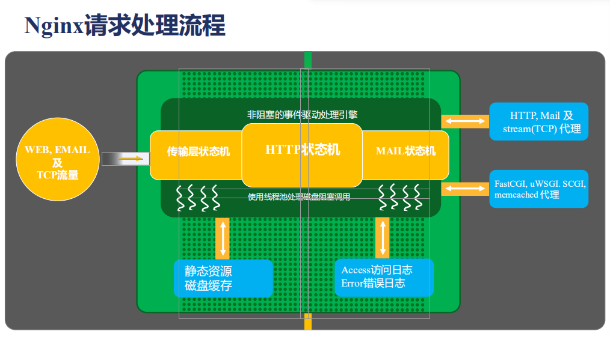

Nginx运行在企业内网的最外层，即边缘节点，它处理的流量是其他应用服务器处理流量的几倍。在Nginx它所处理的应用场景中所有的问题都会被放大，所以我们必须理解为什么Nginx采用`master-worker`这种架构模型。为什么**worker进程的数量要和CPU的核数相匹配**。当我们需要在多个worker进程间共享数据的时候，为什么在TLS（传输层安全协议）或者说对一些限流，限速这样的场景，他们的共享方式是有所不同的。那么这些都需要我们对Nginx的架构有一个清晰的了解。

### 一、nginx请求处理流程

---

大致有WEB、EMAIL、TCP三种流量，进入nginx以后，nginx中有三种状态机：

- 处理TCP，UDP的四层的传输层状态机；
- 处理应用层的HTTP状态机；
- 处理邮件的MAIL状态机。

为什么我们叫它状态机呢？是因为Nginx核心的大的绿色的框，它是使用**非阻塞的事件驱动处理引擎**，即我们所熟知的`epoll`，一旦我们使用这种异步处理引擎以后，通常都是需要使用状态机把这个请求来正确的识别和处理的，基于这样的一种事件状态处理机，我们在解析出请求，需要访问静态资源的时候，走左下方的路线找到了静态资源，如果我们去做反向代理的时候？对反向代理的内容可以做磁盘缓存;但是我们在处理静态资源的时候会遇到一个问题。就是当整个内存不足以缓存住所有的文件信息的时候,一些调用会退化成阻塞的磁盘调用;所以在这里我们需要有一个线程池来处理;对于每一个处理完成的请求；我们会记录Access.log日志和Error.log日志;这里日志也是记录在磁盘中的,当然,我们也可以通过syslog协议把它记录到远程的机器上;更多的时候,我们的Nginx是作为负载均衡和反向代理来使用;这个时候我们可以把请求通过协议机传输给后面的服务器,也可以通过例如应用层的一些协议比如:FastCGI,uWSGI,SCGI,memcached 代理到相应的应用服务器;

