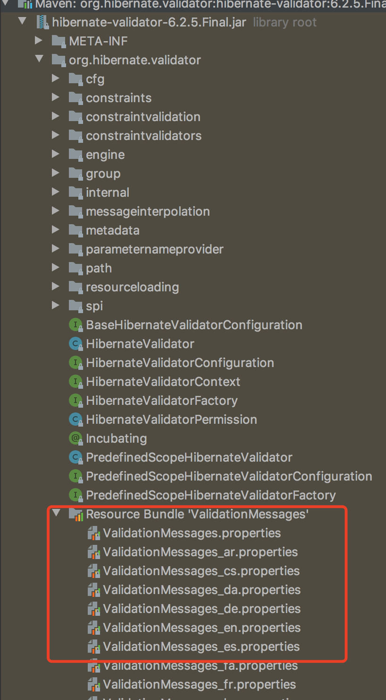
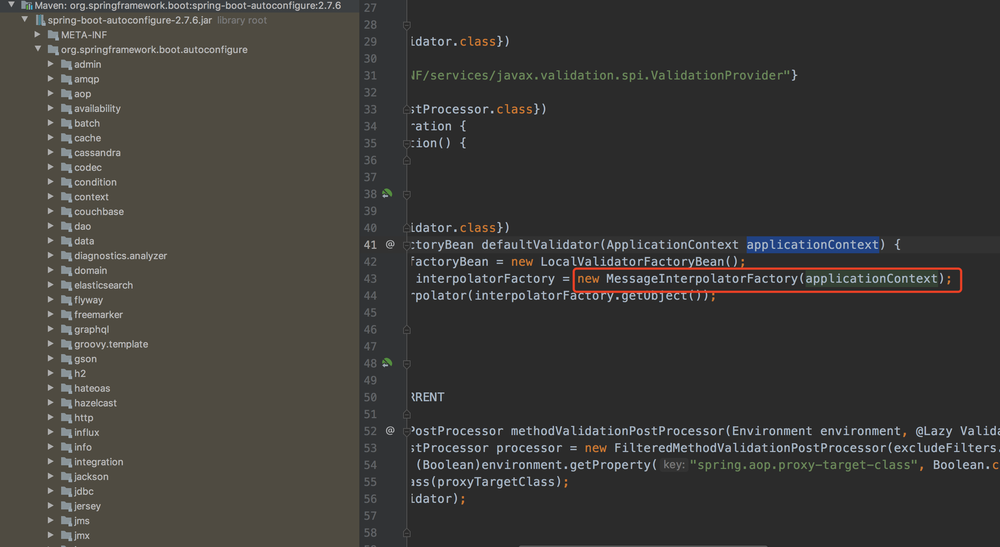

> 软件的国际化：软件开发时，要使它能同时应对世界不同地区和国家的访问，并针对不同地区和国家的访问，提供相应的、符合来访者阅读习惯的页面或数据。也叫 i18n，因为国际化英文是 internationalization ，在 i 和 n 之间有 18 个字母，所以叫 i18n。


### 一、配置国际化资源文件

---

在application.yml中指定资源文件配置。

```yaml
spring: 
  messages:
    basename: i18n/messages
    encoding: UTF-8
```


然后在`resources`目录下创i18n目录，然后在其下创建文件：

```
# 不带后缀为默认语言资源
messages.properties

messages_en_US.properties

messages_zh_CN.properties
```

> 注：三个配置文件的名称不能乱写，要按照这个格式。

可以按照一定规则分类编写，后期会很多信息。

```java
# 参数校验信息
validation.UserVo.NAME_NOT_EMPTY=姓名不能为空
validation.UserVo.AGE_NOT_EMPTY=年龄不能为空
 
# 异常信息
exception.userBizException.10000 = 用户保存异常
 
# 断言校验信息
assert.userService.CHECK_ITEM_KEY = 姓名[{0}]已经存在，请勿重复创建
```

**支持占位符参数**


### 二、MessageSource组件

---

Spring定义了MessageSource接口，用于访问国际化信息。

```java
getMessage(String code, Object[] args, String defaultMessage, Locale locale);

getMessage(String code, Object[] args, Locale locale);

getMessage(MessageSourceResolvable resolvable, Locale locale);
```

| 属性       | 说明                                                         |
| ---------- | ------------------------------------------------------------ |
| code       | 国际化资源中的属性名                                         |
| args       | 传递格式化串占位符所用的运行期参数，当在资源找不到对应属性名时，会返回defaultMessage参数所指定的默认信息 |
| locale     | 表示本地化对象                                               |
| resolvable | 封装了属性名、参数数组以及默认信息的大类                     |

其内部实现（MessageSource 是如何从 properties 文件中读取国际化的值的？），了解到它是将 properties文件中的msgKey、value都load到了一个lookup的HashMap中（第一次加载时会缓存起来，后面直接走的缓存，可以在 PropertyResourceBundle.java:157 中寻找答案），得到 msgKey -> value，外层还有一个 locale 做索引，即 locale -> (msgKey -> value)，最后是通过 locale + msgKey 得到相应的 value 。

最终，一个 properties 文件对应于一个 PropertyResourceBundle 对象。

>在 Spring 中需要配置的 MessageSource 现在不用配置了，Spring Boot 会通过 `org.springframework.boot.autoconfigure.context.MessageSourceAutoConfiguration` 自动帮我们配置一个 MessageSource 实例。


### 三、Spring区域信息解析器

---

spring支持获取请求头Accept-Language区域信息解析器。


不需重写。只需要Http请求头中带有**Accept-Language**就可以实现国际化语言支持。

#### 3.1 Accept-Language

Accept-Language：表示浏览器所支持的语言。

当我们在开发国际化的网站时，后端接口的信息需要根据用户所使用的语言返回对应的内容。作为后端需要前端在请求头的Accept-Language属性声明需要返回的语言。

> 格式：
>
> Accept-Language: lange-range[weight]
>
> 示例：
>
> Accept-Language: zh-cn,zh;q=0.5

意思： 支持的语言分别是简体中文和中文，优先支持简体中文。

zh-cn：表示简体中文，zh：表示中文（包括简体中文，繁体中文）

Accept-Language: zh-CN,zh;q=0.9,en;q=0.8

意思：优先支持中文，如果没有中文则支持英文。

q：表示他之前语言的权重, 0 <= q <= 1

Accept-Language: zh-cn;q=0.8,en-US;q=0.9

意思：优先支持英文，如果没有英文则支持中文。

**Accept-Language: **

意思： 支持所有语言


### 四、国际化工具类

---

```java
@Component
public class I18nUtil {

  public static MessageSource messageSource;

  public I18nUtil(MessageSource messageSource) {
    // spring的bean注入
    I18nUtil.messageSource = messageSource;
  }

  /**
     * 获取国际化翻译值
     */
  public static String get(String msgKey) {
    return messageSource.getMessage(msgKey, null, LocaleContextHolder.getLocale());
  }

  /**
     * 获取国际化翻译值（包括占位符）
     */
  public static String get(String msgKey, Object... args) {
    return messageSource.getMessage(msgKey, args, LocaleContextHolder.getLocale());
  }

}
```

使用方式：

```java
I18nUtil.get("assert.userService.CHECK_ITEM_KEY",user.getName())
```


### 五、Validation国际化

---

Spring Boot Validation支持JSR-380（aka. Bean Validation 2.0，part of Jakarta EE and JavaSE）注解，可通过验证注解的message属性设置验证错误提示信息，且每个验证注解都有默认的message配置，例如@NotEmpty的message属性值设置如下：

```java
/**
 * 名称
 */
@NotEmpty(message = "{validation.DictSaveVO.name.NAME_NOT_EMPTY}")
private String name;
```

>注意：默认的message = "{...}"的形式即指定国际化属性的名称，后续会根据语言环境替换为对应的值，而这些国际化属性的定义可参见hibernate-validator中的org.hibernate.validator.ValidationMessages.properties等一些列国际化属性定义：



Spring Boot Validation起初其并不直接支持读取Spring Boot自身的国际化配置（通过spring.messages进行配置），而是需要在resources/ValidationMessages.properties中进行配置的国际化属性才会生效，而后续在**Spring Boot 2.6+版本**才支持Validation与Spring Boot自身的国际化配置相结合。接下来结合Spring Boot 2.5和2.6版本分别介绍下Spring Boot Validation如何集成自定义国际化验证提示信息。

在Spring Boot 2.5.x版本中，Spring Boot Validation默认只支持读取resources/ValidationMessages.properties系列文件的中的国际化属性，且中文需要进行ASCII转码才可正确显示而就算Spring Boot应用亦声明了自身的国际化配置，但是Spring Boot Validation框架是读取不到的，而想要Spring Boot Validation框架和Spring Boot自身使用同样的国际化配置，则可通过如下方式进行配置：

```java
import org.springframework.context.MessageSource;
import org.springframework.context.annotation.Bean;
import org.springframework.context.annotation.Configuration;
import org.springframework.validation.Validator;
import org.springframework.validation.beanvalidation.LocalValidatorFactoryBean;
import org.springframework.web.servlet.config.annotation.WebMvcConfigurer;

/**
 * Spring Web验证器自定义国际化文件配置<br/>
 * 注：适用于Spring Boot 2.5.*
 *
 */
@Configuration
public class WebValidationConfig implements WebMvcConfigurer {

  /**
   * 国际化消息源
   */
  private MessageSource messageSource;

  public WebValidationConfig(MessageSource messageSource) {
    //注入Spring Boot国际化消息源（需通过spring.messages明确指定）
    this.messageSource = messageSource;
  }

  /**
   * 使用自定义LocalValidatorFactoryBean，
   * 设置Spring国际化消息源
   */
  @Bean
  @Override
  public Validator getValidator() {
    LocalValidatorFactoryBean bean = new LocalValidatorFactoryBean();
    //仅兼容Spring Boot spring.messages设置的国际化文件和原hibernate-validator的国际化文件
    //不支持resource/ValidationMessages.properties系列
    bean.setValidationMessageSource(this.messageSource);
    return bean;
  }
}
```

Spring Boot 2.6.x版本之后已支持验证注解message属性引用Spring Boot自身国际化配置，无需上面自定义配置。

SpringBoot2.7.6已设置ApplicationContext实现MessageSource



> **避坑**
>
> 使用原始validator校验，不要自定义注解来实现拦截，否则无法国际化。
