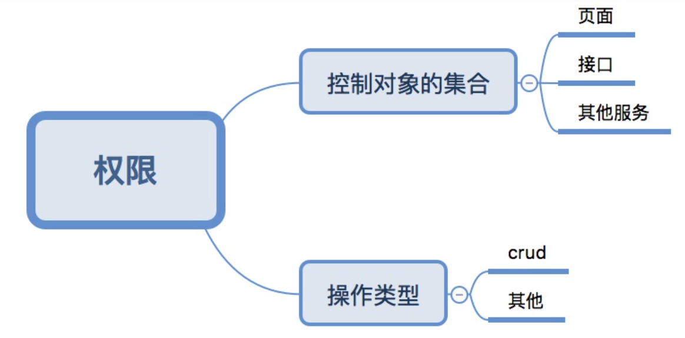
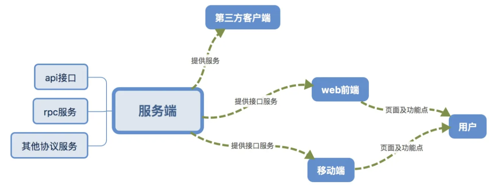
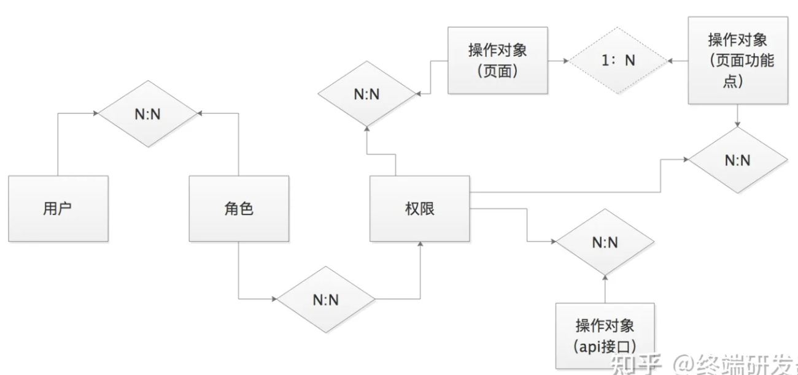
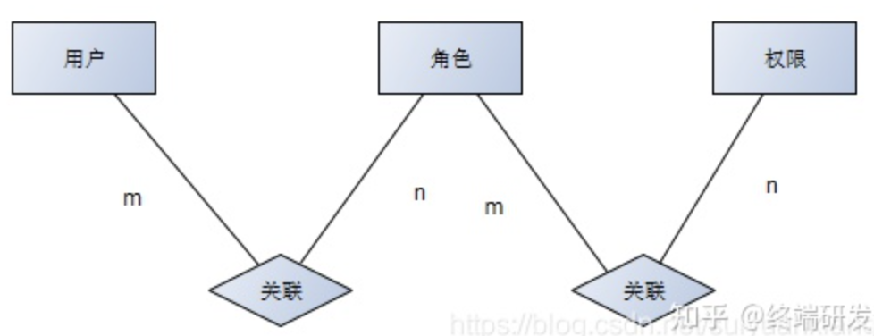
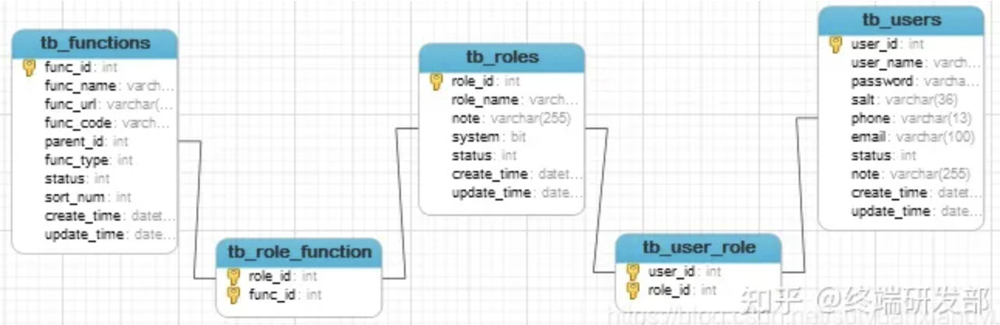
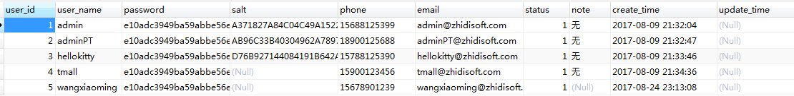
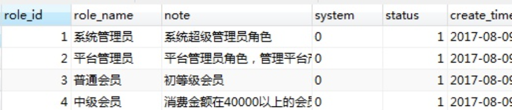
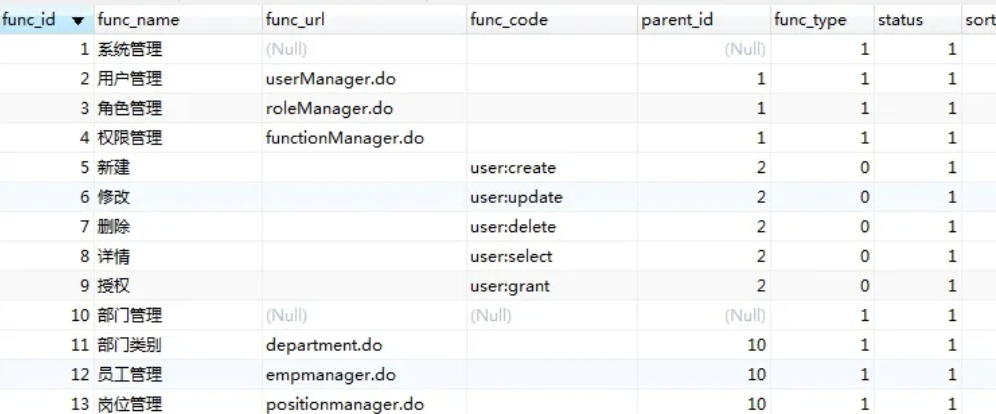

### 一、什么是权限

---

权限到底是名词属性还是动词属性，还是名词、动词属性均包含，这对于权限的含义很重要。如果是名词属性的话，那么它应该是有具体的指代物；如果是动词，则应该具有行为表示。

- 权限的名词属性：api接口、页面、功能点。
- 权限的动词属性：可操作、不可操作。

其实权限是名词、动词属性，它一定是表达了两层含义。即**控制的对象**、**操作**。

1. 例如：权限A表示页面A的可访问。
2. 例如：权限B表示页面B可访问且页面内的功能b不可使用。
3. 例如：权限C表示接口C不可调用。
4. 例如：权限D表示页面D可访问，且接口D可访问。

那么进一步的说明，权限可以表示**单个控制的对象的操作集合**，也可以表示**多个控制的对象的操作集合**。而这两者的取舍则是有设计人员决定的。

一句话总结权限的含义：what（若干元素）进行how（若干操作）。

### 二、权限的划分原则

---

划分原则可以按照“最小特权原则”和“数据抽象原则”。

#### 2.1 最小特权原则

1. 先举一个反例，把系统中所有的元素和操作都组合成一个权限。一个用户拥有这个权限就相当拥有了系统所有的功能，实际上这肯定是不行的，用户在一套系统中一定有他不允许操作的内容，哪怕是超级管理员也可能会有不能操作的元素，那么最大化权限则是行不通，因为不符合常理。
2. 据此，我们就把权限再进行一个拆分，按照业务模块进行拆分，但是这实际上也是不行的。就比如系统中的财务模块，假定模块中含有报销页面和申报页面，如果按照模块进行拆分，那么肯定有用户同时包含了两个互斥功能。
3. 根据1和2，我们需要按照最小化进行权限划分。但是这个也是值得商榷的，因为不同系统，最小的权限划分对于提供的功能来说，划分的角度也是不同的。

#### 2.2 数据抽象原则

1. “最小特权划分”从某个程度上来说决定了**控制的对象** ，而数据抽象原则是决定了**操作**。
2. 通常我们口头上说最多的是**CRUD增删查改**，这实际上就是数据抽象的一种，我们可以理解成元素操作许可权的意思。
3. 但是**CRUD**并不是数据抽象的全部，增删查改用于单实体，基本是没问题的，但是在构建关系上，其实是不够用的，例如任免某个经理管辖某个部门，从业务表面而言它修改了经理的管辖范围。但是从代码底层构建上来说，它属于在经理和部门间新增了一道关系，所以根据需求我们需要再额外的增加一类许可权“任免许可”，这一类型的扩展则需要根据系统实际的业务情况进行划分。

#### 2.3 前后端分离的权限划分问题

- 服务端的权限

1. 前后端分离下的服务端，本质而言只是提供接口的或者rpc服务等其他资源服务的服务提供方。
2. 服务端能提供的权限的鉴权机制的对象：接口服务（api或者其他形式的服务）**不包含前端的页面或页面中的功能点**。
3. 前端或移动端的页面元素的控制和鉴权**实质上不由服务端控制**。
4. 服务端可以单独的控制服务的权限。
5. 服务端的服务对象是前端、移动端、第三方客户端，提供的服务是接口服务。

> 在前后端已经分离的情况下，服务端对于前端而言只是接口的提供者，但无权干涉前端页面的展示，服务端对于前端而言，能提供的是仅鉴权服务的接口而已，但是页面的构成，页面的栏目菜单或页面内的功能点的构成均由前端单独完成的。

- 前端或移动端的权限

1. 前端的鉴权包含页面的可访问，和页面上的某项功能按钮是否可以操作。
2. 前端和移动端的服务对象是用户，提供的服务是可视化的页面。

> 前后端分离的权限划分中仍有新的问题。
>
> 1. 因为服务端和前端的鉴权对象不一致，服务端只能鉴权到api接口，那么是否将api接口和前端的页面乃至页面功能点进行数据库表与表层面的绑定关系。
> 2. 如果进行了表与表之间的绑定关系，那么整个权限系统的维护量，是否能在能承受范围之内。
> 3. 如果不进行表与表之间的绑定关系，前端页面在操作功能的时候，服务端如何鉴权页面调用的api接口是否在用户可操作的权限之内？

> 其实上面的问题则需要一个取舍，要么增加运维成本严格控制前端调用api接口的关系，偏重服务端的接口服务鉴权。要么是给api接口和前端页面及功能点再提供一个通性的逻辑判断处理，如：页面及调用的功能点属于某个业务模块的操作许可，而页面触发的接口也刚好是这个业务模块的操作许可，那么鉴权通过，否则鉴权失败。这种就是属于侧重前端对于用户的控制，弱化了接口级的控制。

### 三、角色与权限的关系

---

用户在系统中最终是通过权限来使用各种功能点，是否有必要在用户和权限中间再额外的附加一个关系。在我们现在的权限设计中，是增加了这样一层关系的，就是**角色**。

1. 减少操作层面的重复性。角色其实就是一组权限的集合，是权限集合的更高级抽象，为了便于运维和实际管理，通过角色的赋予，替代了权限赋予用户的繁琐性，在一套系统中，普遍情况都是权限的数量多于角色的数量。
2. 权限是**控制对象**和**操作**集合，它本身不存在任何状态，但是在赋予在用户身上则拥有了状态，比如权限A中允许用户访问页面A，权限B允许用户访问页面B，权限D允许用户访问B页面，但是不允许访问A页面。那么这层关系的维护在角色层面的话，会更加清晰，也就是说本身角色具有权限集合组装的策略问题，对于互斥的权限有不同的方案处理。（权限中没有某个操作和权限中禁止某个操作，是两个不同的角度，不能混为一谈）
3. 因为权限的可能存在互斥性，在实际业务中也会引发角色的互斥性，举一个现实中的案例来解释互斥性：张三是软件部的负责人但因为工作的特殊性也同样隶属于业务部的普通员工，我们设定负责人是可以要求人事部门给本部门进行招聘的，在实际的情况中，张三能给软件部招聘新员工，但是不能给业务部招聘员工。我们把这个案例运用在系统中，张三则是拥有负责人和普通员工两个角色，但是招聘的功能如果不加以控制，则会发生张三给业务部招人的结果。于是为了解决角色的这类问题，引入了职责划分的方案。
4. 职责划分分为：静态、动态。所谓**静态职责划分则是在角色创建之初就已经确定了角色的职责内容**。**动态职责划分是系统运行过程中对用户已有的角色进行控制**，例如：某些角色不能共存在用户身上（**互斥**）、角色或角色的分配数量限定（**控制用量**）、角色与角色同时只能激活一个进行使用（**时刻唯一**）。

> 引入角色的概念后，实际上这已经是一个比较完整的RBAC的权限设计的模型了。

### 四、数据表的设计思路

---

（1）问：权限表是否有必要存在？

答：这个要结合系统的实际使用场景进行考虑，如果系统中的权限的对象很单一，比如只有页面，或者只有api接口的话，其实权限表可有可无。增加权限表反而会导致初始化项目权限的工作量增加。但是若系统中的权限对象是多个，那么权限表的存在就有了更深层次的意义。在权限对象是多个的情况，**权限表的存在就是为了更好更抽象的组合“最小特权”及“责任划分”的操作对象**。同时，一旦系统中的操作对象增加了，只需要给权限表增加一个对象表和关系表就可以了。这样易于扩展。

（2）问：api接口和页面实际上是没有关系的，但是在鉴权活动是有关系的，页面若和api没有一点绑定联系的话，服务端接口调用的时候则要么拦截掉所有指定的接口（页面和api接口没绑定的话，则页面的接口调用都不能成功），服务端接口完全不拦截接口，也会不安全，但是api接口和页面功能在表结构层面的绑定会产生运维的大量工作成本，如何更好的设计。

答：在权限如何划分中已经提过了这一点，在表结构中，我们可以增加一张业务模块表和操作表（也可以在数据字典表中增加这两类数据），我们可以在页面和功能点钟 绑定业务模块和操作表关系，在api接口的代码层面去绑定业务模块和操作，在逻辑上绑定关系，解耦表结构之间的关系，那么可以在一定程度上解决这一点，这样做只会出现一种问题，那就是用户访问页面的时候可调用的api接口会比实际可调用的接口数要多，但是前端权限管理会隐藏功能点，这样就在可视化的程度上解决了这个问题。

### 五、安全框架

---

由于我们是基于RBAC的权限设计，现行java框架下最常见的就是shiro和Spring Security 。这两个就是仁者见仁智者见智了，我两者都实用过。仅建议使用shiro的话，可以更好的理解RBAC的设计思路，Spring Security 也是个不错的框架，但是它涉及到的概念太多，并不利于初学者去了解最基本的权限设计。

### 六、补充：Java权限管理系统之数据库设计

---

用户（User）：是软件系统使用者的系统账号。每个使用者，都有自己在系统中独一无二的账号，系统通过这个账号来识别不同的使用者，同时，也是通过当前的用户来认证当前使用者的权限。

角色（Role）：可以理解为一定数量的权限的集合，权限的载体，例如：系统管理员，普通用户。

权限（Permission）：指对软件系统中某一个功能或者资源操作的权利。

#### 6.1 说明

一个用户可以拥有多个权限，同时一个权限也可以赋予多个用户，那么用户和权限就是多对多的关系，需要角色来维护和链接用户和权限之间的关系。通过用户关联角色，角色关联权限，从而达到用户和权限的一个间接关联关系。而用户和角色，角色和权限也是多对多的全系，从而也需要引入用户角色和角色权限两张中间表来实现。

（1） 每一个用户包含的属性有用户ID，用户名称，密码，用户状态等基本属性。

（2） 每一个角色包含的属性有角色ID，角色名称，状态等基本属性。

（3） 每一个权限包含的属性有权限ID，权限名称，URL，权限编码，父级ID，权限类型，状态等基本属性。

#### 6.2 概念模型设计

根据说明，设计的实体联系E-R图如下：

#### 6.3 关系模型设计

用户（用户ID,用户名称，密码，状态，创建时间，、、、）

角色（角色ID,角色名称，状态，创建时间，、、、）

权限（权限ID,权限名称，URL，权限编码，父级ID，权限类型，状态，、、、）

用户角色 ( 用户ID，角色ID )用户ID和角色ID均设置为外键约束

角色权限（角色ID，用户ID）用户ID和角色ID均设置为外键约束

#### 6.4 关联关系

#### 6.5 表中数据形式

用户表

角色表

权限表

