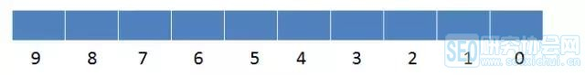
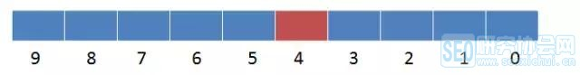
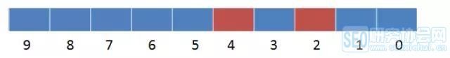
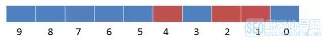
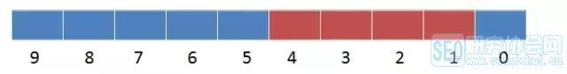

### 一、背景

---

为满足用户标签的统计需求，小灰利用Mysql设计了如下的表结构，每一个维度的标签都对应着Mysql表的一列：

| name | sex  | age  | occupation | phone |
| ---- | ---- | ---- | ---------- | ----- |
| 小灰 | 男   | 90后 | 程序员     | 苹果  |
| 小黄 | 男   | 90后 | 程序员     | 三星  |
| 小白 | 女   | 00后 | 学生       | 华为  |

要想统计所有90后的程序员该怎么做呢？

用一条求交集的SQL语句即可：

```sql
Select count（distinct Name） as 用户数 from table whare age = '90后' and Occupation = '程序员' ;
```

要想统计所有使用苹果手机或者00后的用户总合该怎么做？

用一条求并集的SQL语句即可：

```sql
Select count（distinct Name） as 用户数 from table whare Phone = '苹果' or age = '00后' ;
```


### 二、问题

---

- 标签越来越多，都快上千了，这得要很多列。
- 筛选标签过多的时候，拼接出来的SQL语句像面条一样长。
- 多个用户群体求交集的时候要做distinct，性能实在太慢了。


### 三、位图算法

---

位图是内存中连续的二进制位（bit），用于对大量整型数据做去重和查询。

#### 3.1 示例

给定一块长度是10bit的内存空间，想要依次插入整型数据4，2，1，3。

1. 给定长度是10的bitmap，每一个bit位分别对应着从0到9的10个整型数。此时bitmap的所有位都是0。

   

2. 把整型数4存入bitmap，对应存储的位置就是下标为4的位置，将此bit置为1。

   

3. 把整型数2存入bitmap，对应存储的位置就是下标为2的位置，将此bit置为1。

   

4. 把整型数1存入bitmap，对应存储的位置就是下标为1的位置，将此bit置为1。

   

5. 把整型数3存入bitmap，对应存储的位置就是下标为3的位置，将此bit置为1。

   

要问此时bitmap里存储了哪些元素？显然是4,3,2,1，一目了然。

Bitmap不仅方便查询，还可以去除掉重复的整型数。


