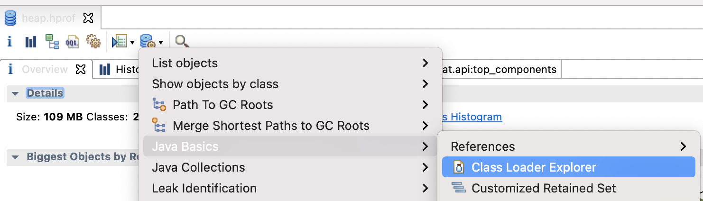
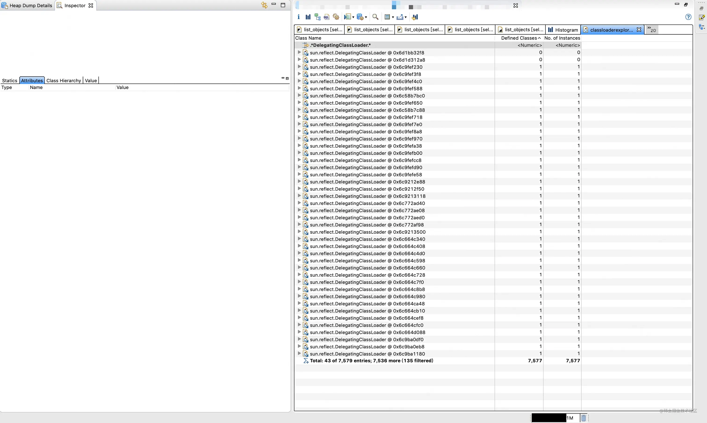
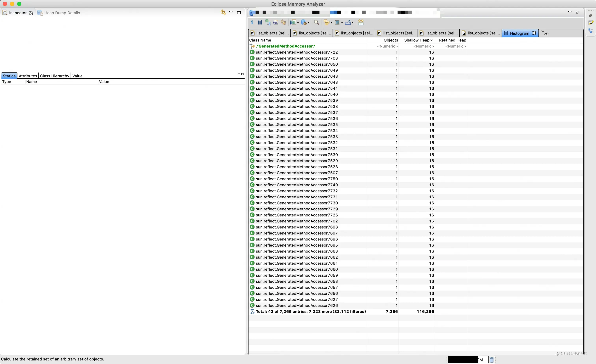
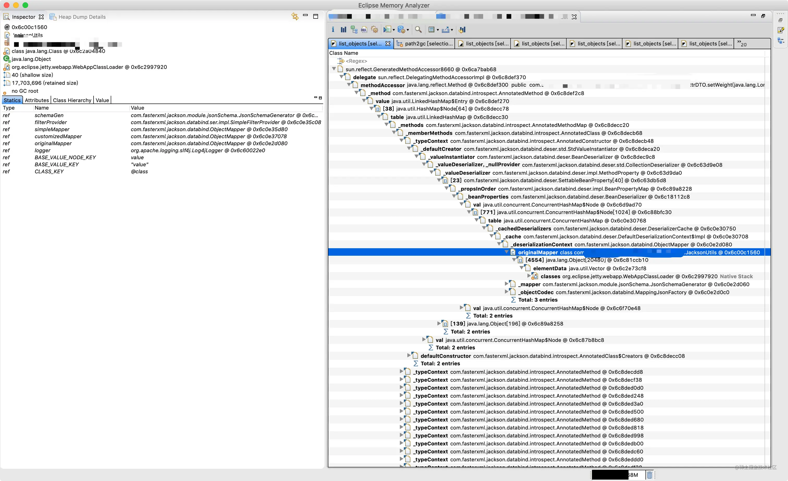

### 一、现象

---

线上服务大量fullgc，服务不可用。错误日志 java.lang.OutOfMemoryError

确定JVM发生了Metaspace OOM错误。

> MetaSpace是jdk8对原PermGen的优化，将类、方法信息等静态信息，从单独的空间拿到heap中进行统一管理。职责与之前类似，但可以通过堆的gc清理无GC root的garbage对象。Metaspace OOM一般是由于 进程**加载了过多或过大的静态信息**。

### 二、排查

---

从系统监控看，Metaspace OOM时，机器的Metaspace占用仅85%，感觉OOM发生得有些奇怪。（日常其他应用的Metaspace占用都超过了90%）

第一时间将服务器禁用（避免影响线上业务）后，**dump内存保留现场**。使用MAT分析。

应用服务给Metaspace预留了256MB的空间。dump文件大小498MB，MAT显示reachable对象326.7MB。通过 `classloaderexplorer` 可以排查进程当时拉起的classLoader的情况。

进程启动的总classLoader数量为7714个，其中大量是sun.reflect.DelegatingClassLoader（可见有7579个），且大部分持有了sun.reflect.GeneratedMethodAccessorXXXX（由图可见后缀已经是8???）。该类是反射用于加载生成的Method类时，使用的加载器。

通过"GeneratedMethodAccessor"搜索对应实例，找到7266个对应的类对象。

### 三、类加载器及其Metaspace占用机制

---

jvm启动时，会通过类加载器加载class文件，以生成类对象，且有经典的双亲委派机制来保证类只加载一次，以及不同类加载器的隔离性。 **jvm会在启动类加载器（ClassLoader）时，会自动为ClassLoader分配一块Metaspace块用于类加载**（参考文章：https://heapdump.cn/article/1924890 ），如果Metaspace块没有充分使用，会导致Metaspace的浪费。此次Metaspace 内存溢出了，使用率却只有85%，有两种可能：

1. 这次需要分配的内存达到了 37.5M( 256M*15% ) 以上
2. 给类加载器分配的 chunk 使用率很低

本次从MAT提示的信息来看，第二种可能性更大。

### 四、为何应用中有大量sun.reflect.GeneratedMethodAccesorXXXX类及其类加载器

---

DelegatingClassLoader是java反射中使用的类加载器。这里需要展开聊一下java反射。JVM对反射调用分两种情况：

1. 默认使用native方法(JNI)进行反射操作，生成NativeMethodAccessorImpl类。
2. 一定条件下会生成字节码进行反射操作，即生成`sun.reflect.GeneratedMethodAccessor<N>`类，它是一个反射调用方法的包装类，代理不同的方法，类后缀序号递增。

如果使用Java字节码生成的类，则需要拥有它自己的Java类和类加载器（sun/reflect/GeneratedMethodAccessorXXXX类和sun/reflect/DelegatingClassLoader)，这些类和类加载器使用本机内存。字节码存取器也可以被JIT编译，这样会增加本机内存的使用。**如果Java反射被频繁使用，会显著地增加本机内存的使用**。

Java虚拟机会首先使用JNI存取器，然后在访问了同一个类若干次后，会改为使用Java字节码存取器。这种**当Java虚拟机从JNI存取器改为字节码存取器的行为被称为膨胀（Inflation）**。Inflation机制提高了反射的性能，但是对于重度使用反射的项目可能存在隐患，它带来了两个问题：（1）初次加载的性能损失；（2）动态加载的字节码类导致PermGen持续增长。幸运的是，我们可以通过一个设置 `-Dsun.reflect.inflationThreshold=N` 控制这种行为，sun.reflect.inflationThreshold会告诉Java虚拟机使用JNI存取器多少次。**如果设为0，即关闭了inflation，总是使用JNI存取器**，不使用字节码存取器，进而可以回避Metaspace的过度使用。**关掉Inflation会带来一定程度上的性能损失**。

### 五、为什么此次有这么多反射生成的代理类

---

从MAT的GeneratedMethodAccessor中人工抽查几个（这样并不严谨，深入分析需要借助三方工具，可参考附录文章2），查看`List objects with incoming refenrece`，发现大部分是业务DTO字段的setter方法，被基础加载器（WebAppClassLoader）加载的类JacksonUtils引用，作为jackson反序列化的deserializer缓存起来。

JacksonUtils是公司内部的RPC框架使用的序列化util类，基于jackson-databind的json序列化能力实现。而Jackson在反序列化的实现中，会把反射生成的某些字段的反序列化器保存到_cache中。

其实并不确定一定是由于jackson生成的setter过多导致的metaspace，但是结合监控显示，进程的metaspace增长的十分缓慢，推测是由于部分特殊情况导致有更多的类加载。

### 六、为什么这些反射生成的临时Accessor和对应

---

未分析。从上述的incoming reference 推测，可能是Jackson的ObjectMapper通过缓存持有了Deserializer，如果是强引用则无法gc。

经讨论，先将进程的metaspace调整到512M观察。如果再次接近异常峰值，再尝试分析。兜底方案是设置-Dsun.reflect.inflationThreshold=0，禁用java反射的膨胀。通过牺牲反射性能，保障metaspace的稳定性，规避OOM风险。

`-XX:MaxMetaspaceSize=512M`

### 七、附排查参考文章

---

## 附排查参考文章（精品）：

1. [大量类加载器创建导致诡异FullGC](https://link.juejin.cn?target=https%3A%2F%2Fheapdump.cn%2Farticle%2F1924890)：介绍了Metaspace空间分配的细节。

2. [从一起GC血案谈到反射原理](https://link.juejin.cn?target=https%3A%2F%2Fheapdump.cn%2Farticle%2F54786%3Ffrom%3Dpc)：代码层面讲解反射运行机制，较详细深入，包括反射生成Method实现时，生成的两种不同反射类的实现细节。

3. [JVM Metaspace内存溢出排查与总结](https://link.juejin.cn?target=https%3A%2F%2Fjavakk.com%2F160.html)：java反射导致metaspace溢出，与本次故障类似。

4. [大量DelegatingClassLoader类加载器，导致Perm区溢出](https://link.juejin.cn?target=https%3A%2F%2Fblog.csdn.net%2Fhellozhxy%2Farticle%2Fdetails%2F80559419)：介绍了反射字节码生成相关内容。

