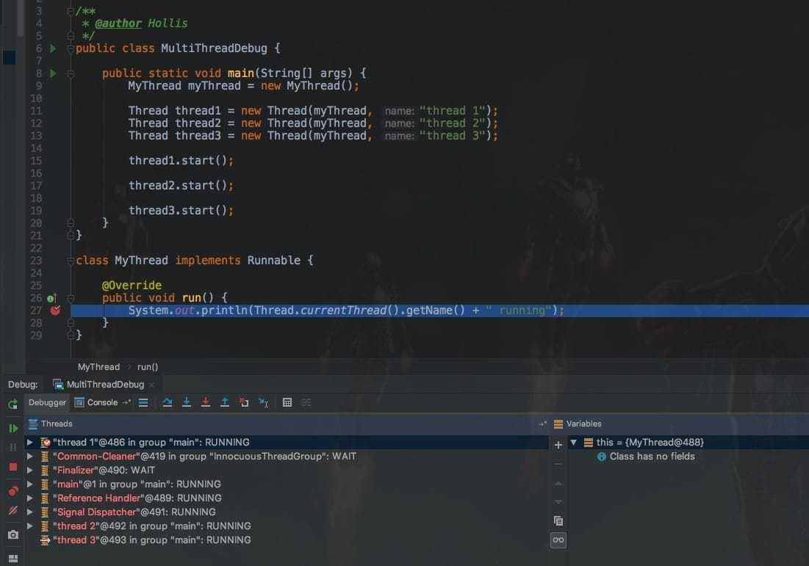
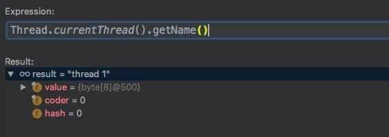
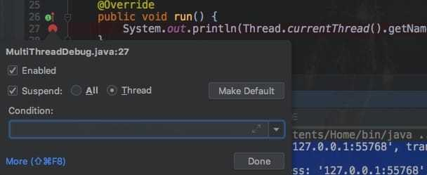

对于单CPU的计算机来说，在任意时刻只能执行一条机器指令，每个线程只有获得CPU的使用权才能执行指令。

所谓多线程的并发运行，其实是指从宏观上看，各个线程轮流获得CPU的使用权，分别执行各自的任务。

线程的运行状态中包含两种子状态，即**就绪（READY）**和**运行中(RUNNING)**。==一个线程想要从就绪状态变成运行中状态，这个过程需要系统调度，即给线程分配CPU的使用权，获得CPU使用权的线程才会从就绪状态变成运行状态==。

**给多个线程按照特定的机制分配CPU的使用权的过程就叫做线程调度。**

进程是分配资源的基本单元，线程是CPU调度的基本单元。这里所说的调度指的就是给其分配CPU时间片，让其执行任务。


#### 1. Linux线程调度

---

**在Linux中，线程是由进程来实现，线程就是轻量级进程（ lightweight process ），因此在Linux中，线程的调度是按照进程的调度方式来进行调度的，也就是说线程是调度单元。**

Linux这样实现的线程的好处的之一是：线程调度直接使用进程调度就可以了，没必要再搞一个进程内的线程调度器。==在Linux中，调度器是基于线程的调度策略（scheduling policy）和静态调度优先级（static scheduling priority）来决定那个线程来运行==。

在Linux中，主要有三种调度策略。分别是：

- **SCHED_OTHER 分时调度策略，（默认的）**
- **SCHED_FIFO 实时调度策略，先到先服务**
- **SCHED_RR 实时调度策略，时间片轮转**


#### 2. Windows线程调度

---

**Windows 采用基于优先级的、抢占调度算法来调度线程。**

用于处理调度的 Windows 内核部分称为调度程序，Windows 调度程序确保具有最高优先级的线程总是在运行的。由于调度程序选择运行的线程会一直运行，直到被更高优先级的线程所抢占，或终止，或时间片已到，或调用阻塞系统调用（如 I/O）。如果在低优先级线程运行时，更高优先级的实时线程变成就绪，那么低优先级线程就被抢占。这种抢占使得实时线程在需要使用 CPU 时优先得到使用。


#### 3. Java线程调度

---

**在操作系统中，一个Java程序其实就是一个进程。所以，我们说Java是单进程、多线程的！**

==Thread类与大部分的Java API有显著的差别，它的所有关键方法都是声明为Native的，也就是说，他需要根据不同的操作系统有不同的实现。==

在Java的多线程程序中，为保证所有线程的执行能按照一定的规则执行，JVM实现了一个**线程调度器**，它定义了线程调度模型，对于CPU运算的分配都进行了规定，按照这些特定的机制为多个线程分配CPU的使用权。

主要有两种调度模型：

- 协同式线程调度
- 抢占式调度模型

##### 3.1 协同式线程调度

协同式调度的多线程系统，线程的执行时间由线程本身来控制，线程把自己的工作执行完了之后，要主动通知系统切换到另外一个线程上。协同式多线程的最大好处是实现简单，而且由于线程要把自己的事情干完后才会进行线程切换，切换操作对线程自己是可知的，所以没有什么线程同步的问题。

##### 3.2 抢占式调度模型

抢占式调度的多线程系统，那么每个线程将由系统来分配执行时间，线程的切换不由线程本身来决定。在这种实现线程调度的方式下，线程的执行时间是系统可控的，也不会有一个线程导致整个进程阻塞的问题。

系统会让可运行池中优先级高的线程占用CPU，如果可运行池中的线程优先级相同，那么就随机选择一个线程，使其占用CPU。处于运行状态的线程会一直运行，直至它不得不放弃CPU。

**Java虚拟机采用抢占式调度模型。**

虽然Java线程调度是系统自动完成的，但是我们还是可以“建议”系统给某些线程多分配一点执行时间，另外的一些线程则可以少分配一点——这项操作可以通过设置线程优先级来完成。==Java语言一共设置了10个级别的线程优先级（Thread.MIN_PRIORITY至Thread.MAX_PRIORITY），在两个线程同时处于Ready状态时，优先级越高的线程越容易被系统选择执行==。

不过，线程优先级并不是太靠谱，原因是Java的线程是通过映射到系统的原生线程上来实现的，所以线程调度最终还是取决于操作系统，虽然现在很多操作系统都提供线程优先级的概念，但是并不见得能与Java线程的优先级一一对应。


#### 4. 多线程如何Debug

---

首先写一个多线程的例子，使用继承Runnable接口的方式定义多个线程，并启动执行。

```java
public class MultiThreadDebug {

  public static void main(String[] args) {
    MyThread myThread = new MyThread();
    Thread thread1 = new Thread(myThread, "thread 1");
    Thread thread2 = new Thread(myThread, "thread 2");
    Thread thread3 = new Thread(myThread, "thread 3");
    thread1.start();
    thread2.start();
    thread3.start();
  }
}

class MyThread implements Runnable {

  @Override
  public void run() {
    System.out.println(Thread.currentThread().getName() + " running");
  }
}
```

尝试在代码中设置断点，并使用debug模式启动。



如题，程序启动后，会进入一个线程的断点中，看一下当前是哪个线程：



发现是thread 1进入了断点。接着，让代码继续执行，代码就直接结束运行，并且控制台打印如下：

```
thread1 running
thread3 running
thread2 running
```

如果多次执行这个代码，就会发现，每一次打印的结果都不一样，三个线程的输出顺序是随机的，并且每一次debug只会进入到一个线程的执行。每次执行结果随机是因为不一定哪个线程可以先获得CPU时间片。

那么，我们怎么才能让每一个线程的执行都能被debug呢？如何在多线程中进行debug排查问题呢？

其实，在IDEA中有一个设置，那就是当我们在断点处单击鼠标右键就会弹出一个设置对话框，当我们把其中的All 修改为 Thread之后，尝试重新执行debug代码。



重新执行后，就可以发现，每一个线程都会进入到断点当中了。


#### 5. 守护线程

---

在Java中有两类线程：**User Thread(用户线程)**、**Daemon Thread(守护线程)** 。

用户线程一般用户执行用户级任务，而守护线程也就是“后台线程”，一般用来执行后台任务，守护线程最典型的应用就是GC(垃圾回收器)。

这两种线程其实是没有什么区别的，唯一的区别就是Java虚拟机在所有“用户线程”都结束后就会退出。

通过使用`setDaemon()`方法通过传递true作为参数，使线程成为一个守护线程。我们必须在启动线程之前调用一个线程的`setDaemon()`方法。否则，就会抛出一个`java.lang.IllegalThreadStateException`。

==使用`isDaemon()`方法来检查线程是否是守护线程。==

```java
public class Main {
  public static void main(String[] args) {
    Thread t1 = new Thread();
    System.out.println(t1.isDaemon());
    t1.setDaemon(true);
    System.out.println(t1.isDaemon());
    t1.start();
    t1.setDaemon(false);
  }
}

```

以上代码输出结果：

```java
false
true
Exception in thread "main" java.lang.IllegalThreadStateException
    at java.lang.Thread.setDaemon(Thread.java:1359)
    at com.hollis.Main.main(Main.java:16)
```

当JVM中只剩下守护线程的时候，JVM就会退出。

```java
public class Main {
  public static void main(String[] args) {

    Thread childThread = new Thread(new Runnable() {
      @Override
      public void run() {
        while (true) {
          System.out.println("I'm child thread..");
          try {
            TimeUnit.MILLISECONDS.sleep(1000);
          } catch (InterruptedException e) {
            e.printStackTrace();
          }
        }
      }
    });
    childThread.start();
    System.out.println("I'm main thread...");
  }
}

```

再把子线程设置成守护线程，重新运行以上代码：

```java
public class Main {
  public static void main(String[] args) {

    Thread childThread = new Thread(new Runnable() {
      @Override
      public void run() {
        while (true) {
          System.out.println("I'm child thread..");
          try {
            TimeUnit.MILLISECONDS.sleep(1000);
          } catch (InterruptedException e) {
            e.printStackTrace();
          }
        }
      }
    });
    childThread.setDaemon(true);
    childThread.start();
    System.out.println("I'm main thread...");
  }
}

```

以上代码，我们通过`childThread.setDaemon(true);`把子线程设置成守护线程，然后运行，得到以下结果：

```java
I'm main thread...
I'm child thread..
```

子线程只打印了一次，也就是，在main线程执行结束后，由于子线程是一个守护线程，JVM就会直接退出了。

==在Daemon线程中产生的新线程也是Daemon的。==
