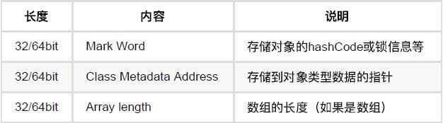
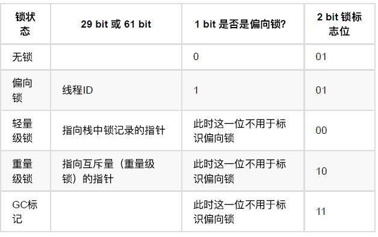

#### 1. 线程安全定义

---

> 《Java并发编程实践》中对线程安全的定义：
>
> 当多个线程访问一个对象时，如果不用考虑这些线程在运行时环境下的调度和交替执行，也不需要进行额外的同步，或者在调用方进行任何其他的协调操作，**调用这个对象的行为都可以获得正确的结果**，那这个对象就是线程安全的。

线程安全的主体是什么？是方法还是代码块？这里给出的主体是对象，这是非常恰当的，因为Java是纯面向对象的，Java中一切为对象。因此通过对象定义线程安全是恰当的。

但是，这里并不是说其他的方式定义不对。我们可以看一下其他的定义方式，进行一下对比：

>当多个线程访问某个方法时，不管你通过怎样的调用方式或者说这些线程如何交替的执行，我们在主程序中不需要去做任何的同步，这个类的结果行为都是我们设想的正确行为，那么我们就可以说这个类时线程安全的。
>如果一段代码可以保证多个线程访问的时候正确操作共享数据，那么它是线程安全的。


#### 2. 多线程编程中的三个核心概念

---

- 原子性
- 可见性
- 顺序性

##### 2.1 原子性

**跟数据库事务的原子性概念差不多，即一个操作（有可能包含有多个子操作）要么全部执行（生效），要么全部都不执行（都不生效）。**

关于原子性，一个非常经典的例子就是银行转账问题：比如A和B同时向C转账10万元。如果转账操作不具有原子性，A在向C转账时，读取了C的余额为20万，然后加上转账的10万，计算出此时应该有30万，但还未来及将30万写回C的账户，此时B的转账请求过来了，B发现C的余额为20万，然后将其加10万并写回。然后A的转账操作继续——将30万写回C的余额。这种情况下C的最终余额为30万，而非预期的40万。

##### 2.2 可见性

可见性是指，当多个线程并发访问共享变量时，一个线程对共享变量的修改，其它线程能够立即看到。可见性问题是好多人忽略或者理解错误的一点。

CPU从主内存中读数据的效率相对来说不高，现在主流的计算机中，都有几级缓存。每个线程读取共享变量时，都会将该变量加载进其对应CPU的高速缓存里，修改该变量后，CPU会立即更新该缓存，但并不一定会立即将其写回主内存（实际上写回主内存的时间不可预期）。此时其它线程（尤其是不在同一个CPU上执行的线程）访问该变量时，从主内存中读到的就是旧的数据，而非第一个线程更新后的数据。

这一点是操作系统或者说是硬件层面的机制，所以很多应用开发人员经常会忽略。

##### 2.3 有序性

顺序性指的是，程序执行的顺序按照代码的先后顺序执行。

以下面这段代码为例

```java
boolean started = false; // 语句1    
long counter = 0L; // 语句2    
counter = 1; // 语句3    
started = true; // 语句4 
```

从代码顺序上看，上面四条语句应该依次执行，但实际上JVM真正在执行这段代码时，并不保证它们一定完全按照此顺序执行。处理器为了提高程序整体的执行效率，可能会对代码进行优化，其中的一项优化方式就是调整代码顺序，按照更高效的顺序执行代码。

CPU虽然并不保证完全按照代码顺序执行，但它会保证程序最终的执行结果和代码顺序执行时的结果一致。


#### 3. 如何实现线程安全

---

- 互斥同步
- 非阻塞同步
- 无同步方案

##### 3.1 互斥同步

==在多线程编程中，同步就是一个线程进入监视器（可以认为是一个只允许一个线程进入的盒子），其他线程必须等待，直到那个线程退出监视器为止。==

在实现互斥同步的方式中，最常使用的就是 `Synchronized` 关键字。

**synchronized实现同步的基础就是：Java中的每一个对象都可以作为锁。**

具体表现为：

1. 普通同步方法，锁是当前实例对象
2. 静态同步方法，锁是当前类的Class对象
3. 同步方法块，锁是Synchronized括号里匹配的对象

>原理：
>
>synchronized经过编译之后，会在同步块的前后生成 `monitorenter` 和 `monitorexit` 这两个字节码指令。这两个字节码指令之后有一个reference类型（存在于java虚拟机栈的局部变量表中，可以根据reference数据，来操作堆上的具体对象）的参数来指明要锁定和解锁的对象。根据虚拟机规范，==在执行monitorenter 指令时，首先会尝试获取对象的锁，如果该对象没有被锁定，或者当前线程已经拥有了那个对象的锁，把锁的计数器加一。若获取对象失败，那当前线程就要阻塞等待，直到对象锁被另一个线程释放==。
>
>synchronized用的锁是存放在对象头里面的。
>
>在jdk1.6之后，锁一共有四种状态：
>
>- 无锁状态
>- 偏向锁状态（在对象头和栈帧中的锁记录里存储偏向锁的线程id）
>- 轻量级锁状态（将对象头的mark word复制到当前线程的栈帧的锁记录中，使用CAS操作将对象头中的markWord指向栈帧中的锁记录，如果成功，则线程就拥有了对象的锁。如果两个以上的线程争用一把锁的话，则膨胀为重量级锁）
>- 重量级锁状态

Java在虚拟机中除了==线程计数器，java虚拟机栈是线程私有的==，其余的==java堆，方法区，和运行时常量池都是线程共享的==内存区域。

java堆是存储对象和数组的，但是**对象**在内存中的存储布局可以分为三块区域：

1. 对象头
2. 实例数据（对象真正存储的有效信息，程序代码中所定义的各个类型的字段内容）
3. 对齐填充

为什么说synchronized的锁是存放在对象头里面呢？每个Java对象都有对象头。如果是⾮数组类型，则⽤2个字宽来存储对象头，如果是数组，则会⽤3个字宽来存储对象头。在32位处理器中，⼀个字宽是32位；在64位虚拟机中，⼀个字宽是64位。**对象头的内容**如下：



**Mark Word（运行时元数据）的内容**如下：



如何判断该对象有没有被锁？对象头里面锁状态的标志位会发生变化，当其他线程查看synchronized 锁定的对象时，会查看该对象的对象头的标志位有没有发生变化。

##### 3.2 非阻塞同步

因为使用synchronized的时候，只能有一个线程可以获取对象的锁，其他线程就会进入阻塞状态，==阻塞状态就会引起线程的挂起和唤醒==，会带来很大的性能问题，所以就出现了非阻塞同步的实现方法。

先进行操作，如果没有其他线程争用共享数据，那么操作就成功了，如果共享数据有争用，就采取补偿措施（不断地重试）。

互斥同步里实现了操作的原子性和可见性，那怎么才能不用同步来实现原子性和可见性呢？ 

**CAS是实现非阻塞同步的计算机指令**，它有三个操作数：内存位置，旧的预期值，新值，在执行CAS操作时，当且仅当内存地址的值符合旧的预期值的时候，才会用新值来更新内存地址的值，否则就不执行更新。

使用方法：使用JUC包下的整数原子类decompareAndSet()和getAndIncrement()方法

缺点：

- ABA 问题，版本号来解决
- 只能保证一个变量的原子操作，解决办法：使用AtomicReference类来保证对象之间的原子性。可以把多个变量放在一个对象里。

##### 3.3 无同步方案

> **线程本地存储**：将共享数据的可见范围限制在一个线程中。这样无需同步也能保证线程之间不出现数据争用问题。

经常使用的就是ThreadLocal类，用来解决数据库连接、Session管理等。

```java
public T get() { }  
public void set(T value) { }  
public void remove() { }  
protected T initialValue() { }  
```

- get()方法是用来获取ThreadLocal在当前线程中保存的变量副本
- set()用来设置当前线程中变量的副本
- remove()用来移除当前线程中变量的副本
- initialValue()是一个protected方法，一般是用来在使用时进行重写的，它是一个延迟加载方法


#### 4. 总结

---

引起线程不安全最根本的原因就是：线程对于共享数据的更改会引起程序结果错误。

线程安全的解决策略就是：==保护共享数据在多线程的情况下，保持正确的取值==。
