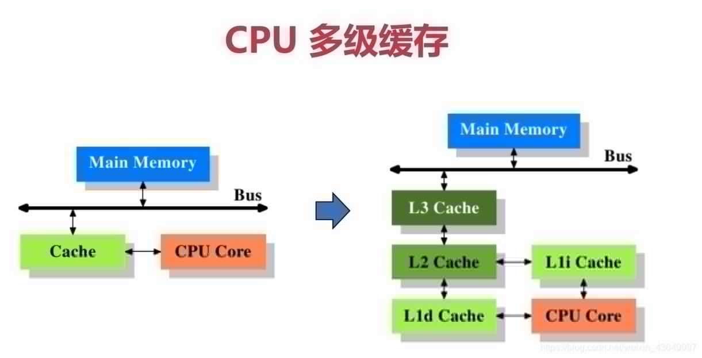

#### 1. cache

---

 cpu cache已经发展到了三级缓存结构，基本上现在买的个人电脑都是L3结构。

##### 1.1 cache的意义

为什么需要CPU cache？因为CPU的频率太快了，快到主存跟不上，这样在处理器时钟周期内，CPU常常需要等待主存，浪费资源。所以**cache的出现，是为了缓解CPU和内存之间速度的不匹配问题（结构：cpu -> cache -> memory）**。

CPU cache有什么意义？cache的容量远远小于主存，因此出现cache miss在所难免，既然cache不能包含CPU所需要的所有数据，那么cache的存在真的有意义吗？当然是有意义的——局部性原理。

A. **时间局部性**：如果某个数据被访问，那么在不久的将来它很可能被再次访问；

B. **空间局部性**：如果某个数据被访问，那么与它相邻的数据很快也可能被访问；

##### 1.2 cache和寄存器

存储器的三个性能指标——**速度**、**容量**和**每位价格**——导致了计算机组成中存储器的多级层次结构，其中主要是缓存和主存、主存和磁盘的结构。那么在主存之上，cache和寄存器之间的关系是？

举个例子，当你在思考一个问题的时候：

- 寄存器存放的是你当前正在思考的内容，
- cache存放的是与该问题相关的记忆，
- 主存则存放无论与该问题是否有关的所有记忆，

所以，寄存器存放的是当前CPU执行的数据，而cache则缓存与该数据相关的部分数据，因此==只要保证了cache的一致性，那么寄存器拿到的数据也必然具备一致性==。

#### 2. CPU cache结构

---

##### 2.1 单核CPU cache结构

在单核CPU结构中，为了缓解CPU指令流水中cycle冲突，L1分成了指令（L1P）和数据（L1D）两部分，而L2则是指令和数据共存。

##### 2.2 多核CPU cache结构

多核CPU的结构与单核相似，但是多了所有CPU共享的L3三级缓存。在多核CPU的结构中，L1和L2是CPU私有的，==L3则是所有CPU核心共享的==。

#### 3. MESI（缓存一致性）

---

Modified修改，Exclusive独占，Shared共享，Invalid无效

##### 3.1 cache的写方式

1. **write through（写通）**：每次CPU修改了cache中的内容，立即更新到内存，也就意味着每次CPU写共享数据，都会导致总线事务，因此这种方式常常会引起总线事务的竞争，高一致性，但是效率非常低；
2. **write back（写回）**：每次CPU修改了cache中的数据，不会立即更新到内存，而是等到cache line在某一个必须或合适的时机才会更新到内存中；

无论是写通还是写回，在多核环境下都需要处理缓存cache一致性问题。为了保证缓存一致性，处理器又提供了**写失效（write invalidate）**和**写更新（write update）**两个操作来保证cache一致性。

1. **写失效**：当一个CPU修改了数据，如果其他CPU有该数据，则通知其为无效；
2. **写更新**：当一个CPU修改了数据，如果其他CPU有该数据，则通知其跟新数据；

写更新会导致大量的更新操作，因此==在MESI协议中，采取的是写失效==（即MESI中的I：ivalid，如果采用的是写更新，那么就不是MESI协议了，而是MESU协议）。

> 现在常见的多核CPU写方式：写命中时，核内write back，核间write invalid + cache coherency protocol；写miss，先write allocated，再走前述的写命中流程。

##### 3.2 cache line

==cache line是cache与内存数据交换的最小单位==，根据操作系统一般是32byte或64byte。在MESI协议中，状态可以是M、E、S、I，地址则是cache line中映射的内存地址，数据则是从内存中读取的数据。

工作方式：当CPU从cache中读取数据的时候，会比较地址是否相同，如果相同则检查cache line的状态，再决定该数据是否有效，无效则从主存中获取数据，或者根据一致性协议发生一次cache-to--chache的数据推送。

工作效率：当CPU能够从cache中拿到有效数据的时候，消耗几个CPU cycle，如果发生cache miss，则会消耗几十上百个CPU cycle。

cache的工作原理以及在主板上的结构如下两图所示：

##### 3.3 状态介绍

MESI协议将cache line的状态分成

- **modify（修改）**：当前CPU cache拥有最新数据（最新的cache line），其他CPU拥有失效数据（cache line的状态是invalid），虽然当前CPU中的数据和主存是不一致的，但是以当前CPU的数据为准；
- **exclusive（独占）**：只有当前CPU中有数据，其他CPU中没有改数据，当前CPU的数据和主存中的数据是一致的；
- **shared（共享）**：当前CPU和其他CPU中都有共同数据，并且和主存中的数据一致；
- **invalid（失效）**：当前CPU中的数据失效，数据应该从主存中获取，其他CPU中可能有数据也可能无数据，当前CPU中的数据和主存被认为是不一致的；

##### 3.4 cache操作

MESI协议中，每个cache的控制器不仅知道自己的操作（local read和local write），每个核心的缓存控制器通过监听也知道其他CPU中cache的操作（remote read和remote write），然后再确定自己cache中共享数据的状态是否需要调整。

- `local read（LR）`：读本地cache中的数据；
- `local write（LW）`：将数据写到本地cache；
- `remote read（RR）`：其他核心发生read；
- `remote write（RW）`：其他核心发生write；

处理器对缓存的请求包括以下操作：

1. `PrRd`：处理器请求**读取**一个Cache块。
2. `PrWr`：处理器请求**写入**缓存块

总线端请求如下：

1. `BusRd`：侦听请求，指示存在对另一个处理器发出的缓存块的**读取**请求。
2. `BusRdX`：窥探请求，指示存在对缓存块的**写入**请求，该缓存块由另一个尚未拥有该块的处理器发出。

因为MESI协议为了减少主存事务（主存总线竞争），会存在cache to cache的推送数据而不去内存读数据（该协议相对于 MSI 协议减少了主存储器事务的数量。 这标志着性能的显着提高。），所以，还存在以下两种操作：

- `Flush`：侦听请求，指示整个缓存块被另一个处理器写回主内存。
- `FlushOpt`：窥探请求，指示整个高速缓存块已发布到总线上，以便将其提供给另一个处理器（高速缓存到高速缓存传输）。

##### local read/write的操作（当前处理器自己的cache读写）

##### 3.5 状态转换和cache操作

MESI协议中cache line数据状态有4种，引起数据状态转换的CPU cache操作也有4种，因此要理解MESI协议，就要将这16种状态转换的情况讨论清楚。

初始场景：在最初的时候，所有CPU中都没有数据，某一个CPU发生读操作，此时必然发生cache miss，数据从主存中读取到当前CPU的cache，状态为E（独占，只有当前CPU有数据，且和主存一致），此时如果有其他CPU也读取数据，则状态修改为S（共享，多个CPU之间拥有相同数据，并且和主存保持一致），如果其中某一个CPU发生数据修改，那么该CPU中数据状态修改为M（拥有最新数据，和主存不一致，但是以当前CPU中的为准），其他拥有该数据的核心通过缓存控制器监听到remote write行文，然后将自己拥有的数据的cache line状态修改为I（失效，和主存中的数据被认为不一致，数据不可用应该重新获取）。

> modify
>
> 场景：当前CPU中数据的状态是modify，表示当前CPU中拥有最新数据，虽然主存中的数据和当前CPU中的数据不一致，但是以当前CPU中的数据为准；
>
> LR：此时如果发生local read，即当前CPU读数据，直接从cache中获取数据，拥有最新数据，因此状态不变；
>
> LW：直接修改本地cache数据，修改后也是当前CPU拥有最新数据，因此状态不变；
>
> RR：因为本地内存中有最新数据，当本地cache控制器监听到总线上有RR发生的时，必然是其他CPU发生了读主存的操作，此时为了保证一致性，当前CPU应该将数据写回主存，而随后的RR将会使得其他CPU和当前CPU拥有共同的数据，因此状态修改为S；
>
> RW：同RR，当cache控制器监听到总线发生RW，当前CPU会将数据写回主存，因为随后的RW将会导致主存的数据修改，因此状态修改成I；

>exclusive
>
>场景：当前CPU中的数据状态是exclusive，表示当前CPU独占数据（其他CPU没有数据），并且和主存的数据一致；
>
>LR：从本地cache中直接获取数据，状态不变；
>
>LW：修改本地cache中的数据，状态修改成M（因为其他CPU中并没有该数据，因此不存在共享问题，不需要通知其他CPU修改cache line的状态为I）；
>
>RR：本地cache中有最新数据，当cache控制器监听到总线上发生RR的时候，必然是其他CPU发生了读取主存的操作，而RR操作不会导致数据修改，因此两个CPU中的数据和主存中的数据一致，此时cache line状态修改为S；
>
>RW：同RR，当cache控制器监听到总线发生RW，发生其他CPU将最新数据写回到主存，此时为了保证缓存一致性，当前CPU的数据状态修改为I；

>shared
>
>场景：当前CPU中的数据状态是shared，表示当前CPU和其他CPU共享数据，且数据在多个CPU之间一致、多个CPU之间的数据和主存一致；
>
>LR：直接从cache中读取数据，状态不变；
>
>LW：发生本地写，并不会将数据立即写回主存，而是在稍后的一个时间再写回主存，因此为了保证缓存一致性，当前CPU的cache line状态修改为M，并通知其他拥有该数据的CPU该数据失效，其他CPU将cache line状态修改为I；
>
>RR：状态不变，因为多个CPU中的数据和主存一致；
>
>RW：当监听到总线发生了RW，意味着其他CPU发生了写主存操作，此时本地cache中的数据既不是最新数据，和主存也不再一致，因此当前CPU的cache line状态修改为I；

>invalid
>
>场景：当前CPU中的数据状态是invalid，表示当前CPU中是脏数据，不可用，其他CPU可能有数据、也可能没有数据；
>
>LR：因为当前CPU的cache line数据不可用，因此会发生读内存，此时的情形如下。
>
>A. 如果其他CPU中无数据则状态修改为E；
>
>B. 如果其他CPU中有数据且状态为S或E则状态修改为S；
>
>C. 如果其他CPU中有数据且状态为M，那么其他CPU首先发生RW将M状态的数据写回主存并修改状态为S，随后当前CPU读取主存数据，也将状态修改为S；
>
>LW：因为当前CPU的cache line数据无效，因此发生LW会直接操作本地cache，此时的情形如下。
>
>A. 如果其他CPU中无数据，则将本地cache line的状态修改为M；
>
>B. 如果其他CPU中有数据且状态为S或E，则修改本地cache，通知其他CPU将数据修改为I，当前CPU中的cache line状态修改为M；
>
>C. 如果其他CPU中有数据且状态为M，则其他CPU首先将数据写回主存，并将状态修改为I，当前CPU中的cache line转台修改为M；
>
>RR：监听到总线发生RR操作，表示有其他CPU读取内存，和本地cache无关，状态不变；
>
>RW：监听到总线发生RW操作，表示有其他CPU写主存，和本地cache无关，状态不变；

#### 4. Store buffer和invalid queue

---

为了加速MESI协议中的一些操作，硬件上引入store buffer和invalid queue的原因。

##### 4.1 内存壁垒

MESI原型（naive MESI）直接的实现方式表现出两种特殊的低性能行为：首先，当写入无效的缓存行时，从另一个CPU提取该行时会存在较长的延迟；其次，将缓存行移至无效状态非常耗时。

因此，CPU实现了存储缓冲区并使队列无效。

写入无效的缓存行时使用存储缓冲区。由于无论如何都会进行写操作，因此CPU会发出一条读无效的消息（因此，有问题的高速缓存行以及存储该内存地址的所有其他CPU的高速缓存行都会无效），然后将写操作推入存储缓冲区当高速缓存行最终到达时执行。（CPU在尝试读取高速缓存行时会扫描自己的存储缓冲区，以防万一它有准备写入高速缓存的内容）。

因此，一个CPU可以写一些东西，但是还没有写在缓存中，因此其他CPU *看不到*-他们无法扫描其他CPU的存储缓冲区。

关于无效，CPU实施无效队列，从而立即确认传入的无效请求，但实际上不对其采取任何行动-它们只是输入无效队列，尽快进行处理（但不一定立即进行）。这样，CPU可以在其高速缓存中包含无效的行，但是尚不知道该行无效的行-无效队列包含尚未作用的无效。（失效队列在高速缓存的另一侧； CPU无法对其进行扫描，因为它可以对存储缓冲区进行扫描）。

结果，需要存储屏障。存储屏障将刷新存储缓冲区（确保所有写入均已进入CPU缓存）。读取屏障将刷新失效队列（确保其他CPU的所有写操作对刷新CPU可见）。

因此，MESI在实践中不太有效-如果您是单线程的，这不是问题，但如果不是，则绝对是问题。