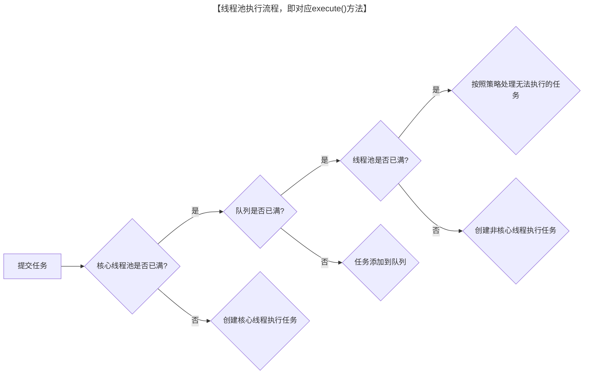
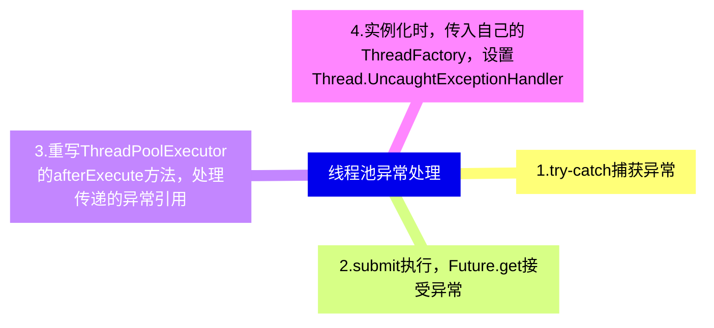
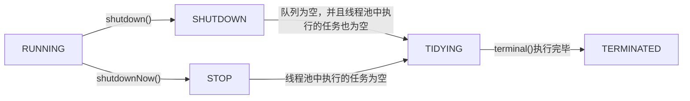

### 一、线程池概念

---

- **管理线程，避免增加创建线程和销毁线程的资源损耗**。线程其实也是一个对象，创建一个对象，需要经过类加载过程，销毁一个对象，需要走GC垃圾回收流程，都是需要资源开销的。

- **提高响应速度。** 如果任务到达了，相对于从线程池拿线程，重新去创建一条线程执行，速度肯定慢很多。
- **重复利用。** 线程用完，再放回池子，可以达到重复利用的效果，节省资源。


### 二、线程池的创建

---

线程池可以通过ThreadPoolExecutor来创建，构造函数：

```java
public ThreadPoolExecutor(int corePoolSize, int maximumPoolSize,long keepAliveTime,TimeUnit unit,   BlockingQueue<Runnable> workQueue,   ThreadFactory threadFactory,   RejectedExecutionHandler handler) 
```

几个核心参数的作用：

- **corePoolSize：** 线程池核心线程数最大值
- **maximumPoolSize：** 线程池最大线程数大小
- **keepAliveTime：** 线程池中非核心线程空闲的存活时间大小
- **unit：** 线程空闲存活时间单位
- **workQueue：** 存放任务的阻塞队列
- **threadFactory：** 用于设置创建线程的工厂，可以给创建的线程设置有意义的名字，可方便排查问题。
- **handler：** 线程池的饱和策略事件，主要有四种类型。


### 三、任务执行

---

#### 3.1 执行流程



- 提交一个任务，线程池里存活的核心线程数小于线程数`corePoolSize`时，线程池会创建一个核心线程去处理提交的任务。
- 如果线程池核心线程数已满，即线程数已经等于corePoolSize，一个新提交的任务，会被放进任务队列`workQueue`排队等待执行。
- 当线程池里面存活的线程数已经等于corePoolSize了,并且任务队列workQueue也满，判断线程数是否达到`maximumPoolSize`，即最大线程数是否已满，如果没到达，创建一个非核心线程执行提交的任务。
- 如果当前的线程数达到了maximumPoolSize，还有新的任务过来的话，直接采用拒绝策略处理。


### 四、四种拒绝策略

---

- AbortPolicy(抛出一个异常，默认的)
- DiscardPolicy(直接丢弃任务)
- DiscardOldestPolicy（丢弃队列里最老的任务，将当前这个任务继续提交给线程池）
- CallerRunsPolicy（交给线程池调用所在的线程进行处理)


### 五、异常处理

---




#### 5.1 线程池exec.submit(runnable)的执行流程

处理有异常submit方法的主要执行流程图：

```java
// java.util.concurrent.AbstractExecutorService
// 构造feature对象
public Future<?> submit(Runnable task) {
    if (task == null) throw new NullPointerException();
    RunnableFuture<Void> ftask = newTaskFor(task, null);
    execute(ftask);
    return ftask;
}

protected <T> RunnableFuture<T> newTaskFor(Runnable runnable, T value) {
    return new FutureTask<T>(runnable, value);
}

public FutureTask(Runnable runnable, V result) {
    this.callable = Executors.callable(runnable, result);
    this.state = NEW;       // ensure visibility of callable
}

public static <T> Callable<T> callable(Runnable task, T result) {
    if (task == null)
        throw new NullPointerException();
    return new RunnableAdapter<T>(task, result);
}

// java.util.concurrent.ThreadPoolExecutor
// 线程池执行
public void execute(Runnable command) {
    if (command == null)
        throw new NullPointerException();
    int c = ctl.get();
    if (workerCountOf(c) < corePoolSize) {
        if (addWorker(command, true))
            return;
        c = ctl.get();
    }
    if (isRunning(c) && workQueue.offer(command)) {
        int recheck = ctl.get();
        if (! isRunning(recheck) && remove(command))
            reject(command);
        else if (workerCountOf(recheck) == 0)
            addWorker(null, false);
    }
    else if (!addWorker(command, false))
        reject(command);
}

// java.util.concurrent.FutureTask
// 捕获异常
public void run() {
    if (state != NEW ||
        !UNSAFE.compareAndSwapObject(this, runnerOffset,
                                     null, Thread.currentThread()))
        return;
    try {
        Callable<V> c = callable;
        if (c != null && state == NEW) {
            V result;
            boolean ran;
            try {
                result = c.call();
                ran = true;
            } catch (Throwable ex) {
                result = null;
                ran = false;
                setException(ex);
            }
            if (ran)
                set(result);
        }
    } finally {
        // runner must be non-null until state is settled to
        // prevent concurrent calls to run()
        runner = null;
        // state must be re-read after nulling runner to prevent
        // leaked interrupts
        int s = state;
        if (s >= INTERRUPTING)
            handlePossibleCancellationInterrupt(s);
    }
}
```

#### 5.2 通过Future对象的get方法接收抛出的异常

submit执行的任务，可以通过Feature对象的get方法接收抛出的异常，再进行处理。

```java
ExecutorService threadPool = Executors.newFixedThreadPool(5);
for (int i = 0; i < 5; i++) {
    Future<?> future = threadPool.submit(() -> {
        System.out.println("current thread name" + Thread.currentThread().getName());
        Object object = null;
        System.out.println("result## " + object.toString());
    });
    try {
        future.get();
    } catch (Exception e) {
        System.out.println("发生异常");
    }
}
```

#### 5.3 为工作者线程设置UncaughtExceptionHandler，在uncaughtException方法中处理异常

```java
ExecutorService threadPool = Executors.newFixedThreadPool(1, r -> {
    Thread t = new Thread(r);
    t.setUncaughtExceptionHandler((t1, e) -> System.out.println(t1.getName() + "线程抛出的异常" + e));
    return t;
});

threadPool.execute(() -> {
    Object object = null;
    System.out.println("result## " + object.toString());
});
threadPool.shutdown();

// 结果：Thread-0线程抛出的异常java.lang.NullPointerException
```

#### 5.4 重写ThreadPoolExecutor的afterExecute方法，处理传递的异常引用

```java
public class CustomThreadPoolExecutor extends ThreadPoolExecutor {

    public CustomThreadPoolExecutor(int corePoolSize, int maximumPoolSize, long keepAliveTime, TimeUnit unit,
                                    LinkedBlockingQueue<Runnable> workQueue) {
        super(corePoolSize, maximumPoolSize, keepAliveTime, unit, workQueue);
    }

    @Override
    protected void afterExecute(Runnable r, Throwable t) {
        super.afterExecute(r, t);
        if (t == null && r instanceof Future<?>) {
            try {
                // 如果任务是Future类型，尝试获取结果可能会抛出异常
                Future<?> future = (Future<?>) r;
                if (future.isDone()) {
                    future.get(); // 这里可能会抛出异常
                }
            } catch (CancellationException ce) {
                t = ce;
            } catch (ExecutionException ee) {
                t = ee.getCause();
            } catch (InterruptedException ie) {
                Thread.currentThread().interrupt(); // 忽略中断，恢复中断状态
            }
        }
        if (t != null) {
            System.err.println("Task threw an exception: " + t);
            t.printStackTrace();
            // 可以在这里添加更多的错误处理逻辑，比如记录日志、发送通知等
        }
    }
}
```


### 六、线程池的工作队列

---

- ArrayBlockingQueue（有界队列）是一个用数组实现的有界阻塞队列，按FIFO排序量。
- LinkedBlockingQueue（可设置容量队列）基于链表结构的阻塞队列，按FIFO排序任务，容量可以选择进行设置，不设置的话，将是一个无边界的阻塞队列，最大长度为Integer.MAX_VALUE，吞吐量通常要高于ArrayBlockingQuene；newFixedThreadPool线程池使用了这个队列。
- DelayQueue（延迟队列）是一个任务定时周期的延迟执行的队列。根据指定的执行时间从小到大排序，否则根据插入到队列的先后排序。newScheduledThreadPool线程池使用了这个队列。
- PriorityBlockingQueue（优先级队列）是具有优先级的无界阻塞队列。
- SynchronousQueue（同步队列）一个不存储元素的阻塞队列，每个插入操作必须等到另一个线程调用移除操作，否则插入操作一直处于阻塞状态，吞吐量通常要高于LinkedBlockingQuene，newCachedThreadPool线程池使用了这个队列。


### 七、常用线程池

---

#### 7.1 newFixedThreadPool

- 特点：
  - 核心线程数和最大线程数大小一样；
  - 没有所谓的非空闲时间，即keepAliveTime为0；
  - 阻塞队列为无界队列LinkedBlockingQueue。

- 使用场景：用于处理**CPU密集型的任务**，确保CPU在长期被工作线程使用的情况下，尽可能的少的分配线程，即适用执行长期的任务。
- 工作机制：
  - 提交任务；
  - 如果线程数少于核心线程，创建核心线程执行任务；
  - 如果线程数等于核心线程，把任务添加到LinkedBlockingQueue阻塞队列；
  - 如果线程执行完任务，去阻塞队列取任务，继续执行。

>使用无界队列的线程池会导致内存飙升吗？
>
>答案 ：会的，newFixedThreadPool使用了无界的阻塞队列LinkedBlockingQueue，如果线程获取一个任务后，任务的执行时间比较长(比如，上面demo设置了10秒)，会导致队列的任务越积越多，导致机器内存使用不停飙升，最终导致OOM。

#### 7.2 newCachedThreadPool

- 特点：
  - 核心线程数为0；
  - 最大线程数为Integer.MAX_VALUE；
  - 阻塞队列是SynchronousQueue；
  - 非核心线程空闲存活时间为60秒。

- 使用场景：用于并发执行**大量短期的小任务**。
- 工作机制：
  - 提交任务；
  - 因为没有核心线程，所以任务直接加到SynchronousQueue队列；
  - 判断是否有空闲线程，如果有，就去取出任务执行；
  - 如果没有空闲线程，就新建一个线程执行；
  - 执行完任务的线程，还可以存活60秒，如果在这期间，接到任务，可以继续活下去；否则，被销毁。

#### 7.3 newSingleThreadExecutor

- 特点：
  - 核心线程数为1；
  - 最大线程数也为1；
  - 阻塞队列是LinkedBlockingQueue；
  - keepAliveTime为0。
- 使用场景：用于**串行执行任务**的场景，一个任务一个任务地执行。
- 工作机制：
  - 提交任务；
  - 线程池是否有一条线程在，如果没有，新建线程执行任务；
  - 如果有，讲任务加到阻塞队列；
  - 当前的唯一线程，从队列取任务，执行完一个，再继续取，一个人（一条线程）夜以继日地干活。

#### 7.4 newScheduledThreadPool

- 特点：
  - 最大线程数为Integer.MAX_VALUE；
  - 阻塞队列是DelayedWorkQueue；
  - keepAliveTime为0；
  - scheduleAtFixedRate() ：按某种速率周期执行；
  - scheduleWithFixedDelay()：在某个延迟后执行。
- 使用场景：**周期性执行任务**的场景，需要限制线程数量的场景。
- 工作机制：
  - 添加一个任务；
  - 线程池中的线程从 DelayQueue 中取任务；
  - 线程从 DelayQueue 中获取 time 大于等于当前时间的task；
  - 执行完后修改这个 task 的 time 为下次被执行的时间；
  - 这个 task 放回DelayQueue队列中。


### 八、线程池状态

---

```java
// runState存储在高位中
private static final int RUNNING    = -1 << COUNT_BITS;
private static final int SHUTDOWN   =  0 << COUNT_BITS;
private static final int STOP       =  1 << COUNT_BITS;
private static final int TIDYING    =  2 << COUNT_BITS;
private static final int TERMINATED =  3 << COUNT_BITS;
```

#### 8.1 状态切换



**RUNNING**

- 该状态的线程池会接收新任务，并处理阻塞队列中的任务;
- 调用线程池的shutdown()方法，可以切换到SHUTDOWN状态;
- 调用线程池的shutdownNow()方法，可以切换到STOP状态;

**SHUTDOWN**

- 该状态的线程池不会接收新任务，但会处理阻塞队列中的任务；
- 队列为空，并且线程池中执行的任务也为空,进入TIDYING状态;

**STOP**

- 该状态的线程不会接收新任务，也不会处理阻塞队列中的任务，而且会中断正在运行的任务；
- 线程池中执行的任务为空,进入TIDYING状态;

**TIDYING**

- 该状态表明所有的任务已经运行终止，记录的任务数量为0。
- terminated()执行完毕，进入TERMINATED状态

**TERMINATED**

- 该状态表示线程池彻底终止


