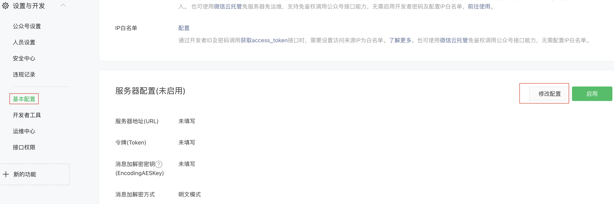
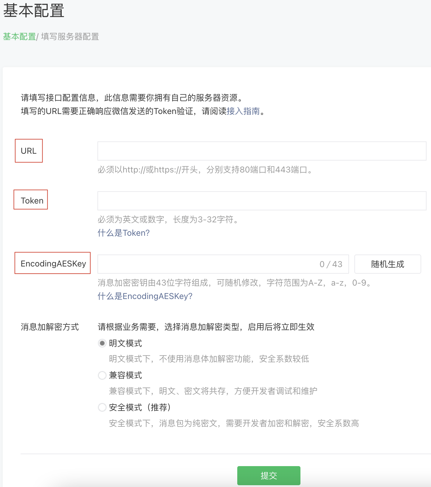
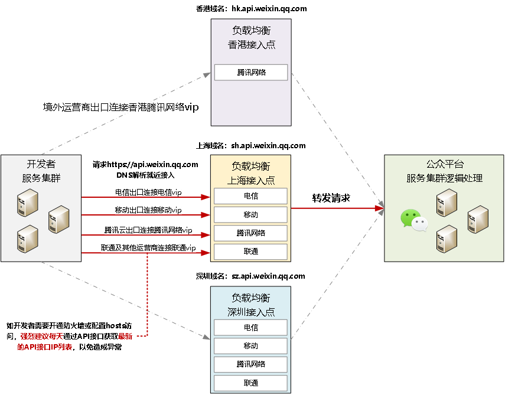

### 一、接入概述

---

接入微信公众平台开发：

1. 填写服务器配置
2. 验证服务器地址的有效性
3. 依据接口文档实现业务逻辑

#### 1.1 填写服务器配置



基本配置->服务器配置->修改配置。



1. 填写服务器地址（URL）：开发者用来接收微信消息和事件的接口URL
2. Token：开发者可以任意填写，用作生成签名（该 Token 会和接口 URL 中包含的 Token 进行比对，从而验证安全性）
3. EncodingAESKey：开发者手动填写或随机生成，将用作消息体加解密密钥。

#### 1.2 验证消息的确来自微信服务器

开发者提交信息后，微信服务器将发送 GET 请求到填写的服务器地址 URL 上，GET请求携带参数如下表所示：

| 参数      | 描述                                                         |
| :-------- | :----------------------------------------------------------- |
| signature | 微信加密签名，signature结合了开发者填写的 token 参数和请求中的 timestamp 参数、nonce参数。 |
| timestamp | 时间戳                                                       |
| nonce     | 随机数                                                       |
| echostr   | 随机字符串                                                   |

开发者通过检验 signature 对请求进行校验。若确认此次 GET 请求来自微信服务器，请原样返回 echostr 参数内容，则接入生效，成为开发者成功，否则接入失败。加密/校验流程如下：

1）将token、timestamp、nonce三个参数进行字典序排序

2）将三个参数字符串拼接成一个字符串进行sha1加密

3）开发者获得加密后的字符串可与 signature 对比，标识该请求来源于微信

> java示例：
>
> 引入weixin-java-mp，开源的封装好的微信JavaSDK。
>
> ```xml
> <!-- 微信公众号 -->
> <dependency>
>   <groupId>com.github.binarywang</groupId>
>   <artifactId>weixin-java-mp</artifactId>
>   <version>4.1.0</version>
> </dependency>
> ```
>
> ```java
> /**
>  * 微信公众平台配置
>  */
> @Configuration
> public class WxMpConfig {
> 
>   @Bean
>   public WxMpDefaultConfigImpl wxMpDefaultConfigImpl() {
>     WxMpDefaultConfigImpl config = new WxMpDefaultConfigImpl();
>     // 设置微信公众号的appid
>     config.setAppId("");
>     // 设置微信公众号的app corpSecret
>     config.setSecret("");
>     // 设置微信公众号的token
>     config.setToken("");
>     // 设置微信公众号的EncodingAESKey
>     config.setAesKey("");
>     return config;
>   }
> 
>   @Bean
>   public WxMpService wxMpService() {
>     // 实际项目中请注意要保持单例，不要在每次请求时构造实例，具体可以参考demo项目
>     WxMpService wxMpService = new WxMpServiceImpl();
>     wxMpService.setWxMpConfigStorage(wxMpDefaultConfigImpl());
>     return wxMpService;
>   }
> }
> ```
>
> ```java
> @Controller
> public class CheckController {
>   @Autowired
>   private WxMpService wxMpService;
> 
>   // 接入验证
>   @RequestMapping("/checkToken")
>   @ResponseBody
>   public String checkToken(@RequestParam("signature") String signature, @RequestParam("timestamp") String timestamp, @RequestParam("nonce") String nonce, @RequestParam("echostr") String echostr) {
>     if (!wxMpService.checkSignature(timestamp, nonce, signature)) {
>       return "消息不合法";
>     }
>     // 消息合法
>     return echostr;
>   }
> }
> ```

#### 1.3 依据接口文档实现业务逻辑

验证 URL 有效性成功后即接入生效，成为开发者。可以在公众平台网站中申请微信认证，认证成功后，将获得更多接口权限，满足更多业务需求。

成为开发者后，用户每次向公众号发送消息、或者产生自定义菜单、或产生微信支付订单等情况时，开发者填写的服务器配置 URL 将得到微信服务器推送过来的消息和事件，开发者可以依据自身业务逻辑进行响应，如回复消息。

公众号调用各接口返回错误时，可根据返回码来查询错误原因。[全局返回码说明](https://developers.weixin.qq.com/doc/offiaccount/Getting_Started/Global_Return_Code.html)

用户向公众号发送消息时，公众号方收到的消息发送者是一个OpenID，是使用用户微信号加密后的结果，每个用户对每个公众号有一个唯一的OpenID。

此外，由于开发者经常有需在多个平台（移动应用、网站、公众帐号）之间共通用户帐号，统一帐号体系的需求，微信开放平台（[open.weixin.qq.com](http://open.weixin.qq.com/)）提供了 UnionID 机制。开发者可通过 OpenID 来获取用户基本信息，而如果开发者拥有多个应用（移动应用、网站应用和公众帐号，公众帐号只有在被绑定到微信开放平台帐号下后，才会获取UnionID），可通过获取用户基本信息中的 UnionID 来区分用户的唯一性，因为只要是同一个微信开放平台帐号下的移动应用、网站应用和公众帐号，用户的 UnionID 是唯一的。换句话说，同一用户，对同一个微信开放平台帐号下的不同应用，UnionID是相同的。详情请在微信开放平台的资源中心 - 移动应用开发 - 微信登录 - 授权关系接口调用指引 - 获取用户个人信息（UnionID机制）中查看。

> 另请注意，微信公众号接口必须以http://或https://开头，分别支持80端口和443端口。


### 二、接口域名说明

---

开发者可以根据自己的服务器部署情况，选择最佳的接入域名（延时更低，稳定性更高）。除此之外，可以将其他接入域名用作容灾用途，当网络链路发生故障时，可以考虑选择备用域名来接入。请开发者使用域名进行 API 接口请求，不要使用 IP 作为访问。若有需要开通网络策略，开发者可以从[获取微信服务器 IP 地址](https://developers.weixin.qq.com/doc/offiaccount/Basic_Information/Get_the_WeChat_server_IP_address.html)定期获取最新的 IP 信息。

1. 通用域名(`api.weixin.qq.com`)，使用该域名将访问官方指定就近的接入点；
2. 通用异地容灾域名(api2.weixin.qq.com)，当上述域名不可访问时可改访问此域名；
3. 上海域名(sh.api.weixin.qq.com)，使用该域名将访问上海的接入点；
4. 深圳域名(sz.api.weixin.qq.com)，使用该域名将访问深圳的接入点；
5. 香港域名(hk.api.weixin.qq.com)，使用该域名将访问香港的接入点。


### 三、获取access_token

---

access_token是公众号的全局唯一接口调用凭据，**公众号调用各接口时都需使用access_token**。开发者需要进行妥善保存。access_token的存储至少要保留512个字符空间。access_token的有效期目前为**2个小时**，需定时刷新，重复获取将导致上次获取的access_token失效。

>开发者通过某 IP 发起调用->平台返回错误码[89503]并同时下发模板消息给公众号管理员->公众号管理员确认该 IP 可以调用->开发者使用该 IP 再次发起调用->调用成功。
>
>如公众号管理员第一次拒绝该 IP 调用，用户在1个小时内将无法使用该 IP 再次发起调用，如公众号管理员多次拒绝该 IP 调用，该 IP 将可能长期无法发起调用。平台建议开发者在发起调用前主动与管理员沟通确认调用需求，或请求管理员开启 IP 白名单功能并将该 IP 加入 IP 白名单列表。

公众号和小程序均可以使用 `AppID` 和`AppSecret`调用本接口来获取access_token。AppID和 AppSecret 可在“微信公众平台 - 开发 - 基本配置”页中获得（需要已经成为开发者，且帐号没有异常状态）。调用接口时，请登录“微信公众平台 - 开发 - 基本配置”提前将服务器 IP 地址添加到 IP 白名单中，点击查看设置方法，否则将无法调用成功。小程序无需配置 IP 白名单。

#### 3.1 接口调用请求说明

https请求方式: GET https://api.weixin.qq.com/cgi-bin/token?grant_type=client_credential&appid=APPID&secret=APPSECRET

#### 3.2 参数说明

| 参数       | 是否必须 | 说明                                  |
| :--------- | :------- | :------------------------------------ |
| grant_type | 是       | 获取access_token填写client_credential |
| appid      | 是       | 第三方用户唯一凭证                    |
| secret     | 是       | 第三方用户唯一凭证密钥，即appsecret   |

#### 3.3 返回说明

正常情况下，微信会返回下述JSON数据包给公众号：

```json
{"access_token":"ACCESS_TOKEN","expires_in":7200}
```

错误时微信会返回错误码等信息，JSON数据包示例如下（该示例为 AppID 无效错误）:

```json
{"errcode":40013,"errmsg":"invalid appid"}
```

| 返回码 | 说明                                                         |
| :----- | :----------------------------------------------------------- |
| -1     | 系统繁忙，此时请开发者稍候再试                               |
| 0      | 请求成功                                                     |
| 40001  | AppSecret错误或者 AppSecret 不属于这个公众号，请开发者确认 AppSecret 的正确性 |
| 40002  | 请确保grant_type字段值为client_credential                    |
| 40164  | 调用接口的 IP 地址不在白名单中，请在接口 IP 白名单中进行设置。 |
| 89503  | 此 IP 调用需要管理员确认,请联系管理员                        |
| 89501  | 此 IP 正在等待管理员确认,请联系管理员                        |
| 89506  | 24小时内该 IP 被管理员拒绝调用两次，24小时内不可再使用该 IP 调用 |
| 89507  | 1小时内该 IP 被管理员拒绝调用一次，1小时内不可再使用该 IP 调用 |


### 四、接口测试号申请

---

微信公众帐号测试号，通过手机微信扫描二维码即可获得测试号。

[进入微信公众帐号测试号申请系统](https://mp.weixin.qq.com/debug/cgi-bin/sandbox?t=sandbox/login)


### 五、接口在线调试

---

微信公众号开发需要熟悉各个接口的调用。

[进入微信公众平台接口调试工具](http://mp.weixin.qq.com/debug/)


### 六、获取微信服务器IP地址

---

如果公众号基于安全等考虑，需要获知微信服务器的 IP 地址列表，以便进行相关限制，可以通过该接口获得微信服务器 IP 地址列表或者 IP 网段信息。

由于出口 IP 及入口 IP 可能存在变动，建议用户每天请求接口1次，以便于及时更新 IP 列表。为了避免造成单点故障，强烈建议用户不要长期使用旧的 IP 列表作为 api.weixin.qq.com 的访问入口。

#### 6.1 获取微信API接口IP地址

使用固定 IP 访问 api.weixin.qq.com 时，注意运营商适配，**跨运营商访问可能会存在高峰期丢包问题**。



API接口 IP 即api.weixin.qq.com的解析地址，由开发者调用微信侧的接入IP。

1. 接口调用请求说明

   GET https://api.weixin.qq.com/cgi-bin/get_api_domain_ip?access_token=ACCESS_TOKEN

2. 参数说明

| 参数         | 是否必须 | 说明                 |
| :----------- | :------- | :------------------- |
| access_token | 是       | 公众号的access_token |

3. 返回说明

   正常情况下，微信会返回下述JSON数据包给公众号：

   ```json
   {
     "ip_list": [
       "101.89.47.18",
       "101.91.34.103",
       "101.91.37.13",
       "109.244.129.223",
       "109.244.145.152",
       "109.244.184.250",
       "112.53.42.235",
       "112.60.20.154",
       "112.65.193.153",
       "112.90.80.215",
       "116.128.170.42",
       "116.128.184.169",
       "117.144.228.18",
       "117.144.228.62",
       "119.147.6.203",
       "119.147.6.237",
       "120.232.65.161",
       "157.148.36.94",
       "157.255.218.109",
       "175.27.18.18",
       "175.27.5.221",
       "183.2.143.222",
       "203.205.239.82",
       "203.205.239.94",
       "221.181.99.40",
       "81.69.216.43"
     ]
   }
   ```

4. 错误时微信会返回错误码等信息，JSON数据包示例如下（该示例为 AppID 无效错误）:

   ```json
   {"errcode":40013,"errmsg":"invalid appid"}
   ```

#### 6.2 获取微信callback IP地址

请开发者确**保防火墙**、**ddos攻击白名单 IP** 内已添加回调IP，以避免误拦截的情况出现。

1. 接口调用请求说明

   GET https://api.weixin.qq.com/cgi-bin/getcallbackip?access_token=ACCESS_TOKEN

2. 参数说明

   | 参数         | 是否必须 | 说明                 |
   | :----------- | :------- | :------------------- |
   | access_token | 是       | 公众号的access_token |

3. 返回说明

   ```json
   {
     "ip_list": [
       "106.55.206.146",
       "106.55.206.211",
       "106.55.207.148",
       "106.55.207.31",
       "118.126.124.186",
       "118.126.124.246",
       "119.29.180.49",
       "119.29.9.101",
       "124.223.151.119",
       "129.226.105.242",
       "162.62.80.57",
       "162.62.80.8",
       "162.62.81.123",
       "175.24.211.142",
       "175.24.211.157",
       "175.24.211.198",
       "175.24.211.31",
       "175.24.211.4",
       "175.24.212.10",
       "175.24.212.185",
       "175.24.212.195",
       "175.24.213.149",
       "175.24.214.150",
       "175.24.214.222",
       "175.27.64.215",
       "175.27.65.216",
       "42.192.0.152",
       "42.192.0.224",
       "42.192.6.57",
       "43.132.112.30",
       "43.132.141.238",
       "43.137.147.169",
       "43.143.52.12",
       "43.143.59.119",
       "81.69.101.193",
       "81.69.101.225",
       "81.69.101.233",
       "81.69.101.237",
       "81.69.103.129",
       "81.69.103.147",
       "81.69.103.163",
       "81.69.103.205",
       "81.69.103.236",
       "81.69.103.238",
       "81.69.103.37",
       "81.69.103.74",
       "81.71.140.59",
       "81.71.19.101"
     ]
   }
   ```


### 七、网络检测

---

排查回调连接失败的问题，提供这个网络检测的API。它可以对开发者 URL 做域名解析，然后对所有 IP 进行一次 ping 操作，得到丢包率和耗时。

Post请求： https://api.weixin.qq.com/cgi-bin/callback/check?access_token=ACCESS_TOKEN

```json
{
  "action": "all", 
  "check_operator": "DEFAULT"
}
```

| 参数           | 是否必须 | 说明                                                         |
| :------------- | :------- | :----------------------------------------------------------- |
| action         | 是       | 执行的检测动作，允许的值：dns（做域名解析）、ping（做 ping 检测）、all（dns和 ping 都做） |
| check_operator | 是       | 指定平台从某个运营商进行检测，允许的值：CHINANET（电信出口）、UNICOM（联通出口）、CAP（腾讯自建出口）、DEFAULT（根据 ip 来选择运营商） |
