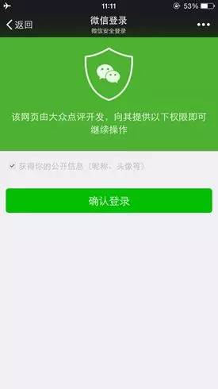

### 一、网页授权

---

如果用户**在微信客户端中访问第三方网页**，公众号可以通过微信网页授权机制，来获取用户基本信息，进而实现业务逻辑。

#### 1.1 网页授权的两种scope的区别

1. 以`snsapi_base`为 scope 发起的网页授权，是用来获取进入页面的用户的 openid 的，并且是静默授权并自动跳转到回调页的。用户感知的就是直接进入了回调页（往往是业务页面）
2. 以`snsapi_userinfo`为 scope 发起的网页授权，是用来获取用户的基本信息的。但这种授权需要用户手动同意，并且由于用户同意过，所以无须关注，就可在授权后获取该用户的基本信息。
3. 用户管理类接口中的“获取用户基本信息接口”，是在用户和公众号产生消息交互或关注后事件推送后，才能根据用户 OpenID 来获取用户基本信息。这个接口，包括其他微信接口，都是**需要该用户（即openid）关注了公众号后，才能调用成功**。

#### 1.2 网页授权access_token和普通access_token的区别

1. **微信网页授权是通过OAuth2.0机制**实现的，在用户授权给公众号后，公众号可以获取到一个网页授权特有的接口调用凭证（网页授权access_token），通过网页授权access_token可以进行授权后接口调用，如获取用户基本信息；
2. 其他微信接口，需要通过基础支持中的“获取access_token”接口来获取到的普通access_token调用。

#### 1.3 UnionID机制

1. 网页授权获取用户基本信息也遵循 UnionID 机制。即如果开发者有在多个公众号，或在公众号、移动应用之间统一用户帐号的需求，需要**在微信开放平台（open.weixin.qq.com）绑定公众号**后，才可利用 UnionID 机制来满足上述需求。
2. UnionID机制的作用说明：如果开发者拥有多个移动应用、网站应用和公众帐号，可通过获取用户基本信息中的 unionid 来区分用户的唯一性，因为同一用户，对同一个微信开放平台下的不同应用（移动应用、网站应用和公众帐号），unionid是相同的。

#### 1.4 特殊场景下的静默授权

1. 对于以snsapi_base为 scope 的网页授权，就静默授权的，用户无感知；
2. **对于已关注公众号的用户，如果用户从公众号的会话或者自定义菜单进入本公众号的网页授权页，即使是 scope 为snsapi_userinfo，也是静默授权，用户无感知**。


### 二、网页授权流程

---

1. 引导用户进入授权页面同意授权，获取code。
2. **通过code换取网页授权access_token**（与基础支持中的access_token不同）
3. 如果需要，开发者可以刷新网页授权access_token，避免过期。
4. 通过网页授权access_token和openid获取用户基本信息（支持UnionID机制）

#### 2.1 用户同意授权，获取code

在确保微信公众账号拥有授权作用域（scope参数）的权限的前提下（**已认证服务号**，默认拥有 scope 参数中的snsapi_base和snsapi_userinfo 权限），引导关注者打开如下页面：

https://open.weixin.qq.com/connect/oauth2/authorize?appid=APPID&redirect_uri=REDIRECT_URI&response_type=code&scope=SCOPE&state=STATE#wechat_redirect

尤其注意：由于授权操作安全等级较高，所以在发起授权请求时，**微信会对授权链接做正则强匹配校验，如果链接的参数顺序不对，授权页面将无法正常访问**。

参考链接(请在微信客户端中打开此链接体验)：

> scope为snsapi_base：
>
> https://open.weixin.qq.com/connect/oauth2/authorize?appid=wx520c15f417810387&redirect_uri=https%3A%2F%2Fchong.qq.com%2Fphp%2Findex.php%3Fd%3D%26c%3DwxAdapter%26m%3DmobileDeal%26showwxpaytitle%3D1%26vb2ctag%3D4_2030_5_1194_60&response_type=code&scope=snsapi_base&state=123#wechat_redirect

> scope为snsapi_userinfo：
>
> https://open.weixin.qq.com/connect/oauth2/authorize?appid=wx807d86fb6b3d4fd2&redirect_uri=http%3A%2F%2Fdevelopers.weixin.qq.com&response_type=code&scope=snsapi_userinfo&state=STATE#wechat_redirect

尤其注意：**跳转回调redirect_uri，应当使用 https 链接来确保授权 code 的安全性**。

| 参数             | 是否必须 | 说明                                                         |
| :--------------- | :------- | :----------------------------------------------------------- |
| appid            | 是       | 公众号的唯一标识                                             |
| redirect_uri     | 是       | 授权后重定向的回调链接地址， 请使用 urlEncode 对链接进行处理 |
| response_type    | 是       | 返回类型，请填写code                                         |
| scope            | 是       | 应用授权作用域，snsapi_base （不弹出授权页面，直接跳转，只能获取用户openid），snsapi_userinfo （弹出授权页面，可通过 openid 拿到昵称、性别、所在地。并且， 即使在未关注的情况下，只要用户授权，也能获取其信息 ） |
| state            | 否       | 重定向后会带上 state 参数，开发者可以填写a-zA-Z0-9的参数值，最多128字节 |
| #wechat_redirect | 是       | 无论直接打开还是做页面302重定向时候，必须带此参数            |
| forcePopup       | 否       | 强制此次授权需要用户弹窗确认；默认为false；需要注意的是，若用户命中了特殊场景下的静默授权逻辑，则此参数不生效 |

下图为 scope 等于snsapi_userinfo时的授权页面：



如果用户同意授权，页面将跳转至 redirect_uri/?code=CODE&state=STATE。

**code作为换取access_token的票据**，每次用户授权带上的 code 将不一样，code只能使用一次，5分钟未被使用自动过期。

#### 2.2 通过code换取网页授权access_token

这里通过 code 换取的是一个特殊的网页授权access_token，与基础支持中的access_token不同。公众号可通过下述接口来获取网页授权access_token。如果网页授权的作用域为snsapi_base，则本步骤中获取到网页授权access_token的同时，也获取到了openid，snsapi_base式的网页授权流程即到此为止。

尤其注意：由于公众号的 secret 和获取到的access_token安全级别都非常高，必须只保存在服务器，不允许传给客户端。**后续刷新access_token、通过access_token获取用户信息等步骤，也必须从服务器发起**。

> 获取 code 后，请求以下链接获取access_token：
>
> https://api.weixin.qq.com/sns/oauth2/access_token?appid=APPID&secret=SECRET&code=CODE&grant_type=authorization_code

| 参数       | 是否必须 | 说明                       |
| :--------- | :------- | :------------------------- |
| appid      | 是       | 公众号的唯一标识           |
| secret     | 是       | 公众号的appsecret          |
| code       | 是       | 填写第一步获取的 code 参数 |
| grant_type | 是       | 填写为authorization_code   |

正确时返回的 JSON 数据包如下：

```json
{
  "access_token":"ACCESS_TOKEN",
  "expires_in":7200,
  "refresh_token":"REFRESH_TOKEN",
  "openid":"OPENID",
  "scope":"SCOPE" 
}
```

#### 2.3 刷新access_token(如果需要)

由于access_token拥有较短的有效期，当access_token超时后，可以使用refresh_token进行刷新，refresh_token有效期为30天，当refresh_token失效之后，需要用户重新授权。

> 获取第二步的refresh_token后，请求以下链接获取access_token：
>
> https://api.weixin.qq.com/sns/oauth2/refresh_token?appid=APPID&grant_type=refresh_token&refresh_token=REFRESH_TOKEN

| 参数          | 是否必须 | 说明                                          |
| :------------ | :------- | :-------------------------------------------- |
| appid         | 是       | 公众号的唯一标识                              |
| grant_type    | 是       | 填写为refresh_token                           |
| refresh_token | 是       | 填写通过access_token获取到的refresh_token参数 |

正确时返回的 JSON 数据包如下：

```json
{ 
  "access_token":"ACCESS_TOKEN",
  "expires_in":7200,
  "refresh_token":"REFRESH_TOKEN",
  "openid":"OPENID",
  "scope":"SCOPE" 
}
```

#### 2.4 拉取用户信息(需scope为snsapi_userinfo)

如果网页授权作用域为snsapi_userinfo，则此时开发者可以通过access_token和 openid 拉取用户信息了。

> GET（请使用 https 协议）：
>
> https://api.weixin.qq.com/sns/userinfo?access_token=ACCESS_TOKEN&openid=OPENID&lang=zh_CN

| 参数         | 描述                                                         |
| :----------- | :----------------------------------------------------------- |
| access_token | 网页授权接口调用凭证,注意：此access_token与基础支持的access_token不同 |
| openid       | 用户的唯一标识                                               |
| lang         | 返回国家地区语言版本，zh_CN 简体，zh_TW 繁体，en 英语        |

正确时返回的 JSON 数据包如下：

```json
{   
  "openid": "OPENID",
  "nickname": NICKNAME,
  "sex": 1,
  "province":"PROVINCE",
  "city":"CITY",
  "country":"COUNTRY",
  "headimgurl":"https://thirdwx.qlogo.cn/mmopen/g3MonUZtNHkdmzicIlibx6iaFqAc56vxLSUfpb6n5WKSYVY0ChQKkiaJSgQ1dZuTOgvLLrhJbERQQ4eMsv84eavHiaiceqxibJxCfHe/46",
  "privilege":[ "PRIVILEGE1" "PRIVILEGE2"     ],
  "unionid": "o6_bmasdasdsad6_2sgVt7hMZOPfL"
}
```


### 三、检验授权凭证是否有效

> GET（请使用 https 协议）：
>
> https://api.weixin.qq.com/sns/auth?access_token=ACCESS_TOKEN&openid=OPENID

正确的 JSON 返回结果：

```json
{ "errcode":0,"errmsg":"ok"}
```

错误时的 JSON 返回示例：

```json
{ "errcode":40003,"errmsg":"invalid openid"}
```