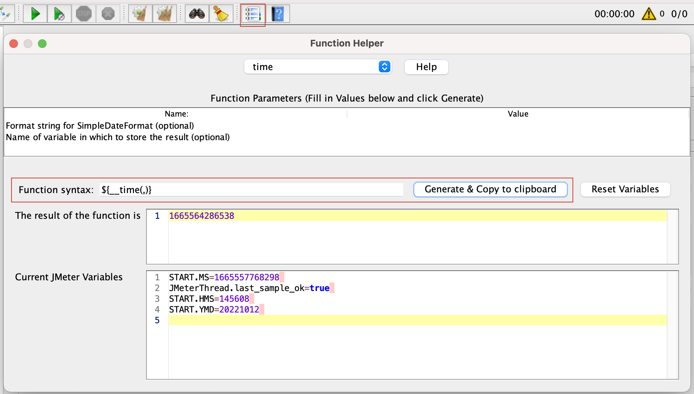
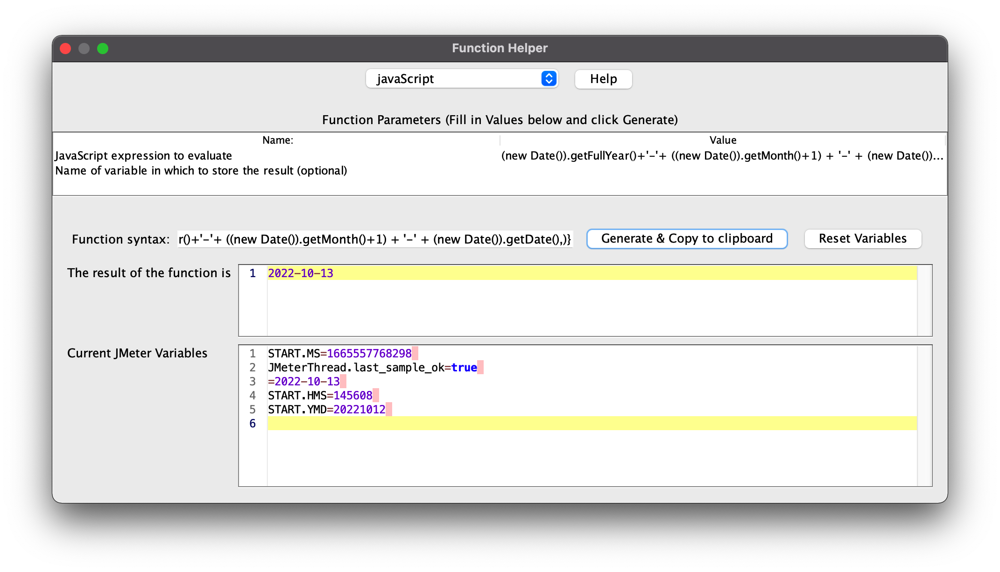
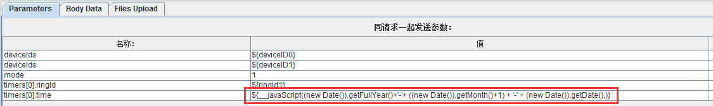
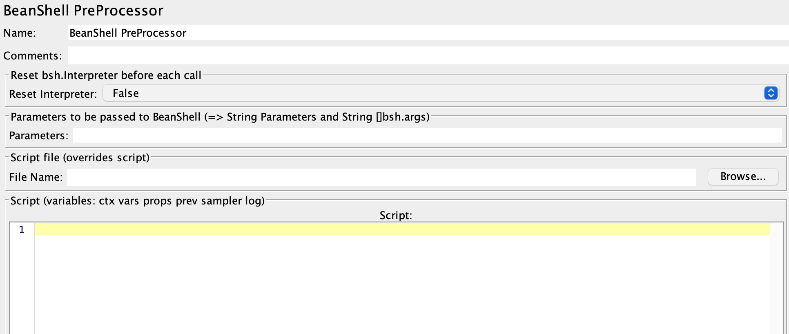
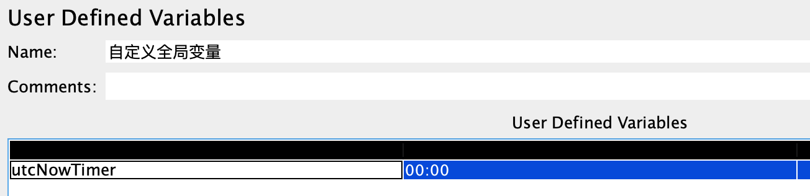

### 一、_time函数

---

JMeter自带的 `__time` 函数

调出函数助手，生成一个_time函数



#### 1.1 调用时间戳参数变量

- 13位时间戳

  ```
  ${__time(,)}	//默认该公式精确到毫秒级别，13位数
  ```

- 10位时间戳

  ```
  ${__tme(/1000,)}  //该公式精确到秒级别， 10位数
  ```

- xx秒后10位时间戳

  ```
  ${__intSum(${__time(/1000,)},6000,)}
  ```

#### 1.2 调用日期格式参数变量

调用yyyy-MM-dd格式日期

```
${__time(yyyy-MM-dd,)} //2022-10-13
```

调用YMDHMS格式日期

```
${__time(YMDHMS,)}  //2022-10-13-211532
```


### 二、JavaScript实现

---

使用JavaScript实现一些时间变量，获取当前日期：



```javascript
${__javaScript((new Date()).getFullYear()+'-'+ ((new Date()).getMonth()+1) + '-' + (new Date()).getDate(),)}
```




### 三、Java实现

---

Jmeter 提供日期函数，功能太弱；JavaScript也许可以，但不熟练。现在用java在`BeanShell PreProcessor` 中实现。

**BeanShell**

1. 一个小型嵌入式Java源代码解释器，能够动态地执行标准java语法，并利用在JavaScript和Perl中常见的的松散类型、命令、闭包等通用脚本来对其进行拓展。
2. 通过运行其内部的脚本来处理Java应用程序，还可以在运行过程中动态执行java应用程序执行java代码。
3. 使用语言java，运行在同一个虚拟机的应用程序，可以自由地引用对象脚本并返回结果。

现在我们使用的是`BeanShell PreProcessor` ，即前置处理器，在执行某个接口时，会先执行前置处理器：



**取得本地时间**

```java
StringBuffer UTCTimeBuffer = new StringBuffer();    
Calendar cal = Calendar.getInstance();  
```

**取得时间偏移量**

```java
int zoneOffset = cal.get(java.util.Calendar.ZONE_OFFSET);
```

**取得夏令时差**

```java
int dstOffset = cal.get(java.util.Calendar.DST_OFFSET);
```

**取得UTC时间（从本地时间里扣除这些差量）**

```java
cal.add(java.util.Calendar.MILLISECOND, -(zoneOffset + dstOffset));
```

**获取具体的时间信息**

```java
int year = cal.get(Calendar.YEAR);  
int month = cal.get(Calendar.MONTH)+1;  
int day = cal.get(Calendar.DAY_OF_MONTH);  
int hour = cal.get(Calendar.HOUR_OF_DAY);  
int minute = cal.get(Calendar.MINUTE);  
```

```java
DecimalFormat df=new DecimalFormat("00");
String HH=df.format(hour);
String MM=df.format(minute);
```

**拼接时间段**

```java
UTCTimeBuffer.append(HH).append(":").append(MM); 
String timer = UTCTimeBuffer.toString();
```

**将时间变量赋值给全局变量**

1. 首先定义一个全局变量`utcNowTimer`

   

2. 赋值给该全局变量

   ```java
   vars.put("utcNowTimer",timer);
   log.info(timeStr);
   ```