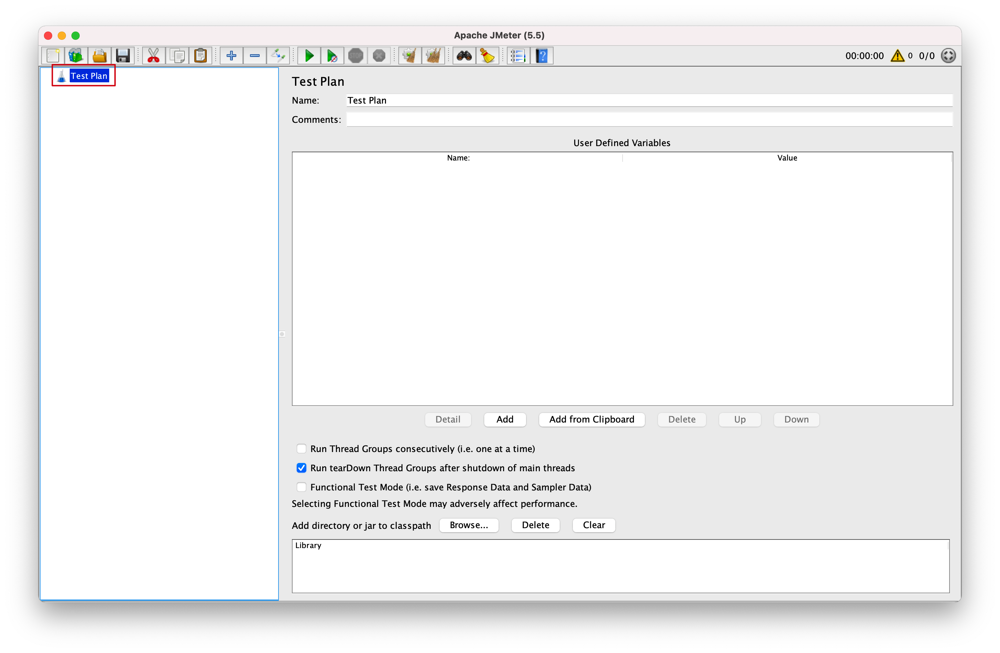
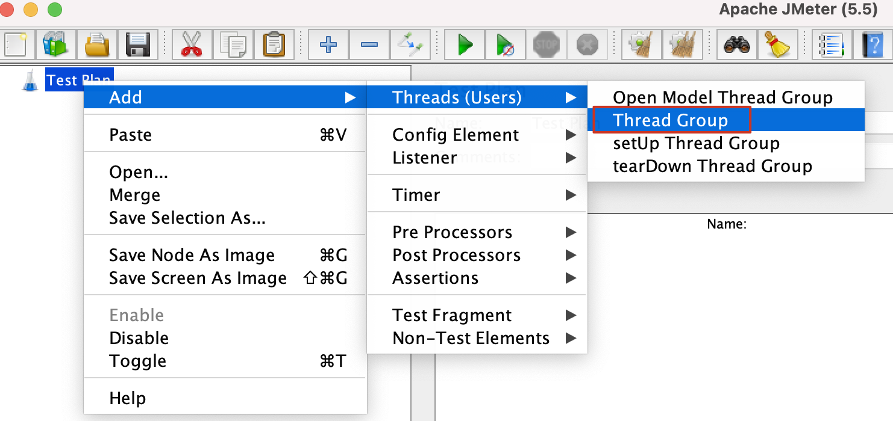
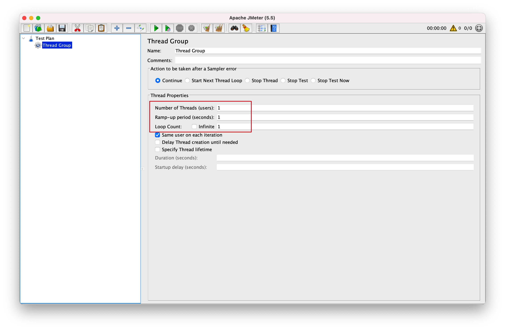
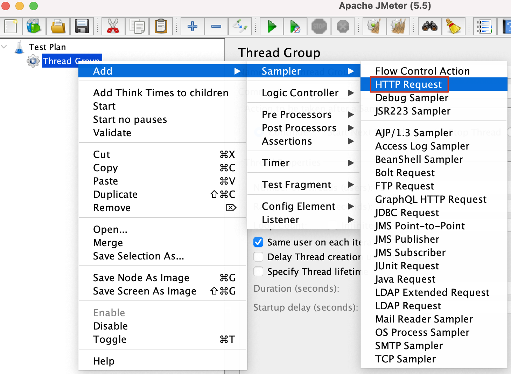
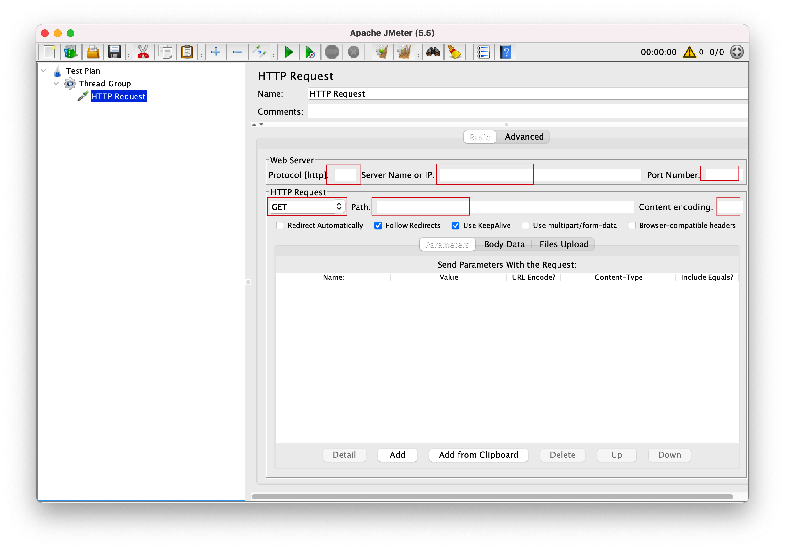
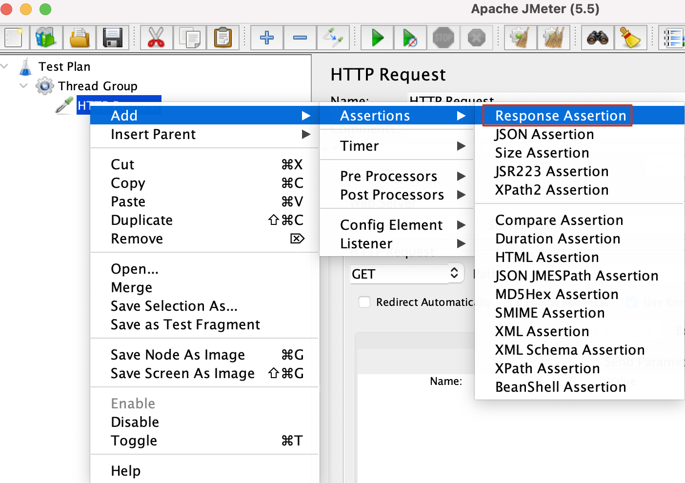
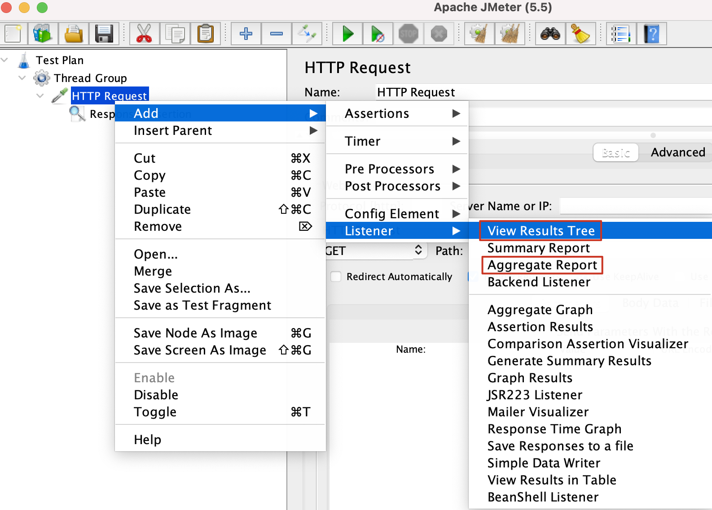

### 一、测试计划

---

打开Jmeter，在菜单左侧出现“测试计划”。

### 二、线程组

---

右键单击测试计划

线程数：即虚拟用户数。设置多少个线程数也就是设置多少虚拟用户数。

Ramp-Up时间(秒)：设置虚拟用户数全部启动的时长。如果线程数为20,准备时长为10秒，那么需要10秒钟启动20个线程。也就是平均每秒启动2个线程。

循环次数：每个线程发送请求的个数。如果线程数为20，循环次数为10，那么每个线程发送10次请求。总请求数为20*10=200。如果勾选了“永远”，那么所有线程会一直发送请求，直到手动点击工具栏上的停止按钮，或者设置的线程时间结束。

### 三、HTTP请求

---

右键单击“线程组”

- HTTP请求的名称：本属性用于标识一个取样器，建议使用一个有意义的名称。
- 注释：对于测试没有任何作用，仅用户记录用户可读的注释信息。
- 服务器名称或IP ：HTTP请求发送的目标服务器名称或IP地址。
- 端口号：目标服务器的端口号，默认值是80。
- 协议：向目标服务器发送HTTP请求时的协议，可以是HTTP或者是HTTPS ，默认值为http 。
- 方法：发送HTTP请求的方法，可用方法包括GET、POST、HEAD、PUT、TRACE、OPTIONS、DELETE等。
- 路径：目标URL路径（不包括服务器地址和端口）
  内容编码：内容的编码方式，常用UTF-8。
- 自动重定向：如果选中该选项，当发送HTTP请求后得到的响应是302/301时，JMeter 自动重定向到新的页面。
- 对Post使用multipart/from-data：当发送POST 请求时，使用multipart/from-data方法发送，默认不选中。
- 同请求一起发送参数 ： 在请求中发送URL参数，对于带参数的URL ，jmeter提供了一个简单的对参数化的方法。用户可以将URL中所有参数设置在本表中，表中的每一行是一个参数值对（对应RUL中的 名称1=值1）。

### 四、添加断言

---

响应断言

### 五、添加监听器

---

查看结果数、聚合报告

