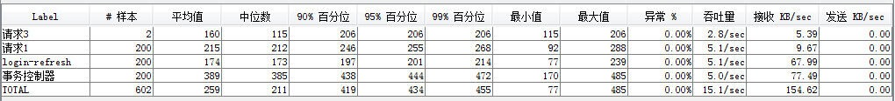

- \#Samples：发出请求数量。如第三行记录，模拟2个用户，循环100次，所以显示了200
- Average：平均响应时间 — 默认情况下是单个 Request 的平均响应时间，当使用了事务控制器时，也可以以事务为单位显示平均响应时间
- Median：中位数，也就是50%用户的响应时间
- 90%Line：90%用户的响应时间
- 95%Line：95%用户的响应时间
- 99%Line：99%用户的响应时间
- Min：最小响应时间
- Maximum：最大响应时间
- Error%：本次测试中出现错误的请求的数量/请求的总数
- Throughput：吞吐量-tps值