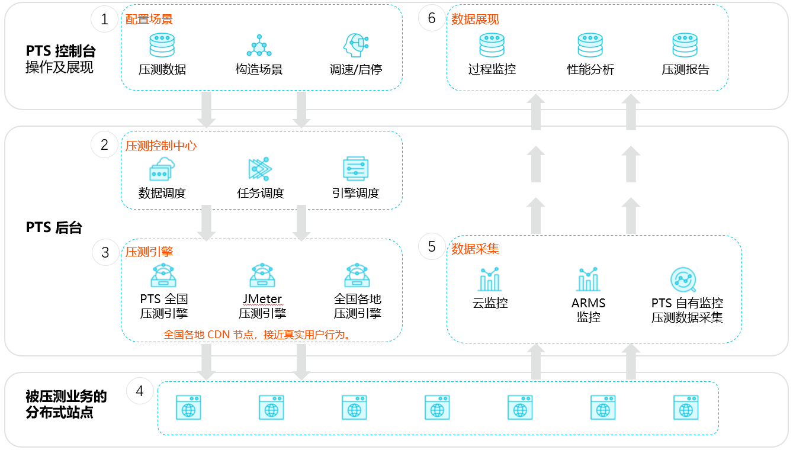
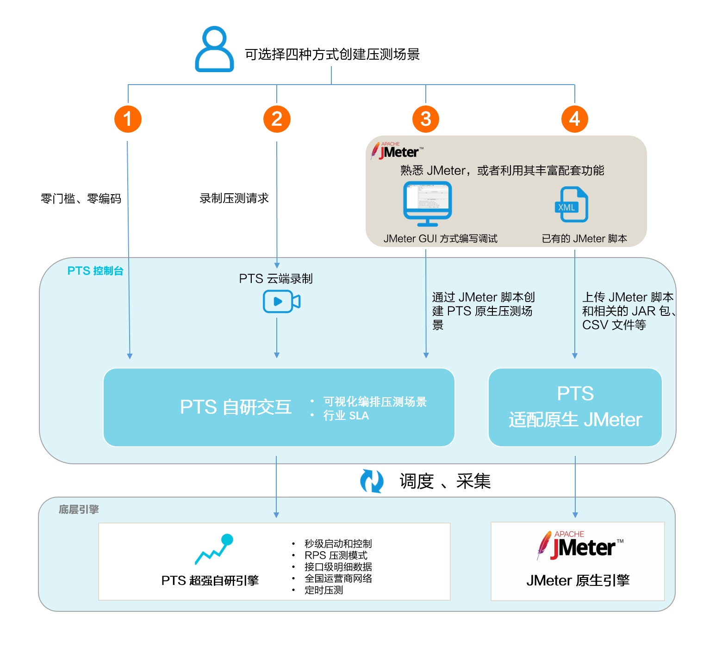

性能测试PTS（`Performance Testing Service`）是一款简单易用，具备强大的分布式压测能力的SaaS压测平台。 

### 一、压测流程

---

1. 在PTS控制台上，准备压测API数据，构造压测场景，定义压测模式、量级等；支持随时启停压测，压测过程中可调速。
2. 压测启动后，PTS后台的压测中心将自动调度<u>压测数据</u>、<u>压测任务</u>和<u>压测引擎</u>。
3. 通过随机调度全国上百个城市和运营商的**内容分发网络CDN**（Content Delivery Network）节点，发起压测流量。
4. 通过压测引擎向您指定的业务站点发起压测。
5. 压测过程中，通过集成[云监控](https://www.aliyun.com/product/jiankong)、[ARMS（应用实时监控服务）](https://www.aliyun.com/product/arms)产品，结合PTS自有的监控指标，实时采集压测数据。
6. 在PTS控制台，实时展现压测数据，进行过程监控；压测结束后，生成压测报告。基于整个压测场景的性能表现，定位性能问题、发现系统瓶颈。

### 二、压测创建方式

---

PTS支持以下4种方式创建压测场景（或称压测用例），如下所示：

说明：

- 方式一：PTS自研零编码可视化编排，使用自研强大引擎压测。
- 方式二： 使用PTS自研云端录制器，零侵入录制业务请求并导入1中的自研交互中进行进一步设置。
- 方式三： 通过脚本导入场景导入PTS自研交互中，使用PTS自研引擎。具体操作，请参见[导入场景](https://help.aliyun.com/document_detail/97878.htm#multiTask2325)。
- 方式四：使用原生JMeter引擎进行压测，PTS提供自定义的压力构造和监控数据汇聚等产品服务。更新信息，请参见[JMeter压测](https://help.aliyun.com/document_detail/91788.htm#multiTask4485)。

其中，方式一、二、三由于使用了PTS的自研引擎，具备RPS（Requests Per Second）吞吐量压测模式、秒级启动、实时控制、定时压测和流量遍布全国运营商网络的差异化能力。

方式一是PTS最核心的一种压测场景创建方式，所有资源包均可使用。

### 三、功能特性

---

PTS提供场景编排、API调试、流量录制等功能，可快速创建业务压测脚本，同时100%兼容JMeter。

- 压测场景创建
- 开源压测工具集成
- 流量录制
- 多协议支持
- 压测流量控制
- 压测数据监控
- 压测报告
- 问题诊断
- 接口测试