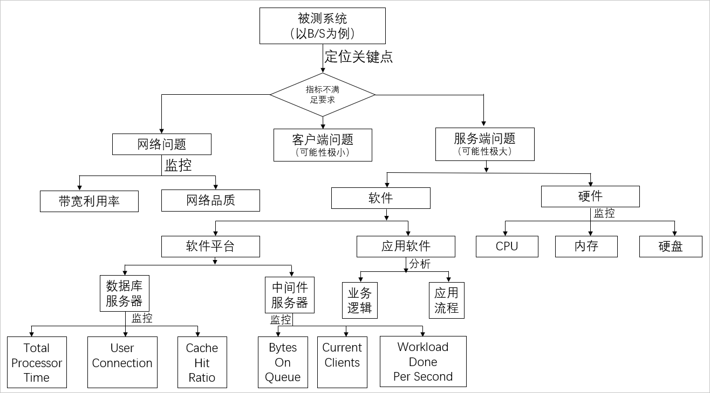

### 一、术语表

---

| 术语             | 说明                                                         |
| :--------------- | :----------------------------------------------------------- |
| 3xx              | 表示客户端需要采取进一步的操作才能完成请求。通常这些状态码用来重定向，后续的请求地址（重定向目标）在本次响应的Location域中指明。 |
| 4xx              | 表示客户端发生了错误，妨碍了服务器的处理。                   |
| 5xx              | 表示服务器无法完成明显有效的请求。一般代表了服务器在处理请求的过程中有错误或者异常状态发生，也有可能是服务器意识到以当前的软硬件资源无法完成对请求的处理。 |
| 串联链路         | 指一组压测API的有序集合（类似于事务），具有业务含义。压测API之间只有在同一个串联链路中才能进行入参和出参关联（运行时数据传递）。两个不同的串联链路之间相互独立，通常不会存在参数的传递依赖（使用数据导出指令的情况除外）。 |
| 压测API          | 指由用户行为触发的一条端上请求。压测API是场景压测中的必需元素，用来定义串联链路中每个阶段URL的具体信息。例如，电商网站的登录、查询商品详情、提交订单等，分别对应一次用户行为中的多个请求API。 |
| ==VU==           | **虚拟并发数**，表示压测能力。例如100 VU，即表示有100个独立的线程分别连续发送请求。 |
| ==VUM==          | 计量单位，VUM = VU * Min。                                   |
| 并发用户数       | 同时发送压测请求的用户数量。一个用户在压测过程中可能是一个进程或者一个线程。 |
| 并发模式         | 虚拟用户模式，如果想要摸底业务系统能同时承载的在线用户数，可以通过该模式。 |
| 压测场景         | 压测场景是若干个基于HTTP/HTTPS的URL/API的组合。URL/API可能关联了数据文件表示不同用户。不同的URL/API表示不同的业务含义（例如登录、加入购物车），最终组合成一个接近用户各种真实行为同时具备一定用户量级的压测模型。 |
| 出参             | 从一个压测API的应答中截取需要的内容作为出参，供后续的压测API作为参数使用。 |
| 检查点（断言）   | 一般用于标记业务成功与否，从而验证压测请求的响应是否符合预期。有时候响应码是200并不代表业务处理成功，有可能需要判断响应体内的内容。在PTS的串联链路中如果断言失败，当前请求就不会继续传递到下一个压测API。另外，在压测实时报表和压测报告中都会相应展现业务成功或者失败的信息。 |
| 集合点           | 使虚拟用户在集合点处等待，满足条件后一次性释放所有等待的用户，继续后续业务，例如整点秒杀场景。 |
| 条件跳转         | 根据出参，改变串联链路请求的执行路径，支持跳转、继续和结束等。 |
| ==RPS模式==      | **吞吐量模式**，指每秒固定发出设置的请求数量（RPS）。        |
| SLA              | 服务等级协议（Service-Level Agreement），是判定压测是否异常的重要依据。压测过程中，通过监控核心服务状态的SLA指标数据，您可以更直观地了解压测业务或架构的状态。 |
| SLA指标          | 是指从哪些指标监控压测过程数据。目前，SLA指标主要包含业务质量相关指标RT （Response Time）、RPS （Requests per Second）和成功率。PTS将逐步增加性能（云监控基础数据）、队列、SQL连接等方面的SLA指标。 |
| SLA规则          | 是在SLA指标的基础上，添加了判断条件，以触发告警或停止压测。  |
| SLA模板          | 是SLA规则的集合，可包含一个或多个SLA规则。SLA模板与行业类型绑定。 |
| 思考时间         | 模拟用户在前后两个节点间思考、反应花费的时间，支持多种模式。 |
| 数据导出         | PTS提供的指令之一。用于导出某个串联链路中的数据（如Cookie、出参或通过数据指令定义的参数），供其他串联链路使用，在全局共享导出数据。 |
| 数据指令         | PTS提供的指令之一。通过对前置压测API的出参、字符串或函数做二次处理，定义新的参数，提供给串联链路中的后续压测API使用。 |
| 文件参数         | 将存在关联的参数放在一个文件的不同列中，通过上传该文件将其参数值导入PTS。这些参数称为文件参数，可在压测API中使用。 |
| TPS              | Transaction Per Second，系统每秒处理的事务数量。             |
| 响应时间RT       | 从客户端发送一个请求开始，到客户端接收到服务端返回的响应所经历的时间。响应时间由请求发送时间、网络传输时间和服务器处理时间三部分组成。 |
| 75%响应时间      | 在整个压测周期内（压测启动到停止的时间内），某个串联链路或者压测API的所有采样到的响应时间（固定采样周期）中75%的时间在这个值以内。 |
| 指令             | 是一种可以改变、控制串联链路中行为和流程的功能组件，可以更真实地模拟业务压测流量。 |
| ==请求成功率==   | 压测中此API的请求成功率。                                    |
| ==Timing瀑布流== | 展示该请求在核心生命周期的耗时情况。                         |
| ==SLB监控==      | 负载均衡SLB（Sever Load Balancer），在SLB监控详情页，可查看整个压测过程中各SLB的端口新建连接数、端口丢弃连接数、端口流出带宽、端口流入带宽和QPS等数据。 |
| ECS监控详情      | 云服务器ECS（Elastic Compute Service），在ECS监控详情页，可查看整个压测过程中各ECS的CPU使用率、内存利用率、各网卡网络流入速率、磁盘读写速度和Load5。 |
| RDS监控详情      | 云数据库RDS（Relational Database Service），在RDS监控详情页可查看整个压测时间内各RDS的连接数使用率、CPU使用率、磁盘使用率、IOPS和内存使用率。 |

### 二、并发虚拟用户、RPS、TPS的解读

---

在做性能测试的时候，传统方式都是用**并发虚拟用户数**来衡量系统的性能（站在客户端视角），一般适用于一些网页站点例如首页、H5的压测；而RPS（Requests per second）模式主要是为了方便直接衡量系统的**吞吐能力TPS**（Transaction Per Second，每秒事务数）而设计的（站在服务端视角），按照被压测端需要达到TPS等量设置相应的RPS，应用场景主要是一些动态的接口API，例如登录、提交订单等等。

#### 2.1 术语定义

- **并发用户数(VU)**：指的是现实系统中操作业务的用户，在性能测试工具中，一般称为虚拟用户数（Virtual User），注意并发用户数跟注册用户数、在线用户数有很大差别的，并发用户数一定会对服务器产生压力的，而在线用户数只是 ”挂” 在系统上，对服务器不产生压力，注册用户数一般指的是数据库中存在的用户数。
- **处理能力(TPS)**：每秒事务数，是衡量系统性能的一个非常重要的指标。
- **响应时间(RT)**：指的是业务从客户端发起到客户端接受的时间。

#### 2.2 VU和TPS换算

简单例子：在术语中解释了TPS是每秒事务数，但是事务是要靠虚拟用户做出来的，假如1个虚拟用户在1秒内完成1笔事务，那么TPS明显就是1；如果某笔业务响应时间是1 ms，那么1个用户在1s内能完成1000笔事务，TPS就是1000了；如果某笔业务响应时间是1s，那么1个用户在1s内只能完成1笔事务，要想达到1000 TPS，至少需要1000个用户；因此可以说1个用户可以产生1000 TPS，1000个用户也可以产生1000 TPS，无非是看响应时间快慢。

复杂公式： 试想一下复杂场景，多个脚本，每个脚本里面定义了多个事务（例如一个脚本里面有100个请求，我们把这100个连续请求叫做Action，只有第10个请求，第20个请求分别定义了事务10和事务20）具体公式如下。

符号代表意义：

- Vui表示的是第i个脚本使用的并发用户数。
- Rtj表示的是第i个脚本第j个事务花费的时间，此时间会影响整个Action时间。
- Rti表示的是第i个脚本一次完成所有操作的时间，即Action时间。
- n表示的是第n个脚本。
- m表示的是每个脚本中m个事务。
- 那么第j个事务的TPS = Vui/Rti。

总的TPS=

#### 2.3 如何获取VU和TPS

- VU获取方式：
  - 已有系统：可选取高峰时刻，**在一定时间内使用系统的人数，这些人数可认为是在线用户数，并发用户数可以取10%**，例如在半个小时内，使用系统的用户数为10万，那么取10%（即1万）作为并发用户数基本就够了。
  - 新系统：没有历史数据作参考，建议通过业务部门进行评估。
- TPS获取方式：
  - 已有系统：**可选取高峰时刻，在一定时间内（如3分钟 ~ 10分钟），获取系统总业务量，计算单位时间（秒）内完成的笔数，乘以2 ~ 5倍作为峰值的TPS**，例如峰值3分钟内处理订单18万笔，平均TPS是1000，峰值TPS可以是2000 ~ 5000。
  - 新系统：没有历史数据作参考，建议通过业务部门进行评估。

#### 2.4 如何评价系统的性能

针对服务器端的性能，**以TPS为主来衡量系统的性能，并发用户数为辅来衡量系统的性能**，如果必须要用并发用户数来衡量的话，需要一个前提，那就是交易在多长时间内完成，因为在系统负载不高的情况下，将思考时间（思考时间的值等于交易响应时间）加到串联链路中，并发用户数基本可以增加一倍，因此用并发用户数来衡量系统的性能没太大的意义。同样的，如果系统间的吞吐能力差别很大，那么同样的并发下TPS差距也会很大。

#### 2.5 性能测试策略

做性能测试需要一套标准化流程及测试策略。在做负载测试的时候，传统方式一般都是**按照梯度施压的方式去加用户数**，避免在没有预估的情况下，一次加几万个用户，导致交易失败率非常高，响应时间非常长，已经超过了使用者忍受范围内；较为适合互联网分布式架构的方式，也是阿里巴巴的最佳实践是用TPS模式（吞吐量模式）+设置起始和目标最大量级，然后根据系统表现灵活的手工实时调速，效率更高，服务端吞吐能力的衡量一步到位。

#### 2.6 总结

- **系统的性能由TPS决定**，跟并发用户数没有多大关系。
- 系统的最大TPS是一定的（在一个范围内），但并发用户数不一定，可以调整。
- 建议性能测试的时候，不要设置过长的思考时间，以最坏的情况下对服务器施压。
- 一般情况下，大型系统（业务量大、机器多）做压力测试，10000~50000个用户并发，中小型系统做压力测试，5000个用户并发比较常见。

### 三、性能测试技术指南

---

#### 3.1 适用范围

适用于所有需要性能测试的项目。 对性能测试实施过程中非常重要、关键的相关技术进行分析，主要包括：系统环境、测试指标、业务模型、数据量、测试模型、测试类型、脚本（API）、场景、监控、瓶颈分析、调优和性能测试分布式云化压测工具。

#### 3.2 系统环境

1. 分析

   系统环境分为生产环境、测试环境等。两个环境的方案各有其优缺点，生产环境衡量的精准度较高，参考效果更好，但是需要清理相关的测试数据（同时要保证数据删除的完整性，基础数据的构造参考后续数据量部分）或者BI统计的时候过滤，或者更彻底的方案是参考阿里全链路压测方式，生产环境的压测尽量挑选在低峰期进行，避免对生产业务造成影响；单独的测试环境风险可控，难点在环境的构建上，规模和生产一致的成本也是较高的，所以一般而言有通过等比构建（1/2，1/4，1/8等），甚至是生产环境中部分应用独立部署测试集群，数据库共用的方式，此外测试环境需要从生产环境中导入脱敏的基础数据，例如至少是最近半年或者1年的，保持其整体的数据关联性，这个对于压测的准确度和参考性也很重要。更多信息，请参见[全链路压测](https://www.aliyun.com/solution/ehasl)。

2. 风险

   测试环境的风险主要体现在跟生产的差异度，测试结果的参考价值会打一定程度的折扣，可以视自身情况选择合理的方式，例如看重入口网络的检验的，可以测试环境和生产环境共享入口。 对测试环境系统平台、中间件、数据库等不熟悉和不了解，也会导致瓶颈不易分析、不易调优。

3. 规范

   1. 测试环境搭建

      在熟知以上问题的前提下，测试环境搭建应尽量满足如下规范：

      - 测试环境架构与生产环境架构完全相同。
      - 测试环境机型与生产环境机型尽量相同，云化的资源确保是同规格ECS或者容器。
      - 测试环境软件版本与生产环境软件版本完全相同，版本主要包括：操作系统、中间件相关、数据库、应用等。
      - 测试环境参数配置与生产环境完全相同，参数主要包括：操作系统参数、中间件参数、数据库参数、应用参数。
      - 测试环境基础数据量与生产环境基础数据量需在同一个数量级上。
      - 只能减少测试环境机器台数，并且需要同比例缩小，而不能只减少某一层的机器台数。
      - 理想的测试环境配置是生产环境的1/2，1/4。

   2. 测试环境调研

      测试环境调研，需要调研如下内容：

      - 系统架构：系统如何组成的，每一层功能是做什么的，与生产环境有多大差异，主要为后面进行瓶颈分析服务和生产环境性能评估，这个很重要。
      - 操作系统平台：操作系统是哪种平台，进行工具监控。
      - 中间件：哪种中间件，进行工具监控和瓶颈定位。
      - 数据库：哪种数据库，进行工具监控和瓶颈定位。
      - 应用：启动多少个实例，启动参数是多少，进行问题查找和瓶颈定位。

      可以配合APM工具（如ARMS）进行中间件、数据库、应用层面的问题定位。

#### 3.3 测试指标

1. 分析

   测试指标一般分为业务指标、资源指标、应用指标、前端指标。

   - 业务指标：如并发用户数、TPS（系统每秒处理事务数）、成功率、响应时间。
   - 资源指标：如CPU资源利用率、内存利用率、I/O、内核参数（信号量、打开文件数）等。
   - 应用指标：如空闲线程数、数据库连接数、GC/FULL GC次数、函数耗时等。
   - 前端指标：如页面加载时间、网络时间（DNS、连接时间、传输时间等）。

2. 风险

   不同用户对指标类型和期望值是不一样的，需要提前针对不同角色的人员进行指标调研、设定阈值，测试出系统在阈值下的性能，瓶颈定位及调优。若您未提前关注测试指标，可能会导致测试结果不是相关人员需要的，结果是无效的。

3. 规范

   1. 业务指标

      - 业务响应时间（Response Time）：这个指标所有相关人员都明白其含义，业务部门更需要此指标的具体值，一般情况下，不同系统的业务响应时间期望值是不同的，建议１秒以内。像淘宝系统业务RT基本在几十毫秒以内。
      - 业务处理能力（Transaction Per Second）：具体指标为TPS（Transaction Per Second，即系统每秒处理事务数），这个指标是衡量系统的处理能力的一个非常重要的指标。TPS可以参照同行业系统和结合具体业务，中小企业TPS值为50~1000笔/秒，银行TPS值为1000~50000笔/秒，淘宝TPS值为30000~300000笔/秒。
      - 成功率：这个指标是衡量系统处于压力下，业务的成功率，一般业界成功率要大于99.6%。

   2. 资源指标

      一般情况下，系统资源指标也不能超过瓶颈值，例如CPU资源利用率≤75%，内存无SWAP，磁盘和网络I/O不能自动处理。理想的情况下，当系统压力上不去的时候，资源成为瓶颈（正常情况下，非其他瓶颈情况下导致），这样的话加资源，系统处理能力还会上升的，但是遗憾的是，很多系统性能测试资源都没达到瓶颈的时候，压力就上不去了。

#### 3.4 业务模型

1. 分析

   测试指标一般分为业务指标、资源指标、应用指标、前端指标。

   - 业务指标：如并发用户数、TPS（系统每秒处理事务数）、成功率、响应时间。
   - 资源指标：如CPU资源利用率、内存利用率、I/O、内核参数（信号量、打开文件数）等。
   - 应用指标：如空闲线程数、数据库连接数、GC/FULL GC次数、函数耗时等。
   - 前端指标：如页面加载时间、网络时间（DNS、连接时间、传输时间等）。

2. 风险

   不同用户对指标类型和期望值是不一样的，需要提前针对不同角色的人员进行指标调研、设定阈值，测试出系统在阈值下的性能，瓶颈定位及调优。若您未提前关注测试指标，可能会导致测试结果不是相关人员需要的，结果是无效的。

3. 规范

   1. 业务指标

      - 业务响应时间（Response Time）：这个指标所有相关人员都明白其含义，业务部门更需要此指标的具体值，一般情况下，不同系统的业务响应时间期望值是不同的，建议１秒以内。像淘宝系统业务RT基本在几十毫秒以内。
      - 业务处理能力（Transaction Per Second）：具体指标为TPS（Transaction Per Second，即系统每秒处理事务数），这个指标是衡量系统的处理能力的一个非常重要的指标。TPS可以参照同行业系统和结合具体业务，中小企业TPS值为50~1000笔/秒，银行TPS值为1000~50000笔/秒，淘宝TPS值为30000~300000笔/秒。
      - 成功率：这个指标是衡量系统处于压力下，业务的成功率，一般业界成功率要大于99.6%。

   2. 资源指标

      一般情况下，系统资源指标也不能超过瓶颈值，例如CPU资源利用率≤75%，内存无SWAP，磁盘和网络I/O不能自动处理。理想的情况下，当系统压力上不去的时候，资源成为瓶颈（正常情况下，非其他瓶颈情况下导致），这样的话加资源，系统处理能力还会上升的，但是遗憾的是，很多系统性能测试资源都没达到瓶颈的时候，压力就上不去了。

#### 3.5 数据量

1. 分析

   数据量主要包括基础数据量（或者叫历史数据量、垫底数据量、数据库中已有的数据量）和参数化数据量，数据量在性能测试中起到非常重要的作用。 对于在数据库中只有几条记录和有几亿条记录里面查询信息，那么结果肯定相差非常大的。随着业务量的增长，记录也越来越多，因此使用性能测试环境时，需要保持跟生产上相同级别的数据量。如果采用在生产环境中插入测试账户的方式，可以一定程度解决环境真实性和基础数据量同量级的问题。 阿里全链路压测的方式对于基础数据量的要求和上述类似。 然后，我们在测试的时候需要考虑参数数据量的大小和数据分布的问题。

2. 风险

   如果基础数据量跟生产环境的基础数据量不在同一个数量级上，将会导致相关指标例如响应时间比生产上快很多，不真实，甚至导致测试结果没有参考意义。 如果参数化数据量过少、未考虑数据分布的情况，将会导致测试结果不真实，甚至测试结果没有参考意义。 生产环境中插入测试账户的方式，需要考虑数据准备的完整性问题，还有清理的逻辑需要完整。 全链路压测的方式需要投入较大的改造成本，同时包括后续的持续迭代维护。

3. 规范

   1. 基础数据量

      如果是测试环境，基础数据量需要跟生产环境基础数据量保持在同一个数据量级上，一般情况下需要考虑未来三年数据量增长趋势，如果增长过快需要在测试环境造非常多的数据。

   2. 参数化数据量

      - 参数化数据量尽可能的多，必要的情况下，可以清除缓存或者用写代码的方式提供参数化。
      - 参数化数据分布，如果业务有明显的地域等分布的特征，需要考虑数据分布的情况。

#### 3.6 测试模型

1. 分析

   测试模型是在业务模型的基础上演变而来的，一般情况测试模型和业务模型是相同的，但是由于某种业务无法模拟或者安全原因，需要去掉此笔业务，重新计算占比得出。

2. 风险

   - 参照5业务模型风险。
   - 去掉的业务如果有风险，那么需评估此笔业务的风险，风险大的情况下，需采取其他解决方案。

3. 规范

   参照5业务模型规范。

#### 3.7 测试类型

1. 分析

   测试类型主要分为负载测试、压力测试，其中包括单交易基准测试、负载测试、压力测试、混合交易负载测试（容量测试）、业务突变测试、混合交易稳定性测试、混合交易可靠性测试、批量测试、批量测试对混合交易影响测试等。 每种测试类型针对不同的目的，可以根据生产系统现实情况进行选择。

2. 风险

   缺少某种测试类型，将会导致现实生产系统某种场景没有测到，发生风险，例如：系统崩溃、响应时间慢等。

3. 规范

   如果时间充足，建议大部分测试类型都需要测试一下，也可以参考以下规范：

   - 单交易基准测试：可选
   - 单交易负载测试：可选，未上线系统建议做负载，看资源消耗
   - 混合交易负载测试（容量测试）：必须
   - 混合交易压力测试：可选
   - 业务突变测试：可选
   - 混合交易稳定性测试：必须
   - 混合交易可靠性测试：可选
   - 批量测试：可选
   - 批量测试对混合交易影响测试：可选

#### 3.8 串联链路

1. 分析

   串联链路是指一组含有某种业务含义的压测API的有序集合（类似事务），串联链路是用来模拟用户侧的业务操作，模拟的正确与否直接影响着系统的性能，模拟业务操作的时候，需要参数化数据，参数化数据分布及数据量请参见[数据量](https://help.aliyun.com/document_detail/29337.html#section-odl-npx-dbm)。

2. 风险

   业务没有做成功或业务逻辑与实际生产环境差距太大将会导致测试结果没有参考价值。

3. 规范

   - 跟生产上业务规则一致编排串联链路。
   - 在关键地方校验服务器返回值，为压测API（指一条由用户行为触发的端上请求）添加检查点即断言，请参见[接口出参](https://help.aliyun.com/document_detail/71605.htm#concept-2086995)。
   - 数据尽量参数化、数据量尽可能的多。

#### 3.9 场景

1. 分析

   （压测）场景是若干个基于HTTP/HTTPS的URL/API的组合，用于模拟现实生产环境中业务场景，包括施压模式、压力递增方式、运行时间等。 场景模拟需要跟生产上场景相一致，特别是在一段时间内，测试出来的各业务TPS占比跟生产上高峰时候业务占比一致。

2. 风险

   场景的风险主要体现在测试出来的业务TPS占比需跟生产上业务占比一致，在业务比例偏离严重的情况下，将会导致测试结果不真实或者无效，不能反映生产上的业务场景。

3. 规范

   测试结果中各业务TPS占比需跟生产上业务占比（业务模型）相一致，可以使用PTS特有的RPS模式（Request Per Second，直接测试吞吐能力）来保证一致。 例如：A和B两笔业务，占比为1:4，响应时间分别为1ms、100ms，那么只需要通过PTS给A和B两个接口按照1:4比例设置请求数（RPS）施压即可。如果使用传统的并发模式，A和B的并发需要经过换算确保比例是1:400，使得最终与生产上保持一致的业务模型。

#### 3.10 监控

1. 分析

   监控的目的主要是为进行性能测试分析服务的，完善的对系统进行监控，针对瓶颈定位起到”事半功倍”的效果。 一般来说，需要针对操作系统、中间件、数据库、应用等进行监控，每种类型的监控尽量指标全面。

2. 风险

   没有完善的系统监控，将会导致性能分析无从下手，定位不出系统瓶颈，根本不知道从哪进行调优。

3. 规范

   - 操作系统：CPU（User、Sys、Wait、Idle）利用率、内存利用率（包括Swap）、磁盘I/O、网络I/O、内核参数等。
   - 中间件：线程池、JDBC连接池、JVM（GC/FULL GC/堆大小）。
   - 数据库：效率低下SQL、锁、缓存、会话、进程数等。
   - 应用：方法耗时、同步与异步、缓冲、缓存。

#### 3.11 瓶颈分析

1. 分析

   瓶颈定位的目的是对系统中存在的瓶颈点进行分析，为调优做准备，系统的性能瓶颈点主要分布在操作系统资源、中间件参数配置、数据库问题以及应用算法上，对于有针对性的进行调优，有利于系统性能的提升。

2. 风险

   当系统的瓶颈点不能被分析出来以后，新业务上线或者核心业务就存在风险，这种风险有可能导致业务高峰的时候，系统性能体验差，甚至“崩溃”。

3. 规范

   分析系统的瓶颈点遵循的规则如下：

   - 操作系统资源消耗：CPU、Memory、Disk I/O、Network I/O。
   - 中间件指标：线程池（Thread Pool）、数据库连接池（JDBC）、JVM（GC/FULL GC/堆大小）。
   - 数据库指标：效率低下SQL、锁等待/死锁、缓存命中率、会话、进程等。
   - 应用：方法耗时、算法、同步和异步、缓存、缓冲。
   - 压力机：压力机资源消耗，一般情况下，压力机成为瓶颈的可能性非常低。PTS压力机有保护和调度机制不用单独关注。

#### 3.12 调优

1. 分析

   调优的目的是提升系统的性能，针对系统的“瓶颈点”对症“下药”，通过测试验证系统的性能有多大的提升。

2. 风险

   未进行调优的系统，系统上线后，可能会出现客户体验差的效果，甚至导致系统“崩溃”的风险。

3. 规范

   系统调优遵循的规则如下：

   - 中间件调优：线程池、数据库连接池、JVM。
   - 数据库调优：效率低下SQL、死锁和锁等待、缓存命中率，进程和会话参数。
   - 应用调优：方法耗时、算法、同步和异步、缓存、缓冲。
   - 系统资源：一般情况下，系统资源（例如CPU等）大部分是由应用和参数设置不合理导致的，并非系统资源不够。

#### 3.13 性能测试分布式云化压测工具

1. 简介

   性能测试服务（Performance Test Service，简称PTS）是Web化的卓越SaaS性能测试平台，具备强大的分布式压测能力，可模拟海量用户的真实业务场景。

   PTS基于单链路或全链路压测平台。该平台对内除了支持日常的外部流量压测之外，同时支持了各种大促活动，如天猫双11、双12和年货节等。PTS的压力发起来源是遍布全国上百个城市和各运营商的CDN节点，相比业界产品的云主机发起更快速，来源更广泛，脉冲能力和流量掌控能力更强。PTS在功能上强调页面可视化编排，倡导无需编码的复杂交互式压测，RPS压测模式，实时调控实时生效的调速能力均优于业界。

   PTS目标是将性能压测本身的工作持续简化，使您可以将更多的精力回归到关注业务和性能问题本身。通过PTS可以用较低的人力、资源成本构造最接近真实业务场景的复杂交互式流量，快速衡量系统的业务性能状况，为性能问题定位、容量配比、全链路压测的流量构造提供更好的帮助，进而提升用户体验，促进业务发展，最大程度实现企业的商业价值。

2. 功能

   1. 压测场景构建

      支持有序串行和并行编排压测的API，参数化上支持数据文件、系统函数、字符串和出参彼此之间的组合，对cookie支持非常友好，还有丰富的指令扩展场景的仿真度。调试功能可以便捷地进行复杂场景的数据流向的校验。

      相应的资源包配套有极易上手的云端录制，非常便于移动端的请求抓取和到压测场景中的一键导入。

   2. 压测流量控制

      支持并发和RPS模式，分钟内快速启动压测。极低的误差，同时支持自动和纯手动模式，压测流量的调整秒级生效，支持千万的流量瞬时脉冲，多重机制确保压测流量及时停止。

   3. 监控和压测报告

      陆续丰富中的监控指标，实时监控和报告中包括但不局限于各API的并发、TPS、响应时间和采样的日志，请求和响应时间还有不同的细分数据，其他监控能力陆续集成中。

3. 优势

   1. 稳定可靠
      - 基于单链路或全链路压测平台，技术稳定性更高。
      - 支持行业广泛，涉及电商、多媒体、金融保险、物流快递、广告营销、社交等等。
   2. 功能强大
      - 全SaaS化形态，无需额外安装和部署。
      - 覆盖主流浏览器的录制插件。
      - 数据工厂功能，简单编码实现压测的API、URL的请求参数格式化。
      - 复杂场景的全可视化编排，支持登录态共享、参数传递、业务断言，同时可扩展的指令功能支持多形态的思考时间、流量蓄洪等。
      - 支持RPS、并发多压测模式。
      - 流量支持动态秒级调整，百万QPS亦可瞬时脉冲。
      - 强大的报表功能，将压测客户端的实时数据做多维度细分展示和统计，同时自动生成报告供事后查阅。
      - 压测API、场景均可调试，压测过程提供日志明细查询。
   3. 流量真实
      - 流量来源于全国上百城市覆盖各运营商（可拓展至海外），真实模拟最终用户的流量来源，相应的报表、数据更接近用户真实体感。
      - 施压能力强，支持较高RPS的压测流量。
   4. 配套完善
      - 除了压测平台之外，可付费增值提供全链路压测解决方案输出，全方位保障站点平稳应对业务峰值。

### 四、测试指标

---

#### 4.1 系统性能指标

1. 交易响应时间

   1. 定义及解释

      响应时间指用户从客户端发起一个请求开始，到客户端接收到从服务器端返回的响应结束，整个过程所耗费的时间。在性能检测中一般以压力发起端至被压测服务器返回处理结果的时间为计量，单位一般为秒或毫秒。平均响应时间指系统稳定运行时间段内，同一交易的平均响应时间。一般而言，交易响应时间均指平均响应时间。 平均响应时间指标值应根据不同的交易分别设定，一般情况下，分为复杂交易响应时间、简单交易响应时间、特殊交易响应时间。其中，特殊交易响应时间的设定必须明确该交易在响应时间方面的特殊性。

   2. 简称

      Response Time: RT

   3. 参考标准

      不同行业不同业务可接受的响应时间是不同的，一般情况，对于在线实时交易：

      - 互联网企业：500毫秒以下，例如淘宝业务10毫秒左右。
      - 金融企业：1秒以下为佳，部分复杂业务3秒以下。
      - 保险企业：3秒以下为佳。
      - 制造业：5秒以下为佳。

      对于批量交易：

      - 时间窗口：即整个压测过程的时间，不同数据量则时间不一样，例如双11和99大促，数据量级不一样则时间窗口不同。大数据量的情况下，2小时内可完成压测。

2. 系统处理能力

   1. 定义及解释

      系统处理能力是指系统在利用系统硬件平台和软件平台进行信息处理的能力。 系统处理能力通过系统每秒钟能够处理的交易数量来评价，交易有两种理解：一是业务人员角度的一笔业务过程；二是系统角度的一次交易申请和响应过程。前者称为业务交易过程，后者称为事务。两种交易指标都可以评价应用系统的处理能力。一般的建议与系统交易日志保持一致，以便于统计业务量或者交易量。系统处理能力指标是技术测试活动中重要指标。

   2. 简称

      一般情况下，用以下指标来度量：

      - HPS（Hits Per Second） ：每秒点击次数，单位是次/秒。
      - TPS（Transaction per Second）：系统每秒处理交易数，单位是笔/秒。
      - QPS（Query per Second）：系统每秒处理查询次数，单位是次/秒。 对于互联网业务中，如果某些业务有且仅有一个请求连接，那么TPS=QPS=HPS，一般情况下用TPS来衡量整个业务流程，用QPS来衡量接口查询次数，用HPS来表示对服务器单击请求。

   3. 标准

      无论TPS、QPS、HPS，此指标是衡量系统处理能力非常重要的指标，越大越好，根据经验，一般情况下：

      - 金融行业：1000 TPS~50000 TPS，不包括互联网化的活动。
      - 保险行业：100 TPS~100000 TPS，不包括互联网化的活动。
      - 制造行业：10 TPS~5000 TPS。
      - 互联网电子商务：10000 TPS~1000000 TPS。
      - 互联网中型网站：1000 TPS~50000 TPS。
      - 互联网小型网站：500 TPS~10000 TPS。

3. 并发用户

   1. 定义及解释

      并发用户数指在同一时刻内，登录系统并进行业务操作的用户数量。 并发用户数对于长连接系统来说最大并发用户数即是系统的并发接入能力。对于短连接系统而言最大并发用户数并不等于系统的并发接入能力，而是与系统架构、系统处理能力等各种情况相关。例如系统吞吐能力很强，加上短连接一般都有连接复用，往往并发用户数大于系统的并发接入连接数。所以对于大部分短连接类型的系统，吞吐量模式（RPS模式，Request Per Second）比较适合，也是阿里的最佳实践，PTS支持RPS模式的压测，吞吐量的压测构建和衡量一步到位。 在测试中，采用虚拟用户来模拟现实中用户进行业务操作。

   2. 简称

      Virtual User：VU

   3. 标准

      一般情况下，性能测试是将系统处理能力容量测出来，而不是测试并发用户数，除了服务器长连接可能影响并发用户数外，系统处理能力不受并发用户数影响，可以用最小的用户数将系统处理能力容量测试出来，也可以用更多的用户将系统处理能力容量测试出来。

4. 错误率

   1. 定义及解释

      错误率指系统在负载情况下，失败交易的概率。错误率＝（失败交易数/交易总数）×100%。稳定性较好的系统，其错误率应该由超时引起，即为超时率。

   2. 简称

      Virtual Failure Ratio：FR: VU

   3. 标准

      不同系统对错误率的要求不同，但一般不超出千分之六，即成功率不低于99.4%。

#### 4.2 资源指标

1. CPU

   1. 定义及解释

      中央处理器是一块超大规模的集成电路，是一台计算机的运算核心（Core）和控制核心（ Control Unit）。它的功能主要是解释计算机指令以及处理计算机软件中的数据。CPU Load：系统正在干活的多少的度量，队列长度。系统平均负载。

   2. 简称

      Central Processing Unit：CPU

   3. 标准

      CPU指标主要指的CPU使用率、利用率，包括用户态（user）、系统态（sys）、等待态（wait）、空闲态（idle）。CPU使用率、利用率要低于业界警戒值范围之内，即小于或者等于75%、CPU sys%小于或者等于30%，CPU wait%小于或者等于5%。单核CPU也需遵循上述指标要求。CPU Load要小于CPU核数。

2. Memory

   1. 定义及解释

      内存是计算机中重要的部件之一，它是与CPU进行沟通的桥梁。计算机中所有程序的运行都是在内存中进行的，因此内存的性能对计算机的影响非常大。

   2. 简称

      Memory就是内存的简称。

   3. 标准

      现代的操作系统为了最大利用内存，在内存中存放了缓存，因此内存利用率100%并不代表内存有瓶颈，衡量系统内有瓶颈主要靠SWAP（与虚拟内存交换）交换空间利用率，一般情况下，SWAP交换空间利用率要低于70%，太多的交换将会引起系统性能低下。

3. 磁盘吞吐量

   1. 定义及解释

      磁盘吞吐量是指在无磁盘故障的情况下单位时间内通过磁盘的数据量。

   2. 简称

      Disk Throughput。

   3. 标准

      磁盘指标主要有每秒读写多少兆，磁盘繁忙率，磁盘队列数，平均服务时间，平均等待时间，空间利用率。其中磁盘繁忙率是直接反映磁盘是否有瓶颈的重要依据，一般情况下，磁盘繁忙率要低于70%。

4. 网络吞吐量

   1. 定义及解释

      网络吞吐量是指在无网络故障的情况下单位时间内通过的网络的数据数量。单位为Byte/s。网络吞吐量指标用于衡量系统对于网络设备或链路传输能力的需求。当网络吞吐量指标接近网络设备或链路最大传输能力时，则需要考虑升级网络设备。

   2. 简称

      Network Throughput

   3. 标准

      网络吞吐量指标主要有每秒有多少兆流量进出，一般情况下不能超过设备或链路最大传输能力的70%。

5. 内核参数

   操作系统内核参数主要包括信号量、进程、文件句柄，一般不要超过设置的参数值即可，具体如下：

| 一级指标        | 二级指标 | 单位                                               | 解释                             |
| :-------------- | :------- | :------------------------------------------------- | :------------------------------- |
| 内核参数        | Maxuprc  | 个                                                 | 限制每个用户的用户进程的最大数量 |
| Max_thread_proc | 个       | 定义每个进程允许的最大线程数量                     |                                  |
| Filecache_max   | 字节     | 最大可用于cache file I/O的物理内存                 |                                  |
| Ninode          | 个       | 内存中HFS文件系统打开i节点的最大数量               |                                  |
| Nkthread        | 个       | 限制允许同时运行的线程数量                         |                                  |
| Nproc           | 个       | 限制允许同时运行的进程数量                         |                                  |
| Nstrpty         | 个       | 基于STREAMS的伪终端 （pts） 的最大数量             |                                  |
| Maxdsiz         | 字节     | 任何用户进程的数据段的最大大小（以字节为单位）     |                                  |
| maxdsiz_64bit   | 字节     | 任何用户进程的数据段的最大大小（以字节为单位）     |                                  |
| maxfiles_lim    | 个       | 每个进程的文件描述符的最大数目硬限制               |                                  |
| maxssiz_64bit   | 字节     | 任何用户进程的堆栈的最大大小                       |                                  |
| Maxtsiz         | 字节     | 任一用户进程的文本段的最大大小                     |                                  |
| nflocks         | 个       | 文件锁的最大数量                                   |                                  |
| maxtsiz_64bit   | 字节     | 任一用户进程的文本段的最大大小                     |                                  |
| msgmni          | 个       | 系统级System V IPC消息队列 （ID) 所允许的最大数量  |                                  |
| msgtql          | 个       | 系统中任意时间的最大System V IPC消息数             |                                  |
| npty            | 个       | BSD伪终端 （pty） 的最大数量                       |                                  |
| nstrtel         | 个       | 指定内核可支持传入telnet会话的telnet设备文件的数量 |                                  |
| nswapdev        | 个       | 可用于交换的设备的最大数量                         |                                  |
| nswapfs         | 个       | 可用于交换的文件系统的最大数量                     |                                  |
| semmni          | 个       | System V IPC系统级信号量标识符的数量               |                                  |
| semmns          | 个       | System V系统级信号量的数量                         |                                  |
| shmmax          | 字节     | System V共享内存段的最大大小                       |                                  |
| shmmni          | 个       | 系统中System V共享内存段标识符的数量               |                                  |
| shmseg          | 个       | 每个进程System V共享内存段的最大数量               |                                  |

#### 4.3 中间件指标

1. 定义及解释

   常用的中间件例如Tomcat、Weblogic等指标主要包括JVM、ThreadPool、JDBC，具体如下：

   | 一级指标             | 二级指标               | 单位                       | 解释                       |
   | :------------------- | :--------------------- | :------------------------- | :------------------------- |
   | GC                   | GC频率                 | 每秒多少次                 | Java虚拟机垃圾部分回收频率 |
   | Full GC频率          | 每小时多少次           | Java虚拟机垃圾完全回收频率 |                            |
   | Full GC平均时长      | 秒                     | 用于垃圾完全回收的平均时长 |                            |
   | Full GC最大时长      | 秒                     | 用于垃圾完全回收的最大时长 |                            |
   | 堆使用率             | 百分比                 | 堆使用率                   |                            |
   | ThreadPool           | Active Thread Count    | 个                         | 活动的线程数               |
   | Pending User Request | 个                     | 处于排队的用户请求个数     |                            |
   | JDBC                 | JDBC Active Connection | 个                         | JDBC活动连接数             |

2. 标准

   - 当前正在运行的线程数不能超过设定的最大值。一般情况下系统性能较好的情况下，线程数最小值设置50和最大值设置200比较合适。
   - 当前运行的JDBC连接数不能超过设定的最大值。一般情况下系统性能较好的情况下，JDBC最小值设置50和最大值设置200比较合适。
   - GC频率不能频繁，特别是FULL GC更不能频繁，一般情况下系统性能较好的情况下，JVM最小堆大小和最大堆大小分别设置1024 M比较合适。

#### 4.4 数据库指标

1. 定义及解释

   常用的数据库例如ＭySQL指标主要包括SQL、吞吐量、缓存命中率、连接数等，具体如下：

   | 一级指标            | 二级指标         | 单位               | 解释             |
   | :------------------ | :--------------- | :----------------- | :--------------- |
   | SQL                 | 耗时             | 微秒               | 执行SQL耗时      |
   | 吞吐量              | QPS              | 个                 | 每秒查询次数     |
   | TPS                 | 个               | 每秒事务次数       |                  |
   | 命中率              | Key Buffer命中率 | 百分之             | 索引缓冲区命中率 |
   | InnoDB Buffer命中率 | 百分之           | InnoDB缓冲区命中率 |                  |
   | Query Cache命中率   | 百分之           | 查询缓存命中率     |                  |
   | Table Cache命中率   | 百分之           | 表缓存命中率       |                  |
   | Thread Cache命中率  | 百分之           | 线程缓存命中率     |                  |
   | 锁                  | 等待次数         | 次                 | 锁等待次数       |
   | 等待时间            | 微秒             | 锁等待时间         |                  |

2. 标准

   - SQL耗时越小越好，一般情况下微秒级别。
   - 命中率越高越好，一般情况下不能低于95%。
   - 锁等待次数越低越好，等待时间越短越好。

#### 4.5 前端指标

1. 定义及解释

   前端指标主要包括页面展示和网络所花的时间，具体如下：

   | 一级指标       | 二级指标     | 单位                                                         | 解释                                                         |
   | :------------- | :----------- | :----------------------------------------------------------- | :----------------------------------------------------------- |
   | 页面展示       | 首次显示时间 | 毫秒                                                         | 在浏览器地址栏输入URL按回车到用户看到网页的第一个视觉标志为止。 |
   | OnLoad事件时间 | 毫秒         | 浏览器触发onLoad事件的时间，当原始文档和所有引用的内容完全下载后才会触发这个事件。 |                                                              |
   | 完全载入的时间 | 毫秒         | 所有onLoad JavaScript处理程序执行完毕，所有动态的或延迟加载的内容都通过这些处理程序触发的时间。 |                                                              |
   | 页面数量       | 页面大小     | KB                                                           | 整个页面大小。                                               |
   | 请求数量       | 次           | 从网站下载资源时所有网络请求的总数，尽量少。                 |                                                              |
   | 网络           | DNS时间      | 毫秒                                                         | DNS查找时间。                                                |
   | 连接时间       | 毫秒         | 连接时间就是浏览器与Web服务器建立TCP/IP连接的时间。          |                                                              |
   | 服务器时间     | 毫秒         | 服务器处理时间。                                             |                                                              |
   | 传输时间       | 毫秒         | 内容传输所用时间。                                           |                                                              |
   | 等待时间       | 毫秒         | 等待某个资源释放的时间。                                     |                                                              |

2. 标准

   - 页面要尽可能小及压缩。
   - 页面展示和花费时间越短越好。

#### 4.6 稳定性指标

1. 定义及解释

   最短稳定时间：系统按照最大容量的80%或标准压力（系统的预期日常压力）情况下运行，能够稳定运行的最短时间。 一般来说，对于正常工作日（8小时）运行的系统，至少应该能保证系统稳定运行８小时以上。对于7×24运行的系统，至少应该能够保证系统稳定运行24小时以上。 如果系统不能稳定的运行，上线后，随着业务量的增长和长时间运行，将会出现性能下降甚至崩溃的风险。

2. 标准

   - TPS曲线稳定，没有大幅度的波动。
   - 各项资源指标没有泄露或异常情况。

#### 4.7 批量处理指标

1. 定义及解释

   指批量处理程序单位时间内处理的数据数量。一般用每秒处理的数据量来衡量。处理效率是估算批量处理时间窗口最重要的计算指标。 关于批量处理时间窗口，不同系统的批量处理时间窗口在起止时间上可以部分重叠。另外，同一系统内部，也可能存在多个批量处理过程同时进行，其时间窗口相互叠加。 长时间批量处理将会对联机在线实时交易产生重大的性能影响。

2. 标准

   - 在数据量很大的情况下，批处理时间窗口时间越短越好。
   - 不能影响实时交易系统性能。

#### 4.8 可扩展性指标

1. 定义及解释

   指应用软件或操作系统以集群方式部署，增加的硬件资源与增加的处理能力之间的关系。计算公式为：（增加性能/原始性能）/（增加资源/原始资源）×100%。 扩展能力应通过多轮测试获得扩展指标的变化趋势。 一般扩展能力非常好的应用系统，扩展指标应是线性或接近线性的，现在很多大规模的分布式系统的扩展能力非常好。

2. 标准

   - 理想的扩展能力是资源增加几倍，性能就提升几倍。
   - 扩展能力至少在70%以上。

#### 4.9 可靠性指标

1. 双机热备

   对于将双机热备作为可靠性保障手段的系统，可衡量的指标如下：

   - 节点切换是否成功及其消耗时间。
   - 双机切换是否有业务中断。
   - 节点回切是否成功及其耗时
   - 双机回切是否有业务中断。
   - 节点回切过程中的数据丢失量。在进行双机切换的同时，使用压力发生工具模拟实际业务发生情况，对应用保持一定的性能压力，保证测试结果符合生产实际情况。

2. 集群

   对于使用集群方式的系统，主要通过以下方式考量其集群可靠性：

   - 集群中某个节点出现故障时，系统是否有业务中断情况出现。
   - 在集群中新增一个节点时，是否需要重启系统。
   - 当故障节点恢复后，加入集群，是否需要重启系统。
   - 当故障节点恢复后，加入集群，系统是否有业务中断情况出现。
   - 节点切换需要多长时间。在验证集群可靠性的同时，需根据具体情况使用压力工具模拟实际业务发生相关情况，对应用保持一定的性能压力，确保测试结果符合生产实际情况。

3. 备份和恢复

   本指标为了验证系统的备份、恢复机制是否有效可靠，包括系统的备份和恢复、数据库的备份和恢复、应用的备份和恢复，包括以下测试内容：

   - 备份是否成功及其消耗时间。
   - 备份是否使用脚本自动化完成。
   - 恢复是否成功及其消耗时间。
   - 恢复是否使用脚本自动化完成指标体系的运用原则。
   - 指标项的采用和考察取决于对相应系统的测试目的和测试需求。被测系统不一样，测试目的不一样，测试需求也不一样，考察的指标项也有很大差别。
   - 部分系统涉及额外的前端用户接入能力的，需要考察用户接入并发能力指标。
   - 对于批量处理过程的性能验证，主要考虑批量处理效率并估算批量处理时间窗口。
   - 如测试目标涉及到系统性能容量，测试需求中应根据相关指标项的定义，明确描述性能指标需求。
   - 测试指标获取后，需说明相关的前提条件（如在多少的业务量、系统资源情况等）。

### 五、测试分析及调优

---

#### 5.1 性能分析

1. 前提

   性能分析的前提除了需要丰富的性能测试监控（如PTS自身的客户侧监控、基础类监控-阿里云监控、应用类监控-ARMS监控等），还需要具备相关的技术知识（包括但不限于：操作系统、中间件、数据库、开发等）。

2. 流程

   - 很多情况下压测流量并没有完全进入到后端（服务端），在网络接入层（云化的架构，例如：SLB/WAF/高防IP，甚至是CDN/全站加速等）可能就会出现由于各种规格（带宽、最大连接数、新建连接数等）限制或者因为压测的某些特征符合CC和DDoS的行为而触发了防护策略导致压测结果达不到预期，详情请见[相关QA](https://help.aliyun.com/knowledge_detail/87797.html?spm=a2c4g.11186631.2.5.YFi2Ww)。
   - 接着看关键指标是否满足要求，如果不满足，需要确定是哪个地方有问题，一般情况下，服务器端问题可能性比较大，也有可能是客户端问题（这种情况非常小）。
   - 对于服务器端问题，需要定位的是硬件相关指标，例如CPU，Memory，Disk I/O，Network I/O，如果是某个硬件指标有问题，需要深入的进行分析。
   - 如果硬件指标都没有问题，需要查看中间件相关指标，例如：线程池、连接池、GC等，如果是这些指标问题，需要深入的分析。
   - 如果中间件相关指标没问题，需要查看数据库相关指标，例如：慢查SQL、命中率、锁、参数设置。
   - 如果以上指标都正常，应用程序的算法、缓冲、缓存、同步或异步可能有问题，需要具体深入的分析。

   具体如下图所示：

   

   3. 可能瓶颈点

      1. 硬件、规格上的瓶颈

         一般指的是CPU、内存、磁盘I/O方面的问题，分为服务器硬件瓶颈、网络瓶颈（对局域网可以不考虑）。

      2. 中间件上的性能瓶颈

         一般指的是应用服务器、web服务器等应用软件，还包括数据库系统。 例如：中间件weblogic平台上配置的JDBC连接池的参数设置不合理，造成的瓶颈。

      3. 应用程序上的性能瓶颈

         一般指的是开发人员开发出来的应用程序。 例如，JVM参数不合理，容器配置不合理，慢SQL（可使用阿里云APM类产品如ARMS协助定位），数据库设计不合理，程序架构规划不合理，程序本身设计有问题（串行处理、请求的处理线程不够、无缓冲、无缓存、生产者和消费者不协调等），造成系统在大量用户访问时性能低下而造成的瓶颈。

      4. 操作系统上的性能瓶颈

         一般指的是windows、UNIX、Linux等操作系统。 例如，在进行性能测试，出现物理内存不足时，虚拟内存设置也不合理，虚拟内存的交换效率就会大大降低，从而导致行为的响应时间大大增加，这时认为操作系统上出现性能瓶颈。

      5. 网络设备上的性能瓶颈

         一般指的是防火墙、动态负载均衡器、交换机等设备。当前更多的云化服务架构使用的网络接入产品：包括但不限于SLB、WAF、高防IP、CDN、全站加速等等。 例如，在动态负载均衡器上设置了动态分发负载的机制，当发现某个应用服务器上的硬件资源已经到达极限时，动态负载均衡器将后续的交易请求发送到其他负载较轻的应用服务器上。在测试时发现，动态负载均衡器没有起到相应的作用，这时可以认为网络瓶颈。

   4. 方法

      1. CPU

         CPU资源利用率很高的话，需要看CPU消耗User、Sys、Wait哪种状态。

         - 如果CPU User非常高，需要查看消耗在哪个进程，可以用top（linux）命令看出，接着用top –H –p <pid>看哪个线程消耗资源高。如果是Java应用，就可以用jstack看出此线程正在执行的堆栈，看资源消耗在哪个方法上，查看源代码就知道问题所在；如果是c++应用，可以用gprof性能工具进行分析。
         - 如果CPU Sys非常高，可以用strace（linux）看系统调用的资源消耗及时间。
         - 如果CPU Wait非常高，考虑磁盘读写了，可以通过减少日志输出、异步或换速度快的硬盘。

      2. Memory

         操作系统为了最大化利用内存，一般都设置大量的cache，因此，内存利用率高达99%并不是问题，内存的问题主要看某个进程占用的内存是否非常大以及是否有大量的swap（虚拟内存交换）。

      3. 磁盘I/O

         磁盘I/O一个最显著的指标是繁忙率，可以通过减少日志输出、异步或换速度快的硬盘来降低繁忙率。

      4. 网络I/O

         网络I/O主要考虑传输内容大小，不能超过硬件网络传输的最大值70%，可以通过压缩减少内容大小、在本地设置缓存以及分多次传输等操作提高网络I/O性能。

      5. 内核参数

         内核参数一般都有默认值，这些内核参数默认值对于一般系统没问题，但是对于压力测试来说，可能运行的参数将会超过内核参数，导致系统出现问题，可以用sysctl来查看及修改。

      6. JVM

         JVM主要分析GC/FULL GC是否频繁，以及垃圾回收的时间，可以用jstat命令来查看，对于每个代大小以及GC频繁，通过jmap将内存转储，再借助工具HeapAnalyzer来分析哪地方占用的内存较高以及是否有内存泄漏可能。简单点可以使用APM工具，例如阿里云ARMS。

      7. 线程池

         如果线程不够用，可以通过参数调整，增加线程；对于线程池中的线程设置比较大的情况，还是不够用可能的原因是：某个线程被阻塞来不及释放，可能在等锁、方法耗时较长、数据库等待时间很长等原因导致，需要进一步分析才能定位。

      8. JDBC连接池

         连接池不够用的情况下，可以通过参数进行调整增加；但是对于数据库本身处理很慢的情况下，调整没有多大的效果，需要查看数据库方面以及因代码导致连接未释放的原因。

      9. SQL

         SQL效率低下也是导致性能差的一个非常重要的原因，可以通过查看执行计划看SQL慢在哪里，一般情况，SQL效率低下原因主要有：

| 类别                                   | 子类                                                     | 表达式或描述                                                 | 原因                            |
| :------------------------------------- | :------------------------------------------------------- | :----------------------------------------------------------- | :------------------------------ |
| 索引                                   | 未建索引                                                 | 无                                                           | 产生全表扫描                    |
| 未利用索引                             | substring(card_no,1,4)=′5378′                            | 产生全表扫描                                                 |                                 |
| amount/30< 1000                        | 产生全表扫描                                             |                                                              |                                 |
| convert(char(10),date,112)=′19991201′  | 产生全表扫描                                             |                                                              |                                 |
| where salary<>3000                     | 产生全表扫描                                             |                                                              |                                 |
| name like '%张'                        | 产生全表扫描                                             |                                                              |                                 |
| first_name + last_name ='beill cliton' | 产生全表扫描                                             |                                                              |                                 |
| id_no in(′0′,′1′)                      | 产生全表扫描                                             |                                                              |                                 |
| select id from t where num=@num        | 有参数也会产生全表扫描                                   |                                                              |                                 |
| 使用效能低的索引                       | oder by非聚簇索引                                        | 索引性能低                                                   |                                 |
| username='张三'and age>20              | 字符串索引低于整形索引                                   |                                                              |                                 |
| 表中列与空NULL值                       | 索引性能低                                               |                                                              |                                 |
| 尽量不要使用IS NULL或IS NOT NULL       | 索引性能低                                               |                                                              |                                 |
| 数据量                                 | 所有数据量                                               | select *                                                     | 很多列产生大量数据              |
| select id,name                         | 表中有几百万行，产生大量数据                             |                                                              |                                 |
| 嵌套查询                               | 先不过滤数据，后过滤数据                                 | 产生大量无用的数据                                           |                                 |
| 关联查询                               | 多表进行关联查询，先过滤掉小部分数据，在过滤大部分数据   | 大量关联操作                                                 |                                 |
| 大数据量插入                           | 一次次插入                                               | 产生大量日志，消耗资源                                       |                                 |
| 锁                                     | 锁等待                                                   | update account set banlance=100 where id=10                  | 产生表级锁，将会锁住整个表      |
| 死锁                                   | A:update a;update b;B:update b;update a;                 | 将会产生死锁                                                 |                                 |
| 游标                                   | Cursor Open cursor,fetch;close cursor                    | 性能很低                                                     |                                 |
| 临时表                                 | create tmp table创建临时表                               | 产生大量日志                                                 |                                 |
| drop table                             | 删除临时表                                               | 需要显示删除，避免系统表长时间锁定                           |                                 |
| 其他                                   | exist代替IN                                              | select num from a where num in(select num from b)            | in会逐个判断，exist有一条就结束 |
| exist代替select count(*)               | 判断记录是否存在                                         | count(*) 将累加计算，exist有就结束                           |                                 |
| between代替IN                          | ID in(1,2,3)                                             | IN逐个判断，between是范围判断                                |                                 |
| left outer join代替Not IN              | select ID from a where ID not in(select b.Mainid from b) | NOT IN逐个判断，效率非常低                                   |                                 |
| union all代替union                     | select ID from a union select id from b union            | 删除重复的行，可能会在磁盘进行排序而union all只是简单的将结果并在一起 |                                 |
| 常用SQL尽量用绑定变量方法              | insert into A(ID) values(1)                              | 直接写SQL每次都要编译，用绑定变量的方法只编译一次，下次就可以用了 |                                 |

#### 5.2 调优

1. 调优步骤

   1. 确定问题

      - 应用程序代码：在通常情况下，很多程序的性能问题都是写出来的，因此对于发现瓶颈的模块，应该首先检查一下代码。
      - 数据库配置：经常引起整个系统运行缓慢，一些诸如大型数据库都是需要DBA进行正确的参数调整才能投产的。
      - 操作系统配置：不合理就可能引起系统瓶颈。
      - 硬件设置：硬盘速度、内存大小等都是容易引起瓶颈的原因，因此这些都是分析的重点。
      - 网络：网络负载过重导致网络冲突和网络延迟。

   2. 分析问题

      - 当确定了问题之后，我们要明确这个问题影响的是响应时间吞吐量，还是其他问题？
      - 是多数用户还是少数用户遇到了问题？如果是少数用户，这几个用户与其它用户的操作有什么不同？
      - 系统资源监控的结果是否正常？CPU的使用是否到达极限？I/O情况如何？
      - 问题是否集中在某一类模块中？
      - 是客户端还是服务器出现问题？ 系统硬件配置是否够用？
      - 实际负载是否超过了系统的负载能力？ 是否未对系统进行优化？

      通过这些分析及一些与系统相关的问题，可以对系统瓶颈有更深入的了解，进而分析出真正的原因。

   3. 确定调整目标和解决方案

      高系统吞吐量，缩短响应时间，更好地支持并发。

   4. 测试解决方案

      对通过解决方案调优后的系统进行基准测试。（基准测试是指通过设计科学的测试方法、测试工具和测试系统，实现对一类测试对象的某项性能指标进行定量的和可对比的测试）。

   5. 分析调优结果

      系统调优是否达到或者超出了预定目标；系统是整体性能得到了改善，还是以系统某部分性能来解决其他问题；调优是否可以结束了。 最后，如果达到了预期目标，调优工作可以先告一段落。

2. 调优注意事项

   - 在应用系统的设计开发过程中，应始终把性能放在考虑的范围内，将性能测试常态化，日常化的内网的性能测试+定期的真实环境的业务性能测试，PTS都可以支持。
   - 确定清晰明确的性能目标是关键，进而将目标转化为PTS中的压测场景并设置好需要的目标量级，然后视情况选择并发、TPS模式，自动递增/手工调速的组合进行流量控制。
   - 必须保证调优后的程序运行正确。
   - 系统的性能更大程度上取决于良好的设计，调优技巧只是一个辅助手段。
   - 调优过程是迭代渐进的过程，每一次调优的结果都要反馈到后续的代码开发中去。
   - 性能调优不能以牺牲代码的可读性和可维护性为代价。

### 六、线上业务压测的核心要素

---

#### 6.1 做到5个一样

要达成精准衡量业务承接能力的目标，业务压测就需要做到5个一样：

- 一样的线上环境。
- 一样的用户规模。
- 一样的业务场景。
- 一样的业务量级。
- 一样的流量来源。

做到5个“一样”，让系统提前进行“模拟考”，从而达到精准衡量业务模型实际处理能力的目标，便于相应的性能提升、限流降级方案准备等配套工作。

#### 6.2 业务压测的核心要素

业务压测需要有以下五大核心要素：

- 压测环境。
- 压测基础数据。
- 压测流量（模型、数据）。
- 流量发起、掌控。
- 问题定位。

- 压测流量（模型、数据）是可以通过PTS的超低门槛、高效交互来编排的，具体操作，请参见[创建压测场景](https://help.aliyun.com/document_detail/90887.htm#concept-2086989)。
- 流量发起可以借助于PTS业界领先的压力构建设置能力和实时调速的能力，为您提供足够的操作空间，具体操作，请参见[如何进行施压配置](https://help.aliyun.com/document_detail/70480.htm#concept-70480)和[启动压测并调速](https://help.aliyun.com/document_detail/72469.htm#concept-2087018)。
- 问题定位上PTS也贴心的集成了云监控、ARMS监控方便进行端到端的全监控和问题排查，具体操作，请参见[云监控](https://help.aliyun.com/document_detail/85819.htm#concept-2087012)。

#### 6.3 关于压测环境和压测基础数据

- 全新生产环境

  如果是刚迁移到云上或者是新的机房，全链路的进行业务压力测试之后可以进行正式投产的，这种验证效果较好，因为最终就是真实的性能环境，一般可以将真实的生产环境数据进行脱敏导入，确保业务数据量（交易数据、流水、各种业务核心业务记录等）维持在半年以上，同时确保数据的关联完整性（包括跨系统的业务完整性数据），压测基于这些基础数据进行相应的核心业务的流量（登录、购物车行为、交易行为等）构建，最后在投产前做相应的数据清理再初始化一次存量基础数据。

- 等比性能环境

  一般是指在生产环境单独划分区域，准备等比的容量，共享接入层的性能测试环境。这种方案缺点是成本较高，优点是方案简单、风险可控，容量规划较为精准。

>说明
>
>- 必须保证有共享的接入层（CDN动态加速、BGP、WAF、SLB、4层7层负载均衡等等，确保最重要的网络接入层相同，能发现问题）。
>- 后端的服务容量配比上至少保证是生产环境的1/4，配比越大精准度也会大幅下降，数据库建议能相同配置。
>- 在基础数据的准备上和上面全新生产环境的方法一致。

- 生产环境

  生产环境上基础数据基本分为两种方式，一种是数据库层面不需要做改造，直接基于基础表里的测试账户（相关的数据完整性也要具备）进行，压测之后将相关的测试产生的流水数据清除（清除的方式可以固化SQL脚本或者落在系统上）；另一种就是压测流量单独打标（如单独定义的Header），然后业务处理过程中识别这个标并传递下去，包括异步消息和中间件，最终落到数据库的影子表或者影子库中。此外，生产环境的压测尽量在业务低峰期进行从而避免影响生产的业务，无论上述哪种方式都可以通过部署单独的压测专用集群来进一步避免对生产业务的影响。

#### 6.4 关于业务挡板

一般生产环境的业务压测还会涉及到和第三方的交互，如短信、支付和渠道对接等等。 最后，关于方案的选择请结合实际的情况如人力资源、机器资源、时间成本、业务复杂度、业务要求和后续的维护成本综合考虑最适合自身的方案。