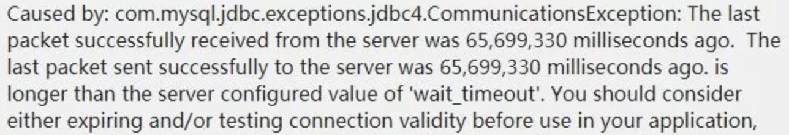

### 一、问题描述

---



1. 数据库连接池超时设置大于 `wait_timeout`
2. 日志提示，可以通过验证数据库连接或者设置：`autoReconnect=true` 来避免此异常。


### 二、问题定位

---

wait_time 参数：服务器关闭非交互连接之前等待活动秒数（默认28800s）。超时时间设置过大，在 MySQL 管理系统里会产生大量的 `SLEEP` 进程无法及时释放，会导致服务器系统性能下降；同时该参数设置过小，会导致 Mysql 处理某些事务未处理，连接不可用状态。

也就是说如果在 `wait_timeout` 设置期间内，数据库连接一直处于空闲等待状态，mysql 内部会自动关闭此连接，而应用程序无法感知到，依然认为连接池合法持有该连接。当应用端再次用该连接来进行数据库操作时，就产生上述异常错误。


### 三、解决办法

---

根据上面的分析思路，我们排查了 Mysql 生产库，发现默认 Mysql 超时时间`wait_timeout`是28800，但是应用层连接池`MaxWait`参数设置成60000，于是我把`MaxWait`参数设置成10000，小于Mysql超时时间28800 ，在测试环境等待8小时后，报错消失了。

>其他思路：
>
>配置 druid 连接池，使用
>
>`validation-query: SELECT 1 FROM DUAL`
>
>`test-on-borrow: true`（设置成true，高并发时性能下降）
>
>`test-while-idle: true`（当应用向连接池申请连接，并且testOnBorrow为false时，连接池将会判断连接是否处于空闲状态，如果是，则验证这条连接是否可用）
>
>`druidDataSource.setPhyTimeoutMillis` 参数：连接最大存活时间，默认是-1(不限制物理连接时间)，从创建连接开始计算，如果超过该时间，则会被清理。 


### 四、druid实战参考配置

---

```java

private void configDruidParams(DruidDataSource druidDataSource) {
  druidDataSource.setMaxActive(20);
  druidDataSource.setInitialSize(1);
  // 配置获取连接等待超时的时间
  druidDataSource.setMaxWait(10000);
  druidDataSource.setMinIdle(1);
  // 配置间隔多久才进行一次检测，检测需要关闭的空闲连接，单位是毫秒
  druidDataSource.setTimeBetweenEvictionRunsMillis(60000);
  // 配置一个连接在池中最小生存的时间，单位是毫秒 超过这个时间每次会回收默认3个连接
  druidDataSource.setMinEvictableIdleTimeMillis(30000);
  // 线上配置的mysql断开闲置连接时间为1小时,数据源配置回收时间为3分钟,以最后一次活跃时间开始算
  druidDataSource.setMaxEvictableIdleTimeMillis(180000);
  // 连接最大存活时间，默认是-1(不限制物理连接时间)，从创建连接开始计算，如果超过该时间，则会被清理
  druidDataSource.setPhyTimeoutMillis(15000);
  druidDataSource.setValidationQuery("select 1");
  druidDataSource.setTestWhileIdle(true);
  druidDataSource.setTestOnBorrow(false);
  druidDataSource.setTestOnReturn(false);
  druidDataSource.setPoolPreparedStatements(true);
  druidDataSource.setMaxOpenPreparedStatements(20);
  druidDataSource.setUseGlobalDataSourceStat(true);
  druidDataSource.setKeepAlive(true);
  druidDataSource.setRemoveAbandoned(true);
  druidDataSource.setRemoveAbandonedTimeout(180);
  try {
    druidDataSource.setFilters("stat,slf4j");
    List filterList = new ArrayList<>();
    filterList.add(wallFilter());
    druidDataSource.setProxyFilters(filterList);
  } catch (SQLException e) {
    e.printStackTrace();
  }
}
```