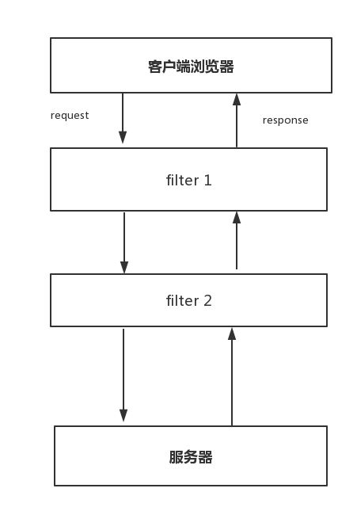
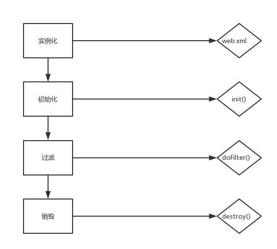

#### 1. filter 简介

---

filter是Servlet规范里的一个高级特性，只==用于对request、response进行修改==。

filter提出了 `FilterChain` 的概念，==客户端请求request在抵达servlet之前都会经过filterChain里的所有fiter==，如图所示：




#### 2. filter 生命周期

---

在web.xml中配置filter，当启动服务器时会实例化，并且会初始化，当有网络请求时会进行过滤操作，当服务器关闭时，会进行销毁，全过程如下图所示：



#### 3. 编写filter

---

filter类需实现javax.servlet.Filter接口，需复写里面的三个方法，其中init(),在初始化时调用；doFiler()方法每次都会调用，在这个方法中一定要执行chain.doFilter(),否则request不会交给后面的filter或者servler;ondestroy()在关闭服务器时调用。

```java
@Component
@WebFilter(urlPatterns = "/*", filterName = "firstFilter")
public class FirstFilter implements Filter {

  @Override
  public void init(FilterConfig filterConfig) throws ServletException {
    System.out.println("init---FirstFilter");
  }

  @Override
  public void doFilter(ServletRequest request, ServletResponse response, FilterChain chain) throws IOException, ServletException {
    System.out.println("start----doFilter--FirstFilter");
    chain.doFilter(request, response);
    System.out.println("end------doFilter--FirstFilter");
  }

  @Override
  public void destroy() {
    System.out.println("destroy---FirstFilter");
  }
}
```

urlPattern可以配置多个，也可以用通配符，当访问满足路径匹配，并且符合dispatcher时，request会被filter拦截进行处理，处理完后的response再次被filter拦截，可以进行处理。

dispatcherTypes 默认`REQUEST`。

- REQUEST：请求时有效
- FORWARD：当某servlet通过forward到该servlet才有效
- INCLUDE：jsp通过< jsp: incluser/> 请求servlet有效
- ERROR：< %@page errorPage=”” % >有效


