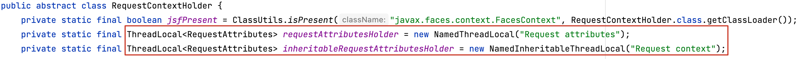
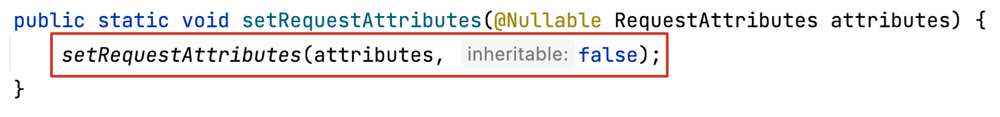
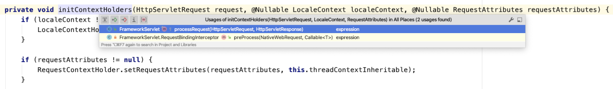
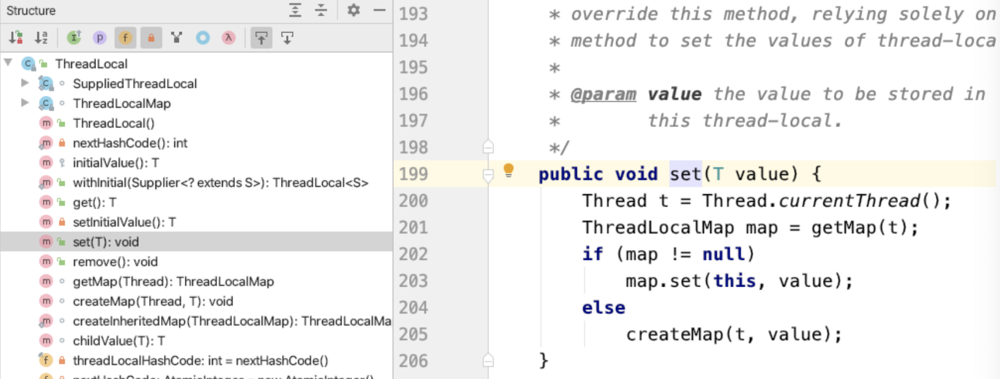
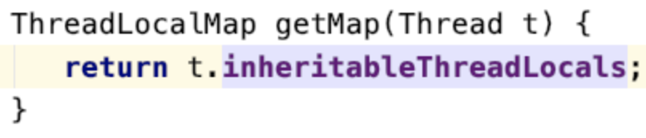

### 一、问题

---

`RequestContextHolder.getRequestAttributes();` 值为空，也就是常说的session丢失。


### 二、分析

---

由于session是线程安全的，无法直接在各个线程中传递，所以在服务间异步线程调用时，就会导致session丢失的问题。

首先，为什么要分析RequestContextHolder？

我们一般获取request和response是在过滤器Filter、拦截器，或者controller层获取。但如果想在service层获取request和response呢？

正常来说在service层是没有request的，**当我们需要在service层获取request和response时，我们可以在`RequestContextHolder`中获取**。


### 三、解决方案

---

使用RequestContextHolder提供的解决方案，将主线程上下文信息共享给子线程，该线程下的所有子线程都会共享上下文数据。

```java
public void getSession() {
  //设置异步线程之间可以共享session数据
  RequestContextHolder.setRequestAttributes(RequestContextHolder.getRequestAttributes(), true);
  ThreadPoolExecutor exportPool = ThreadPoolUtils.exportPool;
  exportPool.execute(() -> {
    RequestAttributes attributes = RequestContextHolder.getRequestAttributes();
  });
}
```


### 四、源码分析

---

1. 首先点开RequestContextHolder的源码，可以发现2个被final修饰的ThreadLocal，这2个线程就是用来存储上下文数据的，并且由于被final修饰，所以其线程是线程安全的。

   

2. requestAttributesHolder提供的是主线程的上下文数据，inheritableRequestAttributesHolder提供的是子线程的上下文数据。

   

3. 那是在什么时候，Spring上下文数据被初始化的呢？

   1. 去FrameworkServlet中看一下，这是Spring初始化WebApplicationContext的地方，因为RequestContextHolder中其实存储的就是HttpServletRequest和HttpServletResponse所以这里就找和这两个相关的代码。

   2. 可以在里面发现一个叫`initContextHolder`的方法，这个方法做了非空判断，说明有别的地方调用了这个方法，并初始化了参数，传递了进来，于是我们接着往上找。

      

   3. 有两个方法调用了这个初始化上下文持有者，下面那个方法似乎是个拦截器，并没有对上下文数据的获取。

   4. 查看processRequest方法

      ```java
      protected final void processRequest(HttpServletRequest request, HttpServletResponse response)
        throws ServletException, IOException {
      
        long startTime = System.currentTimeMillis();
        Throwable failureCause = null;
      
        // 返回与当前线程关联的LocaleContext（如果有）。
        LocaleContext previousLocaleContext = LocaleContextHolder.getLocaleContext();
        //为给定请求构建LocaleContext，将请求的主要语言环境公开为当前语言环境。
        LocaleContext localeContext = buildLocaleContext(request);
      
        RequestAttributes previousAttributes = RequestContextHolder.getRequestAttributes();
        //考虑到预绑定的属性（及其类型），为给定的请求构建ServletRequestAttributes（可能还包含对响应的引用）。
        ServletRequestAttributes requestAttributes = buildRequestAttributes(request, response, previousAttributes);
      
        WebAsyncManager asyncManager = WebAsyncUtils.getAsyncManager(request);
        asyncManager.registerCallableInterceptor(FrameworkServlet.class.getName(), new FrameworkServlet.RequestBindingInterceptor());
      
        // 上下文初始化
        initContextHolders(request, localeContext, requestAttributes);
      
        try {
          doService(request, response);
        }
        catch (ServletException | IOException ex) {
          failureCause = ex;
          throw ex;
        }
        catch (Throwable ex) {
          failureCause = ex;
          throw new NestedServletException("Request processing failed", ex);
        }
      
        finally {
          resetContextHolders(request, previousLocaleContext, previousAttributes);
          if (requestAttributes != null) {
            requestAttributes.requestCompleted();
          }
          logResult(request, response, failureCause, asyncManager);
          publishRequestHandledEvent(request, response, startTime, failureCause);
        }
      }
      ```

      1. 获取当前线程的LocaleContext（相当于初始化）
         ```java
         LocaleContext previousLocaleContext = LocaleContextHolder.getLocaleContext();
         ```

      2. 再将HttpServletRequest封装到了一个SimpleLocaleContext（继承了
         这行代码我们就很熟悉了，在RequestContextHolder的源码中也看到过，这是获取到当前上下文

         ```java
         RequestAttributes previousAttributes = RequestContextHolder.getRequestAttributes();
         ```

      3. 将当前的HttpServletRequest和HttpServletResponse封装到一个ServletRequestAttributes中，并返回出去
         ```java
         ServletRequestAttributes requestAttributes = buildRequestAttributes(request, response, previousAttributes);
         ```

      4. 最后初始化这个上下文持有者，自此整个RequestContextHolder的初始化过程就结束了
         ```java
         initContextHolders(request, localeContext, requestAttributes);
         ```


### 五、RequestContextHolder如何实现子线程数据共享

---

看一下RequestContextHolder的源码，可以看到子线程的数据是存储在这个ThreadLocal中的，那么为什么存储在这个线程中就可以共享了呢，接着看一下源码。

```java
private static final ThreadLocal<RequestAttributes> inheritableRequestAttributesHolder = new NamedInheritableThreadLocal("Request context");
```

可以看到这个NamedInheritableThreadLocal继承了InheritableThreadLocal这个线程，顾名思义这是一个可继承线程。

```java
public class NamedInheritableThreadLocal<T> extends InheritableThreadLocal<T> {

  private final String name;

  public NamedInheritableThreadLocal(String name) {
    Assert.hasText(name, "Name must not be empty");
    this.name = name;
  }

  @Override
  public String toString() {
    return this.name;
  }

}
```

InheritableThreadLocal也继承了ThreadLocal，并重写了它的3个方法，这里来分析一下为什么这个线程的属性可以被共享。

首先数据的封装都是通过set()方法进行的，数据的获取是通过get()方法进行的，这些方法都是由顶级类别ThreadLocal提供的，所以我们看一下这2个方法的具体实现



可以看到第一次进来的时候，map为空，走的是下面的createMap()方法，而InheritableThreadLocal重写了createMap()方法，所以最终的数据被存储到了这个ThreadLocalMap中（key:当前线程，value:传递进去的数据）。

```java
ThreadLocal.ThreadLocalMap inheritableThreadLocals = null;
```

获取数据也是从上面这个集合中获取。



即当使用这个线程存储数据的时候，会将主线程的数据备份一份，存储到ThreadLocalMap中。


### 六、总结

---

使用如下方法可以将主线程的上下文数据共享给子线程。

```java
RequestContextHolder.setRequestAttributes(RequestContextHolder.getRequestAttributes(), true);
```