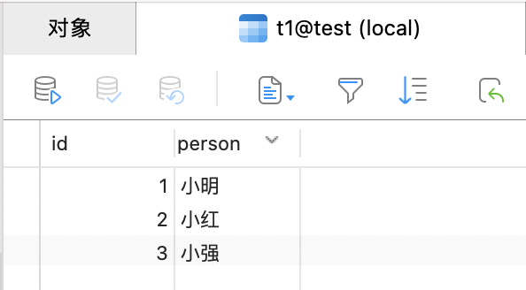

**内连接就是求两个表的交集**，从笛卡尔积的角度讲就是从笛卡尔积中选出满足某条件的记录。（也可以省略 INNER 使用 JOIN，效果一样）

```sql
SELECT
	t1.id,
	t2.id 
FROM
	t1
	INNER JOIN t2 ON t1.person = t2.person;
```

| id   | id(1) |
| ---- | ----- |
| 1    | A     |
| 2    | B     |