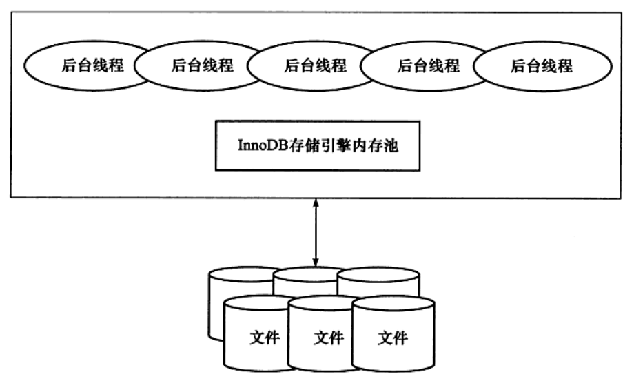
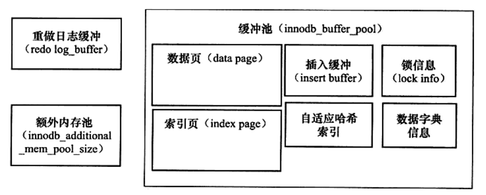

InnoDB存储引擎有**多个内存块**，可以认为这些内存块**组成了一个大的内存池**，负责如下工作：

- 维护所有进程/线程需要访问的多个内部数据结构；
- 缓存磁盘上的数据，方便快速地读取，同时在对磁盘文件的数据修改之前在这里缓存。
- 重做日志（redo log）缓冲。



后台线程的主要作用是负责**刷新内存池中的数据**，保证缓冲池中的内存缓存的是最近的数据。此外**将已修改的数据文件刷新到磁盘文件**，同时**保证在数据库发生异常的情况下InnoBD能恢复到正常运行状态**。


### 一、后台线程

---

InnoDB存储引擎是多线程的模型，因此其后台有多个不同的后台线程，负责处理不同的任务。

#### 1.1 Master Thread

---

Master Thread主要负责将缓冲池中的数据异步刷新到磁盘。保证数据的一致性，包括脏页的刷新、合并插入缓冲（INSERT BUFFER）、UNDO页的回收等。

#### 1.2 IO Thread

InnoDB存储引擎中大量使用了AIO来处理写请求IO请求，极大提高了数据库的性能。而IO Thread的工作主要是负责这些IO请求的回调处理。

通过以下命令观察InnoDB中的IO Thread：

`mysql> show engine innodb status\G;`

```shell
I/O thread 0 state: waiting for i/o request (insert buffer thread)
I/O thread 1 state: waiting for i/o request (log thread)
I/O thread 2 state: waiting for i/o request (read thread)
I/O thread 3 state: waiting for i/o request (read thread)
I/O thread 4 state: waiting for i/o request (read thread)
I/O thread 5 state: waiting for i/o request (read thread)
I/O thread 6 state: waiting for i/o request (write thread)
I/O thread 7 state: waiting for i/o request (write thread)
I/O thread 8 state: waiting for i/o request (write thread)
I/O thread 9 state: waiting for i/o request (write thread)
```

可知：

- IO Thread 0 为 `insert buffer thread`
- IO Thread 1 为 `log thread`
- 四个 `read thread`（innodb_read_io_threads变量控制）
- 四个 `write thread`（innodb_write_io_threads变量控制）

#### 1.3 Purge Thread

事务被提交后，其所使用的undolog可能不再需要，因此需要 Purge Thread来回收已经使用并分配的undo页。

由变量 `innodb_purge_threads` 控制。

#### 1.4 Page Cleaner Thread

刷新脏页。由变量`innodb_page_cleanners`控制。


### 二、内存

---

#### 2.1 缓冲池

InnoDB存储引擎基于磁盘存储，并将其中的记录按照页的方式进行管理。通常使用**缓冲池技术**提高数据库性能。

在数据库中进行读取页的操作，首先将从磁盘读到的页存放在缓冲池中，这个过程称为将页“FIX”在缓冲池中。下一次再读相同的页时，首先判断是否在缓冲池中。若在则命中，否则，读取磁盘上的页。

对于页的修改操作，**首先修改在缓冲池中的页，然后以一定的频率刷新到磁盘上**。页从缓冲池中刷新会磁盘的操作并不是每次页发生更新时触发，而是通过 **Checkpoint 机制**刷新回磁盘。

由变量 `innodb_buffer_pool_size` 控制缓冲池的大小。

缓冲池中缓存的数据页类型有：

- **索引页**

- **数据页**

- **undo页**

- **插入缓冲（insert buffer）**

- **自适应hash索引（adaptive hash index）**

- **InnoDB存储的锁信息（lock info）**

- **数据字典信息（data dictionary**）等。



允许有**多个缓冲池实例**。**每个页根据哈希值平均分配到不同缓冲池实例中**。这样做的好处是减少数据库内部的资源竞争，增加数据库并发处理能力。

由变量 `innodb_buffer_pool_instances` 控制缓冲池实例数。

可以通过 `information_schema` 架构下的表`INNODB_BUFFER_POOL_STATS` 来观察缓冲的状态，如运行下列命令可以看到各个缓冲池的使用状态：

```shell
mysql> use information_schema;
Reading table information for completion of table and column names
You can turn off this feature to get a quicker startup with -A

Database changed
mysql> select pool_id,pool_size,free_buffers,database_pages from innodb_buffer_pool_stats\G;
*************************** 1. row ***************************
       pool_id: 0
     pool_size: 8191
  free_buffers: 7724
database_pages: 467
1 row in set (0.00 sec)
```

#### 2.2 LRU List、Free List 和 Flush List

通常来说，数据库中的缓冲池是通过LRU算法（Lastest Recent）来管理的。即最频繁使用的页在LRU列表的前端，最少使用的页在LRU列表的尾端。**当缓冲池不能存放新读取到的页时，将首先释放LRU列表中尾端的页**。

缓冲池中**页的默认大小为16KB**。InnoDB存储引擎对传统的LRU算法做了一些优化。在InnoDB的存储引擎中，LRU列表中还加入了midpoint 位置。新读取到的页，虽然是最新访问的页，但并不是直接放入LRU列表的首部，而是放入到LRU列表的**midpoint位置**。默认配置下。该位置在LRU列表长度的 5/8 处。

```shell
mysql> show variables like 'innodb_old_blocks_pct'\G;
*************************** 1. row ***************************
Variable_name: innodb_old_blocks_pct
        Value: 37
1 row in set (0.00 sec)
```

默认值37表示新读取的页插入到LRU列表尾端的37%的位置（差不多3/8）。**把midpoint之后的列表称为old列表，之前的列表称为new列表**。可以简单地理解为new列表中的页都是最为活跃的热点数据。

>为什么不直接将读取的页放入LRU列表的首部？
>
>因为如果直接将读取到的页放入到LRU的首部，那么某些SQL操作可能会使缓冲池中的页被刷新出，从而影响缓冲池的效率。常见的这类操作为索引或数据的扫描操作。这类操作需要访问表中的许多页，甚至是全部页，而这些也通常来说又仅在这次查询操作中需要的热点数据页从LRU列表中移除，而在下一次需要读取该页时，InnoDB存储引擎需要再次访问磁盘。
>
>innodb_old_blocks_time 用来表示页读取到mid位置后需要等待多久才会被加入到LRU列表的热端。

LRU列表用来管理已经读取的页，但当数据库刚启动时，LRU列表是空的，即没有任何的页。这时页都存放在Free列表中。当需要从缓冲池中分页时，首先从Free列表中查找是否有可用的空闲页，若有则将该页从Free列表中删除，放入到LRU列表中。否则，根据LRU算法，淘汰LRU列表末尾的页，将该内存空间分配给新的页。当页从LRU列表的old部分加入到new部分时，称此时发生的操作为`page made young`，而因为innodb_old_blocks_time的设置而导致页没有从old部分移动到new部分的操作称为page not made young。

>观察重要变量 Buffer pool hit rate，通常该值不该小于95%。若发生Buffer pool hit rate的值小于95%，需要观察是否是由于全表扫描引起的LRU列表被污染的问题。

InnoDB存储引擎支持压缩页的功能，即将原本16KB的页压缩为1KB、2KB、4KB和8KB。而由于页的大小发生变化，LRU列表也有了些许的改变。对于非16KB的页，是通过unzip_LRU列表进行管理的。通过命令SHOW ENGINE INNODB STATUS可以观察到如下内容：

`LRU len: 1593, unzip_LRU len: 156`

可以看到LRU列表中一共有1539个页，而unzip_LRU列表中有156个页。这里需要注意的是。**LRU中的页包含了unzip_LRU列表中的页**。

首先，在unzip_LRU列表中对不同压缩页大小的页进行分别管理。其次，通过伙伴算法进行内存的分配。例如对需要从缓冲池中申请页为4KB的大小，其过程如下：

1. 检查4KB的 unzip_LRU 列表，检查是否有可用的空闲页；
2. 若有，则直接使用；
3. 否则，检查8KB的 unzip_LRU 列表；
4. 若能够得到空闲页，将页分成2个4KB页，存放到4KB的unzip_LRU列表；
5. 若不能得到空闲页，从LRU列表中申请一个16KB的叶，将页分成1个8KB的页、2个4KB的页，分别存放到对应的unzip_LRU列表中。

>在LRU列表中的页被修改后，称该页为**脏页**，即缓冲池中的页和磁盘上的页的数据产生了不一致。这是数据库会**通过CHECKPOINT机制将脏页刷新回磁盘**，而Flush列表中的页即为脏页列表。需要注意的是，**脏页既存在于LRU列表中，也存在于Flush列表中**。
>
>- LRU列表用来管理缓冲池中页的可用性；
>- Flush列表用来管理将页刷新回磁盘，二者互不影响。
>
>information_schema架构下并没有类似INNODB_BUFFER_PAGE_LRU的表来显示脏页的数量及脏页的类型，但正如前面所述的那样，脏页同样存在于LRU列表中，故可以通过元数据表INNODB_BUFFER_PAGE_LRU来查看，唯一不同的是需要加入OLDEST_MODIFICATION大于0的SQL查询条件。

#### 2.3 重做日志缓冲

InnoDB存储引擎首先将重做日志信息先放入到这个缓冲区，然后按一定频率将其刷新到重做日志文件。

重做日志缓冲一般不需要设置得很大，一般情况下每一秒种会将重做日志缓冲刷新到日志文件，因此**用户只需要保证每秒产生的事务量在这个缓冲大小之内即可**。由参数 `innodb_log_buffer_size` 控制，默认为 **48MB**。

重做日志在下列三种情况下会将日志缓冲中的内容刷新到外部磁盘的重做日志文件中。

- Master Thread **每一秒**将重做日志缓冲刷新到重做日志文件；
- **每个事务提交时**会将重做日志缓冲刷新到重做日志文件；
- 当重做日志缓冲池**剩余空间小于 1/2** 时，重做日志缓冲刷新到重做日志文件。

#### 2.4 额外的内存池

在InnoDB存储引擎中，对内存的管理是通过一种称为内存堆（heap）的方式进行的。在对一些数据结构本身的内存进行分配时，需要从额外的内存池中进行申请，当该区域的内存不够时，会从缓冲池中进行申请。例如，分配了缓冲池（innodb_buffer），但每个缓冲池中的帧缓冲（frame buffer）还有对应的缓冲控制对象（buffer control block），这些对象记录了一些诸如LRU、锁、等待等信息，而这个对象的内存需要从额外内存池中申请。因此，在申请了很大的InnoDB缓冲池时，也应考虑相应地增加这个值。
