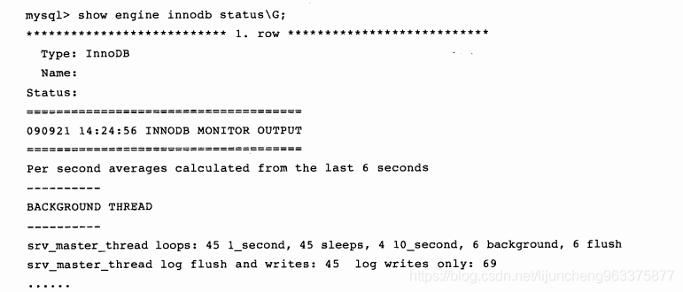
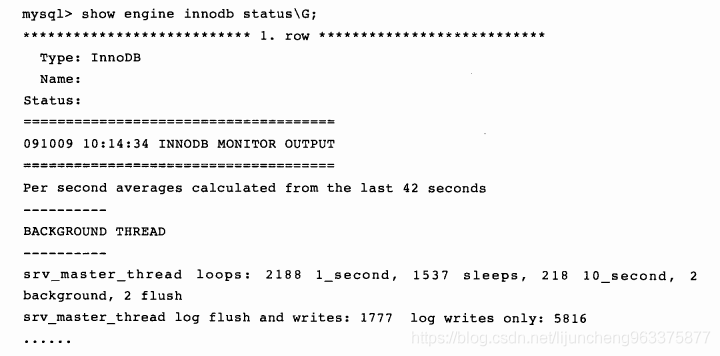

InnoDB存储引擎的主要工作都是在一个单独的后台线程Master Thread中完成的。

master thread的线程优先级别最高。其内部由几个循环（loop）组成：

- 主循环（loop）
- 后台循环（background loop）
- 刷新循环（flush loop）
- 暂停循环（suspend loop）

master thread会根据数据库运行的状态在几个循环中进行切换。

### 一、loop主循环

---

大多数的操作都在这个循环中，其中有两大部分操作∶ 每秒钟的操作和每10秒的操作。伪代码如下：

```c
void master_thread(){ 
loop:
    for(int i= 0; i< 10; i++){
        do thing once per second 
        sleep 1 second if necessary
    }
    do things once per ten seconds 
    goto loop:
}
```

可以看到，loop循环通过thread sleep来实现，这意味着所谓的每秒-次或每10秒一次的操作是不精确的。在负载很大的情况下可能会有延迟 （delay），只能说大概在这个频率下。当然，InnoDB源代码中还采用了其他的方法来尽量保证这个频率。

每秒一次的操作包括：

- **日志缓冲刷新到磁盘，即使这个事务还没有提交**（总是）
- 合并插入缓冲（可能）
- 至多刷新100个InnoDB的缓冲池中的脏页到磁盘（可能）
- 如果当前没有用户活动，切换到background loop（可能）

即使某个事务还没有提交，InnoDB存储引擎仍然会每秒将重做日志缓冲中的内容刷新到重做日志文件。这一点是必须知道的，这可以很好地解释为什么再大的事务commit的时间也是很快的。

合并插入缓冲 （insert buffer）并不是每秒都发生。InnoDB存储引擎会判断当前一秒内发生的IO次数是否小于5次，如果小于5次，InnoDB认为当前的IO压力很小，可以执行合并插入缓冲的操作。

同样，刷新100个脏页也不是每秒都在发生。InnoDB存储引擎通过判断当前缓冲池中脏页的比例（buf_get_modified_ratio_pct）是否超过了配置文件中innodb_max_ dirty_pages_pct这个参数（默认为90，代表90%），如果超过了这个阈值，InnoDB存储引擎认为需要做磁盘同步操作，将100个脏页写入磁盘。

```c
void master_thread(){
    goto loop; 
loop:
    for(int i = 0; i<10; i++){
        thread_sleep(1) //sleep 1 second do log buffer flush to disk 
        if (last_one_second_ios < 5 )
            do merge at most 5 insert buffer
        if( buf_get_modified_ratio_pct>innodb_max_dirty_pages_pct)
            do buffer pool flush 100 dirty page 
        if ( no user activity )
            goto backgroud loop
    }
    do things once per ten seconds 
    background loop:
        do something 
        goto loop:
}
```

接着来看每10秒的操作，包括如下内容：

- 刷新100个脏页到磁盘（可能）
- 合并至多5个插入缓冲（总是）
- 将日志缓冲刷新到磁盘（总是）
- 删除无用的Undo页（总是）
- 刷新100个或者10个脏页到磁盘（总是）
- **产生一个检查点**（总是）

在以上的过程中，InnoDB存储引擎会先判断过去10秒之内磁盘的IO操作是否小于200次。如果是，InnoDB存储引擎认为当前有足够的磁盘IO操作能力，因此将100个脏页刷新到磁盘。接着，InnoDB存储引擎会合并插入缓冲。不同于每1秒操作时可能发生的合并插入缓冲操作，这次的合并插入缓冲操作总会在这个阶段进行。之后，InnoDB存储引擎会再执行一次将日志缓冲刷新到磁盘的操作，这与每秒发生的操作是一样的。

接着InnoDB存储引擎会执行一步full purge操作，即删除无用的Undo页。对表执行update、delete这类操作时，原先的行被标记为删除，但是因为一致性读（consistent read）的关系，需要保留这些行版本的信息。但是在full purge过程中，InnoDB存储引擎会判断当前事务系统中已被删除的行是否可以删除，比如有时候可能还有查询操作需要读取之前版本的Undo信息，如果可以，InnoDB会立即将其删除。从源代码中可以发现，InnoDB存储引擎在操作full purge时，每次最多删除20个Undo页。

然后，InnoDB存储引擎会判断缓冲池中脏页的比例（buf_get_modified_ratio_pct），如果有超过70%的脏页，则刷新100个脏页到磁盘;如果脏页的比例小于70%，则只需刷新 10%的脏页到磁盘。

最后，InnoDB存储引擎会产生一个检查点（checkpoint），InnoDB存储引擎的检查点也称为模糊检查点（fuzzy checkpoint）。InnoDB存储引擎在checkpoint时并不会把所有缓冲池中的脏页都写入磁盘，因为这样可能会对性能产生影响，而只是将最老日志序列号（oldest LSN）的页写入磁盘。

现在，我们可以完整地把主循环（main loop）的伪代码写出来了，内容如下：

```c
void master_thread () {
goto loop:
loop:
    for(int i = 0; i<10; i++){
        thread_sleep(1) //sleep 1 second 
            do log buffer flush to disk 
        if (last_one_second_ios < 5 )
            do merge at most 5 insert buffer
        if(buf_get_modified_ratio_pct > innodb_max_dirty_pages_pct)
            do buffer pool flush 100 dirty page 
        if ( no user activity )
            goto backgroud loop
    }

    if ( last_ten_second_ios < 200 )
        do buffer pool flush 100 dirty page

    do merge at most 5 insert buffer 
    do log buffer flush to disk
    do full purge

    if(buf_get_modified_ratio_pct>70%)
        do buffer pool flush 100 dirty page else
        buffer pool flush 10 dirty page 
        do fuzzy checkpoint 
    goto loop 
    background loop:
        do something 
    goto loop:
}
```


### 二、background loop

---

若当前没有用户活动（数据库空闲时）或者数据库关闭时，就会切换到这个循环，会执行以下操作：

- 删除无用的Undo页（总是）
- 合并20个插入缓冲（总是）
- 跳回到主循环（总是）
- 不断刷新100个页，直到符合条件（可能，跳转到flush loop中完成）


### 三、flush loop、suspend loop

---

如果flush loop中也没有什么事情可以做了，InnoDB存储引擎会切换到suspend loop，将master thread挂起，等待事件的发生。若启用了InnoDB存储引擎，却没有使用任何 InnoDB存储引擎的表，那么master thread总是处于挂起状态。

最后，master thread完整的伪代码如下∶

```c
void master_thread() {
goto loop:
loop:
    for(int i = 0; i<10; i++){
        thread_sleep(1) // sleep 1 second 
        do log buffer flush to disk 
        if ( last_one_second_ios < 5 )
            do merge at most 5 insert buffer
        if( buf_get_modified_ratio_pct > innodb_max_dirty_pages_pct )
            do buffer pool flush 100 dirty page 
        if( no user activity )
            goto backgroud loop
    }
    if ( last_ten_second_ios < 200 )
        do buffer pool flush 100 dirty page

    do merge at most 5 insert buffer
    do log buffer flush to disk do full purge

    if ( buf_get_modified_ratio_pct > 70% )
        do buffer pool flush 100 dirty page
    else
        buffer pool flush 10 dirty page 
    do fuzzy checkpoint 
    goto loop background loop:
    do full purge
    do merge 20 insert buffer 
    if not idle:
        goto loop: 
    else:
        goto flush loop

    flush loop:
        do buffer pool flush 100 dirty page
        if(buf_get_modified_ratio_pct> innodb_max_dirty_pages_pct )
            goto flush loop 
    goto suspend loop 
    suspend loop: 
    suspend_thread() 
    waiting event 
    goto loop:
}
```



这里可以看到主循环执行了45次，每秒sleep的操作执行了45次（说明负载不是很大）， 10秒一次的活动执行了4次，符合1∶10。background loop执行了6次，flush loop执行了6次。因为当前这台服务器的压力很小，所以能在理论值上运行。但是，如果是在一台压力很大的MySQL服务器上，我们看到的可能会是下面的情景：



可以看到当前主循环运行了2188次，但是循环中的每一秒钟SLEEP的操作只运行了1537次。这是因为InnoDB对其内部进行了一些优化，当压力大时并不总是等待1秒。所以说，我们并不能认为l_second和sleeps的值总是相等的。在某些情况下，可以通过两者之间差值的比较来反映当前数据库的负载压力。